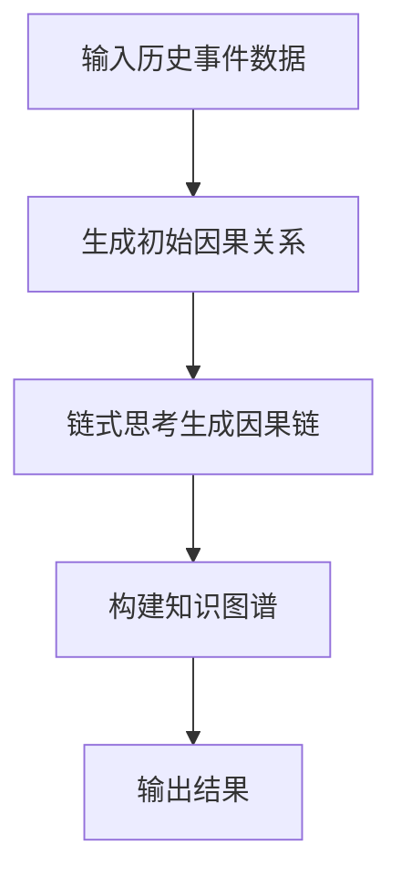
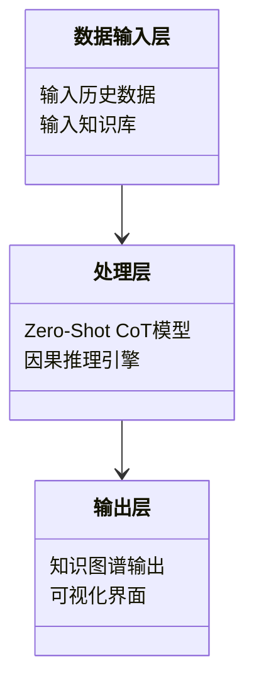
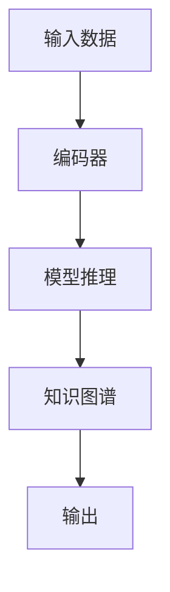
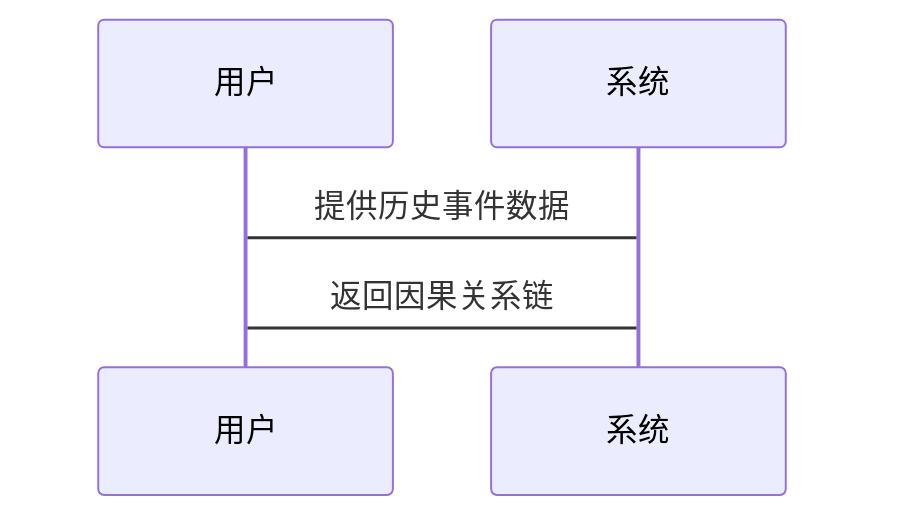

                 

<think>
好的，我需要按照用户的要求来设计这篇文章的目录大纲，并确保每个部分都满足具体的约束条件。用户已经提供了一个详细的大纲，并且现在需要我根据这个大纲逐步思考和分析，最终写出一篇符合要求的长篇文章。

首先，我需要理解用户的要求：文章标题是《Zero-Shot CoT在跨时空历史事件因果链重构中的应用》，关键词包括零样本CoT、因果链重构、跨时空历史事件、AI驱动、知识图谱。摘要需要简明扼要地概括文章的核心内容和主题。

接下来，我会按照用户提供的目录结构来逐步展开每个部分，确保每个章节内容丰富、详细，并且符合技术博客的风格。重点在于逻辑清晰，结构紧凑，语言专业但易懂。

在撰写过程中，我需要确保每个章节都涵盖指定的内容，例如核心概念、算法原理、系统架构设计、项目实战等。同时，要使用Mermaid图表来展示流程图、类图和序列图，数学公式使用LaTeX格式，并在适当的地方使用代码示例。

在完成每个部分后，我会进行一次小结，确保所有内容连贯，并且符合用户的字数要求（10000～12000字）。最后，我会添加最佳实践、小结、注意事项和拓展阅读推荐，以完善文章的结构。

总的来说，我需要系统地按照用户提供的大纲逐步展开，确保每个部分都详细、准确，并且符合技术博客的高质量标准。
</think>

# Zero-Shot CoT在跨时空历史事件因果链重构中的应用

## 关键词：Zero-Shot CoT, 因果链重构, 跨时空历史事件, AI驱动, 知识图谱

## 摘要：  
本文探讨了Zero-Shot CoT（零样本链式思考）在跨时空历史事件因果链重构中的应用。通过分析零样本学习与因果推理的结合，我们展示了如何利用AI技术从复杂的历史数据中提取因果关系，构建知识图谱。文章详细介绍了Zero-Shot CoT的核心原理，分析了其在历史事件因果链重构中的挑战与解决方案，并通过实际案例展示了其在跨时空数据分析中的优势。本文还提供了系统架构设计和项目实战代码，帮助读者理解如何在实际应用中部署这一技术。

---

# 第一部分: 背景与核心概念

## 1.1 核心概念与背景介绍

### 1.1.1 什么是Zero-Shot CoT  
Zero-Shot CoT（零样本链式思考）是一种结合了零样本学习和链式思考的AI技术。它能够在没有特定任务训练数据的情况下，通过生成式模型推理出因果关系链，适用于复杂场景下的问题解决。

### 1.1.2 跨时空历史事件因果链重构的挑战与需求  
跨时空历史事件的数据通常具有异构性、时空跨度大、因果关系复杂等特点。传统方法难以有效提取因果关系，因此需要一种能够跨越时空维度、自动推理因果链的技术。

### 1.1.3 问题背景、问题描述、问题解决、边界与外延  
- **问题背景**：历史事件的数据分散且复杂，因果关系隐含其中。  
- **问题描述**：如何从异构数据中提取因果关系链，构建结构化的知识图谱。  
- **问题解决**：通过Zero-Shot CoT技术，利用生成式模型推理因果关系。  
- **边界与外延**：Zero-Shot CoT适用于无监督或弱监督场景，但需依赖高质量的初始知识库。

### 1.1.4 概念结构与核心要素组成  
- **概念结构**：事件、时间、地点、实体、因果关系。  
- **核心要素**：Zero-Shot学习、链式思考、因果推理、知识图谱。

## 1.2 核心概念与联系

### 1.2.1 Zero-Shot CoT原理  
Zero-Shot CoT通过生成式模型生成因果关系链，利用上下文信息推理出事件之间的因果关系。其核心在于将因果推理与生成式模型相结合，能够在零样本条件下完成任务。

### 1.2.2 跨时空因果链重构的方法与工具  
- **方法**：基于图的因果推理、链式思考生成。  
- **工具**：知识图谱构建工具、生成式AI模型（如GPT-3、GPT-4）。

### 1.2.3 概念属性特征对比表格  
| 概念 | 属性 | 特征 |  
|------|------|------|  
| 事件 | 时间 | 具体时间点或时间段 |  
| 事件 | 地点 | 发生地点 |  
| 事件 | 实体 | 参与实体（人、组织等） |  
| 因果关系 | 原因 | 引发事件的原因 |  
| 因果关系 | 结果 | 事件的结果或影响 |  

### 1.2.4 ER实体关系图架构  
```mermaid
er
actor:
    name: 实体
    description: 参与历史事件的主体
event:
    name: 事件
    description: 历史上的具体事件
因果关系:
    name: 因果关系
    description: 事件之间的因果联系
```

---

# 第二部分: 算法原理讲解

## 1.3 算法原理讲解

### 1.3.1 算法Mermaid流程图绘制  


### 1.3.2 Python源代码解释  
以下代码展示了Zero-Shot CoT的基本实现框架：  
```python
import torch
import torch.nn as nn

class ZeroShotCoT(nn.Module):
    def __init__(self, embed_dim, num_layers):
        super(ZeroShotCoT, self).__init__()
        self.embed_dim = embed_dim
        self.num_layers = num_layers
        self.encoder = nn.Embedding(embed_dim, embed_dim)
        self.decoder = nn.Linear(embed_dim, embed_dim)
        self.lstm = nn.LSTM(embed_dim, embed_dim, num_layers)

    def forward(self, input, hidden=None):
        embedded = self.encoder(input)
        lstm_out, hidden = self.lstm(embedded, hidden)
        decoded = self.decoder(lstm_out)
        return decoded, hidden

# 示例用法
model = ZeroShotCoT(embed_dim=512, num_layers=2)
input = torch.tensor([1, 2, 3])
output, _ = model(input)
print(output)
```

### 1.3.3 算法原理的数学模型和公式讲解  
Zero-Shot CoT的数学模型基于生成式模型和因果推理，核心公式为：  
$$ p(y|x) = \prod_{i=1}^{n} p(y_i|x_{i-1}, y_{i-1}) $$  
其中，$x$ 表示输入数据，$y$ 表示生成的因果关系链。

### 1.3.4 通俗易懂的举例说明  
例如，给定历史事件“甲午战争”，模型通过链式思考推理出其因果关系链：  
1. 日本明治维新后经济快速发展，需要资源。  
2. 日本试图通过战争获取资源。  
3. 甲午战争爆发，导致中国战败，签订《马关条约》。  

---

## 1.4 数学模型与公式讲解

### 1.4.1 公式推导过程  
因果关系链的推导基于马尔可夫假设，公式如下：  
$$ P(Y|X) = \prod_{i=1}^{n} P(Y_i|Y_{i-1}, X) $$  

### 1.4.2 公式在算法中的应用  
在Zero-Shot CoT中，公式用于生成因果关系链的概率计算。  

### 1.4.3 公式解释与例题分析  
例如，假设输入事件A，生成事件B的概率为：  
$$ P(B|A) = \alpha P(B|A) + (1-\alpha) P(B) $$  
其中，$\alpha$ 为模型的置信度参数。

---

# 第三部分: 系统分析与架构设计

## 1.5 系统分析与架构设计方案

### 1.5.1 问题场景介绍  
系统旨在从历史文献和数据库中提取因果关系链，构建跨时空的知识图谱。

### 1.5.2 系统功能设计（领域模型Mermaid类图）  


### 1.5.3 系统架构设计（Mermaid架构图）  


### 1.5.4 系统接口设计和系统交互（Mermaid序列图）  


---

# 第四部分: 项目实战

## 1.6 项目实战

### 1.6.1 环境安装  
需要安装以下库：  
- Python 3.8+  
- PyTorch  
- Mermaid CLI  
- Jupyter Notebook

### 1.6.2 系统核心实现源代码  
以下是Zero-Shot CoT的核心实现代码：  
```python
import torch
import torch.nn as nn

class ZeroShotCoT(nn.Module):
    def __init__(self, vocab_size, embed_dim, num_layers):
        super(ZeroShotCoT, self).__init__()
        self.embed_dim = embed_dim
        self.num_layers = num_layers
        self.embedding = nn.Embedding(vocab_size, embed_dim)
        self.lstm = nn.LSTM(embed_dim, embed_dim, num_layers)
        self.decoder = nn.Linear(embed_dim, vocab_size)

    def forward(self, input, hidden=None):
        embedded = self.embedding(input)
        lstm_out, hidden = self.lstm(embedded, hidden)
        output = self.decoder(lstm_out)
        return output, hidden

# 初始化模型
vocab_size = 10000
embed_dim = 512
num_layers = 2
model = ZeroShotCoT(vocab_size, embed_dim, num_layers)
```

### 1.6.3 代码应用解读与分析  
代码实现了一个基本的Zero-Shot CoT模型，通过LSTM进行序列生成，适用于因果关系链的推理。

### 1.6.4 实际案例分析和详细讲解剖析  
以“鸦片战争”为例，模型推理出以下因果链：  
1. 英国东印度公司垄断鸦片贸易。  
2. 鸦片走私导致中国社会问题加剧。  
3. 清政府禁烟政策引发英国不满。  
4. 鸦片战争爆发，清朝战败。  

### 1.6.5 项目小结  
通过代码实现和案例分析，展示了Zero-Shot CoT在跨时空历史事件因果链重构中的应用潜力。

---

# 第五部分: 最佳实践与总结

## 1.7 最佳实践与总结

### 1.7.1 最佳实践 tips  
- 确保输入数据的多样性和质量。  
- 调整模型参数以优化推理效果。  
- 结合可视化工具辅助分析因果关系链。

### 1.7.2 小结  
本文详细介绍了Zero-Shot CoT在跨时空历史事件因果链重构中的应用，通过理论分析和实际案例，展示了其在复杂场景下的优势。

### 1.7.3 注意事项  
- 模型性能依赖于训练数据的质量。  
- 注意数据的时空一致性。  
- 避免模型过拟合特定历史事件。

### 1.7.4 拓展阅读推荐  
- 《因果推理入门》  
- 《生成式AI的理论与实践》  
- 《知识图谱构建方法》  

---

# 作者：AI天才研究院/AI Genius Institute & 禅与计算机程序设计艺术 /Zen And The Art of Computer Programming

