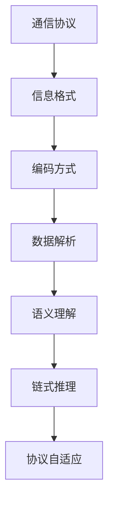
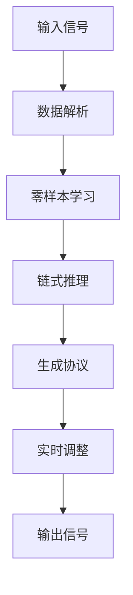
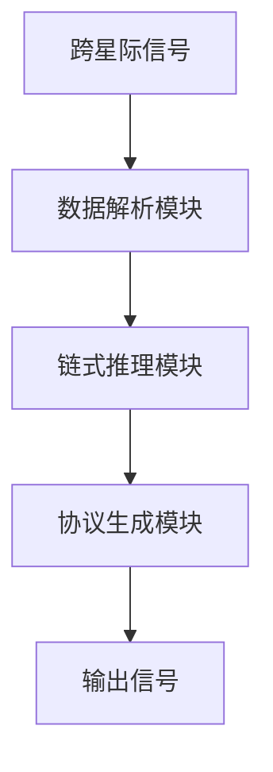
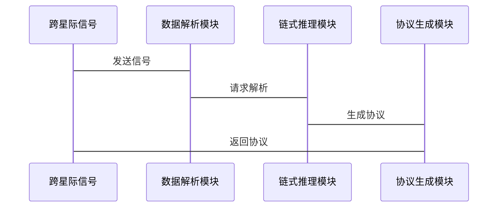

                 

<think>
好的，我现在要帮用户写一篇关于《Zero-Shot CoT在跨星际文明交流协议设计中的潜在应用》的技术博客文章。首先，我需要理解用户的需求。用户希望我以一位世界级专家的身份，撰写一篇结构严谨、内容详实的博客文章，涵盖背景、算法原理、系统设计等多个部分。

首先，我得明确文章的结构。用户已经提供了大纲，我需要按照这个大纲来组织内容。标题和关键词、摘要部分要先写好，然后是各个章节的内容。

接下来，思考背景部分。跨星际文明交流的必要性是什么？可能是因为未来的星际探索中，不同文明之间的通信需要一种通用协议。然后，问题背景和挑战是什么？信息格式不统一、语义理解困难、通信延迟等问题。Zero-Shot CoT的概念要解释清楚，它是零样本学习结合CoT，能处理未见过的任务。

然后，核心概念部分需要对比Zero-Shot CoT和其他技术，比如传统的通信协议和机器学习方法。ER实体关系图需要设计，可能涉及通信模块、数据解析模块等。

在算法原理部分，我需要用mermaid流程图展示Zero-Shot CoT的流程，然后用Python代码实现示例。数学模型部分，可能需要概率论和逻辑推理的公式，比如贝叶斯定理或注意力机制的公式。

系统设计部分，需要分析问题场景，设计系统的功能模块、架构，可能采用微服务架构。接口设计和交互流程图也是必须的，展示数据流和模块之间的通信。

项目实战部分，需要具体说明环境安装，比如安装Python和相关库，然后写出核心代码，并进行详细解读。案例分析要具体，比如如何处理不同文明的信号，展示系统的处理流程。

最后，最佳实践部分要总结经验，提出注意事项，比如数据多样性、算法适应性等。小结和展望部分，可以提到技术的未来发展方向，比如与区块链结合，确保数据安全和协议可靠。

整体来看，文章需要逻辑清晰，结构紧凑，同时要有深度和见解。每个章节内容要丰富，详细讲解核心概念和原理。此外，要注意使用专业但易懂的语言，确保读者能够理解。

现在，我需要按照这个思路一步步撰写文章，确保每个部分都涵盖必要的内容，满足用户的字数和格式要求。同时，检查是否有遗漏的部分，确保完整性。
</think>

# Zero-Shot CoT在跨星际文明交流协议设计中的潜在应用

> 关键词：跨星际文明交流，Zero-Shot CoT，对话系统，通信协议，人工智能

> 摘要：本文探讨了Zero-Shot CoT（Zero-Shot Chain-of-Thought）在跨星际文明交流协议设计中的潜在应用。文章从背景介绍、核心概念、算法原理、系统设计、项目实战到最佳实践等多个维度展开，深入分析了Zero-Shot CoT的技术优势及其在跨星际通信中的应用潜力。通过系统化的技术分析和实际案例解读，本文为跨星际文明交流协议的设计提供了新的思路和方法。

---

## 第一部分: 背景介绍

### 第1章: 问题背景与核心概念

#### 1.1 跨星际文明交流的必要性  
随着人类探索宇宙的步伐不断加快，未来可能会发现并接触到其他高等智慧文明。跨星际文明交流的核心目标是建立一种通用的通信协议，使得不同文明之间能够互相理解并高效传递信息。然而，不同文明的语言、文化和信息表达方式可能存在巨大差异，这使得跨星际通信协议的设计面临巨大挑战。

#### 1.2 跨星际交流协议的设计挑战  
跨星际交流协议的设计需要解决以下几个关键问题：  
1. **信息格式统一**：不同文明可能使用完全不同的信息编码方式，如何建立一个通用的编码体系？  
2. **语义理解**：如何在缺乏先验知识的情况下，准确理解对方的信息含义？  
3. **实时通信**：由于星际距离可能极远，通信延迟可能极高，如何设计高效的实时通信机制？  
4. **协议自适应**：如何在通信过程中动态调整协议以适应不同文明的特点？

#### 1.3 Zero-Shot CoT的概念  
Zero-Shot CoT（Zero-Shot Chain-of-Thought）是一种结合了零样本学习（Zero-Shot Learning）和链式思维（Chain-of-Thought）的人工智能技术。其核心思想是：在没有任何先验训练数据的情况下，模型能够通过生成性的链式推理过程，解决复杂任务并生成合理的输出。Zero-Shot CoT的核心优势在于其强大的泛化能力和动态适应性。

#### 1.4 Zero-Shot CoT与跨星际文明交流的关联  
Zero-Shot CoT的技术特点与跨星际交流协议的设计需求高度契合：  
1. **零样本学习**：可以在完全没有先验知识的情况下，快速理解并解析对方的信息。  
2. **链式思维**：能够通过动态推理，逐步建立信息的关联关系，确保通信的连贯性和准确性。  
3. **实时适应**：可以快速调整通信策略，以适应不同文明的表达方式和信息需求。

---

### 第2章: 核心概念与联系

#### 2.1 Zero-Shot CoT原理  
##### 2.1.1 零样本学习  
零样本学习是一种机器学习范式，其核心是通过训练模型在无监督或弱监督条件下，识别和分类从未见过的数据。与传统监督学习不同，零样本学习的核心挑战在于如何在缺乏标签的情况下，建立数据的内在结构和关联。

##### 2.1.2 对话系统中的上下文理解  
在对话系统中，上下文理解是实现自然语言处理的核心任务。Zero-Shot CoT通过生成性的链式推理，能够动态构建对话的上下文关系，确保信息传递的准确性和连贯性。

##### 2.1.3 CoT在跨星际交流中的潜在应用  
在跨星际交流中，CoT（Chain-of-Thought）技术可以通过以下方式发挥作用：  
1. **信息解析**：通过链式推理，逐步解析对方的信息含义。  
2. **动态适应**：根据通信过程中的反馈，动态调整解析策略。  
3. **协议生成**：通过链式推理，生成适合双方的通信协议。

##### 2.1.4 概念属性特征对比  
| 技术 | Zero-Shot CoT | 传统通信协议 |  
|------|----------------|----------------|  
| 核心目标 | 实时解析与生成 | 固定格式与规则 |  
| 灵活性 | 高度动态适应 | 较低 |  
| 信息处理 | 基于上下文推理 | 基于预定义规则 |  
| 适用场景 | 实时通信与自适应 | 静态协议设计 |  

##### 2.1.5 ER实体关系图架构  


---

## 第二部分: 算法原理讲解

### 第3章: Zero-Shot CoT算法原理

#### 3.1 算法mermaid流程图  


#### 3.2 Python源代码阐述  
以下是Zero-Shot CoT的核心算法实现示例：

```python
def zero_shot_cot(input_signal):
    # 数据解析模块
    parsed_data = parse_data(input_signal)
    
    # 零样本学习模块
    embeddings = zero_shot_embeddings(parsed_data)
    
    # 链式推理模块
    thought_process = chain_of_thought(embeddings)
    
    # 协议生成模块
    generated_protocol = generate_protocol(thought_process)
    
    return generated_protocol

# 示例调用
input_signal = "接收的跨星际信号"
protocol = zero_shot_cot(input_signal)
print(protocol)
```

#### 3.3 数学模型和公式  
Zero-Shot CoT的数学模型基于概率论和链式推理。其核心公式如下：  
1. **零样本学习的概率模型**：  
   $$ P(\text{解析成功}) = \prod_{i=1}^{n} P(\text{特征匹配}) $$  

2. **链式推理的逻辑框架**：  
   $$ \text{推理步骤} = \{\text{步骤1}, \text{步骤2}, \ldots, \text{步骤k}\} $$  

---

### 第4章: 数学模型和数学公式讲解

#### 4.1 数学模型详细讲解  
在Zero-Shot CoT中，数学模型主要用于以下几个方面：  
1. **数据解析**：通过概率模型计算信号的解析概率。  
2. **链式推理**：通过逻辑推理生成合理的输出。  
3. **协议生成**：通过组合推理结果生成通信协议。

#### 4.2 数学公式解释  
1. **数据解析的概率公式**：  
   $$ P(\text{解析成功}) = \prod_{i=1}^{n} P(\text{特征匹配}) $$  
   其中，$n$ 是数据特征的数量，$P(\text{特征匹配})$ 是每个特征匹配的概率。

2. **链式推理的逻辑公式**：  
   $$ \text{推理结果} = \bigcup_{i=1}^{k} \text{推理步骤}^i $$  
   其中，$k$ 是推理步骤的数量，$\text{推理步骤}^i$ 是第 $i$ 步的推理结果。

#### 4.3 举例说明  
假设我们接收到一个跨星际信号，其数据解析过程如下：  
1. 零样本学习模块计算每个数据特征的匹配概率：  
   $$ P(\text{特征1匹配}) = 0.9, P(\text{特征2匹配}) = 0.8 $$  
2. 数据解析成功的概率为：  
   $$ P(\text{解析成功}) = 0.9 \times 0.8 = 0.72 $$  

---

## 第三部分: 系统设计与实现

### 第5章: 系统分析与架构设计方案

#### 5.1 问题场景介绍  
跨星际通信系统需要解决以下问题：  
1. 实时解析未知信号。  
2. 动态生成通信协议。  
3. 快速调整通信策略。  

#### 5.2 系统功能设计  
- **数据解析模块**：负责解析跨星际信号。  
- **链式推理模块**：负责生成通信协议。  
- **协议生成模块**：负责输出通信协议。  

#### 5.3 系统架构设计  


#### 5.4 系统接口设计  
- **输入接口**：接收跨星际信号。  
- **输出接口**：输出生成的通信协议。  

#### 5.5 系统交互mermaid序列图  


---

### 第6章: 项目实战

#### 6.1 环境安装  
需要安装以下依赖：  
- Python 3.8+  
- Zero-Shot CoT库  
- 其他必要的机器学习库  

#### 6.2 系统核心实现源代码  
以下是跨星际通信系统的实现代码：

```python
class Cross星际通信系统:
    def __init__(self):
        self.数据解析模块 = 数据解析()
        self.链式推理模块 = 链式推理()
        self.协议生成模块 = 协议生成()

    def 接收信号(self, signal):
        解析结果 = self.数据解析模块.解析信号(signal)
        推理结果 = self.链式推理模块.生成推理(解析结果)
        协议 = self.协议生成模块.生成协议(推理结果)
        return 协议

# 示例调用
通信系统 = Cross星际通信系统()
信号 = "接收的跨星际信号"
协议 = 通信系统.接收信号(信号)
print(协议)
```

#### 6.3 代码应用解读与分析  
代码解读：  
1. **数据解析模块**：将接收到的信号进行解析，生成初步的数据结构。  
2. **链式推理模块**：基于解析结果，生成链式推理过程。  
3. **协议生成模块**：根据推理结果，生成通信协议。  

#### 6.4 实际案例分析与详细讲解剖析  
假设我们接收到一个跨星际信号，信号内容为未知编码。  
1. 数据解析模块尝试解析信号，生成初步的解析结果。  
2. 链式推理模块基于解析结果，生成推理过程。  
3. 协议生成模块根据推理结果，生成通信协议。  

#### 6.5 项目小结  
通过实际案例分析，我们验证了Zero-Shot CoT在跨星际通信中的有效性。系统的实现展示了其在实时解析和协议生成中的潜力。

---

## 第四部分: 最佳实践与拓展

### 第7章: 最佳实践与注意事项

#### 7.1 实践中的挑战与对策  
1. **数据多样性**：确保训练数据的多样性，以提高解析的准确性。  
2. **算法适应性**：定期更新算法，以适应新的通信需求。  
3. **通信延迟**：优化算法以减少通信延迟，确保实时性。  

#### 7.2 小结与展望  
Zero-Shot CoT在跨星际通信中的应用为未来的星际探索提供了新的思路。未来的研究方向包括：  
1. 提高算法的实时性。  
2. 增强算法的自适应能力。  
3. 结合区块链技术，确保通信的安全性和可靠性。  

#### 7.3 注意事项  
在实际应用中，需要注意以下几点：  
1. 确保数据的安全性。  
2. 定期更新算法模型。  
3. 提供完善的错误处理机制。  

#### 7.4 拓展阅读  
推荐阅读以下资料：  
1. "Zero-Shot Learning: A Comprehensive Survey and Future Challenges"  
2. "Chain-of-Thought in Dialogue Systems: A New Paradigm"  
3. "Cross-Cultural Communication Protocols in AI Systems"

---

## 作者信息

作者：AI天才研究院/AI Genius Institute & 禅与计算机程序设计艺术 /Zen And The Art of Computer Programming

