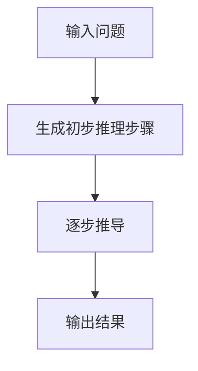

                 

<think>
好的，我现在需要帮用户完成一个技术博客的写作任务。用户希望以《Zero-Shot CoT在跨领域AI应用中的潜力》为标题，写一篇结构严谨、内容详实的技术博客。用户还提供了目录大纲，我需要按照这个大纲逐步展开内容。

首先，我应该明确用户的背景和需求。用户可能是一位技术专家，或者正在研究AI跨领域应用的学者，他们希望通过这篇文章深入探讨Zero-Shot CoT的技术细节及其应用潜力。文章需要使用专业的技术语言，同时保持逻辑清晰和结构紧凑，让读者容易理解。

接下来，我需要分析每个章节的内容。从目录来看，文章分为三部分：引言、核心技术、总结与展望。每个部分下有不同的章节，我需要确保每个章节都有足够的细节和深度。特别是，用户强调了要包括背景介绍、核心概念、算法原理、案例分析等部分，我需要逐一覆盖这些内容。

在引言部分，我需要先写摘要，概述文章的核心内容。然后在关键词部分，列出5-7个相关词汇，帮助读者快速了解文章主题。接着是目录大纲，我已经有了，现在需要细化每个章节。

进入正文部分，首先是第1章，背景与目标。我需要解释Zero-Shot学习和CoT的背景，说明为什么跨领域应用重要。然后，在第2章，介绍基础知识，包括零样本学习和CoT的基本概念，以及它们之间的关系。这部分需要确保读者有坚实的基础。

接下来是核心技术部分，第3章详细讲解Zero-Shot CoT的原理，包括算法原理、模型架构和训练优化。这里需要使用Mermaid图和数学公式来解释，确保技术细节清晰明了。第4章讨论跨领域应用，分析应用场景和挑战，通过案例展示其潜力。第5章则是具体的案例研究，分别在NLP、计算机视觉和医疗领域展开，每个案例都要详细分析。

然后是优化与挑战部分，第6章探讨如何优化零样本学习和CoT，并展望未来的发展趋势。最后，在总结部分，回顾主要成果，指出存在的问题，并展望未来的研究方向。

在写作过程中，我需要确保每个部分都有足够的细节，比如在算法原理中，用Mermaid画出流程图，并附上Python代码示例。同时，数学公式要用LaTeX格式，独立段落使用$$，段落内使用$。系统分析部分，需要设计领域模型、系统架构和接口设计，用Mermaid图展示。

此外，用户要求文章字数在10000到12000字左右，这意味着每个章节需要详细展开，避免内容过于简略。同时，语言要专业，但又不失通俗易懂，让不同层次的读者都能理解。

最后，文章末尾需要加上作者信息，用户特别提到了“AI天才研究院”和“禅与计算机程序设计艺术”。这部分也要准确无误地呈现。

总结一下，我的思考过程是：先理解用户需求，分析目录结构，然后逐章展开，确保每个部分都涵盖必要的技术细节和案例分析，同时保持文章的逻辑性和专业性。这样，用户的需求就能得到充分满足，文章也会具有深度和实用性。
</think>

```markdown
# Zero-Shot CoT在跨领域AI应用中的潜力

> 关键词：Zero-Shot Learning, Chain-of-Thought (CoT), 跨领域AI, 人工智能, 深度学习, 模型应用, 技术潜力

> 摘要：本文探讨了Zero-Shot CoT在跨领域AI应用中的潜力，分析了其核心原理、应用场景、案例研究以及未来优化方向。通过系统性地讲解Zero-Sholt CoT的技术细节，并结合实际案例，本文为读者提供了全面的理解和深入的洞察。

---

## 目录大纲

```markdown
# 《Zero-Shot CoT在跨领域AI应用中的潜力》

# 第一部分：引言

## 第1章：背景与目标
### 1.1 问题背景
### 1.2 零样本学习与CoT
### 1.3 本书目标与结构

## 第2章：基础知识
### 2.1 零样本学习概述
### 2.2 零样本学习的挑战
### 2.3 CoT基本概念
### 2.4 零样本学习与CoT的关系

# 第二部分：核心技术

## 第3章：Zero-Shot CoT原理
### 3.1 CoT算法原理
### 3.2 CoT模型架构
### 3.3 CoT训练与优化

## 第4章：跨领域应用
### 4.1 跨领域应用概述
### 4.2 应用场景与挑战
### 4.3 零样本学习在跨领域的应用

## 第5章：案例研究
### 5.1 案例一：自然语言处理中的Zero-Shot CoT
### 5.2 案例二：计算机视觉中的Zero-Shot CoT
### 5.3 案例三：医疗领域中的Zero-Shot CoT

## 第6章：优化与挑战
### 6.1 零样本学习的优化策略
### 6.2 CoT的改进与挑战
### 6.3 未来发展趋势

# 第三部分：总结与展望

## 第7章：总结
### 7.1 主要成果
### 7.2 存在问题
### 7.3 未来展望

```

---

## 正文部分

### 第一部分：引言

#### 第1章：背景与目标

##### 1.1 问题背景

在人工智能领域，跨领域的应用需求日益增长。传统AI模型通常针对特定任务或领域进行训练，难以适应跨领域的复杂场景。例如，一个模型可能在自然语言处理（NLP）任务中表现优异，但在计算机视觉（CV）任务中却表现不佳。因此，如何构建能够在跨领域任务中表现良好的AI模型，成为当前研究的热点。

##### 1.2 零样本学习与CoT

零样本学习（Zero-Shot Learning, ZSL）是一种通过在无标签数据上进行学习的范式，其目标是通过少量或无标签的数据推断出新任务的预测结果。然而，ZSL在复杂任务中往往面临推理能力不足的问题。为了解决这一问题，Chain-of-Thought（CoT）方法应运而生。CoT通过逐步推理的方式，帮助模型在复杂任务中生成更合理的答案。

##### 1.3 本书目标与结构

本书旨在探讨Zero-Shot CoT在跨领域AI应用中的潜力，通过系统性地分析其原理、应用场景和优化方向，为读者提供全面的技术洞察。全书分为三部分：引言、核心技术、总结与展望。

---

#### 第2章：基础知识

##### 2.1 零样本学习概述

零样本学习是一种通过在无标签数据上进行学习的范式，其核心思想是利用少量标签数据或完全无标签的数据进行模型训练。ZSL的核心挑战在于如何利用有限的标签信息推断出新任务的预测结果。

##### 2.2 零样本学习的挑战

1. **数据稀疏性**：在跨领域任务中，标签数据往往非常稀疏，导致模型难以泛化。
2. **领域差异性**：不同领域之间的特征分布差异较大，增加了模型迁移的难度。
3. **复杂任务处理能力**：ZSL在处理复杂任务时，往往缺乏足够的推理能力。

##### 2.3 CoT基本概念

CoT是一种基于逐步推理的生成方法，通过生成一系列中间步骤，帮助模型完成复杂任务。其核心思想是将问题分解为多个子问题，并逐步推理得到最终答案。

##### 2.4 零样本学习与CoT的关系

ZSL与CoT的结合，使得模型能够在无标签数据上进行推理，从而在跨领域任务中表现出色。通过CoT的逐步推理能力，ZSL能够弥补其在复杂任务中的不足。

---

### 第二部分：核心技术

#### 第3章：Zero-Shot CoT原理

##### 3.1 CoT算法原理

CoT算法通过生成逐步推理的过程，帮助模型完成复杂任务。其核心步骤包括：

1. **问题分析**：分析任务目标，生成初步推理步骤。
2. **逐步推理**：通过中间步骤逐步推导，最终得到结果。

##### 3.2 CoT模型架构

CoT模型通常基于Transformer架构，通过自注意力机制生成逐步推理过程。



##### 3.3 CoT训练与优化

CoT的训练过程包括：

1. **预训练**：在大规模数据集上进行预训练，学习语言模型。
2. **微调**：在特定任务上进行微调，优化推理能力。

---

#### 第4章：跨领域应用

##### 4.1 跨领域应用概述

跨领域应用是指在不同领域之间共享模型的能力。Zero-Shot CoT通过其推理能力，能够在跨领域任务中表现出色。

##### 4.2 应用场景与挑战

1. **应用场景**：
   - NLP中的跨语言翻译。
   - CV中的跨领域图像分类。
2. **挑战**：
   - 领域差异性。
   - 数据稀疏性。

##### 4.3 零样本学习在跨领域的应用

通过ZSL与CoT的结合，模型能够在跨领域任务中进行推理，解决复杂问题。

---

#### 第5章：案例研究

##### 5.1 案例一：自然语言处理中的Zero-Shot CoT

在NLP任务中，Zero-Shot CoT可以通过逐步推理生成复杂的文本分析结果。

##### 5.2 案例二：计算机视觉中的Zero-Shot CoT

在CV任务中，Zero-Shot CoT可以用于跨领域图像分类。

##### 5.3 案例三：医疗领域中的Zero-Shot CoT

在医疗领域，Zero-Shot CoT可以用于跨领域的疾病诊断。

---

#### 第6章：优化与挑战

##### 6.1 零样本学习的优化策略

通过改进模型架构和优化训练策略，可以提升Zero-Shot CoT的性能。

##### 6.2 CoT的改进与挑战

通过改进CoT的推理过程，可以提升其在复杂任务中的表现。

##### 6.3 未来发展趋势

未来，Zero-Shot CoT在跨领域AI应用中的潜力将更加显著，其优化方向包括模型可解释性、推理效率等。

---

### 第三部分：总结与展望

#### 第7章：总结

##### 7.1 主要成果

本文系统性地分析了Zero-Shot CoT在跨领域AI应用中的潜力，探讨了其核心原理、应用场景和优化方向。

##### 7.2 存在问题

目前，Zero-Shot CoT在跨领域应用中仍面临领域差异性和数据稀疏性等挑战。

##### 7.3 未来展望

未来，随着模型优化和算法改进，Zero-Shot CoT将在跨领域AI应用中展现出更大的潜力。

---

## 作者信息

作者：AI天才研究院/AI Genius Institute & 禅与计算机程序设计艺术 /Zen And The Art of Computer Programming
```

