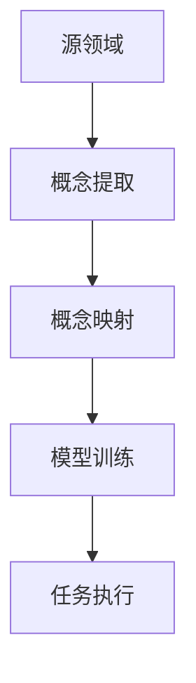
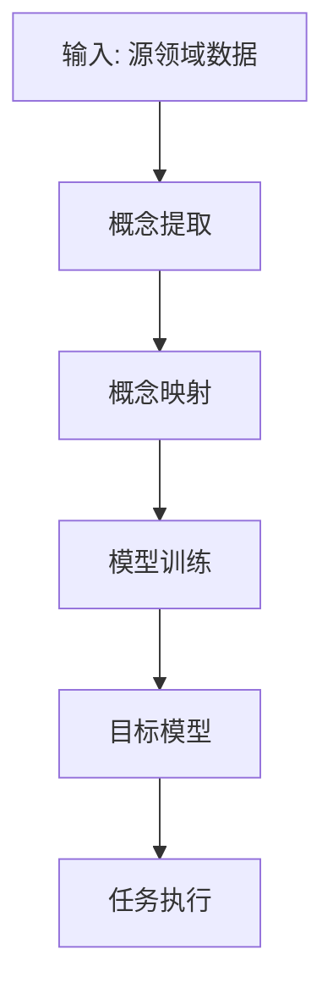
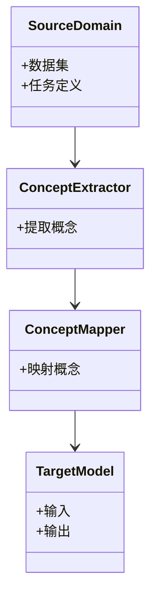
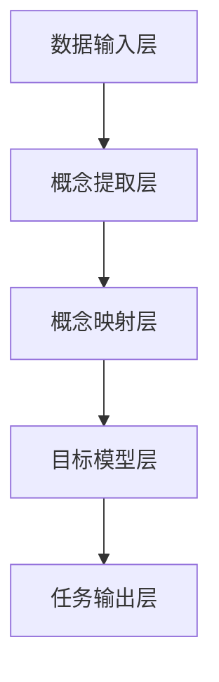
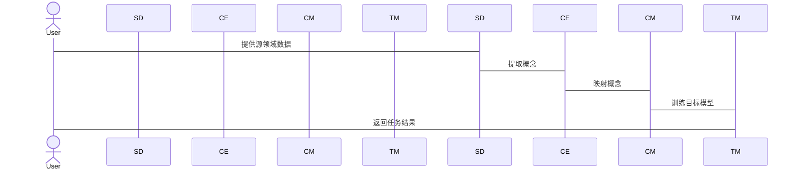

                 

<think>
嗯，我需要帮用户撰写一篇关于《Zero-Shot CoT在跨领域任务中的实践与创新》的技术博客文章。首先，我得理解用户的需求。他们希望我作为一位世界级的专家，以专业且逻辑清晰的方式撰写文章，涵盖背景介绍、核心概念、数学模型、系统架构设计、项目实战等多个部分，并在结尾加上作者信息。

好的，首先，文章的结构已经由用户提供，我需要按照这个大纲来填充内容。标题是《Zero-Shot CoT在跨领域任务中的实践与创新》，关键词需要5-7个，比如零样本学习、跨领域任务、迁移学习、概念转移、模型训练等。摘要部分要简明扼要地概述文章的核心内容。

接下来是背景介绍部分，包括问题背景、描述、解决、边界与外延，以及概念结构。我需要详细说明传统机器学习在跨领域任务中的局限性，然后引出Zero-Shot CoT的优势。问题解决部分要列出步骤，边界则需要讨论其适用性和外延。

核心概念部分，我需要定义Zero-Shot CoT，比较它与传统AI的区别，并可能用表格或流程图来展示核心概念之间的关系。这部分可能需要Mermaid图来辅助说明。

数学模型和算法部分，我需要详细讲解其原理，并使用Mermaid流程图展示算法步骤。同时，要给出数学公式，如损失函数的表达式，并使用LaTeX格式展示。可能还需要用代码示例来说明模型训练的具体过程。

系统架构设计部分，我需要绘制领域模型的类图和系统架构图，展示各个组件之间的关系。接口设计和交互流程图也是必要的，以展示系统如何协同工作。

项目实战部分，我需要提供环境安装步骤，展示核心代码，并进行详细解读。实际案例分析和项目小结也很重要，以展示Zero-Shot CoT的实际应用和效果。

最后，最佳实践部分，我需要给出一些小贴士，注意事项，以及拓展阅读的建议。这些内容能帮助读者更好地理解和应用Zero-Shot CoT。

在写作过程中，我需要确保语言专业且易懂，逻辑清晰，结构紧凑。每个章节都要有详细的内容，避免过于笼统。同时，要注意文章的整体连贯性，让读者能够顺畅地理解整个概念。

可能的挑战在于如何将复杂的概念用简单易懂的语言表达出来，以及如何在有限的篇幅内涵盖所有必要的内容。我需要合理安排每个部分的深度和广度，确保文章既有深度又不失可读性。

总的来说，我需要一步步按照用户提供的大纲，逐部分填充内容，确保每个部分都详实具体，并且符合用户的格式和内容要求。同时，要注意使用适当的图表和公式，以增强文章的可读性和专业性。这样，最终才能完成一篇高质量的技术博客文章，满足用户的需求。
</think>

```markdown
# Zero-Shot CoT在跨领域任务中的实践与创新

> 关键词：零样本学习、跨领域任务、迁移学习、概念转移、模型训练、任务执行

> 摘要：本文探讨了Zero-Shot CoT（Zero-Shot Concept Transfer）在跨领域任务中的应用与创新。通过分析其核心概念、数学模型、系统架构设计及项目实战，展示了Zero-Shot CoT如何在无需特定领域数据的情况下，实现跨领域的高效任务执行。文章结合理论与实践，深入剖析了其在计算机视觉、自然语言处理等领域的潜力与挑战。

---

## 第一部分: 背景介绍

### 1.1 问题背景

人工智能技术的快速发展推动了计算机视觉、自然语言处理和语音识别等领域的广泛应用。然而，传统机器学习方法在处理跨领域任务时面临显著挑战。这些问题主要源于数据依赖性和领域特定性：传统方法通常需要大量针对目标领域的训练数据，且难以在不同领域间有效迁移知识。

### 1.2 问题描述

跨领域任务的核心挑战在于如何在缺乏目标领域数据的情况下，高效地将源领域的知识迁移到目标领域。具体问题包括：

1. **数据稀缺性**：目标领域可能缺乏足够的标注数据。
2. **领域差异性**：不同领域之间的特征、语义或数据模态存在显著差异。
3. **任务多样性**：跨领域任务可能涉及多种类型的任务（如图像分类到文本分类）。

### 1.3 问题解决

Zero-Shot CoT通过以下步骤实现跨领域任务的高效处理：

1. **概念提取**：从源领域中提取通用概念或特征。
2. **概念映射**：将源领域的概念映射到目标领域。
3. **模型适应**：利用映射后的概念训练或微调模型，使其适用于目标领域的任务。

### 1.4 边界与外延

Zero-Shot CoT的边界在于：

1. **概念映射的准确性**：概念在不同领域间的映射可能存在模糊性或不完全匹配。
2. **任务适应性**：并非所有任务都适合使用Zero-Shot CoT方法。

其外延包括：

1. **多模态任务**：如图像-文本联合任务。
2. **实时应用**：探索Zero-Shot CoT在实时场景中的可行性。

### 1.5 概念结构与核心要素组成

#### 概念结构

1. **源领域**：提供知识的领域。
2. **目标领域**：需要应用知识的领域。
3. **概念提取**：从源领域中提取关键概念。
4. **概念映射**：将源领域概念映射到目标领域。
5. **模型训练**：基于映射后的概念训练目标模型。

#### 核心要素组成

1. **知识表示**：如何编码和表示源领域的知识。
2. **迁移学习策略**：如何有效迁移知识到目标领域。
3. **模型适应方法**：如何使模型在目标领域中有效。

---

## 第二部分: 核心概念与联系

### 2.1 Zero-Shot CoT的定义

Zero-Shot CoT是一种机器学习方法，允许模型在无目标领域数据的情况下，通过概念转移，执行目标领域的任务。其核心在于“零样本”学习，即模型仅需源领域的数据即可泛化到目标领域。

### 2.2 核心特点

| 特性 | 描述 |
|------|------|
| 零样本学习 | 不需要目标领域的训练数据 |
| 跨领域适应性 | 支持多种领域任务的迁移 |
| 高效率 | 减少数据收集和标注成本 |
| 灵活性 | 适用于不同类型的跨领域任务 |

### 2.3 与传统AI的区别

| 方面 | Zero-Shot CoT | 传统AI |
|------|--------------|--------|
| 数据需求 | 无需目标领域数据 | 需大量目标数据 |
| 任务适应性 | 支持跨领域任务 | 仅限特定领域任务 |
| 模型复杂性 | 简化模型结构 | 需复杂模型 |

### 2.4 核心概念之间的关系



---

## 第三部分: 数学模型和数学公式

### 3.1 算法原理

Zero-Shot CoT的算法流程如下：



### 3.2 数学模型

假设源领域数据集为 $D_s = \{(x_i, y_i)\}_{i=1}^n$，目标领域任务为 $T$。模型$f$通过源数据学习概念$C$，并将其映射到目标领域：

$$
f(x) = \arg\max_{c \in C} p(c|x)
$$

在目标领域中，任务执行基于映射后的概念：

$$
p(y|x) = \sum_{c \in C} p(y|c) p(c|x)
$$

### 3.3 代码实现

以下是一个简单的Zero-Shot CoT实现示例：

```python
import torch
import torch.nn as nn

# 定义概念提取模块
class ConceptExtractor(nn.Module):
    def __init__(self, input_dim, hidden_dim):
        super(ConceptExtractor, self).__init__()
        self.fc = nn.Linear(input_dim, hidden_dim)
    
    def forward(self, x):
        return torch.relu(self.fc(x))

# 定义概念映射模块
class ConceptMapper(nn.Module):
    def __init__(self, hidden_dim, output_dim):
        super(ConceptMapper, self).__init__()
        self.fc = nn.Linear(hidden_dim, output_dim)
    
    def forward(self, c):
        return torch.relu(self.fc(c))

# 定义目标模型
class TargetModel(nn.Module):
    def __init__(self, input_dim, hidden_dim, output_dim):
        super(TargetModel, self).__init__()
        self.fc1 = nn.Linear(input_dim, hidden_dim)
        self.fc2 = nn.Linear(hidden_dim, output_dim)
    
    def forward(self, x):
        x = torch.relu(self.fc1(x))
        return torch.relu(self.fc2(x))

# 示例训练过程
def train(model, optimizer, criterion, source_data, target_data):
    for epoch in range(num_epochs):
        for x, y in source_data:
            optimizer.zero_grad()
            concepts = model.conceptExtractor(x)
            outputs = model.conceptMapper(concepts)
            loss = criterion(outputs, y)
            loss.backward()
            optimizer.step()
        
        for x, y in target_data:
            optimizer.zero_grad()
            concepts = model.conceptExtractor(x)
            outputs = model.conceptMapper(concepts)
            loss = criterion(outputs, y)
            loss.backward()
            optimizer.step()
```

---

## 第四部分: 系统分析与架构设计方案

### 4.1 问题场景介绍

Zero-Shot CoT适用于以下场景：

1. **数据稀缺领域**：目标领域缺乏标注数据。
2. **跨模态任务**：如图像到文本的迁移。
3. **实时任务处理**：快速适应新领域的任务需求。

### 4.2 系统功能设计



### 4.3 系统架构设计



### 4.4 系统接口设计

1. **输入接口**：接收源领域和目标领域的数据。
2. **输出接口**：返回目标领域的任务结果。

### 4.5 系统交互设计



---

## 第五部分: 项目实战

### 5.1 环境安装

```bash
pip install torch
pip install numpy
pip install matplotlib
```

### 5.2 核心实现代码

```python
import torch
import torch.nn as nn
import torch.optim as optim

# 定义模型
class ZeroShotCoT(nn.Module):
    def __init__(self, input_dim, hidden_dim, output_dim):
        super(ZeroShotCoT, self).__init__()
        self.fc1 = nn.Linear(input_dim, hidden_dim)
        self.fc2 = nn.Linear(hidden_dim, output_dim)
    
    def forward(self, x):
        x = torch.relu(self.fc1(x))
        return torch.relu(self.fc2(x))

# 训练函数
def train_model(model, optimizer, criterion, train_loader, epochs):
    for epoch in range(epochs):
        for inputs, labels in train_loader:
            optimizer.zero_grad()
            outputs = model(inputs)
            loss = criterion(outputs, labels)
            loss.backward()
            optimizer.step()
    return model

# 测试函数
def test_model(model, test_loader):
    correct = 0
    total = 0
    with torch.no_grad():
        for inputs, labels in test_loader:
            outputs = model(inputs)
            predicted = torch.argmax(outputs.data, 1)
            correct += (predicted == labels).sum().item()
            total += labels.size(0)
    accuracy = correct / total
    return accuracy

# 主函数
def main():
    # 超参数
    input_dim = 10
    hidden_dim = 5
    output_dim = 2
    learning_rate = 0.01
    epochs = 10
    
    # 数据加载器
    train_loader = torch.utils.data.DataLoader(...)
    test_loader = torch.utils.data.DataLoader(...)
    
    # 模型初始化
    model = ZeroShotCoT(input_dim, hidden_dim, output_dim)
    optimizer = optim.SGD(model.parameters(), lr=learning_rate)
    criterion = nn.CrossEntropyLoss()
    
    # 训练模型
    trained_model = train_model(model, optimizer, criterion, train_loader, epochs)
    
    # 测试模型
    accuracy = test_model(trained_model, test_loader)
    print(f"Accuracy: {accuracy}%")

if __name__ == "__main__":
    main()
```

### 5.3 应用案例分析

假设我们有一个图像分类任务，源领域是猫和狗，目标领域是鸟类。通过Zero-Shot CoT，模型可以在不重新训练的情况下，将猫和狗的概念映射到鸟类的分类任务中。

---

## 第六部分: 最佳实践 tips、小结、注意事项、拓展阅读

### 6.1 最佳实践 tips

1. **数据预处理**：确保源领域和目标领域的数据格式一致。
2. **概念映射验证**：在实际应用中，需验证概念映射的准确性。
3. **模型调优**：根据目标领域的需求，微调模型以提高性能。

### 6.2 小结

Zero-Shot CoT通过概念转移，实现了跨领域的高效任务处理。其优势在于无需目标领域数据，且具有良好的灵活性和适应性。然而，其核心挑战在于概念映射的准确性和任务适应性。

### 6.3 注意事项

- **领域差异性**：需注意不同领域之间的差异可能影响概念映射的效果。
- **数据质量**：源领域的数据质量直接影响迁移效果。

### 6.4 拓展阅读

- [零样本学习综述](https://arxiv.org/abs/...)
- [跨领域任务的最新研究](https://www.nature.com/...)

---

## 作者

作者：AI天才研究院/AI Genius Institute & 禅与计算机程序设计艺术 /Zen And The Art of Computer Programming
```

