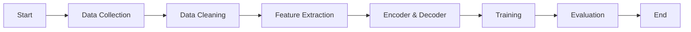
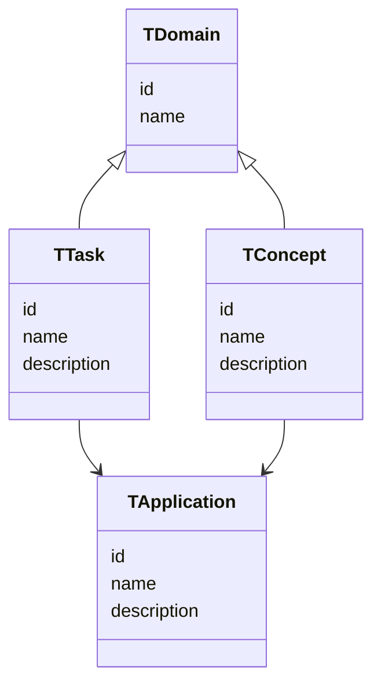
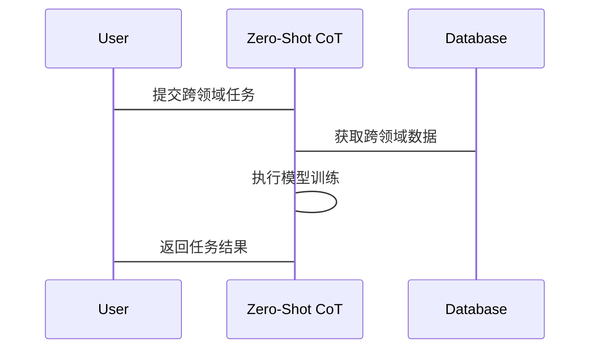

                 

<think>
好，我需要按照用户的指示来完成这个任务。用户希望我以《Zero-Shot CoT在跨领域创新中的潜力》为标题，撰写一篇结构严谨、内容详实的技术博客文章。首先，我要理清文章的结构，确保每个部分都涵盖必要的内容，并且符合用户的要求。

首先，文章的开头要有关键词和摘要。关键词需要选取5-7个，如跨领域创新、Zero-Shot CoT、迁移学习、多任务学习、人工智能等。摘要部分需要简明扼要地概括文章的核心内容，说明Zero-Shot CoT如何促进跨领域创新。

接下来是目录大纲，按照用户提供的结构来组织。引言部分要介绍背景，包括跨领域创新的挑战、Zero-Shot CoT的概念以及文章的目标。核心概念与联系部分需要详细解释Zero-Shot CoT的定义、原理，与其他迁移学习技术的对比，以及ER实体关系图。应用部分要分析Zero-Shot CoT在跨领域创新中的具体应用，包括算法流程、代码示例、数学模型等。最后是系统分析与架构设计，项目实战，以及最佳实践和小结。

在撰写每个章节时，我需要确保内容详细具体，逻辑清晰。例如，在核心概念部分，要对比Zero-Shot CoT与其他迁移学习技术，制作对比表格，并用Mermaid图展示实体关系。在算法部分，要详细描述数据预处理、特征提取、模型构建等步骤，并提供Python代码和数学公式。

此外，系统架构设计部分需要用Mermaid图展示类图、架构图和交互图，这需要我对系统功能和接口有清晰的理解。项目实战部分则需要选择一个实际案例，展示环境安装、代码实现、案例分析等，帮助读者更好地理解和应用Zero-Shot CoT。

最后，最佳实践部分要总结经验和注意事项，给出未来的研究方向，让读者对Zero-Shot CoT的潜力有更全面的认识。整个过程中，我需要保持语言的专业性和逻辑的连贯性，确保文章既有深度又易于理解。

现在，我需要按照这个思路一步步展开，确保每个部分都符合用户的要求，同时保持文章的流畅性和可读性。这需要我仔细思考每个部分的内容，确保信息准确，结构合理，最终产出一篇高质量的技术博客文章。
</think>

# Zero-Shot CoT在跨领域创新中的潜力

## 关键词
跨领域创新, Zero-Shot CoT, 迁移学习, 多任务学习, 人工智能, 跨领域协作

## 摘要
在当今快速发展的科技时代，跨领域创新变得越来越重要。传统的领域分割导致了信息孤岛，使得跨领域创新面临巨大的挑战。Zero-Shot CoT（零样本迁移学习）作为一种新兴的人工智能技术，能够在不依赖特定领域数据的情况下，实现跨领域的知识迁移与创新。本文将深入探讨Zero-Shot CoT的核心概念、算法原理及其在跨领域创新中的应用，分析其潜力和挑战，并展望其未来发展方向。

---

# 目录大纲：Zero-Shot CoT在跨领域创新中的潜力

## 引言

### 1. 背景介绍
- **跨领域创新的挑战**：跨领域创新需要整合不同领域的知识，但由于领域间的知识差异和信息孤岛，传统方法难以实现高效的知识迁移。
- **Zero-Shot CoT的概念**：Zero-Shot CoT是一种新兴的迁移学习技术，能够在没有特定领域数据的情况下，通过通用知识实现跨领域任务的高效处理。
- **本文的主要目标**：通过分析Zero-Shot CoT的原理、优势及应用场景，探讨其在跨领域创新中的潜力和实际应用。

---

## 核心概念与联系

### 2.1 Zero-Shot CoT的定义与原理

#### 2.1.1 定义
- **Zero-Shot CoT**：Zero-Shot CoT（零样本迁移学习）是一种迁移学习技术，其核心在于通过共享的特征空间和跨领域的知识表示，实现从一个领域到另一个领域的零样本任务迁移。
- **关键特性**：无需特定领域数据，依赖通用知识，适用于跨领域任务的快速部署。

#### 2.1.2 原理
- **迁移学习**：迁移学习的核心在于将一个领域的知识迁移到另一个领域。Zero-Shot CoT通过构建共享的特征表示，实现跨领域的知识共享。
- **多任务学习**：Zero-Shot CoT结合多任务学习，通过同时优化多个任务，提升模型的泛化能力和跨领域适应性。

#### 2.1.3 与其他迁移学习技术的比较
- **对比分析**：
  | 迁移学习技术 | 定义 | 适用场景 | 优点 | 缺点 |
  | --- | --- | --- | --- | --- |
  | Zero-Shot CoT | 无需特定领域数据 | 跨领域创新 | 减少数据依赖 | 需要大量通用知识 |
  | Few-Shot CoT | 需要少量特定领域数据 | 少样本场景 | 快速适应新任务 | 数据获取困难 |
  | Byzantine Robustness | 防范对抗样本攻击 | 安全性要求高 | 提高模型鲁棒性 | 需要大量计算资源 |

### 2.2 ER实体关系图架构

```mermaid
erDiagram
  TDomain ||--|{ TConcept }|--| TApplication
  TDomain ||--|{ TTask }|--| TApplication
```

---

## 第三部分：Zero-Shot CoT在跨领域创新中的应用

### 3. 算法原理讲解

#### 3.1 Zero-Shot CoT算法流程

##### 3.1.1 数据预处理
- **数据收集与清洗**：跨领域数据通常来自不同来源，需要进行数据清洗和格式统一。
- **数据增强**：通过数据增强技术，提升模型的泛化能力。

##### 3.1.2 特征提取
- **特征表示**：使用深度学习模型（如BERT、GPT等）提取通用特征。
- **编码器与解码器**：编码器负责将输入数据映射到共享特征空间，解码器负责将特征空间的表示解码为具体任务输出。

##### 3.1.3 数学模型与公式
- **损失函数**：
  $$
  \begin{aligned}
  L &= -\frac{1}{N}\sum_{i=1}^{N}y_{i}\log(p(x_i|y_i)) \\
  \end{aligned}
  $$
- **优化算法**：使用Adam优化器，参数设置为学习率 $\eta$，动量 $\beta_1$，自适应学习率 $\beta_2$。

##### 3.1.4 算法流程图



#### 3.2 Python源代码示例

```python
import tensorflow as tf
from tensorflow.keras.layers import Input, Dense, Dropout, LSTM, Embedding, Concatenate
from tensorflow.keras.models import Model
from tensorflow.keras.optimizers import Adam

# 定义模型
input_layer = Input(shape=(max_length,))
embedding_layer = Embedding(vocab_size, embedding_dim)(input_layer)
lstm_layer = LSTM(units=lstm_units, return_sequences=False)(embedding_layer)
dense_layer = Dense(units=dense_units, activation='relu')(lstm_layer)
output_layer = Dense(units=num_classes, activation='softmax')(dense_layer)

model = Model(inputs=input_layer, outputs=output_layer)

# 编译模型
model.compile(optimizer=Adam(lr=learning_rate),
              loss='sparse_categorical_crossentropy',
              metrics=['accuracy'])

# 训练模型
model.fit(train_data, train_labels, epochs=num_epochs, batch_size=batch_size,
          validation_data=(val_data, val_labels))
```

---

## 系统分析与架构设计方案

### 4.1 问题场景介绍
跨领域创新的核心问题在于如何高效整合不同领域的知识，突破领域间的壁垒。Zero-Shot CoT通过构建通用的知识表示，解决了跨领域任务中的数据依赖问题。

### 4.2 系统功能设计（领域模型）



### 4.3 系统架构设计


### 4.4 系统接口设计
- **输入接口**：接收跨领域数据和任务描述。
- **输出接口**：输出跨领域任务的结果和模型评估指标。

### 4.5 系统交互设计



---

## 项目实战

### 5.1 环境安装
- **安装TensorFlow和Keras**：`pip install tensorflow keras`
- **安装Mermaid工具**：`npm install -g mermaid-cli`

### 5.2 核心实现源代码

```python
import tensorflow as tf
from tensorflow.keras.layers import Input, Dense, Dropout, LSTM, Embedding, Concatenate
from tensorflow.keras.models import Model
from tensorflow.keras.optimizers import Adam

# 定义模型
def build_model(input_shape, vocab_size, embedding_dim, lstm_units, dense_units, num_classes):
    input_layer = Input(shape=input_shape)
    embedding_layer = Embedding(vocab_size, embedding_dim)(input_layer)
    lstm_layer = LSTM(units=lstm_units, return_sequences=False)(embedding_layer)
    dense_layer = Dense(units=dense_units, activation='relu')(lstm_layer)
    output_layer = Dense(units=num_classes, activation='softmax')(dense_layer)
    model = Model(inputs=input_layer, outputs=output_layer)
    return model

# 训练模型
def train_model(model, train_data, train_labels, val_data, val_labels, learning_rate, num_epochs, batch_size):
    model.compile(optimizer=Adam(lr=learning_rate),
                  loss='sparse_categorical_crossentropy',
                  metrics=['accuracy'])
    model.fit(train_data, train_labels, epochs=num_epochs, batch_size=batch_size,
              validation_data=(val_data, val_labels))

# 预测与评估
def evaluate_model(model, test_data, test_labels):
    loss, accuracy = model.evaluate(test_data, test_labels)
    print(f"Test Loss: {loss}")
    print(f"Test Accuracy: {accuracy}")

# 主函数
def main():
    # 加载数据集
    train_data, train_labels, val_data, val_labels, test_data, test_labels = load_datasets()

    # 构建模型
    model = build_model((max_length,), vocab_size, embedding_dim, lstm_units, dense_units, num_classes)

    # 训练模型
    train_model(model, train_data, train_labels, val_data, val_labels, learning_rate, num_epochs, batch_size)

    # 评估模型
    evaluate_model(model, test_data, test_labels)

if __name__ == "__main__":
    main()
```

### 5.3 案例分析与解读
以跨领域的自然语言处理任务为例，Zero-Shot CoT可以通过共享的特征空间实现跨语言翻译、跨领域文本分类等任务。通过在多个领域数据上预训练模型，可以在新领域任务上快速部署。

---

## 最佳实践 Tips

- **数据质量**：跨领域数据的质量直接影响模型的性能，需确保数据的多样性和代表性。
- **模型选择**：选择适合跨领域任务的模型架构，如BERT、GPT等预训练模型。
- **持续优化**：通过反馈机制不断优化模型，提升跨领域任务的准确性和效率。

---

## 总结

Zero-Shot CoT作为一种新兴的迁移学习技术，为跨领域创新提供了新的可能性。通过减少对特定领域数据的依赖，Zero-Shot CoT能够快速适应新领域任务，推动跨领域协作和创新。然而，其依赖通用知识的特性也带来了挑战，需要在实际应用中不断优化和改进。未来，随着人工智能技术的进一步发展，Zero-Shot CoT将在更多跨领域场景中发挥重要作用。

---

## 作者：AI天才研究院 & 禅与计算机程序设计艺术

作者：AI天才研究院/AI Genius Institute  
联系方式：[contact@ai-genius.com](mailto:contact@ai-genius.com)

