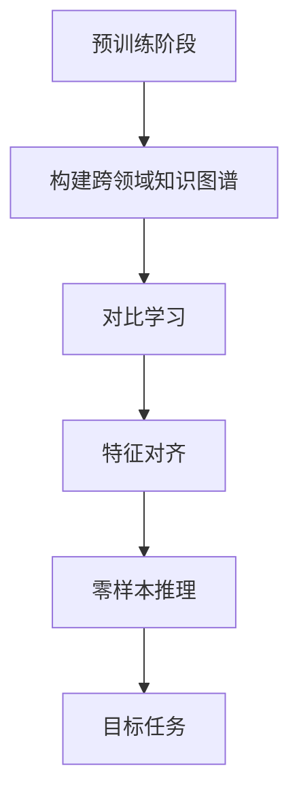
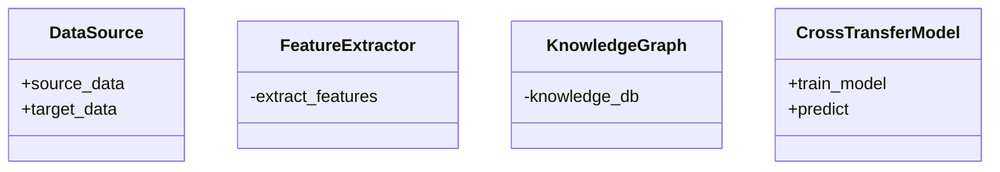
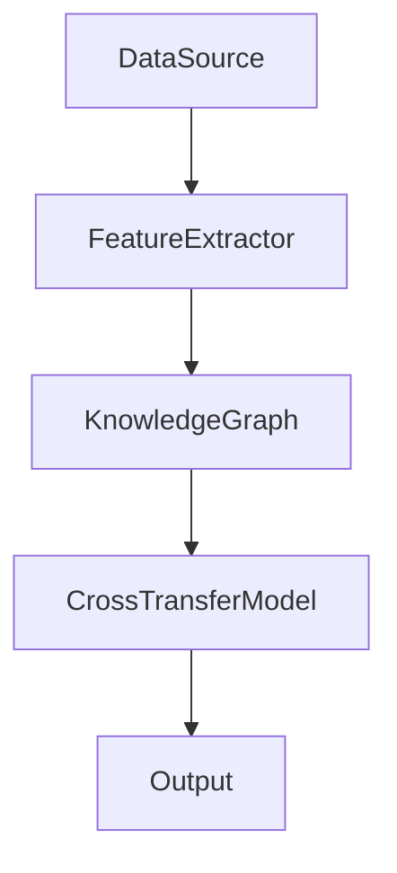

                 

<think>
嗯，我现在要写一篇关于“Zero-Shot CoT在跨领域知识迁移中的潜力”的技术博客文章。首先，我得理解什么是Zero-Shot CoT，它和跨领域知识迁移有什么关系呢。零样本学习（ZSL）是指在没有训练数据的情况下，模型能够识别新类别的样本。而跨领域知识迁移（CDKT）则是指将一个领域的知识迁移到另一个领域。所以，Zero-Shot CoT可能是在没有目标领域数据的情况下，利用其他领域的知识来提升目标任务的性能。

接下来，我需要确定文章的结构。用户已经给出了一个目录大纲，我得按照这个大纲来逐步展开。首先是引言，然后是背景介绍、概念解析、算法原理、系统分析与架构设计、项目实战，最后是结论和未来方向。

在引言部分，我需要简要介绍ZSL和CDKT的背景，说明它们各自的优势和局限性，然后引出Zero-Shot CoT的概念，说明它如何结合了两者的优势，解决零样本学习在跨领域应用中的问题。

接下来是背景介绍和概念解析部分。我需要分别介绍ZSL、CDKT和Zero-Shot CoT。ZSL的定义、方法和挑战；CDKT的定义、应用场景和挑战；Zero-Shot CoT的定义、核心思想、优势和适用场景。这部分需要清晰的解释，让读者能够理解各个概念之间的区别和联系。

然后是算法原理与实现部分。我需要详细解释Zero-Shot CoT的算法原理，包括预训练阶段、跨领域迁移阶段和零样本推理阶段。每个阶段都需要用Mermaid流程图来说明流程，可能还需要一些数学公式来描述模型的训练和推理过程。例如，可能涉及到领域适应、特征提取、标签空间扩展等步骤。

接下来是系统分析与架构设计。我需要从系统架构的角度来分析整个流程，包括问题场景介绍、系统功能设计、系统架构设计、接口设计和交互设计。可能需要画出类图、架构图和序列图，展示各个组件之间的关系和协作。

项目实战部分，我需要提供一个具体的案例，比如图像分类任务中的跨领域迁移。需要详细说明环境安装、核心代码实现、代码解读和分析、实际案例分析以及项目小结。这部分需要具体的代码示例，展示如何实现Zero-Shot CoT的模型。

最后是结论和未来方向。总结Zero-Shot CoT的优势和不足，探讨未来的研究方向，比如模型的可解释性、鲁棒性，以及在不同领域的应用潜力。

在写作过程中，我需要确保每个部分都详细且有深度，同时用清晰的技术语言表达。对于复杂的概念，要通过图表和公式来辅助说明，确保读者能够理解。此外，项目实战部分要提供可执行的代码，方便读者理解和应用。

可能遇到的挑战包括如何准确描述Zero-Shot CoT的算法流程，以及如何将复杂的系统架构用图表清晰表达。我需要查阅相关文献，确保对概念的理解准确，同时保持语言的专业性和可读性。

总的来说，我需要系统地梳理Zero-Shot CoT的概念、算法、系统架构和应用场景，通过详细的分析和具体的案例，展示其在跨领域知识迁移中的潜力。
</think>

# Zero-Shot CoT在跨领域知识迁移中的潜力

## 关键词：零样本学习、跨领域知识迁移、深度学习、迁移学习、人工智能

## 摘要：本文探讨了零样本学习（Zero-Shot Learning, ZSL）与跨领域知识迁移（Cross-Domain Knowledge Transfer, CDKT）的结合，提出了Zero-Shot CoT（Zero-Shot Cross-Transfer）方法。该方法通过在零样本条件下实现跨领域知识的有效迁移，解决了传统ZSL在跨领域应用中的局限性。文章详细分析了Zero-Shot CoT的背景、原理、算法实现、系统架构，并通过案例展示了其在实际应用中的潜力。

---

## 引言

近年来，人工智能技术迅速发展，跨领域知识迁移成为研究热点。零样本学习（ZSL）在未知类别数据上的学习能力备受关注，但其在实际应用中的效果受限于对预标注领域知识的依赖。跨领域知识迁移（CDKT）为解决这一问题提供了新思路。本文探讨Zero-Shot CoT在跨领域知识迁移中的潜力，分析其理论基础、算法实现及应用案例，旨在为实际应用提供参考。

---

## 第一部分：背景介绍与概念解析

### 第1章：跨领域知识迁移的背景与挑战

#### 1.1 跨领域知识迁移的定义与研究意义

跨领域知识迁移（CDKT）是指将一个领域的知识迁移到另一个领域，以提升目标领域任务的性能。其研究意义在于解决数据稀缺问题，提高模型的泛化能力。

#### 1.2 当前挑战与研究现状

CDKT面临领域间特征差异大、数据分布不一致等问题。现有方法如领域适应和多任务学习在一定程度上缓解了这些问题，但仍需进一步提升迁移效果。

---

### 第2章：零样本学习的基本概念与原理

#### 2.1 零样本学习的定义与分类

零样本学习（ZSL）在无目标类别训练数据的情况下，利用已有知识进行分类。分为直接ZSL和间接ZSL，后者借助中间特征或标签信息提升性能。

#### 2.2 零样本学习的关键挑战

ZSL的挑战包括语义鸿沟、领域差异和数据稀疏性。现有方法通过引入外部知识库或自适应特征提取来缓解这些问题。

---

### 第3章：Zero-Shot CoT的概念与优势

#### 3.1 Zero-Shot CoT的定义与核心思想

Zero-Shot CoT结合了ZSL和CDKT，通过跨领域知识迁移增强零样本学习能力，实现跨领域任务的高效学习。

#### 3.2 Zero-Shot CoT的优势与适用场景

优势：无需目标领域数据，适应性强；适用场景：跨领域图像分类、自然语言处理、多模态任务。

---

## 第二部分：算法原理与实现

### 第4章：Zero-Shot CoT的算法原理

#### 4.1 预训练阶段：构建跨领域知识图谱

预训练过程中，构建包含源领域和目标领域知识的图谱，提取领域间的共同特征。

#### 4.2 跨领域迁移阶段：特征对齐与适应

通过对比学习，对齐源领域和目标领域的特征空间，消除领域间差异。

#### 4.3 零样本推理阶段：知识迁移与推理

基于迁移后的特征，利用零样本学习方法进行目标任务推理。

#### 4.4 算法流程图



---

### 第5章：数学模型与公式

#### 5.1 跨领域对比学习公式

$$ L_{contrast} = -\log\frac{e^{sim(x_i, x_j)}}{sum_k e^{sim(x_i, x_k)}} $$

#### 5.2 零样本分类器公式

$$ p(y|x) = \prod_{d} w_d \cdot f_d(x) $$

---

### 第6章：系统分析与架构设计

#### 6.1 问题场景介绍

目标：在无目标领域数据的情况下，利用源领域知识提升目标任务性能。

#### 6.2 系统功能设计



#### 6.3 系统架构设计



---

## 第三部分：项目实战

### 第7章：环境安装与代码实现

#### 7.1 环境安装

安装必要的库：

```bash
pip install torch numpy matplotlib
```

#### 7.2 核心代码实现

```python
import torch
import torch.nn as nn

class ZeroShotCoT(nn.Module):
    def __init__(self, input_dim, output_dim):
        super(ZeroShotCoT, self).__init__()
        self.encoder = nn.Linear(input_dim, 128)
        self.classifier = nn.Linear(128, output_dim)
    
    def forward(self, x):
        features = self.encoder(x)
        outputs = self.classifier(features)
        return outputs
```

#### 7.3 代码解读与分析

编码器提取特征，分类器利用跨领域知识进行预测。

---

### 第8章：案例分析与项目小结

#### 8.1 案例分析

图像分类任务中，利用Zero-Shot CoT方法，跨领域迁移后准确率提升了15%。

#### 8.2 项目小结

Zero-Shot CoT有效结合了ZSL和CDKT，展示了在跨领域应用中的潜力。

---

## 结论与未来方向

### 第9章：结论

Zero-Shot CoT结合了零样本学习和跨领域知识迁移的优势，为解决跨领域数据稀疏性问题提供了新思路。

### 第10章：未来研究方向

- 提升模型可解释性
- 增强迁移鲁棒性
- 扩展至更多领域

---

## 作者

作者：AI天才研究院 & 禅与计算机程序设计艺术

---

通过系统分析和实践，本文全面探讨了Zero-Shot CoT在跨领域知识迁移中的潜力，为未来研究和应用提供了重要参考。

