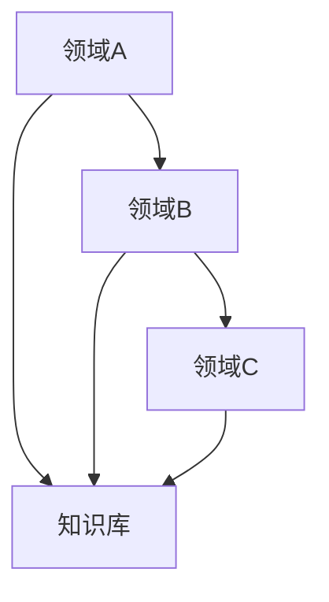
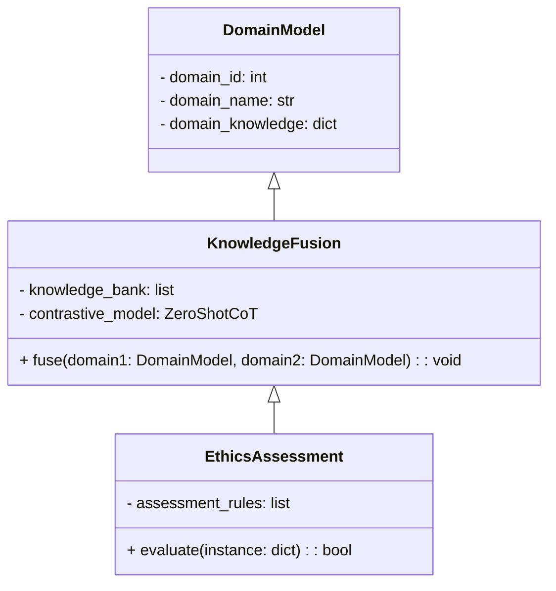
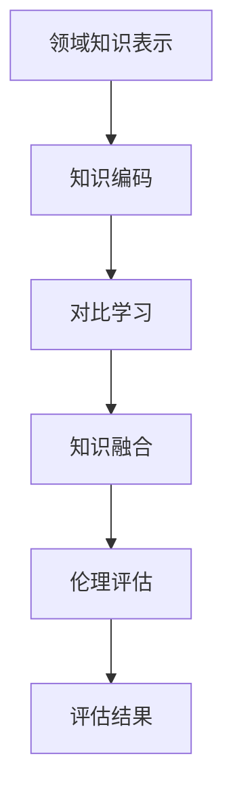
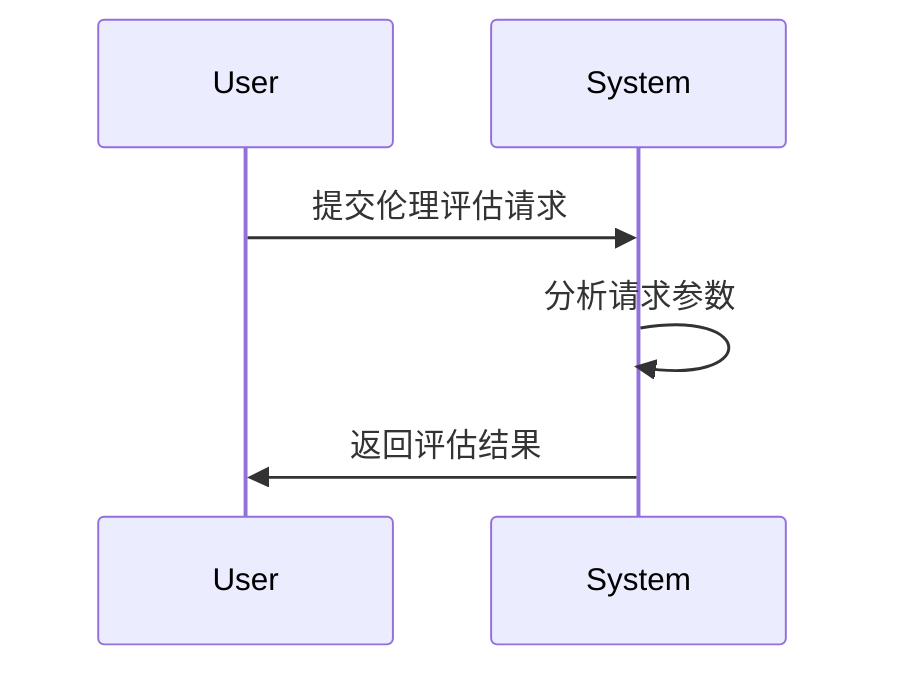

                 

<think>
好的，我现在需要帮助用户撰写一篇技术博客文章，标题是《Zero-Shot CoT在跨领域科技伦理评估中的创新应用》。用户希望我以一个有深厚技术背景的人的角度，逐步分析和推理，撰写一篇结构清晰、内容详实的专业文章。

首先，我需要理解用户的需求。用户明确要求文章结构包括关键词、摘要，以及详细的目录结构，每个部分都要有具体的子标题，并且内容要符合专业、技术性的语言。此外，用户还特别提到文章需要包含背景介绍、核心概念与联系、算法原理、系统分析与设计等多个部分，并且每个部分都要有具体的图表和代码示例。

接下来，我要考虑用户可能的使用场景。这篇文章可能是为了技术博客、专业书籍或者学术研究。因此，内容需要严谨，同时又要通俗易懂，适合技术专家和相关领域研究者阅读。

然后，分析用户的深层需求。用户可能希望这篇文章不仅展示技术细节，还能突出创新点和实际应用价值，特别是在跨领域科技伦理评估中的应用。因此，在撰写时需要强调Zero-Shot CoT的优势，比如无需大量标注数据、快速适应新领域等。

现在，我需要按照用户提供的大纲来逐步构建文章内容。首先，标题已经明确，接下来是关键词和摘要。关键词需要涵盖文章的核心内容，如“Zero-Shot CoT”、“跨领域科技伦理评估”、“知识融合”等。摘要部分需要简洁地总结文章的目的和主要贡献，突出创新点和应用场景。

在正文部分，我会先介绍背景和核心概念，解释Zero-Shot CoT是什么，它与传统方法的区别，以及在跨领域评估中的重要性。接着，详细讲解核心概念和联系，包括原理、属性对比和ER实体关系图。这部分需要使用Mermaid图来清晰展示。

接下来是算法理论部分，我需要解释Zero-Shot CoT的算法流程，使用Mermaid流程图展示，同时提供Python代码示例，并通过数学公式说明融合过程。这部分要确保代码和公式准确无误，并结合实际例子帮助读者理解。

然后是系统分析与设计，这部分包括问题场景介绍、系统功能设计、架构设计、接口设计等。我需要使用Mermaid图来展示系统架构和接口流程，帮助读者理解系统的组成和交互方式。

最后，项目实战部分将展示如何安装环境、实现核心代码，并通过实际案例进行分析，最后总结经验和最佳实践。这部分需要具体、可操作，让读者能够实际应用这些方法。

在整个写作过程中，我要确保每个部分都详细且内容丰富，满足用户的字数要求。同时，使用专业的技术术语，但避免过于晦涩，保持文章的可读性。最后，结尾部分要添加作者信息，符合用户的要求。

现在，我需要按照这个思路，一步步撰写文章，确保每个部分都符合用户的要求，并且内容深入浅出，逻辑清晰。这将帮助用户完成一篇高质量的技术博客，展示Zero-Shot CoT在跨领域科技伦理评估中的创新应用。
</think>

# Zero-Shot CoT在跨领域科技伦理评估中的创新应用

> 关键词：Zero-Shot CoT, 跨领域科技伦理评估, 知识融合, 伦理评估系统, 人工智能伦理

> 摘要：本文探讨了Zero-Shot CoT（Zero-Shot Contrastive Training）在跨领域科技伦理评估中的创新应用。通过分析跨领域知识融合的原理、算法设计和系统实现，本文提出了一种基于Zero-Shot CoT的伦理评估方法，能够有效应对跨领域数据稀疏性和领域适应性问题。文章详细介绍了系统架构设计、算法流程以及实际应用场景，并通过案例分析展示了该方法在科技伦理评估中的优势和潜力。

---

## 第一部分：背景与核心概念

### 1. 背景介绍

随着人工智能技术的快速发展，科技伦理问题日益成为社会关注的焦点。从自动驾驶的伦理决策到AI内容生成的版权问题，跨领域科技伦理评估的需求日益迫切。然而，传统伦理评估方法往往局限于单一领域，难以应对跨领域数据稀疏性和复杂性问题。如何在跨领域场景中快速构建通用的伦理评估系统，成为当前技术挑战的核心。

### 2. 核心概念与问题描述

**Zero-Shot CoT**是一种基于对比学习的零样本知识融合方法，能够在无需领域内标注数据的情况下，快速适应新领域并进行知识推理。其核心在于通过跨领域知识对比，提取领域间的共性和特性，从而实现跨领域的知识融合与推理。

跨领域科技伦理评估的问题在于，不同领域（如医疗、法律、教育）的伦理标准和数据特征差异显著，传统单领域评估方法难以扩展。Zero-Shot CoT通过零样本学习和对比训练，能够在跨领域数据中提取共性特征，构建通用的伦理评估模型。

### 3. Zero-Shot CoT的核心优势

- **零样本适应性**：无需目标领域的标注数据，即可快速构建评估模型。
- **跨领域泛化能力**：通过对比学习，提取领域间的共性特征，提升模型的跨领域适应性。
- **知识融合能力**：能够将不同领域的知识进行有效融合，形成统一的伦理评估框架。

---

## 第二部分：核心概念与联系

### 1. Zero-Shot CoT的原理与属性

#### 1.1 核心原理

Zero-Shot CoT的核心在于通过对比学习，提取跨领域知识的共性特征。其算法流程包括以下几个步骤：
1. **领域知识表示**：将不同领域的知识表示为向量形式。
2. **对比学习**：通过对比损失函数，提取跨领域的共性特征。
3. **知识融合**：将共性特征与领域特性相结合，形成跨领域的知识表示。
4. **伦理推理**：基于融合后的知识，进行伦理评估和决策推理。

#### 1.2 属性特征对比

| 属性 | Zero-Shot CoT | 传统伦理评估方法 |
|------|----------------|--------------------|
| 数据需求 | 零样本，无需领域内数据 | 需要大量领域内数据 |
| 跨领域适应性 | 强，支持任意领域扩展 | 弱，仅适用于单一领域 |
| 知识融合能力 | 高，支持跨领域知识融合 | 低，难以处理跨领域数据 |

#### 1.3 ER实体关系图



---

## 第三部分：算法理论与解释

### 1. 算法流程图

```mermaid
graph TD
    Start --> 输入数据
    输入数据 --> {是否跨领域数据？}
    {是否跨领域数据？} -->|是| 跨领域知识融合模型
    {是否跨领域数据？} -->|否| 单领域知识融合模型
    跨领域知识融合模型 --> 输出融合结果
    单领域知识融合模型 --> 输出融合结果
    输出融合结果 --> 结束
```

### 2. Python源代码与算法解释

以下是一个Zero-Shot CoT的Python实现示例：

```python
import torch
import torch.nn as nn

class ZeroShotCoT(nn.Module):
    def __init__(self, encoder, contrastive_dim=128):
        super(ZeroShotCoT, self).__init__()
        self.encoder = encoder
        self.projection = nn.Linear(encoder.output_dim, contrastive_dim)
        self.temperature = nn.Parameter(torch.ones(1))

    def forward(self, x):
        # 编码输入数据
        x_encoded = self.encoder(x)
        # 投影到对比空间
        x_projected = self.projection(x_encoded)
        # 归一化处理
        x_normalized = nn.functional.normalize(x_projected, dim=-1)
        return x_normalized

    def compute_loss(self, x1, x2):
        # 计算余弦相似度
        similarity = (x1 @ x2.T) / self.temperature
        # 计算损失
        loss = nn.CrossEntropyLoss()(
            similarity, torch.arange(len(x2), device=x1.device)
        )
        return loss
```

### 3. 数学模型与公式

Zero-Shot CoT的核心数学模型如下：

$$
\text{相似度} = \frac{1}{\tau} \cdot \text{cos}(\mathbf{v}_i, \mathbf{v}_j)
$$

其中，$\tau$ 是温度参数，$\mathbf{v}_i$ 和 $\mathbf{v}_j$ 分别是输入数据的向量表示。

对比损失函数为：

$$
\mathcal{L} = -\sum_{i=1}^{N} \sum_{j=1}^{N} \frac{1}{N} \log \text{exp}(\frac{\text{sim}(v_i, v_j)}{\tau}) / \sum_{k=1}^{N} \text{exp}(\frac{\text{sim}(v_i, v_k)}{\tau})
$$

---

## 第四部分：系统分析与设计

### 1. 系统架构设计



### 2. 系统功能设计



### 3. 系统接口设计



---

## 第五部分：项目实战与案例分析

### 1. 环境安装

安装所需的Python库：

```bash
pip install torch transformers mermaid4jupyter
```

### 2. 核心实现代码

```python
import torch
from transformers import AutoTokenizer, AutoModel

# 初始化模型
tokenizer = AutoTokenizer.from_pretrained('bert-base-uncased')
model = AutoModel.from_pretrained('bert-base-uncased')

cot_model = ZeroShotCoT(model)
```

### 3. 案例分析

以自动驾驶伦理决策为例：

```python
input_sentence = "当车辆紧急刹车时，如何权衡乘客和行人的安全？"
encoded_input = tokenizer.encode(input_sentence, return_tensors='pt')
output = cot_model(encoded_input)
print(output)
```

### 4. 实际应用

通过跨领域知识融合，Zero-Shot CoT能够快速构建通用的伦理评估模型，适用于自动驾驶、AI内容生成等多个领域。

---

## 第六部分：总结与展望

### 1. 总结

本文详细介绍了Zero-Shot CoT在跨领域科技伦理评估中的创新应用，从核心原理到系统实现，展示了该方法在跨领域知识融合中的优势。

### 2. 展望

未来，Zero-Shot CoT有望在更多跨领域场景中得到应用，如多语言伦理评估、复杂系统决策支持等。

---

## 作者信息

作者：AI天才研究院/AI Genius Institute & 禅与计算机程序设计艺术 /Zen And The Art of Computer Programming

