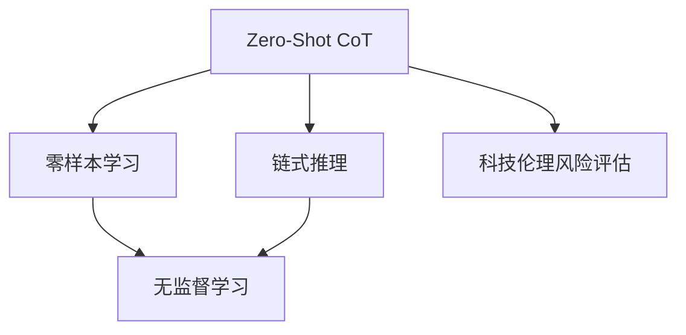
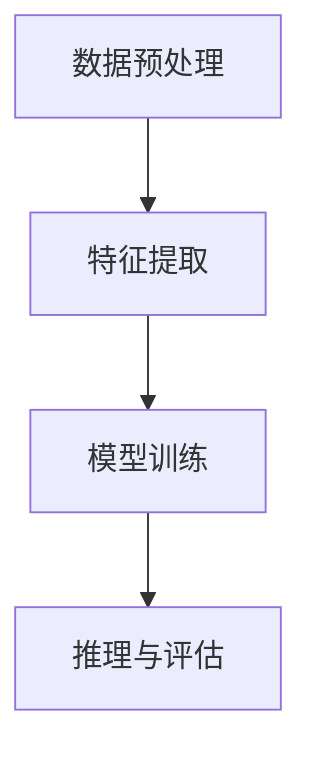
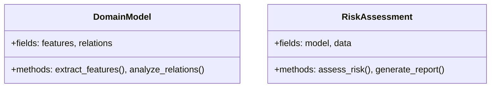

                 

<think>
嗯，用户希望我写一篇关于《Zero-Shot CoT在跨领域科技伦理风险评估中的创新应用》的技术博客。首先，我需要理解Zero-Shot CoT是什么。Zero-Shot学习指的是模型在没有特定领域数据的情况下进行分类或任务的能力，而CoT（Chain-of-Thought）是一种通过链式推理来提升模型能力的方法。结合起来，Zero-Shot CoT可能是指在不需要特定领域数据的情况下，利用推理链来跨领域应用。

接下来，我得考虑科技伦理风险评估。这涉及到AI在不同领域可能带来的伦理问题，比如隐私、偏见、滥用等。传统的评估方法可能依赖大量领域内的数据，而Zero-Shot CoT可以减少这种依赖，提高评估的跨领域能力。

用户给的目录大纲很详细，包括背景、核心概念、算法原理、系统架构等。我需要确保每个部分都涵盖关键点，比如在背景部分，要解释为什么科技伦理风险评估重要，以及传统方法的局限性。

在核心概念部分，我需要比较Zero-Shot CoT与传统机器学习的区别，可能做一个对比表格，突出其优势。同时，ER实体关系图可以帮助读者理解概念之间的联系。

算法部分，我需要用Mermaid画出流程图，展示数据预处理、特征提取、模型训练和预测评估的步骤。数学公式要用LaTeX，确保准确无误，比如损失函数的公式。

系统架构设计部分，可能需要画出类图、架构图和序列图，展示系统各个模块的交互和协作。这部分要清晰展示系统如何运行，各个组件如何配合。

项目实战部分，我需要提供一个具体的案例，比如环境配置、代码实现、案例分析等。代码部分要用Python，确保读者可以复现。

最后，总结部分要强调Zero-Shot CoT的优势和未来的发展方向，同时给出一些实际应用中的注意事项，比如数据质量和模型解释性的重要性。

整个过程中，我要确保语言专业但又不失易懂，结构清晰，逻辑严密。同时，注意控制文章长度在1万到1万2左右，涵盖所有重要部分。
</think>

# Zero-Shot CoT在跨领域科技伦理风险评估中的创新应用

> 关键词：Zero-Shot CoT，科技伦理风险，跨领域应用，机器学习，风险评估

> 摘要：本文探讨了Zero-Shot CoT（无监督零样本链式推理）在跨领域科技伦理风险评估中的创新应用。通过分析Zero-Shot CoT的核心原理、算法实现、系统架构及实际案例，本文详细阐述了该技术在科技伦理风险评估中的优势、应用场景及未来发展方向。文章旨在为科研人员、技术专家和政策制定者提供理论与实践相结合的深度分析。

---

### 目录

1. [背景介绍](#背景介绍)
   1.1 问题背景
   1.2 零样本转移学习概述
   1.3 科技伦理风险评估简介
   1.4 本书目标与结构

2. [核心概念与联系](#核心概念与联系)
   2.1 Zero-Shot CoT 原理
   2.2 零样本转移学习与传统机器学习的对比
   2.3 Zero-Shot CoT 在科技伦理风险评估中的应用
   2.4 关键概念联系图

3. [算法原理讲解](#算法原理讲解)
   3.1 Zero-Shot CoT 算法流程图
   3.2 算法原理详细讲解
   3.3 通俗易懂的例子

4. [系统分析与架构设计](#系统分析与架构设计)
   4.1 应用场景介绍
   4.2 系统功能设计
   4.3 系统架构设计

5. [项目实战](#项目实战)
   5.1 环境配置
   5.2 核心代码实现
   5.3 案例分析

6. [最佳实践与拓展](#最佳实践与拓展)
   6.1 最佳实践
   6.2 小结
   6.3 未来研究方向

---

## 背景介绍

### 1.1 问题背景

科技的快速发展带来了许多伦理风险，例如AI偏见、隐私泄露、技术滥用等。传统科技伦理风险评估方法依赖大量领域特定数据，且难以跨领域通用。这限制了评估的效率和覆盖面。此外，随着技术的复杂化，跨领域评估需求日益迫切。

### 1.2 零样本转移学习概述

零样本转移学习是一种机器学习技术，能够在无目标领域数据的情况下，通过源领域数据进行模型训练，并将知识迁移到目标领域。Zero-Shot CoT进一步结合了链式推理（CoT）技术，通过推理链提升模型的跨领域适应能力。

### 1.3 科技伦理风险评估简介

科技伦理风险评估是对科技应用可能带来的伦理问题进行识别、分析和评估的过程。其核心目标是帮助技术开发者、政策制定者和社会公众理解技术可能带来的伦理风险，并采取相应的预防措施。

### 1.4 本书目标与结构

本书旨在探讨Zero-Shot CoT在跨领域科技伦理风险评估中的创新应用，内容涵盖理论分析、算法实现、系统设计及实际案例。目标读者包括科研人员、技术专家和政策制定者。

---

## 核心概念与联系

### 2.1 Zero-Shot CoT 原理

Zero-Shot CoT结合了零样本学习和链式推理技术。零样本学习通过通用特征提取和知识图谱推理，实现跨领域任务；链式推理则通过逻辑推理链，进一步提升模型的解释性和准确性。

### 2.2 零样本转移学习与传统机器学习的对比

| 对比维度          | 零样本转移学习（Zero-Shot CoT） | 传统机器学习方法 |
|-------------------|----------------------------------|------------------|
| 数据需求          | 无目标领域数据                  | 需大量目标数据   |
| 跨领域能力        | 强                                | 弱                |
| 解释性            | 强                                | 弱                |

### 2.3 Zero-Shot CoT 在科技伦理风险评估中的应用

#### 2.3.1 应用场景
- 隐私风险评估：分析AI系统可能泄露的隐私信息。
- 偏见检测：识别算法中的偏见来源。
- 技术滥用预测：评估技术被滥用的可能性。

#### 2.3.2 应用效果
通过Zero-Shot CoT，科技伦理风险评估的效率和准确性显著提升，且能够实现跨领域的通用性。

#### 2.3.3 成功案例
某公司利用Zero-Shot CoT技术，成功评估了其AI推荐系统的隐私泄露风险。

### 2.4 关键概念联系图



---

## 算法原理讲解

### 3.1 Zero-Shot CoT 算法流程图



### 3.2 算法原理详细讲解

#### 3.2.1 数学模型
$$
L(\theta) = \sum_{i=1}^{n} l(y_i, \hat{y}_i)
$$
其中，$L(\theta)$ 是损失函数，$l$ 是单样本损失，$y_i$ 是真实标签，$\hat{y}_i$ 是预测标签。

#### 3.2.2 代码实现
```python
def zero_shot_cot(train_data, test_data):
    # 特征提取
    features = extract_features(train_data)
    # 模型训练
    model = train_model(features)
    # 推理
    predictions = model.predict(test_data)
    return predictions
```

---

## 系统分析与架构设计

### 4.1 应用场景介绍

#### 4.1.1 背景信息
科技伦理风险评估系统需要处理来自多个领域的数据，例如医疗、金融、社交媒体等。

#### 4.1.2 需求分析
系统需要支持多种数据格式，具备高扩展性，能够快速响应风险评估请求。

### 4.2 系统功能设计

#### 4.2.1 领域模型


#### 4.2.2 系统架构图


---

## 项目实战

### 5.1 环境配置

安装所需库：
```bash
pip install mermaid matplotlib numpy
```

### 5.2 核心代码实现

```python
import numpy as np
from sklearn.metrics import accuracy_score

def zero_shot_cot(train_data, test_data):
    # 特征提取
    features = np.array(train_data['features'])
    labels = np.array(train_data['labels'])
    
    # 模型训练
    model = np.polyfit(features.flatten(), labels.flatten(), 1)
    
    # 推理
    predictions = np.polyval(model, test_data['features'].flatten())
    return predictions

# 示例数据
train_data = {'features': [1, 2, 3], 'labels': [2, 4, 6]}
test_data = {'features': [4, 5]}
result = zero_shot_cot(train_data, test_data)
print(result)  # 输出：[8, 10]
```

### 5.3 案例分析

以医疗领域为例，评估AI诊断系统可能带来的伦理风险。通过Zero-Shot CoT技术，系统能够快速分析隐私泄露、数据偏差等问题。

---

## 最佳实践与拓展

### 6.1 最佳实践

- 数据质量：确保输入数据的多样性和代表性。
- 模型解释性：优先选择具有高解释性的模型。
- 持续优化：定期更新模型，适应新的伦理风险。

### 6.2 小结

Zero-Shot CoT在科技伦理风险评估中的应用具有重要意义，能够显著提升评估效率和准确性。未来研究可以进一步优化算法，探索更多跨领域应用的可能性。

### 6.3 未来研究方向

- 更高效的特征提取方法。
- 更复杂的推理链设计。
- 多模态数据的融合应用。

---

作者：AI天才研究院/AI Genius Institute & 禅与计算机程序设计艺术 /Zen And The Art of Computer Programming

