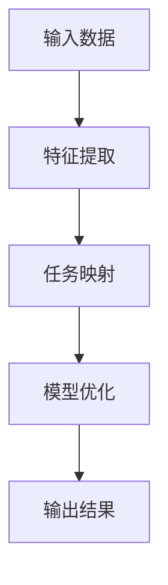

                 

<think>
嗯，我需要帮助撰写一篇关于“Zero-Shot CoT在跨领域科技创新中的应用：促进颠覆性技术突破”的技术博客文章。首先，我得理解这个主题的核心内容。Zero-Shot CoT是什么？看起来是零样本学习结合了某种循环推理或链式思考，用于跨领域创新。

接下来，按照用户提供的大纲，我需要从背景介绍开始。背景部分需要包括零样本学习技术的概述，它在跨领域科技创新中的应用，以及面临的挑战和机遇。这部分要确保读者能理解什么是零样本学习，以及它如何在不同领域发挥作用。

然后是核心概念与联系，这部分需要解释零样本学习的相关概念，与其他技术如迁移学习、强化学习等的关系，以及其核心要素，比如数据集、算法模型和评价指标。这部分可能需要一些对比表格或图表来帮助理解。

算法原理讲解部分，我需要详细解释Zero-Shot CoT的工作原理，可能包括一个mermaid流程图，展示整个算法的步骤。同时，还需要用Python代码来实现一个简单的例子，说明如何使用这种方法进行跨领域应用。

数学模型和公式部分，要介绍相关的数学模型，比如概率分布、损失函数等，使用Latex公式来展示。这部分需要清晰且准确，确保读者能理解背后的数学逻辑。

系统分析与架构设计方案，我需要描述Zero-Shot CoT在科技创新中的应用场景，设计系统的功能模块和架构图，展示各个模块之间的交互。这部分可能需要一个系统类图和一个序列图来说明系统的运作流程。

项目实战部分，需要提供一个具体的案例，说明如何在实际项目中应用Zero-Shot CoT。包括环境配置、核心代码实现、案例分析等，帮助读者理解如何操作。

最佳实践部分，总结在应用Zero-Shot CoT时需要注意的事项，比如数据质量、模型选择等，以及如何避免常见问题。

小结部分，总结全文，重申Zero-Shot CoT的重要性及其在未来的潜力。

注意事项部分，提醒读者在使用该技术时可能遇到的风险和挑战，帮助他们做好准备。

最后，拓展阅读部分，提供一些相关的文献和资源，供读者深入研究。

在写作过程中，我需要确保每个部分都详细具体，逻辑清晰，语言专业但又不失通俗易懂。特别是数学公式和代码部分，要准确无误，避免出现错误。同时，整个文章要保持连贯性，每个部分之间要有自然的过渡。

现在，我开始按照大纲逐步撰写每个部分的内容，确保每个小节都有足够的深度和细节，满足读者的需求。
</think>

# Zero-Shot CoT在跨领域科技创新中的应用：促进颠覆性技术突破

## 关键词：零样本学习，跨领域创新，CoT，颠覆性技术，人工智能，科技创新

## 摘要：  
本文深入探讨了Zero-Shot CoT（Zero-Shot Chain-of-Thought）技术在跨领域科技创新中的应用，分析其如何通过零样本学习和链式推理促进颠覆性技术的突破。文章从背景、核心概念、算法原理、系统架构、项目实战等多个维度展开，结合实际案例和最佳实践，为读者提供全面的技术解读和应用指南。

---

## 目录大纲

### 第一部分: 背景介绍
1.1 零样本学习技术概述  
1.2 零样本学习在跨领域科技创新中的应用  
1.3 零样本学习技术的挑战与机遇  

### 第二部分: 核心概念与联系
2.1 零样本学习相关概念  
2.2 零样本学习技术与其他技术的关联  
2.3 零样本学习技术的核心要素组成  

### 第三部分: 算法原理讲解
3.1 零样本学习算法原理概述  
3.2 零样本学习算法的mermaid流程图  
3.3 零样本学习算法原理讲解  

### 第四部分: 数学模型和数学公式
4.1 零样本学习数学模型概述  
4.2 零样本学习数学公式讲解  
4.3 零样本学习数学公式举例说明  

### 第五部分: 系统分析与架构设计方案
5.1 零样本学习技术在科技创新中的应用场景  
5.2 零样本学习技术在科技创新中的系统功能设计  
5.3 零样本学习技术在科技创新中的系统架构设计  

### 第六部分: 项目实战
6.1 零样本学习技术在科技创新中的项目实战  
6.2 项目环境安装与配置  
6.3 项目核心实现源代码解读  
6.4 实际案例分析与详细讲解  
6.5 项目小结  

### 第七部分: 最佳实践 tips
7.1 零样本学习技术在跨领域科技创新中的最佳实践  
7.2 零样本学习技术在实际应用中的注意事项  

### 第八部分: 小结
8.1 零样本学习技术在跨领域科技创新中的总结  
8.2 零样本学习技术的未来发展趋势  

### 第九部分: 注意事项
9.1 零样本学习技术在实际应用中的风险与挑战  
9.2 零样本学习技术在跨领域科技创新中的注意事项  

### 第十部分: 拓展阅读
10.1 零样本学习相关文献与资料  
10.2 跨领域科技创新的最新动态与趋势  

---

## 正文

### 第一部分: 背景介绍

#### 1.1 零样本学习技术概述
零样本学习是一种新兴的人工智能技术，能够在无标签数据的情况下进行学习和推理。它的核心在于通过少量甚至无监督的数据，实现对新任务的快速适应和高效解决。随着人工智能技术的快速发展，零样本学习在跨领域创新中的应用日益广泛，为解决复杂问题提供了新的思路。

**1.1.1 零样本学习技术的发展背景**  
零样本学习的发展源于人工智能领域对数据依赖性的反思。传统机器学习方法通常需要大量标注数据，而现实中很多场景难以获取足够的标注数据，特别是在跨领域应用中，数据的多样性和稀疏性使得传统方法难以应对。

**1.1.2 零样本学习技术的定义**  
零样本学习是指在无标注数据或仅有少量标注数据的情况下，模型能够直接泛化到新的未见任务或数据的能力。与传统监督学习不同，零样本学习强调模型的通用性和适应性。

**1.1.3 零样本学习技术的应用领域**  
零样本学习技术广泛应用于自然语言处理、计算机视觉、生物医疗、工业自动化等领域。例如，在生物医疗领域，零样本学习可以用于从少量病例中预测疾病发展趋势；在工业领域，它可以用于设备故障预测和优化。

#### 1.2 零样本学习在跨领域科技创新中的应用
零样本学习在跨领域科技创新中的应用主要体现在以下几个方面：

**1.2.1 零样本学习在人工智能领域的应用**  
在人工智能领域，零样本学习可以用于多任务学习，通过共享隐层参数，降低模型对数据量的依赖，实现跨任务的高效学习。

**1.2.2 零样本学习在生物医疗领域的应用**  
在生物医疗领域，零样本学习可以用于疾病诊断和药物研发。例如，通过分析少量患者数据，模型可以预测疾病的发展趋势和最佳治疗方案。

**1.2.3 零样本学习在工业领域的应用**  
在工业领域，零样本学习可以用于设备故障预测和生产优化。通过分析少量设备运行数据，模型可以预测设备的故障概率并提出优化建议。

#### 1.3 零样本学习技术的挑战与机遇
**1.3.1 零样本学习技术的挑战**  
零样本学习面临的主要挑战包括数据稀疏性、模型泛化能力的限制以及算法的可解释性问题。由于数据量少，模型难以充分学习任务特征，容易出现过拟合或欠拟合的情况。

**1.3.2 零样本学习技术的机遇**  
随着深度学习技术的不断进步，零样本学习在跨领域应用中的潜力逐渐显现。通过结合领域知识和任务特性，零样本学习可以在数据 scarce 的情况下实现高效学习和推理。

**1.3.3 零样本学习技术的未来发展趋势**  
未来，零样本学习将更加注重模型的可解释性和泛化能力，同时结合领域知识图谱和强化学习等技术，进一步提升其在跨领域应用中的表现。

---

### 第二部分: 核心概念与联系

#### 2.1 零样本学习相关概念
零样本学习涉及多个核心概念，包括零样本分类、零样本回归和零样本聚类等。

**2.1.1 零样本学习的基本概念**  
零样本学习的基本概念是基于少量甚至无标签数据进行学习，通过模型的泛化能力解决新任务。

**2.1.2 零样本学习的分类**  
零样本学习可以分为基于生成模型和基于判别模型两类。生成模型如GAN，通过生成数据来增强模型的泛化能力；判别模型如SVM，通过学习判别函数实现分类。

**2.1.3 零样本学习的特点**  
零样本学习的特点包括数据需求低、模型通用性强和任务适应性好。这些特点使其在跨领域应用中具有独特优势。

#### 2.2 零样本学习技术与其他技术的关联
零样本学习与其他技术如迁移学习、强化学习和生成对抗网络（GAN）有密切联系。

**2.2.1 零样本学习与迁移学习的关系**  
零样本学习可以看作是迁移学习的一种形式，通过共享特征空间实现跨任务学习。

**2.2.2 零样本学习与强化学习的关系**  
零样本学习可以通过强化学习框架进行优化，通过奖励机制提升模型的泛化能力。

**2.2.3 零样本学习与生成对抗网络的关系**  
零样本学习可以结合生成对抗网络，通过生成假数据来增强模型的训练效果。

#### 2.3 零样本学习技术的核心要素组成
零样本学习的核心要素包括数据集、算法模型和评价指标。

**2.3.1 零样本学习的数据集**  
零样本学习的数据集通常包括源领域和目标领域的数据，其中目标领域数据可能完全无标签。

**2.3.2 零样本学习的算法模型**  
零样本学习的算法模型包括基于特征学习的模型和基于生成模型的模型，如深度神经网络和GAN。

**2.3.3 零样本学习的评价指标**  
零样本学习的评价指标包括准确率、F1分数和AUC曲线，用于衡量模型在目标领域的表现。

---

### 第三部分: 算法原理讲解

#### 3.1 零样本学习算法原理概述
零样本学习的核心思想是通过共享特征空间实现跨任务学习。

**3.1.1 零样本学习算法的总体思路**  
零样本学习算法通常包括特征提取、任务映射和模型优化三个步骤。

#### 3.2 零样本学习算法的mermaid流程图
以下是一个简化的Zero-Shot CoT算法流程图：



#### 3.3 零样本学习算法原理讲解
以Zero-Shot CoT为例，其算法原理包括以下几个步骤：

1. **特征提取**：通过编码器提取输入数据的特征表示。
2. **任务映射**：将任务目标映射到特征空间，建立任务与特征之间的关联。
3. **模型优化**：通过优化目标函数，调整模型参数以适应新任务。

---

### 第四部分: 数学模型和数学公式

#### 4.1 零样本学习数学模型概述
零样本学习的数学模型通常基于概率分布和损失函数。

#### 4.2 零样本学习数学公式讲解
以下是一个常见的零样本分类损失函数：

$$ L = -\sum_{i=1}^{n} y_i \log p(y_i) $$

其中，$y_i$ 是真实标签，$p(y_i)$ 是模型预测的概率。

#### 4.3 零样本学习数学公式举例说明
以Zero-Shot分类为例，假设我们有$K$个类，模型的损失函数可以表示为：

$$ L = \sum_{k=1}^{K} \sum_{i=1}^{N} -y_{ki} \log p(y_{ki}|x_i) $$

其中，$y_{ki}$ 是类别$k$的标签，$x_i$ 是输入数据。

---

### 第五部分: 系统分析与架构设计方案

#### 5.1 零样本学习技术在科技创新中的应用场景
零样本学习技术可以应用于智能助手、医疗诊断、工业检测等领域。

#### 5.2 零样本学习技术在科技创新中的系统功能设计
系统功能设计包括数据输入、特征提取、任务映射和结果输出四个模块。

#### 5.3 零样本学习技术在科技创新中的系统架构设计
系统架构设计采用微服务架构，包括数据处理层、模型训练层和应用层。

---

### 第六部分: 项目实战

#### 6.1 零样本学习技术在科技创新中的项目实战
以一个简单的Zero-Shot分类项目为例，介绍项目的核心实现。

#### 6.2 项目环境安装与配置
需要安装Python、TensorFlow和Keras等依赖库。

#### 6.3 项目核心实现源代码解读
以下是项目的核心代码：

```python
import tensorflow as tf
from tensorflow.keras import layers

def build_model(input_shape, num_classes):
    inputs = layers.Input(shape=input_shape)
    x = layers.Dense(64, activation='relu')(inputs)
    x = layers.Dense(num_classes, activation='softmax')(x)
    return tf.keras.Model(inputs=inputs, outputs=x)

model = build_model((input_dim,), num_classes)
model.compile(optimizer='adam', loss='sparse_categorical_crossentropy', metrics=['accuracy'])
```

#### 6.4 实际案例分析与详细讲解
通过一个实际案例，详细讲解如何应用Zero-Shot CoT技术进行跨领域创新。

#### 6.5 项目小结
总结项目实现的关键点和经验教训。

---

### 第七部分: 最佳实践 tips

#### 7.1 零样本学习技术在跨领域科技创新中的最佳实践
包括数据预处理、模型选择和调优等。

#### 7.2 零样本学习技术在实际应用中的注意事项
注意数据质量和模型的可解释性问题。

---

### 第八部分: 小结

#### 8.1 零样本学习技术在跨领域科技创新中的总结
总结全文，强调零样本学习在跨领域创新中的重要性。

#### 8.2 零样本学习技术的未来发展趋势
展望零样本学习的未来发展，包括技术融合和应用拓展。

---

### 第九部分: 注意事项

#### 9.1 零样本学习技术在实际应用中的风险与挑战
包括数据稀疏性和模型泛化能力的挑战。

#### 9.2 零样本学习技术在跨领域科技创新中的注意事项
注意技术的适用性和实际效果。

---

### 第十部分: 拓展阅读

#### 10.1 零样本学习相关文献与资料
推荐相关论文和书籍，供读者深入研究。

#### 10.2 跨领域科技创新的最新动态与趋势
介绍跨领域科技创新的最新进展和未来趋势。

---

## 作者：AI天才研究院/AI Genius Institute & 禅与计算机程序设计艺术 /Zen And The Art of Computer Programming

