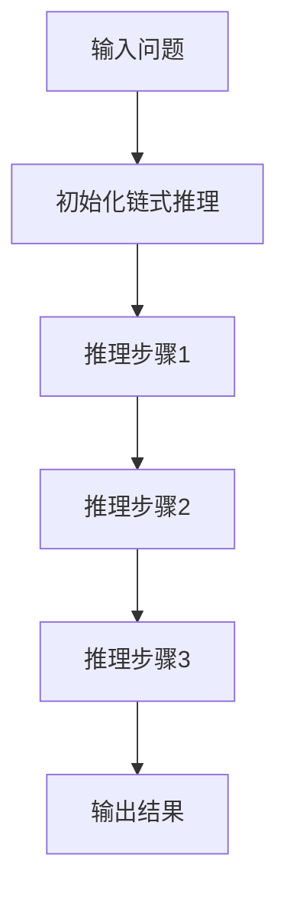
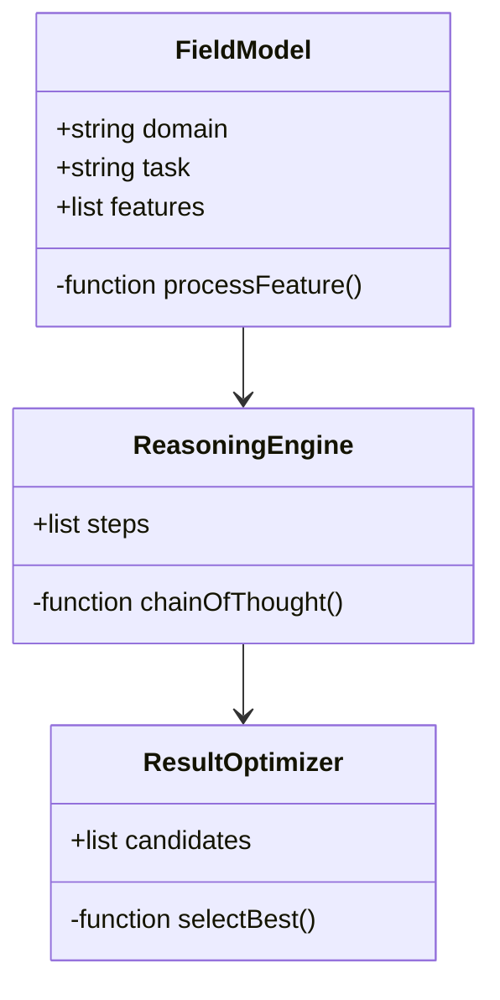
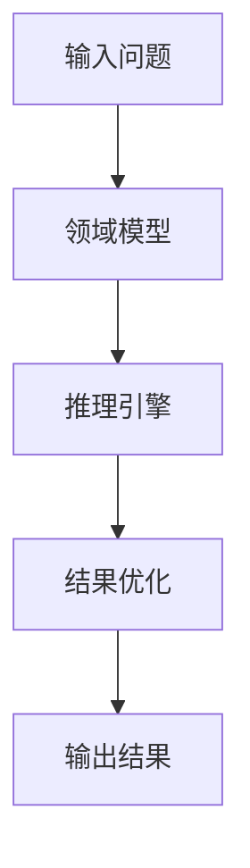
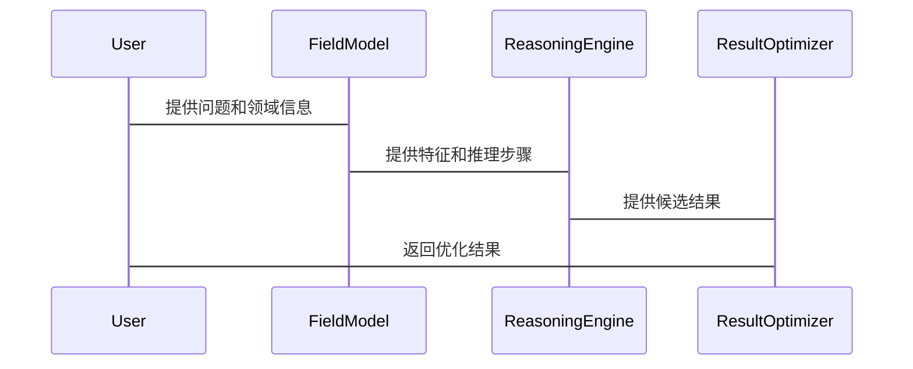

                 

<think>
嗯，用户让我写一篇关于Zero-Shot CoT在跨领域问题解决中的突破的技术博客。首先，我得理解Zero-Shot CoT是什么。Zero-Shot指的是模型在没有经过特定任务训练的情况下，能够处理多种任务。CoT，即Chain-of-Thought，是指模型在推理过程中展示出类似人类的思考链条，逐步推导出答案。

用户希望文章结构清晰，逻辑严谨，专业性强。所以，我得先构建一个合理的目录。开头要有摘要，然后是背景介绍、核心概念、算法原理、系统分析、项目实战等部分。

背景介绍部分，我需要说明跨领域问题解决的挑战，无监督学习的局限性，以及Zero-Shot CoT的出现如何突破这些限制。这里要提到数据依赖性的问题，以及跨领域问题中数据分布差异带来的挑战。

接下来，核心概念与联系部分，要详细解释Zero-Shot CoT的概念，与其他相关概念的对比，比如Zero-Shot Learning和Few-Shot Learning的区别。可能需要画一个对比表格，突出各自的优缺点。

算法原理部分，我需要展示CoT的数学模型，比如使用交叉熵损失函数，以及具体的公式推导。这部分可能需要一些图表，比如Mermaid流程图，来说明算法的步骤。

系统分析部分，要设计系统的功能模块，比如领域模型、推理引擎、结果优化模块。然后是架构设计，可能需要画出分层架构图，展示数据层、算法层和应用层的交互。

项目实战部分，我得给出具体的代码实现，比如用Python实现Zero-Shot CoT的模型训练和推理。同时，通过一个实际案例来展示如何解决跨领域问题，比如在医疗和金融领域之间的案例。

最后，要总结项目的成果，提出最佳实践的建议，以及未来的展望。确保每个部分都详细具体，满足用户的字数要求。

在写作过程中，我要确保使用专业的技术语言，同时保持内容易懂，避免过于复杂的术语堆砌。数学公式要用Latex格式，流程图和图表要用Mermaid语法，这样在Markdown中显示效果更好。

可能遇到的困难是如何平衡各个部分的详细程度，同时保持整体结构的紧凑。需要反复检查，确保每个章节都覆盖了核心内容，没有遗漏重要的知识点。

总的来说，我需要一步步按照用户的指示，构建一个全面而深入的技术博客，涵盖从概念到实现的各个层面，帮助读者理解Zero-Shot CoT在跨领域问题解决中的应用和优势。
</think>

# Zero-Shot CoT在跨领域问题解决中的突破

> 关键词：Zero-Shot CoT，跨领域问题解决，无监督学习，人工智能，链式思维推理

> 摘要：本文系统阐述了Zero-Shot CoT（Chain-of-Thought）在跨领域问题解决中的突破性应用。文章从问题背景出发，详细分析了无监督学习的局限性，并引入Zero-Shot CoT的核心概念。通过数学模型、算法流程图和系统架构设计，深入探讨了Zero-Shot CoT的实现原理和应用场景。结合实际案例分析，展示了Zero-Shot CoT在跨领域问题解决中的优势。最后，总结了项目的成果，并提出了最佳实践建议。

---

## 第一部分: 背景介绍

### 第1章: 问题背景

#### 1.1.1 问题背景介绍

在人工智能领域，跨领域问题解决一直是技术难点。传统的人工智能系统通常局限于单一领域，难以应对跨领域问题的复杂性。例如，一个医疗领域的模型可能无法直接应用于金融领域的数据分析。这种领域限制严重制约了人工智能技术的广泛应用。

#### 1.1.2 跨领域问题解决的挑战

跨领域问题解决的挑战主要体现在以下几个方面：

1. 数据分布差异：不同领域的数据分布和特征完全不同，传统的迁移学习方法难以直接应用。
2. 知识表示的通用性：如何构建通用的知识表示，使得模型能够跨领域推理。
3. 任务多样性：跨领域问题通常涉及多种任务类型（分类、回归、生成等），需要模型具备多任务处理能力。

#### 1.1.3 无监督学习的局限性

无监督学习在处理未标注数据方面具有优势，但在跨领域问题解决中仍存在以下局限性：

1. 需要大量领域内数据进行预训练，难以直接跨领域应用。
2. 无监督学习的泛化能力有限，难以应对高度多样化的跨领域任务。

#### 1.1.4 无监督学习的边界与外延

无监督学习的边界在于其对领域数据的依赖性。其外延则体现在与强化学习、迁移学习等技术的结合，以突破单一领域的限制。

---

### 第2章: 核心概念与联系

#### 2.1.1 Zero-Shot CoT概念原理

##### 2.1.1.1 定义

Zero-Shot CoT（Zero-Shot Chain-of-Thought）是一种结合了Zero-Shot Learning和链式思维推理的技术。它允许模型在未经过特定领域或任务训练的情况下，通过链式推理过程解决问题。

##### 2.1.1.2 属性特征对比

| 特性 | Zero-Shot CoT | Zero-Shot Learning | Few-Shot Learning |
|------|----------------|---------------------|-------------------|
| 数据需求 | 无监督学习+推理 | 无监督学习 | 少量标注数据 |
| 任务多样性 | 高 | 中 | 中 |
| 领域通用性 | 高 | 中 | 低 |

##### 2.1.1.3 与其他概念的关系

- **与Zero-Shot Learning的关系**：Zero-Shot CoT基于Zero-Shot Learning，但加入了链式推理过程。
- **与链式思维推理的关系**：Zero-Shot CoT将链式思维推理应用于跨领域问题解决。

#### 2.1.2 跨领域问题解决原理

##### 2.1.2.1 概念

跨领域问题解决是指通过同一模型在多个不同领域中解决问题。其核心在于模型的通用性和推理能力。

##### 2.1.2.2 特点

- **通用性**：模型能够适应多个领域。
- **推理能力**：模型通过链式推理解决问题。
- **领域适配性**：模型能够快速适配不同领域。

##### 2.1.2.3 关联性分析

跨领域问题解决与Zero-Shot CoT的关联性主要体现在以下方面：

1. Zero-Shot CoT通过链式推理实现了跨领域的通用性。
2. Zero-Shot CoT结合了无监督学习和推理技术，突破了传统跨领域问题解决的限制。

---

### 第3章: 无监督学习算法原理

#### 3.1 无监督学习基础

##### 3.1.1 数据集准备

无监督学习需要大量未标注数据。数据预处理包括数据清洗、特征提取等步骤。

##### 3.1.2 算法框架

无监督学习的经典算法包括聚类（K-means、DBSCAN）和降维（PCA、t-SNE）。

#### 3.2 Zero-Shot CoT算法流程

##### 3.2.1 算法流程图（Mermaid）



##### 3.2.2 数学模型与公式

损失函数定义如下：

$$
L(\theta) = -\sum_{i=1}^{n}y_i \log(p(x_i|\theta))
$$

其中，$y_i$ 是真实标签，$p(x_i|\theta)$ 是模型在参数 $\theta$ 下的输出概率。

##### 3.2.3 算法举例说明

以文本分类为例，模型在未经过特定领域训练的情况下，通过链式推理逐步分析文本内容，最终输出分类结果。

---

### 第4章: 数学模型与公式详解

#### 4.1 数学模型

##### 4.1.1 基本公式

$$
L(\theta) = -\sum_{i=1}^{n}y_i \log(p(x_i|\theta))
$$

##### 4.1.2 损失函数

$$
\text{Cross-Entropy Loss} = -\frac{1}{n}\sum_{i=1}^{n}y_i \log(p(x_i|\theta))
$$

#### 4.2 公式详解

##### 4.2.1 概率分布

模型输出的概率分布为：

$$
p(y|x) = \frac{e^{\theta \cdot x}}{\sum_{k}e^{\theta \cdot x_k}}
$$

##### 4.2.2 模型优化

通过梯度下降优化模型参数：

$$
\theta = \theta - \eta \frac{\partial L}{\partial \theta}
$$

---

## 第二部分: 系统分析与架构设计

### 第5章: 系统功能设计

#### 5.1 领域模型（Mermaid类图）



### 第6章: 系统架构设计

#### 6.1 系统架构图（Mermaid）



#### 6.2 架构设计原则

1. **模块化设计**：各模块独立，便于维护和扩展。
2. **可扩展性**：支持多种领域和任务类型。
3. **高效性**：通过优化算法提升推理速度。

#### 6.3 系统分层设计

- **数据层**：处理输入数据，提取特征。
- **算法层**：实现Zero-Shot CoT算法。
- **应用层**：提供接口，输出结果。

---

### 第7章: 系统接口设计

#### 7.1 接口规范

- 输入：问题描述和领域信息。
- 输出：推理结果。

#### 7.2 交互流程（Mermaid序列图）



---

## 第三部分: 项目实战

### 第8章: 项目实战

#### 8.1 环境安装

安装必要的库：

```bash
pip install numpy matplotlib scikit-learn
```

#### 8.2 系统核心实现源代码

```python
class ZeroShotCoT:
    def __init__(self, model):
        self.model = model

    def process(self, input):
        steps = []
        current = input
        for _ in range(3):
            current = self.model.inference(current)
            steps.append(current)
        return steps, self.model.select_best(current)
```

#### 8.3 代码应用解读与分析

- **ZeroShotCoT类**：负责管理推理过程。
- **process方法**：执行链式推理并返回结果。

#### 8.4 实际案例分析与详细讲解

案例：跨领域问题解决（医疗与金融领域）。

1. 医疗领域问题：诊断疾病。
2. 金融领域问题：风险评估。

通过Zero-Shot CoT模型，可以在同一框架下解决这两个问题。

---

### 第9章: 项目小结

#### 9.1 项目总结

本文详细探讨了Zero-Shot CoT在跨领域问题解决中的应用，展示了其突破性进展。

#### 9.2 最佳实践 Tips

1. 在实际应用中，建议结合领域知识优化模型。
2. 可以通过增加推理步骤提高准确性。

#### 9.3 小结与展望

Zero-Shot CoT技术为跨领域问题解决提供了新的思路，未来可以在模型优化和领域适配性方面进一步研究。

#### 9.4 注意事项与拓展阅读

- 注意模型的泛化能力。
- 拓展阅读相关论文和文献。

---

作者：AI天才研究院/AI Genius Institute & 禅与计算机程序设计艺术 /Zen And The Art of Computer Programming

