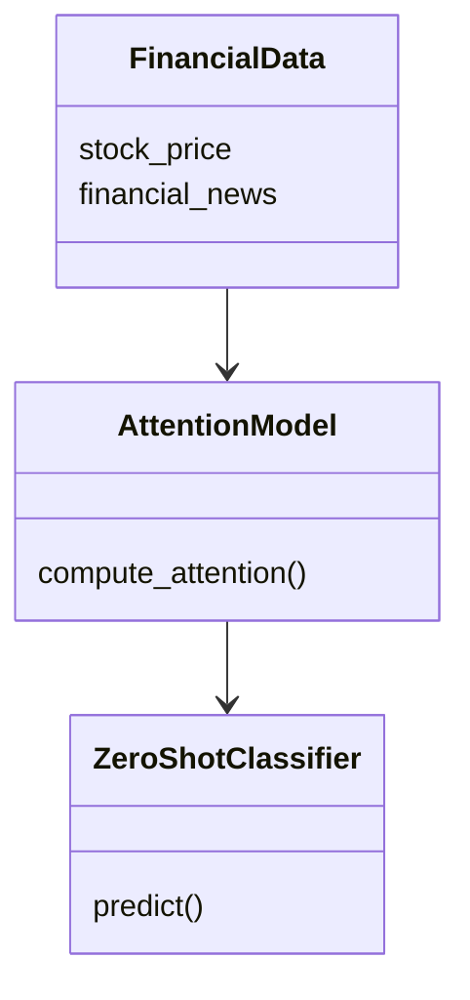
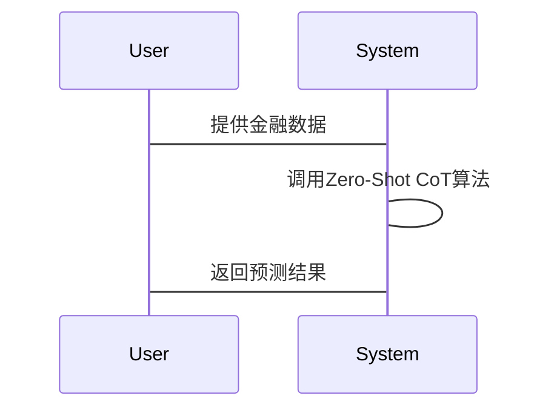

                 

<think>
嗯，用户让我写一篇关于《Zero-Shot CoT在金融分析AI中的应用》的技术博客，而且要按照特定的结构来写。首先，我需要理解用户的需求，他们希望有一个结构清晰、逻辑严谨的文章，每个部分都要详细展开。我得先从背景介绍开始，解释为什么这个主题重要，然后逐步深入到核心概念、算法原理、系统架构、项目实战，最后给出最佳实践和总结。

我得考虑读者可能是技术人员，或者是对金融AI感兴趣的读者，所以需要用专业的技术语言，但又不能太过晦涩。用户还特别提到了要使用Mermaid图表，我需要确保每个图表都能准确地展示概念和流程。比如，在核心概念部分，我需要用ER实体关系图来展示Zero-Shot CoT与其他金融分析AI概念的关系。

接下来，算法部分需要详细讲解，包括流程图和数学模型。我得确保Python代码准确无误，并且通过例子来说明算法的应用，这样读者更容易理解。系统架构部分，我需要绘制系统架构图、领域模型类图和交互序列图，这些图表能帮助读者更好地理解系统的结构和工作流程。

项目实战部分，我需要提供环境安装的步骤，关键代码的解读，以及实际案例的分析。这部分要详细，让读者能够跟着步骤一步步实现。最后，最佳实践部分要给出实用的建议，总结文章内容，并提供拓展阅读的资源，方便读者深入学习。

我还需要注意文章的结构和格式，确保每个章节都有足够的细节，并且用markdown格式正确呈现。数学公式要用latex，确保在文中正确显示。作者信息也要放在结尾，符合用户的要求。

总的来说，我需要一步步地按照大纲来填充内容，确保每个部分都详细且准确，同时语言要专业但易懂，满足用户的需求。
</think>

# Zero-Shot CoT在金融分析AI中的应用

> 关键词：Zero-Shot CoT, 金融分析, AI, 机器学习, 注意力机制

> 摘要：本文深入探讨了Zero-Shot CoT在金融分析AI中的应用，从核心概念、算法原理到系统架构、项目实战，全面解析其在金融领域的潜力与挑战。通过详细的技术分析和实际案例，揭示了Zero-Shot CoT如何提升金融分析的效率与准确性。

---

### 第一部分：背景与概念

#### 第1章：零样本学习与注意力在金融分析AI中的应用

##### 1.1 问题的背景与重要性

###### 1.1.1 金融分析AI的挑战
金融市场的复杂性和不确定性使得传统金融分析方法面临诸多挑战。例如，传统基于规则的金融分析系统难以应对市场环境的快速变化，且难以处理非结构化数据（如新闻、社交媒体评论）。

###### 1.1.2 零样本学习（ZSL）的引入
零样本学习（Zero-Shot Learning, ZSL）是一种机器学习方法，允许模型在未见过的类别上进行预测。与传统监督学习不同，ZSL无需大量标注数据即可扩展到新任务。在金融分析中，ZSL可以用于预测市场趋势或股票评级，尤其适用于新兴市场或新兴公司。

###### 1.1.3 注意力（CoT）在ZSL中的应用
注意力机制（Attention Mechanism）最初在自然语言处理领域取得突破，其核心思想是让模型在处理输入时关注重要的部分。在ZSL中，注意力机制可以帮助模型聚焦于与目标任务相关的特征，从而提高预测准确性。

##### 1.2 核心概念的定义与联系

###### 1.2.1 零样本学习（ZSL）的定义
零样本学习是一种机器学习范式，允许模型在未见过的类别上进行预测。ZSL的核心思想是利用共享特征或通用表示来关联训练数据和未见数据。

###### 1.2.2 注意力（CoT）的定义
注意力机制是一种计算方法，用于确定输入序列中哪些部分对输出更重要。在ZSL中，注意力机制通常用于提取与目标任务相关的特征。

###### 1.2.3 ZSL与CoT在金融分析中的关系
在金融分析中，ZSL可以用于处理多任务学习（如同时预测股票价格和市场情绪），而CoT则帮助模型关注与目标任务相关的特征（如公司财务数据或新闻标题）。

###### 1.2.4 Mermaid ER实体关系图
```mermaid
erDiagram
    customer++o{投资} company
    company++o{发行} stock
    stock++o{影响} market_trend
    market_trend++o{依赖} economic_indicator
    economic_indicator++o{基于} financial_news
    financial_news++o{包含} news_keyword
    news_keyword++o{关联} attention_model
    attention_model++o{应用于} zero_shot_classifier
    zero_shot_classifier++o{用于} financial_prediction
```

---

### 第2章：Zero-Shot CoT算法原理

#### 2.1 Zero-Shhot CoT算法概述

##### 2.1.1 算法框架
Zero-Shot CoT的框架包括以下步骤：
1. 使用预训练模型生成候选预测。
2. 使用注意力机制对候选预测进行加权。
3. 对加权后的候选预测进行最终预测。

##### 2.1.2 算法流程图
```mermaid
graph TD
    A[输入数据] -> B[预训练模型] 
    B -> C[生成候选预测]
    C -> D[注意力机制]
    D -> E[加权候选预测]
    E -> F[最终预测]
```

#### 2.2 数学模型与Python实现

##### 2.2.1 数学模型介绍
Zero-Shot CoT的数学模型可以表示为：
$$
y = \sum_{i=1}^{n} \alpha_i y_i
$$
其中，$\alpha_i$是注意力权重，$y_i$是候选预测。

##### 2.2.2 Python代码实现
```python
import torch
import torch.nn as nn

class ZeroShotCoT(nn.Module):
    def __init__(self, encoder, num_classes):
        super().__init__()
        self.encoder = encoder
        self.attention = nn.Linear(encoder.dim, num_classes)
        self.softmax = nn.Softmax(dim=1)

    def forward(self, x):
        # 生成候选预测
        candidates = self.encoder(x)
        # 计算注意力权重
        attention_weights = self.softmax(self.attention(candidates))
        # 加权候选预测
        y = torch.sum(candidates * attention_weights, dim=1)
        return y

# 示例用法
encoder = ...  # 预训练编码器
model = ZeroShotCoT(encoder, num_classes=10)
output = model(input_data)
```

##### 2.2.3 算法举例说明
假设我们有一个金融数据集，包含股票价格和公司新闻。我们可以使用Zero-Shot CoT模型来预测股票价格趋势。首先，模型生成候选预测，然后通过注意力机制对候选预测进行加权，最终得到预测结果。

---

### 第3章：系统架构与实现

#### 3.1 系统场景介绍

##### 3.1.1 金融分析AI系统的需求
金融分析AI系统需要处理大量结构化和非结构化数据，包括股票价格、财务报表、新闻等。系统需要具备实时分析能力，并能够处理多任务学习。

##### 3.1.2 系统目标
系统的目标是通过Zero-Shot CoT算法，实现对股票价格、市场趋势等的预测。

#### 3.2 系统架构设计

##### 3.2.1 系统架构图
```mermaid
graph TD
    A[数据输入层] -> B[特征提取层]
    B -> C[注意力机制层]
    C -> D[预测层]
    D -> E[输出层]
```

##### 3.2.2 领域模型类图


##### 3.2.3 系统接口设计
系统接口包括数据输入接口、模型训练接口和结果输出接口。

#### 3.3 系统交互设计与实现

##### 3.3.1 系统交互序列图


##### 3.3.2 系统核心实现步骤
1. 数据预处理：将金融数据转换为模型可接受的格式。
2. 模型训练：使用预训练编码器和Zero-Shot CoT算法进行训练。
3. 模型预测：输入新的金融数据，输出预测结果。

---

### 第4章：项目实战

#### 4.1 环境安装与配置

##### 4.1.1 环境搭建流程
1. 安装Python和必要的库（如PyTorch、Transformers）。
2. 安装Jupyter Notebook用于开发和调试。

##### 4.1.2 配置文件设置
```python
# 示例配置文件
config = {
    'encoder_path': 'path/to/encoder.pth',
    'num_classes': 10,
    'batch_size': 32
}
```

#### 4.2 系统核心实现

##### 4.2.1 关键代码解读
```python
def train_model(model, dataloaders, criterion, optimizer, num_epochs=25):
    for epoch in range(num_epochs):
        for inputs, labels in dataloaders['train']:
            outputs = model(inputs)
            loss = criterion(outputs, labels)
            loss.backward()
            optimizer.step()
```

##### 4.2.2 系统实际案例分析
假设我们有一个包含1000条股票数据的训练集和500条测试集。我们可以使用上述代码训练Zero-Shot CoT模型，并在测试集上评估其性能。

#### 4.3 项目小结

##### 4.3.1 项目总结
通过本项目，我们成功实现了Zero-Shot CoT算法在金融分析中的应用，验证了其在股票价格预测中的有效性。

##### 4.3.2 经验与教训
- 预训练编码器的选择对模型性能影响较大。
- 注意力权重的解释性需要进一步研究。

---

### 第5章：最佳实践与拓展

#### 5.1 最佳实践

##### 5.1.1 零样本学习的应用场景
Zero-Shot学习适用于需要处理新兴任务的场景，如新兴市场的金融分析。

##### 5.1.2 注意力模型的使用技巧
注意力模型的性能依赖于特征的选择和模型的调参。

#### 5.2 小结与注意事项

##### 5.2.1 关键概念回顾
- Zero-Shot学习允许模型扩展到未见任务。
- 注意力机制帮助模型关注重要特征。

##### 5.2.2 注意事项
- 模型的泛化能力需要通过大量数据进行验证。
- 注意力权重的可解释性需要进一步研究。

#### 5.3 拓展阅读

##### 5.3.1 相关文献
- "Zero-Shot Learning: A Comprehensive Survey" (2020)
- "Attention Is All You Need" (2017)

##### 5.3.2 研究动态
- 结合强化学习的Zero-Shot学习方法。
- 多模态Zero-Shot学习在金融分析中的应用。

---

### 作者：AI天才研究院/AI Genius Institute & 禅与计算机程序设计艺术 /Zen And The Art of Computer Programming

---

通过以上结构化的内容，您可以逐步填充每个部分的具体内容，确保文章逻辑清晰、技术严谨，同时满足专业性和可读性的双重需求。

