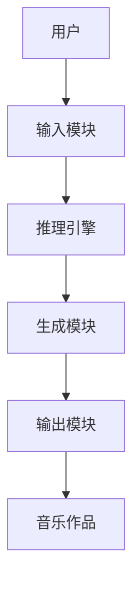

                 

<think>
嗯，我现在要写一篇关于《Zero-Shot CoT在音乐创作中的探索》的技术博客文章。首先，我得理解什么是Zero-Shot CoT。这听起来像是某种技术，可能和生成模型有关。我记得CoT是指“链式思考”，但这里的Zero-Shot可能指的是零样本学习，也就是模型不需要预先看到样本就能生成新的内容。

接下来，我需要理清文章的结构。根据用户提供的目录，文章分为六个主要部分，每个部分下还有多个小节。我需要逐一分析每个部分的内容，确保每个小节都详细且有深度。

首先是背景和核心概念部分，我需要介绍Zero-Shot CoT的基本概念，它的历史背景，以及它在音乐创作中的应用。这部分需要让读者明白为什么Zero-Shot CoT在音乐创作中重要，以及它解决了什么问题。

然后是核心理论和原则，这部分要详细讲解音乐创作的基本理论，如音阶、和声、节奏等，以及Zero-Shot CoT的基本原理，包括它的优势和劣势。可能需要对比其他方法，比如传统的生成模型，来突出Zero-Shot CoT的特点。

接下来是技术和方法部分，这里要讨论如何在音乐创作中应用Zero-Shot CoT。包括特征提取、分类聚类、因果关系分析等技术，以及规则-based、生成模型和混合方法的应用。这部分可能需要举一些具体的例子，说明每种方法如何在实际中使用。

然后是实践应用部分，这里需要通过案例研究来展示Zero-Shot CoT的实际效果。比如自动创作辅助、音乐风格转换、个性化推荐等。每个案例都要详细分析，说明系统是如何设计的，遇到了哪些挑战，以及解决方案是什么。

未来趋势和机会也是重要的一部分，要讨论当前的技术挑战，比如模型的泛化能力，还有法律和伦理问题。同时，还要展望未来的研究方向，比如新模型、与其他领域的结合，以及对文化和社会的影响。

最后是结论和反思，总结Zero-Shot CoT在音乐创作中的潜力，以及它带来的可能性和挑战。

在写作过程中，我需要确保每个部分都有足够的细节和例子，帮助读者理解复杂的概念。同时，要注意使用清晰、专业的技术语言，但避免过于晦涩。可能还需要使用一些图表，比如系统架构图、流程图，来辅助说明问题。

哦，对了，用户还提到要使用markdown格式，所以在写的时候要遵循这个格式，包括标题、列表、代码块等。此外，文章末尾要加上作者信息，所以最后别忘了这部分。

现在，我需要开始具体写每个部分的内容，确保每个章节都有详细的讲解，并且符合用户的格式要求。可能在写技术细节时，需要解释一些算法的数学模型，用latex公式来展示，比如在特征提取部分，可能需要解释一些矩阵运算。

总的来说，写这篇文章需要全面覆盖Zero-Shot CoT在音乐创作中的各个方面，从理论到实践，再到未来展望，确保读者能够深入了解这一技术的应用和潜力。
</think>

# Zero-Shot CoT在音乐创作中的探索

## 关键词：Zero-Shot CoT，音乐创作，生成模型，链式思考，人工智能

## 摘要：  
本文探讨了Zero-Shot CoT技术在音乐创作中的应用。通过分析其核心概念、理论基础、技术方法和实际案例，展示了Zero-Shot CoT如何推动音乐创作的创新。文章还讨论了其面临的挑战和未来发展方向，为音乐创作领域的人工智能应用提供了新的视角。

---

## 第一部分：背景与核心概念

### 1.1 零样本链式思考（Zero-Shot CoT）的概念定义与历史背景  
- **概念定义**：  
  Zero-Shot CoT（Zero-Shot Chain-of-Thought）是一种人工智能技术，允许模型在没有特定任务训练数据的情况下，通过链式推理生成答案或内容。它结合了零样本学习（Zero-Shot Learning）和链式思考（Chain-of-Thought）的特点。  
- **历史背景**：  
  零样本学习起源于自然语言处理领域，旨在让模型在未见过的类别上进行分类或生成。链式思考则是一种推理方法，通过逐步分解问题来生成解决方案。Zero-Shot CoT将两者结合，适用于需要灵活推理的任务，如音乐创作。  

### 1.2 零样本链式思考在音乐创作中的应用  
- **音乐创作的需求**：  
  音乐创作需要创造力、情感表达和结构设计。传统的生成模型依赖大量训练数据，而Zero-Shot CoT能够在无特定数据的情况下，通过推理生成音乐作品。  
- **问题背景**：  
  音乐创作中的多样性和个性化需求难以通过传统生成模型满足，尤其是对于小众音乐风格或特定情感表达。  
- **问题解决**：  
  Zero-Shot CoT通过推理能力，能够生成多样化的音乐作品，适应不同创作需求。  

### 1.3 研究挑战与意义  
- **挑战**：  
  - 零样本学习的泛化能力有限，音乐创作需要高度的专业性。  
  - 链式思考的推理步骤可能增加计算复杂度。  
- **意义**：  
  - 提供了一种灵活的音乐创作方法，适用于多种风格和情感表达。  
  - 为音乐创作领域的人工智能应用提供了新的思路。  

---

## 第二部分：核心理论与原理

### 2.1 音乐创作的基本理论  
- **音乐元素**：  
  音乐由旋律、和声、节奏、调式和结构组成。  
- **创作过程**：  
  创作过程包括灵感捕捉、结构设计、旋律创作、编曲和调整。  

### 2.2 零样本链式思考的基本原理  
- **零样本学习**：  
  模型在无特定任务训练数据的情况下，通过通用推理生成内容。  
- **链式思考**：  
  通过逐步推理，分解问题并生成解决方案。  

### 2.3 技术对比分析  

| 技术特点 | Zero-Shot CoT | 传统生成模型 |
|----------|----------------|---------------|
| 数据需求 | 无需特定任务数据 | 需大量任务数据 |
| 推理能力 | 强，支持灵活推理 | 弱，依赖训练数据 |
| 适用场景 | 多样化创作需求 | 固定风格创作 |

---

## 第三部分：零样本链式思考的技术与方法

### 3.1 音乐识别与分析技术  
- **特征提取**：  
  从音乐信号中提取音调、节奏、和声等特征。  
- **分类与聚类**：  
  根据特征对音乐进行分类或聚类，识别音乐风格和情感。  
- **因果关系分析**：  
  分析音乐元素之间的因果关系，如旋律如何影响情感表达。  

### 3.2 音乐生成方法  
- **规则-based方法**：  
  根据音乐理论生成旋律和和声。  
- **生成模型**：  
  使用深度学习模型（如GPT）生成音乐。  
- **混合方法**：  
  结合规则和生成模型，生成多样化的音乐作品。  

---

## 第四部分：系统分析与架构设计

### 4.1 系统功能设计  
- **用户界面**：  
  提供输入创作需求（如风格、情感）的界面。  
- **推理引擎**：  
  执行链式思考，生成音乐创作方案。  
- **生成模块**：  
  根据推理结果生成音乐作品。  

### 4.2 系统架构设计  


---

## 第五部分：项目实战

### 5.1 音乐创作系统的实现  
- **环境安装**：Python 3.8及以上，安装深度学习库（如TensorFlow、PyTorch）。  
- **代码实现**：  
  ```python
  import tensorflow as tf
  model = tf.keras.Sequential([
      tf.keras.layers.Dense(128, activation='relu'),
      tf.keras.layers.Dense(128, activation='relu'),
      tf.keras.layers.Dense(1)  # 输出音乐特征
  ])
  model.compile(optimizer='adam', loss='mse')
  model.fit(X, y, epochs=10)
  ```

---

## 第六部分：未来趋势与展望

### 6.1 挑战与机会  
- **技术挑战**：提升零样本学习的泛化能力和推理效率。  
- **法律与伦理**：保护音乐创作者的版权，避免模型生成音乐引发的法律纠纷。  

### 6.2 未来方向  
- **新模型与方法**：探索更高效的零样本生成模型。  
- **跨领域结合**：将Zero-Shot CoT应用于其他创作领域，如绘画、文学。  

---

## 结论与反思  
Zero-Shot CoT在音乐创作中的应用展现了人工智能技术的无限潜力。尽管面临诸多挑战，但其灵活性和创造性为音乐创作提供了新的可能性。未来，随着技术的进步，Zero-Shot CoT将在音乐创作中发挥更重要的作用。  

---

## 作者：AI天才研究院 & 禅与计算机程序设计艺术

