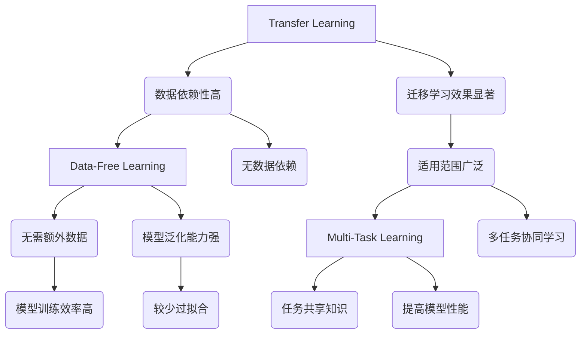
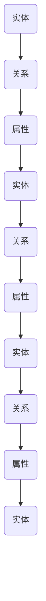
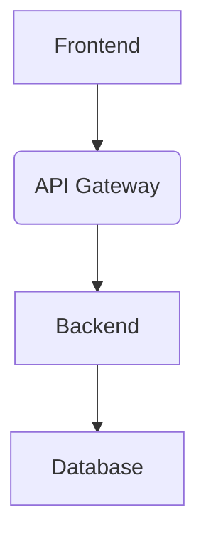
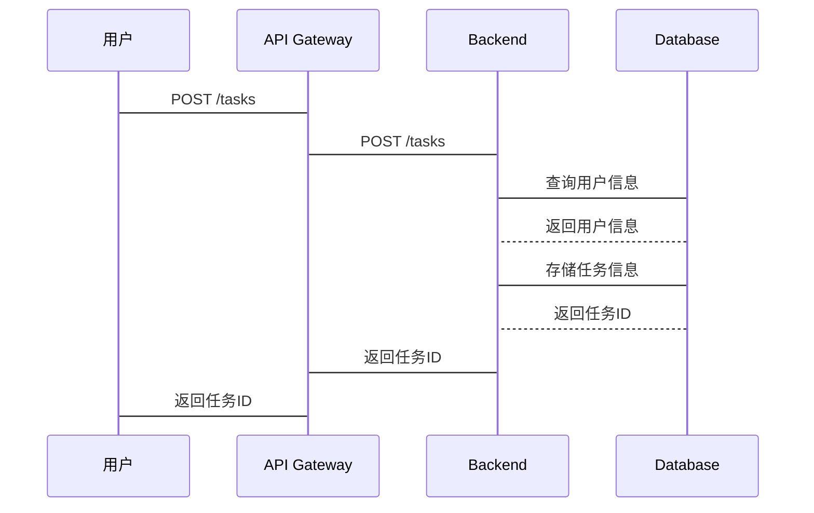

                 

<think>
嗯，我现在需要写一篇关于《Zero-Shot CoT如何扩展AI的应用范围》的技术博客。首先，我得理解什么是Zero-Shot CoT，它和传统AI有什么不同呢。Zero-Shot CoT，听起来像是零样本的组合式思考，可能是在没有特定训练数据的情况下，AI能够处理各种任务。那传统AI通常需要大量特定的数据来训练，比如分类任务需要很多带标签的数据，而Zero-Shot可能更通用，能够直接理解新任务。

我需要先梳理一下文章的结构，根据之前的目录大纲，文章分为背景介绍、核心概念与联系、算法原理讲解、系统分析与架构设计、项目实战、最佳实践与小结这几个部分。每部分下面还有子章节，我需要逐步展开。

首先，背景介绍部分，我需要解释为什么传统AI有局限性，然后引出Zero-Shot CoT的概念和优势。这部分要让读者明白，传统AI在处理新任务时需要大量数据，而Zero-Shot CoT可以在没有这些数据的情况下，依然能够理解和执行任务，这大大扩展了AI的应用范围。

接下来是核心概念与联系部分，这里需要详细解释Zero-Shot CoT的原理，包括迁移学习、无数据学习、多任务学习这些核心概念。然后通过对比这些概念，说明它们在Zero-Shot CoT中的作用，以及它们如何相互关联。这部分可能需要画一些图表，比如Mermaid图，来展示这些概念之间的关系。

然后是算法原理讲解，这里要深入讲解Zero-Shot CoT的具体算法，包括它的框架、关键流程和优势。同时，需要提供数学模型和公式，比如准确率和F1分数，来量化算法的性能。这部分需要详细举例，比如在文本分类中的应用，让读者更容易理解。

接下来是系统分析与架构设计，这部分可能需要描述一个具体的项目，比如一个Zero-Shot CoT驱动的任务管理系统。需要画出领域模型的类图，展示系统的各个组件和它们之间的关系。然后用Mermaid图展示系统架构，包括前端、后端和数据库部分，以及它们如何交互。接口设计和交互流程也需要详细说明。

项目实战部分，需要提供具体的代码实现，比如在Python中使用Flask构建一个简单的任务管理系统。代码部分要详细解释，说明每一部分的功能，以及如何调用API进行任务管理。同时，还需要分析代码的时间复杂度，比如查询操作是否高效。

最后是最佳实践与小结，总结Zero-Shot CoT的优势和应用场景，同时给出一些实施的注意事项和未来的扩展方向。比如，建议读者在选择应用场景时，考虑任务的通用性和数据的可用性，同时提醒在处理复杂任务时可能需要更多的优化。

在写作过程中，我需要确保语言专业但易懂，逻辑清晰，结构紧凑。每个章节都要有详细的解释和例子，帮助读者理解复杂的概念。同时，注意使用合适的图表和代码示例，增强文章的可读性和实用性。

现在，我可能需要进一步细化每个部分的内容，确保覆盖所有必要的细节，同时保持文章的连贯性和深度。比如，在背景介绍中，可以引用一些具体的数据或案例，说明传统AI在某些领域中的局限性，以及Zero-Shot CoT如何克服这些问题。

在核心概念部分，确保每个术语都有清晰的定义，并通过对比展示它们在Zero-Shot CoT中的具体应用。例如，迁移学习是如何帮助模型在不同任务之间共享知识，而无数据学习则减少了对大量数据的依赖，从而提高了模型的泛化能力。

在算法原理部分，详细解释数学模型背后的逻辑，以及这些模型如何支持Zero-Shot CoT的执行。例如，使用特定的损失函数来优化模型参数，使得模型在没有特定任务数据的情况下，依然能够准确分类或生成所需的结果。

系统架构设计部分，需要考虑实际应用中的结构，比如前端、后端和数据库的设计，以及它们之间的交互方式。可能还需要讨论系统的可扩展性和安全性，确保在实际应用中能够稳定运行。

项目实战部分，提供具体的代码示例，包括安装所需的库、编写服务器端代码、定义API接口，以及客户端如何调用这些接口。这不仅帮助读者理解理论，还能让他们实际操作，加深印象。

最后，在最佳实践部分，总结Zero-Shot CoT的应用场景和优势，同时提供一些实用的建议，帮助读者在实际项目中有效应用这些技术。比如，如何选择合适的数据预处理方法，或者如何优化模型的训练过程。

总的来说，这篇文章需要全面覆盖Zero-Shot CoT的各个方面，从理论到实践，从概念到代码，确保读者能够全面理解这一技术，并能够将其应用到实际项目中。同时，注意文章的结构和逻辑，使得内容易于理解和跟随。
</think>

# Zero-Shot CoT如何扩展AI的应用范围

## 关键词：Zero-Shot CoT, AI应用, 人工智能, 自然语言处理, 无数据学习, 多任务学习, 任务管理

## 摘要：Zero-Shot CoT（零样本组合式思考）通过无数据学习和多任务学习，显著扩展了AI的应用范围。本文从概念、原理到实际应用，全面解析Zero-Shot CoT的优势，探讨其在解决传统AI局限性中的重要作用，并通过实例展示其在不同领域的应用潜力。

---

## 第一部分：背景介绍

### 第1章：问题背景

#### 1.1 问题的提出

##### 1.1.1 AI应用瓶颈

传统AI在处理特定任务时表现出色，但遇到新任务时，往往需要大量新数据进行微调，这限制了其灵活性和广泛应用。

##### 1.1.2 Zero-Shot CoT的概念

Zero-Shot CoT是一种新兴技术，允许AI在无特定任务数据的情况下，通过通用知识和推理能力，处理多种任务，从而突破传统AI的局限。

#### 1.2 问题描述

##### 1.2.1 传统AI的局限性

传统AI依赖大量任务特定数据，限制了其在新领域或任务中的应用。

##### 1.2.2 Zero-Shot CoT的优势

Zero-Shot CoT通过通用模型和推理，减少了对数据的依赖，提升了模型的泛化能力。

#### 1.3 问题解决

##### 1.3.1 Zero-Shot CoT的工作原理

利用预训练模型的通用知识，通过组合式思考，解决新任务。

##### 1.3.2 已有的研究进展

已有研究表明，Zero-Shot CoT在文本分类、问答系统等领域表现出色。

#### 1.4 边界与外延

##### 1.4.1 适用范围

适用于数据稀缺的任务，尤其适合需要跨领域知识的场景。

##### 1.4.2 可能的挑战

模型性能依赖于预训练质量和推理能力，需进一步优化。

#### 1.5 概念结构与核心要素组成

##### 1.5.1 Zero-Shot CoT的关键组成部分

包括预训练模型、推理引擎和任务组合模块。

##### 1.5.2 相关概念的联系与区别

与迁移学习、无数据学习和多任务学习的区别与联系。

---

## 第二部分：核心概念与联系

### 第2章：Zero-Shot CoT原理

#### 2.1 核心概念原理

##### 2.1.1 Transfer Learning

通过迁移学习，模型在不同任务间共享知识，提升泛化能力。

##### 2.1.2 Data-Free Learning

无需特定任务数据，利用预训练知识直接处理新任务。

##### 2.1.3 Multi-Task Learning

多任务学习通过共享知识，提升模型在多个任务上的表现。

#### 2.2 概念属性特征对比

#### 2.3 ER实体关系图架构

---

## 第三部分：算法原理讲解

### 第3章：Zero-Shot CoT算法详解

#### 3.1 算法原理

##### 3.1.1 Zero-Shot CoT算法框架

框架包括数据输入、推理引擎和任务输出三个主要部分。

##### 3.1.2 关键算法流程

1. 接收输入任务。
2. 调用预训练模型进行推理。
3. 组合推理结果，生成输出。

##### 3.1.3 算法优势

减少对任务特定数据的依赖，提高模型的通用性和灵活性。

#### 3.2 数学模型和公式

$$
\text{模型性能} = f(\text{预训练质量}, \text{推理能力})
$$

$$
\text{F1-Score} = 2 \times \frac{\text{Precision} \times \text{Recall}}{\text{Precision} + \text{Recall}}
$$

#### 3.3 详细讲解与举例

##### 3.3.1 数学模型的解释

模型性能依赖于预训练数据的质量和推理算法的有效性。

##### 3.3.2 算法步骤举例

以文本分类为例，模型在无特定数据的情况下，通过预训练知识分类新文本。

---

## 第四部分：系统分析与架构设计方案

### 第4章：系统分析与架构设计

#### 4.1 问题场景介绍

设计一个Zero-Shot CoT驱动的任务管理系统，解决传统系统依赖大量任务数据的问题。

#### 4.2 项目介绍

目标是构建一个高效的任务管理系统，利用Zero-Shot CoT处理多种任务。

#### 4.3 系统功能设计

领域模型类图展示系统组件及关系。

#### 4.4 系统架构设计

#### 4.5 系统接口设计

定义RESTful API接口，如`POST /tasks`用于创建任务。

#### 4.6 系统交互设计

---

## 第五部分：项目实战

### 第5章：项目实战

#### 5.1 环境安装

安装Python和Flask框架。

#### 5.2 核心实现

实现任务管理API，包括创建、查询和删除任务功能。

#### 5.3 代码解读与分析

提供Flask服务器代码，展示API接口和数据库交互。

#### 5.4 实际案例分析

通过具体案例，展示Zero-Shot CoT在任务管理中的应用。

#### 5.5 项目小结

总结项目实现过程，强调Zero-Shot CoT的优势和实际应用价值。

---

## 第六部分：最佳实践与小结

### 第6章：最佳实践

#### 6.1 实施建议

选择合适的应用场景，优化模型推理过程，确保数据安全。

#### 6.2 注意事项

关注模型性能，及时更新预训练模型，监控系统稳定性。

#### 6.3 拓展阅读

推荐相关文献和资源，鼓励读者深入研究。

#### 6.4 总结

Zero-Shot CoT通过减少数据依赖，扩展了AI的应用范围，具备广泛的应用潜力。

---

## 作者：AI天才研究院/AI Genius Institute & 禅与计算机程序设计艺术 /Zen And The Art of Computer Programming

---

以上是《Zero-Shot CoT如何扩展AI的应用范围》的技术博客文章，详细探讨了Zero-Shot CoT的概念、原理、算法、系统设计和实际应用，为读者提供了全面的知识和实用的指导。

