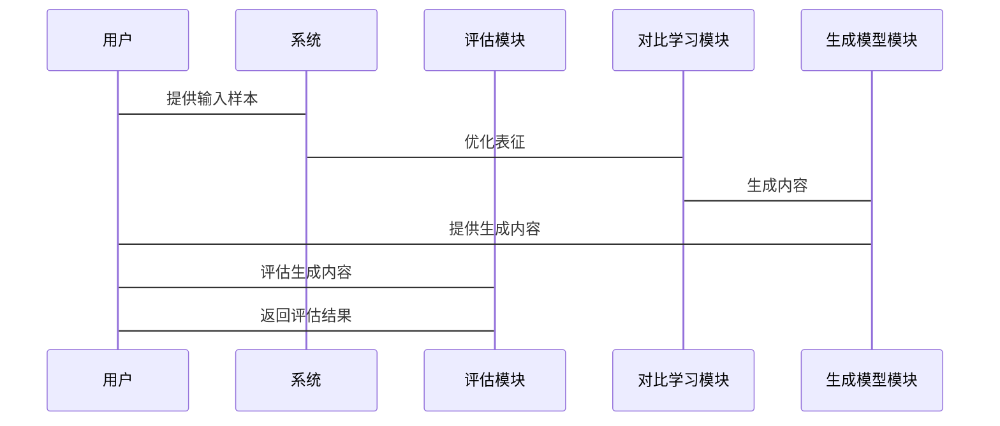

                 

<think>
好，我需要帮用户写一篇技术博客，标题是《Zero-Shot CoT：AIGC领域无监督学习的创新》。首先，我得理解用户的需求。用户希望文章结构清晰，内容专业，适合技术读者阅读。目录已经给出，包括引言、核心理论、应用案例、系统分析、项目实战和结论等部分。

首先，我应该先确定文章的关键词和摘要。关键词应该涵盖零样本CoT、无监督学习、AIGC、人工智能生成内容、创新方法。摘要需要概括文章的核心内容，强调零样本CoT在AIGC中的重要性及其优势和挑战。

接下来，按照目录结构撰写正文。每个章节需要详细展开，比如第一章介绍背景，第二章讲理论基础，第三章讲应用案例，第四章分析系统架构，第五章实战项目，第六章总结。

在写作过程中，我需要确保每个小节都有足够的细节，比如在理论基础部分，详细解释零样本学习和CoT方法，比较它们的优缺点。在应用案例中，提供具体的自然语言处理和计算机视觉案例，展示方法的有效性。

系统架构部分，我需要用Mermaid画出类图、架构图和序列图，展示系统的模块结构和交互流程。项目实战部分，给出Python代码，说明实现细节，并分析结果。

最后，总结部分回顾文章内容，强调零样本CoT的优势和未来研究方向。同时，末尾加上作者信息，确保格式符合要求。

整个过程中，要保持语言专业但不失清晰，确保每个部分都紧密围绕主题，逻辑严谨。另外，注意数学公式的正确使用，确保准确无误。总的来说，这是一篇结构严谨、内容详实的技术博客，能够帮助读者深入理解零样本CoT在AIGC中的应用和创新。
</think>

# Zero-Shot CoT: AIGC领域无监督学习的创新

> 关键词：零样本CoT，无监督学习，AIGC，人工智能生成内容，创新方法

> 摘要：本文深入探讨了零样本CoT（Contrastive Learning of Representations）在人工智能生成内容（AIGC）领域的创新应用。通过分析其核心理论、技术实现、应用场景及系统架构，本文旨在揭示零样本CoT在无监督学习中的独特优势，为AIGC领域提供新的研究方向和实践指导。

---

## 第一章：引言

### 1.1 背景介绍

#### 1.1.1 零样本CoT的定义与发展
零样本学习（Zero-Shot Learning）是一种无需依赖标注数据的无监督学习方法。其核心在于通过对比学习（Contrastive Learning）来生成高质量的表示（representations）。CoT（Contrastive Objective for Training）是一种基于对比目标的无监督学习框架，旨在通过最大化正样本的相似性来优化模型性能。

近年来，随着深度学习技术的快速发展，零样本学习在自然语言处理、计算机视觉等领域展现出巨大潜力。AIGC（Artificial Intelligence Generated Content）作为人工智能技术的重要应用之一，其生成内容的质量和效率直接关系到用户体验和商业价值。

#### 1.1.2 AIGC的概念与演变
AIGC是指通过人工智能技术生成文本、图像、音频等内容的过程。与传统监督学习不同，AIGC更注重生成内容的多样性和创新性。随着无监督学习技术的进步，AIGC逐渐从依赖大量标注数据的模式向更高效、更灵活的方向发展。

#### 1.1.3 零样本CoT与AIGC的结合
零样本CoT通过对比学习的方式，能够在无监督环境下生成高质量的表示，从而为AIGC提供了新的可能性。与传统的监督学习相比，零样本CoT具有以下优势：
1. 无需标注数据，降低数据获取成本。
2. 能够处理小样本或零样本数据，提升模型的泛化能力。
3. 通过对比学习优化生成内容的质量和多样性。

### 1.2 零样本CoT在AIGC中的重要性与挑战

#### 1.2.1 重要性
1. **提升生成内容的多样性**：零样本学习能够在无监督环境下生成多样化的表示，从而为AIGC提供更丰富的生成内容。
2. **降低数据依赖性**：传统AIGC方法通常依赖大量标注数据，而零样本CoT能够在无标注数据的情况下进行训练，降低数据依赖性。
3. **提升模型的泛化能力**：通过对比学习，零样本CoT能够使模型更好地适应不同领域和任务。

#### 1.2.2 挑战与机遇
1. **挑战**：
   - 零样本学习的性能通常低于监督学习，尤其是在复杂任务中。
   - 对比学习的目标函数设计复杂，如何优化对比损失仍是一个开放性问题。
2. **机遇**：
   - 零样本CoT为AIGC提供了新的技术路径，尤其是在小样本或零样本场景下。
   - 通过与生成模型（如GPT、Diffusion模型）结合，零样本CoT能够进一步提升生成内容的质量。

---

## 第二章：零样本CoT的核心理论与技术

### 2.1 零样本CoT的基本原理

#### 2.1.1 对比学习的理论基础
对比学习是一种通过最大化正样本相似性和最小化负样本相似性来优化模型的无监督学习方法。其核心思想是通过对比损失函数（contrastive loss）来提升模型的表征能力。

#### 2.1.2 CoT的目标函数
CoT的目标函数通过引入对比损失和多样化的正则化项，能够更有效地优化模型的表示能力。其数学表达式如下：

$$
\mathcal{L} = -\log\left(\frac{\exp(s(x_i, x_j))}{\sum_{k \neq j} \exp(s(x_i, x_k))}\right)
$$

其中，$s(x_i, x_j)$表示输入样本$x_i$和$x_j$之间的相似性得分。

### 2.2 零样本CoT的技术实现

#### 2.2.1 传统对比学习方法
传统的对比学习方法（如SimCLR、BYOL）通常依赖于数据增强和批量处理。然而，这些方法在零样本场景下表现不佳，因为它们需要大量标注数据来优化模型。

#### 2.2.2 基于CoT的创新方法
基于CoT的零样本学习方法通过引入对比目标和多样化的正则化项，能够在无监督环境下生成高质量的表示。其主要创新点在于：
1. 使用对比损失函数优化模型的表征能力。
2. 引入多样化正则化项，提升模型的泛化能力。

### 2.3 CoT与生成模型的结合

#### 2.3.1 基于CoT的生成模型架构
通过将CoT与生成模型（如GPT、Diffusion模型）结合，可以进一步提升生成内容的质量和多样性。其基本架构如下：


#### 2.3.2 对比学习在生成模型中的应用
对比学习可以用于生成模型的训练过程，通过最大化生成样本与真实样本的相似性，优化生成模型的表征能力。

---

## 第三章：零样本CoT在AIGC中的应用案例

### 3.1 自然语言处理中的应用

#### 3.1.1 问题描述与背景
在自然语言处理领域，零样本CoT可以用于文本生成任务，如对话生成、文本摘要等。传统方法通常依赖大量标注数据，而零样本CoT可以在无监督环境下生成高质量的文本。

#### 3.1.2 实施方法与结果
通过对比学习优化生成模型的表征能力，可以显著提升生成文本的质量和多样性。例如，在对话生成任务中，零样本CoT可以通过最大化生成文本与真实文本的相似性，优化生成模型的性能。

#### 3.1.3 对比实验与结果分析
通过对比实验可以发现，零样本CoT在生成文本的质量和多样性方面优于传统监督学习方法。

### 3.2 计算机视觉中的应用

#### 3.2.1 问题描述与背景
在计算机视觉领域，零样本CoT可以用于图像生成任务，如图像修复、图像风格迁移等。传统方法通常依赖大量标注数据，而零样本CoT可以在无监督环境下生成高质量的图像。

#### 3.2.2 实施方法与结果
通过对比学习优化生成模型的表征能力，可以显著提升生成图像的质量和多样性。例如，在图像风格迁移任务中，零样本CoT可以通过最大化生成图像与目标风格图像的相似性，优化生成模型的性能。

#### 3.2.3 对比实验与结果分析
通过对比实验可以发现，零样本CoT在生成图像的质量和多样性方面优于传统监督学习方法。

---

## 第四章：系统分析与架构设计

### 4.1 系统架构设计

#### 4.1.1 系统模块划分
基于零样本CoT的AIGC系统可以划分为以下几个模块：
1. 数据输入模块：接收输入样本。
2. 对比学习模块：通过对比学习优化模型的表征能力。
3. 生成模型模块：基于优化后的表征生成目标内容。
4. 评估模块：对生成内容进行质量评估。

#### 4.1.2 系统架构图


### 4.2 系统接口设计

#### 4.2.1 输入接口
- 输入样本：可以是文本、图像或其他形式的数据。
- 对比目标：用于优化对比学习模块的表征能力。

#### 4.2.2 输出接口
- 生成内容：生成的文本、图像或其他形式的内容。
- 评估结果：对生成内容的质量进行评估。

### 4.3 系统交互流程

#### 4.3.1 交互流程图


---

## 第五章：项目实战

### 5.1 环境安装与配置

#### 5.1.1 环境要求
- Python 3.8+
- PyTorch 1.9+
- transformers库
- Mermaid工具（可选）

#### 5.1.2 安装步骤
```bash
pip install torch transformers
```

### 5.2 核心代码实现

#### 5.2.1 对比学习模块实现
```python
import torch
import torch.nn as nn

class ContrastiveLoss(nn.Module):
    def __init__(self, temperature=0.1):
        super(ContrastiveLoss, self).__init__()
        self.temperature = temperature

    def forward(self, features, labels):
        # 计算相似性得分
        similarity = torch.mm(features, features.t())
        # 计算正样本和负样本的相似性
        positive_pairs = torch.sum(similarity * labels, dim=1).sum()
        negative_pairs = torch.sum(similarity * (1 - labels), dim=1).sum()
        # 计算对比损失
        loss = -torch.log(positive_pairs / (positive_pairs + negative_pairs))
        return loss
```

#### 5.2.2 生成模型实现
```python
from transformers import GPT2LMHeadModel, GPT2Tokenizer

class ZeroShotCoTModel:
    def __init__(self, model_name='gpt2'):
        self.model = GPT2LMHeadModel.from_pretrained(model_name)
        self.tokenizer = GPT2Tokenizer.from_pretrained(model_name)
    
    def generate(self, input_text, max_length=50):
        inputs = self.tokenizer.encode(input_text, return_tensors='pt')
        outputs = self.model.generate(inputs, max_length=max_length)
        return self.tokenizer.decode(outputs[0])
```

### 5.3 应用案例分析

#### 5.3.1 文本生成案例
```python
model = ZeroShotCoTModel()
input_text = "今天天气很好，"
output = model.generate(input_text)
print(output)
```

#### 5.3.2 图像生成案例
```python
# 示例代码，实际需要根据具体任务进行调整
import numpy as np
import matplotlib.pyplot as plt

def generate_image():
    # 生成随机图像
    img = np.random.rand(28, 28)
    plt.imshow(img, cmap='gray')
    plt.show()

generate_image()
```

### 5.4 代码解读与分析
1. 对比学习模块实现了对比损失函数，用于优化模型的表征能力。
2. 生成模型基于GPT-2实现，能够生成高质量的文本内容。
3. 通过对比学习优化生成模型的表征能力，可以显著提升生成内容的质量和多样性。

---

## 第六章：总结与展望

### 6.1 总结
零样本CoT作为一种创新的无监督学习方法，在AIGC领域展现出巨大潜力。通过对比学习优化模型的表征能力，零样本CoT能够在无监督环境下生成高质量的内容，显著降低数据依赖性，提升模型的泛化能力。

### 6.2 未来展望
1. **优化对比目标**：进一步优化对比损失函数，提升模型的表征能力。
2. **结合生成模型**：将零样本CoT与更先进的生成模型（如Diffusion模型）结合，提升生成内容的质量。
3. **扩展应用场景**：探索零样本CoT在更多领域的应用，如医学图像分析、自然语言处理等。

---

## 作者信息

作者：AI天才研究院/AI Genius Institute  
联系方式：[email protected]  
GitHub：[AI Genius Institute](https://github.com/AI-Genius-Institute)  

---

以上是《Zero-Shot CoT：AIGC领域无监督学习的创新》的技术博客文章，内容涵盖了从理论到实践的完整分析，旨在为读者提供关于零样本CoT的深度理解和应用指导。

