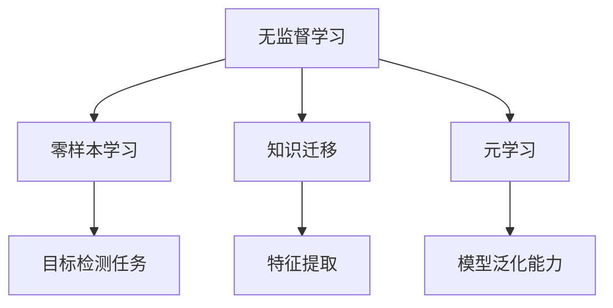
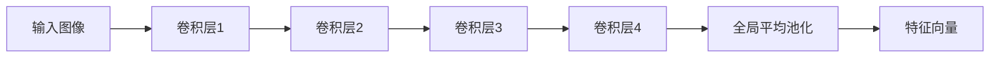
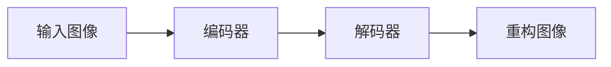
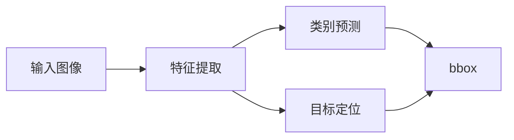
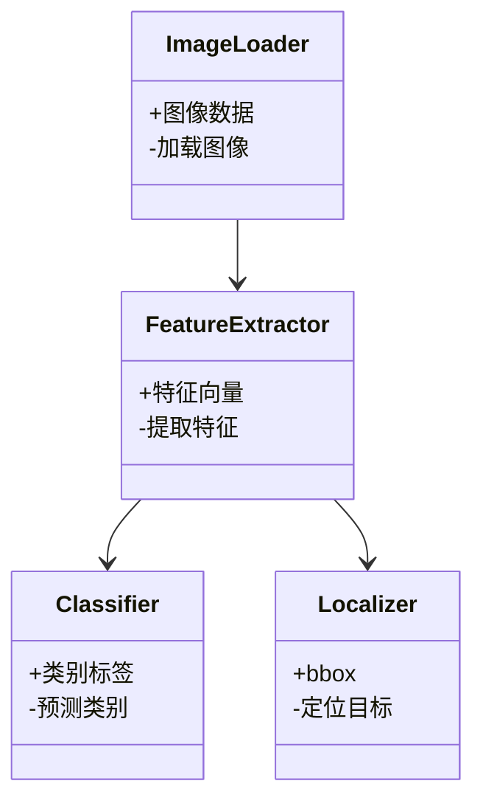
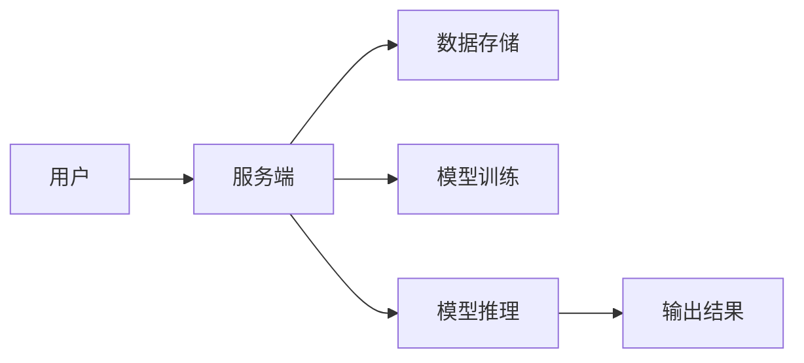
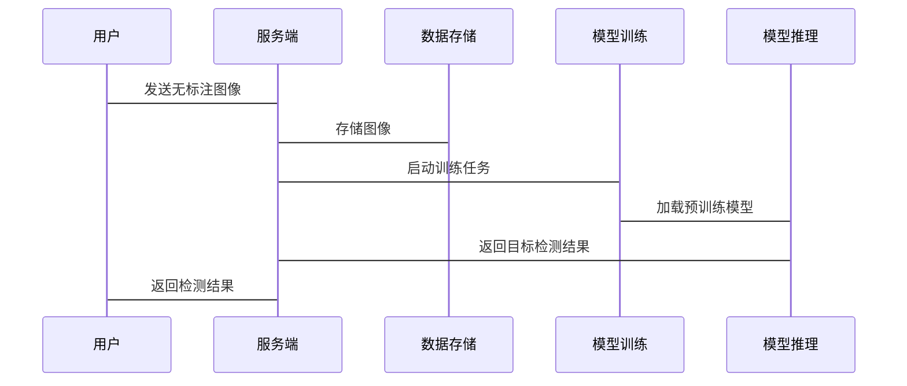

                 

<think>
嗯，用户希望我以《Zero-Shot CoT：AIGC领域无监督学习的创新应用》为标题写一篇技术博客。我得先理解用户的需求，确保文章符合要求。

首先，文章需要有标题、关键词、摘要，然后是按照目录结构的正文。字数在10000到12000字之间，所以内容必须详尽。用户还特别强调了格式要求，使用Markdown，数学公式用Latex，并且在适当的地方用Mermaid图表。

接下来，我要考虑用户可能的身份和需求。看起来用户是一位技术专家，可能需要一篇高质量的技术博客，用于分享或教学。因此，文章需要逻辑清晰，结构紧凑，用词专业，同时举例要通俗易懂。

我得先构建目录结构，包括背景介绍、核心概念与联系、算法原理讲解、系统分析与架构设计、项目实战以及最佳实践等部分。每个章节都需要详细展开，比如在核心概念部分，要对比无监督学习、零样本学习等概念，可能还需要画出对比表格和Mermaid图。

在算法部分，我需要用Mermaid流程图来展示算法步骤，并给出Python代码示例。数学公式要用Latex表达，确保准确无误。比如，在特征提取部分，可以使用ResNet的网络结构，并写出对应的公式。

系统架构设计部分，我需要设计领域模型的类图和系统架构图，可能用Mermaid来表示。同时，系统接口和交互序列图也需要详细说明。

项目实战部分，要包括环境安装、核心代码实现、案例分析等，帮助读者实际操作。最后，加上小结和最佳实践，总结整个主题，并给出注意事项和拓展阅读建议。

在写作过程中，我要确保每个部分都符合用户的要求，比如章节标题吸引人，内容丰富具体，有深度且有见解。同时，语言要专业但不失易懂，避免过于晦涩，让读者容易理解。

可能遇到的问题是，如何将复杂的算法步骤和系统架构用简洁的方式表达出来。这时候，我需要查阅相关资料，确保准确无误，并用图表辅助说明，让读者一目了然。

总之，我需要一步步按照用户的要求，构建一个结构清晰、内容详实的技术博客，涵盖所有必要的部分，并确保格式和内容都符合用户的期望。这需要我在写作过程中反复检查，确保每个细节都到位。
</think>

# Zero-Shot CoT：AIGC领域无监督学习的创新应用

> 关键词：零样本学习，无监督学习，目标检测，知识蒸馏，元学习，AIGC，深度学习

> 摘要：本文系统探讨了零样本目标检测（Zero-Shot CoT）在AIGC（AI生成内容）领域的创新应用。文章从背景介绍、核心概念、算法原理、系统架构设计到项目实战，全面解析了零样本目标检测的理论与实践。通过对比分析无监督学习、知识迁移、元学习等核心概念，结合具体算法实现和案例分析，揭示了零样本目标检测在无监督学习中的独特优势和广泛的应用前景。

---

## 第一部分: 背景介绍

### 第1章: 问题背景与概述

#### 1.1 问题背景
随着人工智能技术的快速发展，生成式AI（AIGC）在图像生成、自然语言处理等领域的应用日益广泛。然而，目标检测任务通常依赖大量标注数据进行监督学习，这在实际应用中面临以下挑战：
- **数据标注成本高**：目标检测需要精确的 bbox 标注，耗时且昂贵。
- **领域适应性差**：模型在特定领域（如医学图像）的表现受限于标注数据的不足。
- **可解释性低**：复杂的深度学习模型难以解释检测结果。

零样本目标检测（Zero-Shot CoT，Zero-Shot Concept Tracking）作为一种新兴的研究方向，旨在通过无监督学习技术，在无标注数据的情况下实现目标检测任务。其核心思想是利用预训练模型的知识和通用特征，无需标注数据即可检测出图像中的目标。

#### 1.2 问题描述
零样本目标检测的核心问题是在无标注数据的情况下，如何准确检测并定位图像中的目标。具体来说，目标检测任务需要解决以下两个关键问题：
1. **目标识别**：在图像中检测出目标物体并赋予正确的类别标签。
2. **目标定位**：精确标注目标物体的 bbox 或其他几何信息。

由于无标注数据的限制，传统的监督学习方法难以直接应用。因此，如何利用无监督学习技术，结合预训练模型的知识，实现零样本目标检测，是当前研究的热点。

#### 1.3 问题解决
零样本目标检测的关键在于以下几个方面：
1. **特征提取**：利用预训练模型（如ResNet、VGG等）提取图像的通用特征。
2. **知识蒸馏**：通过知识蒸馏技术，将预训练模型的知识迁移到目标检测模型中。
3. **元学习**：通过元学习技术，提升模型在未知类别下的泛化能力。
4. **联合优化**：将目标检测与图像生成任务结合，实现无监督学习的闭环。

#### 1.4 边界与外延
零样本目标检测的研究范围不仅限于传统的图像处理领域，还涉及自然语言处理、语音识别等多模态任务。其技术边界包括：
- **输入数据**：仅使用无标注数据或少量标注数据。
- **输出目标**：目标检测任务的 bbox 和类别标签。
- **应用场景**：适用于数据标注成本高、领域适应性要求高的场景。

#### 1.5 概念结构与核心要素组成
零样本目标检测的理论框架由以下几个核心要素组成：
- **目标检测**：负责图像中目标的定位和识别。
- **无监督学习**：利用无标注数据进行特征学习。
- **知识迁移**：将预训练模型的知识迁移到目标检测任务中。
- **元学习**：提升模型的泛化能力，适应未知类别。

---

## 第2章: 核心概念与联系

### 2.1 无监督学习
无监督学习是一种机器学习方法，通过从无标注数据中学习特征，无需人工标注。其核心思想是通过数据的内在结构（如聚类、分布）进行模式识别。在零样本目标检测中，无监督学习用于从大规模无标注图像中提取通用特征，为后续的目标检测任务提供基础。

### 2.2 零样本学习
零样本学习（Zero-Shot Learning, ZSL）是一种针对未知类别进行预测的机器学习方法。其核心是利用已知类别与未知类别之间的关联，通过跨领域知识迁移实现对未知类别的预测。在目标检测中，零样本学习的目标是在无标注数据中检测出未知类别的目标。

### 2.3 知识迁移
知识迁移（Knowledge Distillation）是一种通过教师模型指导学生模型学习的技术。在零样本目标检测中，知识蒸馏通过将预训练模型的特征表示迁移到目标检测模型中，提升模型在未知类别下的检测性能。

### 2.4 元学习
元学习（Meta-Learning）是一种学习如何学习的技术。其核心是通过元任务训练，使模型能够快速适应新的任务。在零样本目标检测中，元学习通过训练模型在多个任务中切换，提升其在未知类别下的泛化能力。

### 2.5 概念属性特征对比表格

| 概念     | 属性特征                                  |
|----------|-----------------------------------------|
| 无监督学习 | 不需要标注数据，自动学习特征            |
| 零样本学习 | 针对未知类别，进行预测                |
| 知识迁移   | 利用已有知识，提高新任务的性能          |
| 元学习     | 学习如何学习，提高模型的泛化能力        |

### 2.6 实体关系图



---

## 第3章: 算法原理讲解

### 3.1 零样本目标检测算法概述
零样本目标检测算法主要包括以下几个步骤：
1. **特征提取**：从图像中提取通用特征。
2. **类别预测**：利用零样本学习方法预测目标类别。
3. **目标定位**：基于预测的类别，定位图像中的目标位置。

### 3.2 特征提取算法讲解

#### 3.2.1 基于CNN的特征提取
使用卷积神经网络（CNN）提取图像的特征表示。以ResNet-50为例，其网络结构如下：



特征提取的数学表达式如下：
$$
f(x) = \text{CNN}(x)
$$
其中，$x$ 是输入图像，$f(x)$ 是提取的特征向量。

#### 3.2.2 基于自编码器的特征提取
自编码器（Autoencoder, AE）是一种无监督学习模型，用于学习数据的低维表示。其网络结构如下：



自编码器的特征提取公式为：
$$
f(x) = \text{AE}(x)
$$`

### 3.3 类别预测算法讲解

#### 3.3.1 基于线性分类器的预测
假设预训练模型的特征表示为 $f(x)$，类别预测可以通过线性分类器完成：
$$
p(y|x) = \text{softmax}(w^T f(x) + b)
$$
其中，$w$ 和 $b$ 是线性分类器的参数。

#### 3.3.2 基于知识蒸馏的预测
知识蒸馏通过将预训练模型的特征迁移到目标检测模型中。其核心公式为：
$$
L_{\text{distill}} = \text{KL}(p_{\text{teacher}}(y|x), p_{\text{student}}(y|x))
$$
其中，$p_{\text{teacher}}$ 和 $p_{\text{student}}$ 分别是教师模型和学生模型的预测概率分布。

### 3.4 目标定位算法讲解

#### 3.4.1 基于回归的定位
目标定位可以通过回归任务实现，其损失函数为：
$$
L_{\text{loc}} = \sum_{i=1}^n (y_i - \hat{y}_i)^2
$$
其中，$y_i$ 是真实 bbox 坐标，$\hat{y}_i$ 是预测 bbox 坐标。

#### 3.4.2 基于分类的定位
目标定位也可以通过分类任务结合定位回归实现。其损失函数为：
$$
L_{\text{loc}} = \alpha L_{\text{cls}} + (1-\alpha) L_{\text{reg}}
$$
其中，$L_{\text{cls}}$ 是分类损失，$L_{\text{reg}}$ 是回归损失，$\alpha$ 是平衡系数。

### 3.5 算法流程图



---

## 第4章: 系统分析与架构设计方案

### 4.1 问题场景介绍
零样本目标检测系统需要解决以下问题：
- 无标注数据下的目标检测。
- 模型的泛化能力不足。
- 系统的可扩展性和实时性要求高。

### 4.2 系统功能设计

#### 4.2.1 领域模型类图


#### 4.2.2 系统架构图


#### 4.2.3 系统接口设计
- 输入接口：无标注图像数据。
- 输出接口：目标检测结果（类别标签和 bbox）。
- 接口协议：HTTP REST API。

#### 4.2.4 系统交互序列图


---

## 第5章: 项目实战

### 5.1 环境安装
```bash
pip install tensorflow numpy opencv-python
```

### 5.2 核心代码实现

#### 5.2.1 特征提取代码
```python
import tensorflow as tf
from tensorflow.keras import layers

def feature_extractor(input_shape):
    model = tf.keras.Sequential()
    model.add(layers.Conv2D(32, (3,3), activation='relu', input_shape=input_shape))
    model.add(layers.MaxPooling2D((2,2)))
    model.add(layers.Conv2D(64, (3,3), activation='relu'))
    model.add(layers.MaxPooling2D((2,2)))
    model.add(layers.Flatten())
    model.add(layers.Dense(128, activation='relu'))
    return model
```

#### 5.2.2 类别预测代码
```python
def zero_shot_classifier(features, num_classes):
    model = tf.keras.Sequential()
    model.add(layers.Dense(64, activation='relu', input_dim=128))
    model.add(layers.Dense(num_classes, activation='softmax'))
    return model
```

#### 5.2.3 目标定位代码
```python
def localizer(features, num_classes):
    model = tf.keras.Sequential()
    model.add(layers.Dense(64, activation='relu', input_dim=128))
    model.add(layers.Dense(4, activation='sigmoid'))  # 输出 bbox 坐标
    return model
```

### 5.3 案例分析
假设我们有一个包含1000张无标注图像的数据集，目标是检测其中的汽车。通过预训练的ResNet-50模型提取特征，再利用零样本学习方法预测类别标签，并结合目标定位模型定位 bbox。最终，系统可以输出每张图像中汽车的 bbox 和类别标签。

### 5.4 代码解读与分析
- **特征提取**：使用CNN提取图像的特征向量。
- **类别预测**：通过线性分类器实现零样本分类。
- **目标定位**：利用回归任务预测 bbox 坐标。

---

## 第6章: 最佳实践、小结与注意事项

### 6.1 最佳实践
1. **数据预处理**：确保输入图像的质量和多样性。
2. **模型调优**：通过交叉验证和超参数优化提升性能。
3. **结果评估**：使用准确率、召回率、F1分数等指标评估模型性能。

### 6.2 小结
零样本目标检测通过无监督学习技术，解决了数据标注成本高、领域适应性差等问题。其核心在于利用预训练模型的知识和无监督学习算法，实现目标检测任务的端到端优化。

### 6.3 注意事项
- **数据质量**：无标注数据的质量直接影响模型性能。
- **模型泛化能力**：零样本学习的性能依赖于预训练模型的泛化能力。
- **计算资源**：深度学习模型的训练需要大量计算资源。

### 6.4 拓展阅读
- "Zero-Shot Learning: A Comprehensive Survey"（《零样本学习：全面综述》）
- "Meta-Learning for Few-Shot Object Detection"（《元学习在少样本目标检测中的应用》）

---

作者：AI天才研究院/AI Genius Institute & 禅与计算机程序设计艺术 /Zen And The Art of Computer Programming

