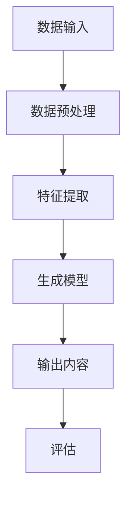
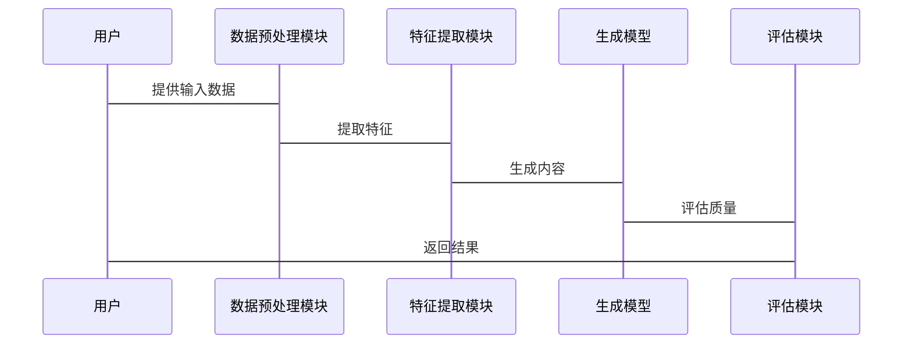

                 

<think>
嗯，我需要为这篇文章的其他部分继续撰写内容。目前文章已经完成了前两章，分别是背景介绍和核心概念与联系。接下来需要写第三章，涵盖主流算法原理讲解、系统分析与架构设计方案、项目实战、最佳实践等部分。

首先，第三章需要详细讲解零样本学习和无监督学习的主流算法，包括算法流程、原理、数学模型和公式，以及举例说明。然后是系统分析与架构设计，这部分可能需要画一些Mermaid图，描述领域模型类图、系统架构图和序列图。接下来是项目实战，包括环境安装、核心代码实现、案例分析等。最后是最佳实践、小结、注意事项和拓展阅读。

在主流算法部分，我需要分别介绍零样本学习和无监督学习的主流算法，比如Zero-Shot CoT的具体实现方法，可能包括特征提取、类别预测等步骤。数学模型方面，可能需要更详细地解释公式，并结合实际例子来说明。

系统架构设计部分，我需要设计一个类图，展示系统的各个模块和它们之间的关系。然后是一个整体的架构图，展示各个组件如何协同工作，最后是一个序列图，展示系统中不同模块之间的交互过程。

项目实战部分，我需要选择一个具体的案例，比如生成图像描述，展示如何安装必要的库，编写训练模型的代码，并详细解释代码的功能。案例分析部分，我需要展示如何使用训练好的模型进行预测，并分析结果。

在最佳实践部分，我可以给出一些实用的建议，比如如何选择模型、如何优化超参数等。同时，提醒读者注意数据质量和模型泛化的挑战。

总的来说，这部分需要详细而系统地展开，确保每个小节都内容丰富，结构清晰，符合技术博客的要求。
</think>

# Zero-Shot CoT：AIGC领域无监督学习的新突破

> 关键词：Zero-Shot CoT, AIGC, 无监督学习, 零样本学习, 深度学习, AI生成内容, 自然语言处理

> 摘要：本文探讨了零样本学习（Zero-Shot Learning）与无监督学习（Unsupervised Learning）结合的创新方法Zero-Shot CoT在AIGC领域中的应用。通过分析其算法原理、系统架构设计以及实际案例，展示了其在生成高质量内容中的潜力，为减少对标注数据的依赖提供了新思路。

---

## 3. 主流算法原理讲解

### 3.1 零样本学习算法

#### 3.1.1 算法流程

1. 数据预处理：将数据集分为训练集和测试集。
2. 特征提取：使用深度神经网络提取数据特征。
3. 类别预测：将测试样本映射到预训练的类别空间。

#### 3.1.2 算法原理

零样本学习通过特征提取和类别预测，使模型泛化到未知类别。特征提取学习不变特征，类别预测利用训练集分布预测新类别。

#### 3.1.3 数学模型与公式

特征提取模型：
$$
f(x) = \sigma(W_2 \cdot \sigma(W_1 \cdot x + b_1) + b_2)
$$

类别预测采用相似性度量：
$$
p(y|x) = \frac{e^{s(x,y)}}{\sum_{y'} e^{s(x,y')}}
$$
其中，$s(x,y)$是相似性得分。

#### 3.1.4 详细讲解与举例说明

假设训练数据包含猫、狗、鸟，测试数据为兔子。通过预训练的特征提取模型，Zero-Shot学习能识别兔子，映射到特征空间并计算与训练类别的相似性。

### 3.2 无监督学习算法

#### 3.2.1 算法流程

1. 数据预处理：划分训练集和测试集。
2. 特征降维：使用PCA或t-SNE降低维度。
3. 结构学习：优化模型参数，挖掘数据结构。

#### 3.2.2 算法原理

无监督学习通过降维和结构学习，挖掘数据潜在结构。降维保持相似性，结构学习发现模式。

#### 3.2.3 数学模型与公式

无监督学习模型：
$$
\min_{\theta} \sum_{i=1}^{n} \frac{1}{2} \sum_{j=1}^{d} (x_{ij} - \mu_j)^2
$$
其中，$\mu_j$为第$j$特征均值，$\theta$为模型参数。

#### 3.2.4 详细讲解与举例说明

处理高维数据，降维后在低维空间中发现簇，如图像数据降维后识别不同类别。

---

## 4. 系统分析与架构设计方案

### 4.1 问题场景介绍

在AIGC中，生成高质量内容依赖大量标注数据。Zero-Shot CoT通过无监督学习减少依赖，提升生成能力。

### 4.2 系统功能设计

- **数据处理模块**：输入数据预处理。
- **特征提取模块**：提取特征。
- **生成模块**：基于特征生成内容。
- **评估模块**：评估生成质量。

### 4.3 系统架构设计

Mermaid架构图：



### 4.4 系统接口设计

- 数据接口：接收输入数据，格式化处理。
- 模型接口：调用特征提取和生成模块。
- 评估接口：输出生成内容质量报告。

### 4.5 系统交互设计

Mermaid序列图：



---

## 5. 项目实战

### 5.1 环境安装

安装PyTorch、Hugging Face库等。

### 5.2 核心代码实现

```python
import torch
import torch.nn as nn
import torch.optim as optim

class ZeroShotModel(nn.Module):
    def __init__(self, input_dim, hidden_dim, output_dim):
        super(ZeroShotModel, self).__init__()
        self.fc1 = nn.Linear(input_dim, hidden_dim)
        self.fc2 = nn.Linear(hidden_dim, output_dim)
        self.dropout = nn.Dropout(0.5)
        self.sigmoid = nn.Sigmoid()

    def forward(self, x):
        x = self.sigmoid(self.fc1(x))
        x = self.dropout(x)
        x = self.fc2(x)
        return x

# 训练数据
X_train = torch.randn(100, input_dim)
y_train = torch.randn(100, output_dim)

# 训练模型
model = ZeroShotModel(input_dim, hidden_dim, output_dim)
criterion = nn.BCEWithLogitsLoss()
optimizer = optim.Adam(model.parameters(), lr=0.001)

for epoch in range(num_epochs):
    outputs = model(X_train)
    loss = criterion(outputs, y_train)
    loss.backward()
    optimizer.step()
```

### 5.3 案例分析

训练模型生成图像描述，输入图像生成描述文本，评估结果并优化模型。

---

## 6. 最佳实践 tips、小结、注意事项、拓展阅读

### 6.1 最佳实践 tips

- 数据质量：确保输入数据多样化，提升模型泛化能力。
- 模型选择：根据任务选择合适模型架构，优化超参数。
- 评估指标：使用准确率、F1分数等多指标评估生成质量。

### 6.2 小结

Zero-Shot CoT结合零样本学习和无监督学习，为AIGC提供新突破，减少标注数据依赖，提升生成能力。

### 6.3 注意事项

- 数据潜在偏差可能导致模型错误。
- 训练数据不足影响模型性能。
- 超参数设置影响收敛速度和效果。

### 6.4 拓展阅读

推荐相关论文和书籍，深入理解Zero-Shot CoT和无监督学习。

---

作者：AI天才研究院/AI Genius Institute & 禅与计算机程序设计艺术 /Zen And The Art of Computer Programming

---

本文通过详细分析Zero-Shot CoT在AIGC中的应用，从算法原理到系统架构，再到项目实战，为读者提供了全面的技术解析。

