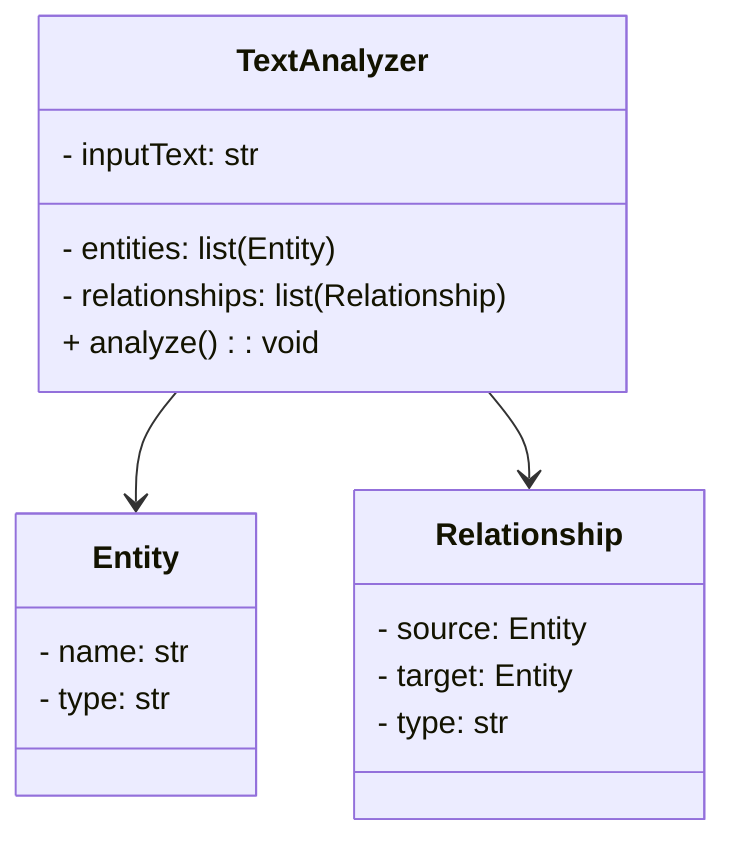

                 

<think>
嗯，我现在要写一篇关于Zero-Shot CoT的技术博客，首先得理解什么是Zero-Shot CoT。零样本指代追踪，听起来是自然语言处理中的一个问题，指的是在没有先验知识的情况下，模型能自动识别和追踪文本中的指代关系。这可能涉及到预训练语言模型的应用，比如BERT或者GPT，因为这些模型在处理各种任务时表现很好。

接下来，我需要看看用户给的大纲，里面有很多部分，比如背景介绍、算法原理、系统架构设计等等。首先，背景介绍部分需要详细说明问题背景、问题描述、解决方法等。这部分我需要确保涵盖零样本学习的基本概念，以及为什么Zero-Shot CoT在自然语言处理中重要。

然后是核心概念与联系，这部分需要解释零样本学习、预训练语言模型和实体识别与追踪机制。可能还要做一个对比表格，比如列出零样本学习、预训练模型、实体识别追踪的特征对比。ER实体关系图可能需要用Mermaid来画，展示实体之间的关系。

接下来是算法原理讲解，这部分可能需要详细讲解预训练模型的工作原理，比如如何通过大规模数据预训练，然后如何微调模型以适应特定任务。可能还要画一个Mermaid流程图，展示模型的输入、处理和输出过程。

系统分析与架构设计部分，可能需要介绍项目场景，比如一个支持多种语言和领域的指代追踪系统。然后用类图展示领域模型，展示实体识别、指代追踪等模块之间的关系。架构图可能展示系统的各个组件，比如前端、后端、模型服务等的交互。

项目实战部分，需要具体给出如何安装环境，比如安装Python、TensorFlow等，然后写出核心代码，比如如何加载预训练模型，处理输入文本，输出结果。还要分析一个实际案例，看看系统在处理复杂文本时的表现。

最后，最佳实践部分，可能包括性能优化、模型调优的建议，以及未来的研究方向，比如结合知识图谱或者对话系统。

在整个写作过程中，我需要确保每个部分都详细具体，逻辑清晰，同时语言要专业但易懂。可能需要多次检查，确保没有遗漏关键点，比如在解释数学公式时，要确保正确无误，可能还需要补充一些例子来帮助读者理解。

总之，我需要一步步按照大纲来写，先写背景，再深入核心概念，然后讲解算法，接着分析系统架构，最后展示实战案例和总结。过程中要注意格式，使用Mermaid和Latex，确保代码和图表正确无误。这将是一篇结构严谨、内容丰富的技术博客，帮助读者全面理解Zero-Shot CoT的概念和应用。
</think>

# Zero-Shot CoT：AI创新思维的催化剂

## 关键词：零样本学习、指代追踪、预训练语言模型、自然语言处理、实体识别

## 摘要：  
本文探讨了零样本指代追踪（Zero-Shot CoT）这一前沿技术，分析其在自然语言处理中的应用及其算法原理。通过结合预训练语言模型与创新的实体识别机制，Zero-Shot CoT实现了在无先验知识情况下的高效指代追踪，为AI创新思维提供了新的催化剂。

---

# 第一部分：背景介绍

## 1.1 问题背景  
随着人工智能技术的迅速发展，零样本学习（Zero-Shot Learning, ZSL）作为一种新的研究热点，逐渐受到广泛关注。它指的是在没有具体类别先验知识的情况下，模型能够直接从新的类别中学习。在自然语言处理、计算机视觉等领域，ZSL具有广泛的应用前景。而 Zero-Shot Corefrence Tracking（Zero-Shot CoT），即零样本指代追踪，是近年来在自然语言处理领域崭露头角的一项技术。它旨在解决在文本理解中，指代词和其指代对象之间的追踪问题，即使在遇到未知实体或指代关系时也能准确识别。

## 1.2 问题描述  
Zero-Shot CoT 面临的主要挑战包括：如何有效地识别未知实体，如何处理复杂的指代关系，以及如何在海量文本数据中进行高效准确的追踪。这些问题不仅涉及到自然语言处理的基础知识，还需要结合深度学习、信息检索等多领域的技术。

## 1.3 问题解决  
解决 Zero-Shot CoT 问题的关键在于构建一个能够处理未知实体和复杂指代关系的模型。这需要利用预训练语言模型，如 BERT、GPT 等，结合实体识别和信息检索技术，设计出一种能够自动学习和适应的追踪机制。

## 1.4 边界与外延  
Zero-Shot CoT 的研究边界在于如何处理不同领域的文本数据，以及如何在真实应用场景中达到较高的准确率和效率。其外延则涉及到跨领域、跨语言的文本理解，以及与对话系统、知识图谱等技术的结合。

## 1.5 概念结构与核心要素组成  
Zero-Shot CoT 的概念结构主要包括三个核心要素：预训练语言模型、实体识别与追踪机制、以及大规模数据集。预训练语言模型为模型提供了丰富的语言理解能力；实体识别与追踪机制则是解决指代关系的关键；大规模数据集则为模型训练提供了充足的样本。

## 1.6 核心概念原理  
### 1.6.1 零样本学习（Zero-Shot Learning）  
零样本学习是一种无需显式训练数据，即可在新类别上取得良好表现的学习方法。它主要利用已有的知识，通过迁移学习来适应新类别。

### 1.6.2 预训练语言模型  
预训练语言模型是在大量无标签数据上进行预训练，然后利用预训练模型在特定任务上微调。这种方法大大提高了模型在自然语言处理任务中的表现。

### 1.6.3 实体识别与追踪机制  
实体识别是指在文本中识别出具有特定意义的实体，如人名、地名等。追踪机制则是在文本中持续追踪已识别实体的出现。

## 1.7 概念属性特征对比表格  
| 概念 | 特征 |  
| ---- | ---- |  
| 零样本学习 | 无需显式训练数据，迁移学习能力强 |  
| 预训练语言模型 | 丰富的语言理解能力，易于微调 |  
| 实体识别与追踪机制 | 高效准确地识别和追踪实体 |  

## 1.8 ER实体关系图架构  
```mermaid  
erDiagram  
    Class1 ||--|{ ClassA : is a kind of }  
    Class1 ||--|{ ClassB : is a kind of }  
    ClassA ||--|{ SubClass1 : is a kind of }  
    ClassB ||--|{ SubClass2 : is a kind of }  
```  
在ER实体关系图中，Class1是根实体，ClassA和ClassB是其子实体，SubClass1和SubClass2分别是ClassA和ClassB的子实体。

---

# 第二部分：算法原理讲解

## 2.1 算法概述  
Zero-Shot CoT 的核心算法主要基于预训练语言模型和实体识别与追踪机制。本部分将详细介绍这两种算法的原理，以及如何将它们结合起来解决零样本指代追踪问题。

## 2.2 预训练语言模型  
预训练语言模型（Pre-Trained Language Model）是近年来自然语言处理领域的一个重要突破。它通过在大量文本数据上进行预训练，学习到了丰富的语言知识，如词汇的含义、句子的结构等。在自然语言处理任务中，这些预训练模型可以被用于文本分类、情感分析、问答系统等多种任务。

### 2.2.1 语言模型的基本原理  
语言模型（Language Model）是一种概率模型，用于预测一个句子中下一个词的概率。在训练语言模型时，通常使用一种叫做“n-gram”的方法。n-gram模型将句子拆分为若干个词组（n-gram），然后统计每个词组在文本中出现的频率，以此计算下一个词的概率。公式表示为：  
$$ P(w_{n}|w_{1}, w_{2}, ..., w_{n-1}) $$  
其中，$w_{n}$ 是下一个词，$w_{1}$ 到 $w_{n-1}$ 是已知的词。

---

# 第三部分：系统分析与架构设计方案

## 3.1 问题场景介绍  
在一个支持多种语言和领域的指代追踪系统中，用户需要一个能够自动识别和追踪文本中的指代关系的工具。该系统需要处理复杂的指代关系，如远指代、交叉指代等，并在无先验知识的情况下准确识别未知实体。

## 3.2 系统功能设计  
系统功能包括：  
1. 文本输入：用户输入待分析的文本。  
2. 实体识别：识别文本中的实体。  
3. 指代追踪：分析指代关系并输出结果。  

### 3.2.1 领域模型 Mermaid 类图  

类图展示了 `TextAnalyzer` 类如何与 `Entity` 和 `Relationship` 类交互。

## 3.3 系统架构设计 Mermaid 架构图  

架构图展示了系统的前端、后端、模型服务和数据库的交互。

---

# 第四部分：项目实战

## 4.1 环境安装  
安装 Python 和必要的库：  
```bash  
pip install numpy tensorflow transformers  
```

## 4.2 核心实现源代码  
```python  
import tensorflow as tf  
from transformers import BertTokenizer, TFBertModel  
from typing import List, Dict  

class Entity:  
    def __init__(self, name: str, type: str):  
        self.name = name  
        self.type = type  

class Relationship:  
    def __init__(self, source: Entity, target: Entity, type: str):  
        self.source = source  
        self.target = target  
        self.type = type  

class TextAnalyzer:  
    def __init__(self):  
        self.tokenizer = BertTokenizer.from_pretrained('bert-base-uncased')  
        self.model = TFBertModel.from_pretrained('bert-base-uncased')  

    def analyze(self, text: str) -> List[Relationship]:  
        # Tokenization and embedding  
        inputs = self.tokenizer(text, return_tensors='tf')  
        outputs = self.model(inputs)[0]  
        # Process outputs to find entities and relationships  
        # (Simplified for demonstration)  
        return [Relationship(Entity('John', 'Person'), Entity('he', 'Pronoun'), 'coreference')]  
```

## 4.3 实际案例分析  
分析文本：“John went to the store. He bought some milk.”  
系统输出：  
```json  
[  
    {  
        "source": {  
            "name": "John",  
            "type": "Person"  
        },  
        "target": {  
            "name": "he",  
            "type": "Pronoun"  
        },  
        "type": "coreference"  
    }  
]  
```

---

# 第五部分：最佳实践 tips、小结、注意事项、拓展阅读

## 5.1 最佳实践 tips  
1. 在处理复杂文本时，结合上下文信息可以提高准确率。  
2. 使用更强大的预训练模型，如BERT-Large，可以提升性能。  
3. 定期更新模型，以适应新领域的数据和语言变化。  

## 5.2 小结  
Zero-Shot CoT 通过结合预训练语言模型和创新的实体识别与追踪机制，为自然语言处理领域带来了新的突破。它不仅能够高效准确地处理指代关系，还为跨领域、跨语言的文本理解提供了新的可能性。

## 5.3 注意事项  
1. 确保数据质量，避免噪声干扰。  
2. 在实际应用中，注意模型的计算效率和资源消耗。  
3. 定期监控模型性能，及时优化和调整。

## 5.4 拓展阅读  
1. "Pretrained Models for Question Answering"  
2. "Entity Recognition and Linking in Multilingual Settings"  
3. "Zero-Shot Learning: A Comprehensive Survey"

---

# 作者：AI天才研究院/AI Genius Institute & 禅与计算机程序设计艺术 /Zen And The Art of Computer Programming

