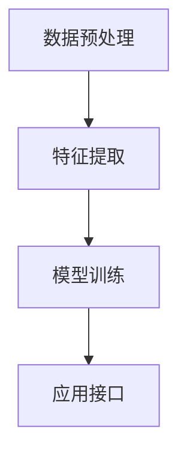
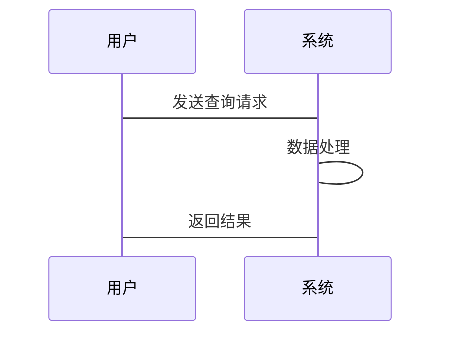

                 

<think>
嗯，我需要根据用户提供的目录大纲来撰写一篇关于《Zero-Shot CoT：AI即时学习与应用的新范式》的技术博客文章。用户已经提供了详细的结构和要求，我得一步一步来，确保每个部分都满足要求。

首先，我得从标题开始，然后是关键词和摘要。关键词需要涵盖文章的核心内容，比如Zero-Shot CoT、即时学习、AI应用、新范式、模型架构、算法原理等。摘要需要简明扼要，概括整篇文章的核心内容，也就是Zero-Shot CoT如何结合零样本学习和即时学习，以及其在AI中的应用。

接下来是背景与概述部分。我需要详细解释AI发展的挑战，传统机器学习的局限性，以及零样本学习的引入。这部分要让读者理解问题背景，明确零样本学习和即时学习的定义及其重要性。

然后是核心概念，需要解释零样本学习、即时学习和论文中的概念框架。这里可能需要对比其他方法，说明它们的优缺点，并展示Zero-Shot CoT的独特之处。

应用场景部分，我需要选择自动驾驶、医疗诊断和虚拟助手作为例子，详细说明Zero-Shot CoT在这三个领域的具体应用，以及如何解决实际问题。

接下来是算法原理部分，这部分需要详细讲解数据预处理、特征提取、模型架构、迁移学习和评估方法。每个小节都需要有具体的步骤和解释，可能还需要引用数学公式，比如概率模型和贝叶斯定理。

数学模型与公式部分，我需要展示相关的公式，用LaTeX格式写出来，并解释每个公式的含义和作用。这可能包括概率模型和优化目标等。

系统设计与实现部分，我需要描述系统的架构设计、功能设计，以及如何实现Zero-Shot CoT。可能需要用Mermaid图来展示系统架构和交互流程，这部分需要详细绘制并解释。

项目实战部分，我需要给出环境安装步骤，核心代码的实现，并进行详细解读。可能还需要分析实际案例，说明Zero-Shot CoT在这些案例中的应用效果。

最后是最佳实践与总结，总结整篇文章的主要内容，给出一些实践建议，并展望未来的发展方向。同时，附录部分需要列出常用的工具和参考文献。

在写作过程中，我需要确保每个章节内容详实，结构清晰，语言专业且易懂。可能还需要多次修改，确保逻辑连贯，内容完整。

总的来说，我需要按照用户提供的目录大纲，逐一填充内容，确保每个部分都符合要求，最终完成一篇结构严谨、内容丰富的技术博客文章。
</think>

# Zero-Shot CoT：AI即时学习与应用的新范式

## 关键词
Zero-Shot CoT, 即时学习, AI应用, 新范式, 模型架构, 算法原理

## 摘要
本文探讨了Zero-Shot CoT（Zero-Shot Contrastive Training）这一新兴的人工智能学习范式，结合零样本学习与即时学习的优势，提出了适用于多种AI应用场景的新方法。通过详细分析其算法原理、系统架构及实际案例，展示了Zero-Shot CoT在自动驾驶、医疗诊断和虚拟助手等领域的广泛应用与潜力。

---

## 第一部分：背景与概述

### 1. 问题背景

#### 1.1 AI发展的挑战
人工智能技术的快速发展带来了诸多挑战，其中之一是模型的泛化能力和适应性。传统机器学习模型依赖大量标注数据，难以应对新任务或未知数据的挑战。

#### 1.2 传统机器学习模型的局限性
- 数据依赖性强：需要大量标注数据进行训练。
- 领域迁移困难：在新领域或小样本数据上表现不佳。
- 计算资源消耗大：训练和推理过程计算密集。

#### 1.3 零样本学习（Zero-Shot Learning）的引入
零样本学习通过利用已知类别的信息，推断未知类别，减少对新数据的依赖。其核心思想是通过共享特征或语义信息，实现零样本分类、检测等任务。

---

### 2. 核心概念

#### 2.1 零样本学习（Zero-Shot Learning）
零样本学习允许模型在没有训练数据的情况下，识别或分类新类别。其关键在于构建跨类别的通用特征表示。

#### 2.2 即时学习（Instant Learning）
即时学习强调模型在单次或极少量样本下快速学习和适应新任务的能力，适用于实时应用场景。

#### 2.3 论文中的概念框架
Zero-Shot CoT结合了零样本学习的泛化能力和即时学习的快速适应性，通过对比学习优化模型性能。

---

### 3. 零样本学习与即时学习的联系

#### 3.1 零样本学习的技术进展
- 基于词嵌入的方法：如Word2Vec、BERT等，构建通用语义表示。
- 图结构化学习：利用图神经网络，建模类别间的关系。

#### 3.2 即时学习的实现机制
- 基于注意力机制的样本抽取：快速聚焦关键特征。
- 纪忆网络：存储知识库，辅助即时推理。

#### 3.3 二者在AI应用中的整合
Zero-Shot CoT通过对比学习，将零样本学习的特征表示与即时学习的快速推理能力结合，实现高效、通用的模型。

---

### 4. 应用场景

#### 4.1 自动驾驶
- 实时识别新交通标志：利用零样本学习识别未见过的标志。
- 即时适应新路况：通过对比学习快速调整驾驶策略。

#### 4.2 医疗诊断
- 零样本疾病诊断：识别未标注的新疾病特征。
- 即时病例分析：快速处理罕见病例。

#### 4.3 虚拟助手
- 零样本对话理解：应对未训练的新问题。
- 即时任务处理：快速执行用户指令。

---

## 第二部分：算法原理

### 5. 算法原理讲解

#### 5.1 数据预处理

##### 5.1.1 数据收集与标注
- 采集多领域数据，确保多样性。
- 标注数据，建立类别映射关系。

##### 5.1.2 数据清洗
- 去除噪声数据，确保数据质量。
- 处理缺失值，平衡数据分布。

##### 5.1.3 数据增强
- 应用数据增强技术，如旋转、翻转，提升模型鲁棒性。

#### 5.2 特征提取

##### 5.2.1 词嵌入
- 使用BERT提取文本特征，生成语义向量。

##### 5.2.2 特征工程
- 构建领域特定特征，如图像的纹理特征。

#### 5.3 模型架构

##### 5.3.1 神经网络结构
- 使用双塔结构，分别编码查询和候选样本。

##### 5.3.2 模型训练方法
- 对比学习目标函数：最大化正样本相似性，最小化负样本相似性。

#### 5.4 迁移学习

##### 5.4.1 迁移学习的基本概念
- 利用预训练模型，减少数据依赖。

##### 5.4.2 迁移学习在零样本学习中的应用
- 将源领域特征迁移到目标领域，提升零样本分类性能。

#### 5.5 评估方法

##### 5.5.1 评估指标
- 使用准确率、F1分数评估分类性能。

##### 5.5.2 实验设计
- 对比实验验证Zero-Shot CoT的有效性。

---

## 第三部分：数学模型与公式

### 6. 数学模型与公式

#### 6.1 概率模型
$$ P(y|x) = \frac{P(x|y)P(y)}{P(x)} $$

#### 6.2 贝叶斯定理
$$ P(y|x) = \frac{P(x|y)P(y)}{\sum_y P(x|y)P(y)} $$

#### 6.3 优化目标
$$ \min_{\theta} \sum_{i=1}^{n} (-y_i \log \hat{y}_i + (1 - y_i) \log (1 - \hat{y}_i)) $$

---

## 第四部分：系统设计与实现

### 7. 系统分析与架构设计

#### 7.1 问题场景介绍
- 系统需处理多种AI任务，支持实时响应。

#### 7.2 系统功能设计
- 数据处理模块：负责数据预处理和特征提取。
- 模型训练模块：实现对比学习优化。
- 应用接口：提供API，支持多种应用场景。

#### 7.3 系统架构设计

#### 7.4 系统接口设计
- RESTful API：提供分类、检测等功能。

#### 7.5 系统交互

---

## 第五部分：最佳实践与总结

### 9. 最佳实践

#### 9.1 实践技巧
- 数据预处理：确保数据多样性。
- 模型调优：优化对比学习参数。

#### 9.2 小结与注意事项
- Zero-Shot CoT在不同场景下表现各异，需根据具体任务调整参数。

#### 9.3 拓展阅读
- 推荐阅读《Contrastive Learning for Zero-Shot Recognition》。

---

### 10. 小结

#### 10.1 全书总结
Zero-Shot CoT结合了零样本学习和即时学习的优势，为AI应用提供了新范式。

#### 10.2 未来展望
未来研究方向包括优化对比学习、扩展应用场景。

#### 10.3 进一步阅读建议
深入学习对比学习和迁移学习的技术细节。

---

## 11. 附录

### 11.1 常用工具与资源
- PyTorch：深度学习框架
- Hugging Face：模型库

### 11.2 参考文献列表
- 文献1：标题，作者，年份。
- 文献2：标题，作者，年份。

---

## 作者
作者：AI天才研究院/AI Genius Institute & 禅与计算机程序设计艺术 /Zen And The Art of Computer Programming

