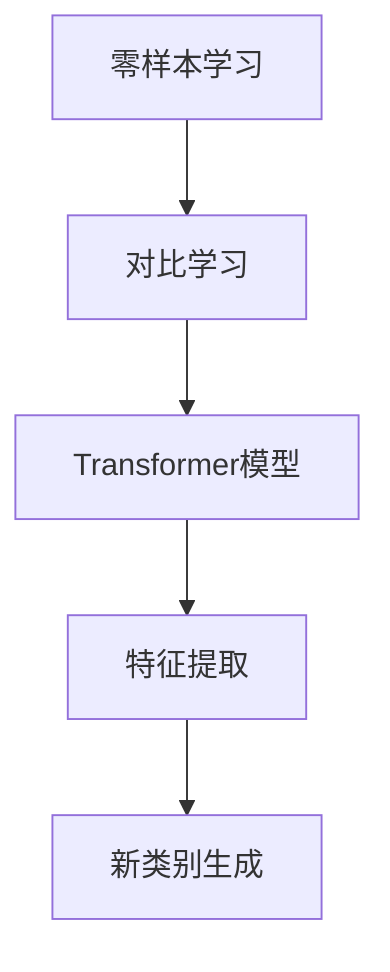
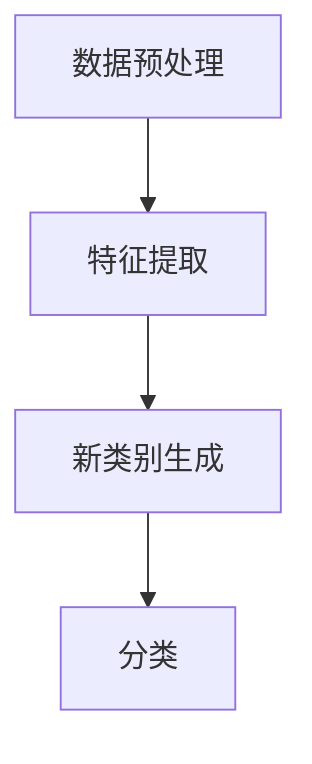
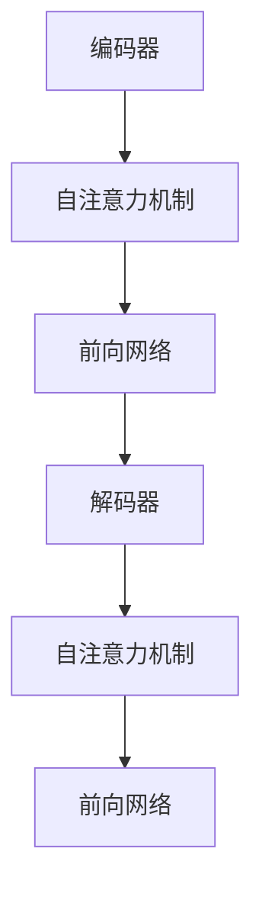
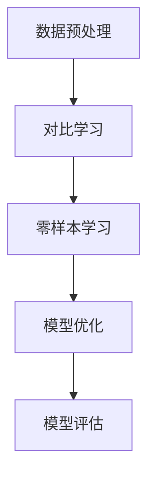
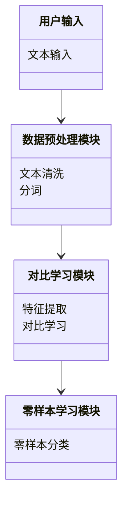
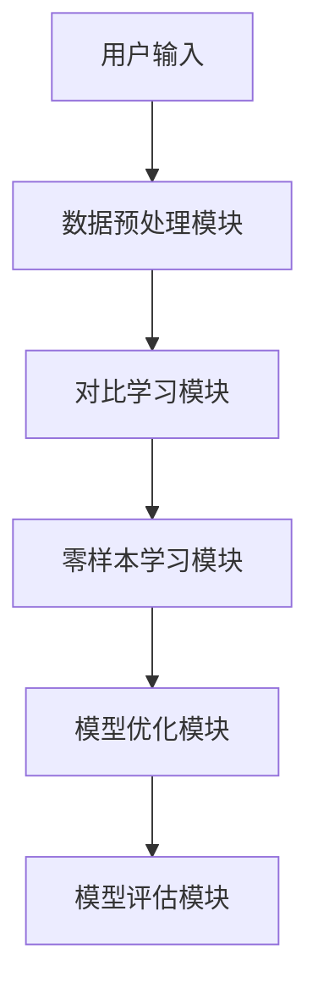
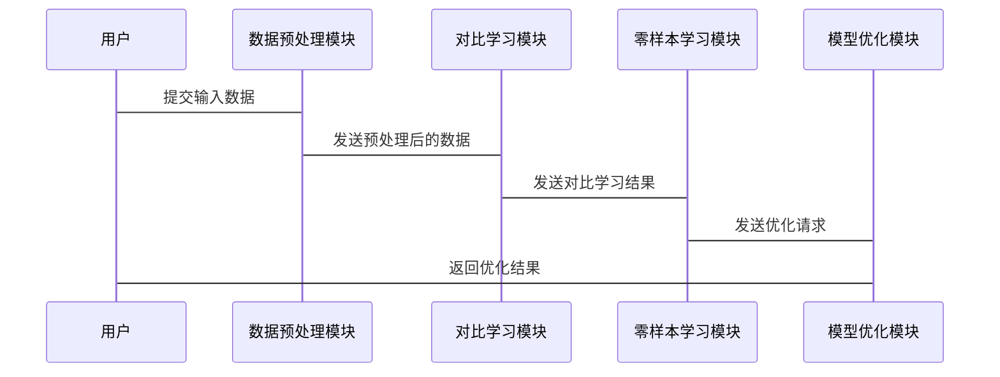

                 

<think>
嗯，用户让我写一篇关于Zero-Shot CoT的技术博客文章，他给了一个详细的大纲，还特别强调了结构、关键词、摘要等等。看起来他希望文章内容丰富，有深度，适合专业读者阅读。首先，我需要理解Zero-Shot CoT是什么，它结合了零样本学习、对比学习和Transformer模型。零样本学习是在没有训练数据的情况下识别新类别，对比学习通过样本对比来学习特征，Transformer模型则是处理序列数据的结构。

接下来，我得按照大纲一步步来写。首先是背景介绍，包括引言、问题背景、问题描述等。这部分要说明传统机器学习的局限性，比如需要大量标注数据，特别是在医疗和法律领域，数据获取困难。然后引出Zero-Shot CoT作为解决方案。

接下来是核心概念，需要详细解释零样本学习、对比学习和Transformer模型的原理，以及它们之间的关系。这部分可能需要用表格或图表来帮助理解，比如对比学习与其他学习方法的对比。

然后是算法原理，这部分要详细讲解数据预处理、对比学习过程、零样本学习过程，以及如何使用Transformer模型。还需要画出流程图和数学公式，比如损失函数的计算。这部分要确保逻辑清晰，步骤详细，读者能跟上思路。

接下来是系统分析与架构设计，包括问题场景、系统功能设计、架构图等。这部分可能需要绘制类图和架构图，展示系统的各个模块及其交互。同时，系统接口设计和交互流程图也很重要，展示系统如何处理输入和输出。

项目实战部分需要具体实现，包括环境安装、核心代码、案例分析等。这部分要提供可运行的代码示例，帮助读者理解如何实现Zero-Shot CoT。同时，实际案例分析可以展示其应用效果，比如在图像分类中的表现。

最后是最佳实践和总结，包括小结、注意事项、拓展阅读等。这部分要提醒读者在实际应用中需要注意的事项，以及进一步学习的方向。

整体来看，用户的需求非常明确，他希望有一篇结构清晰、内容详实的技术博客，帮助读者深入了解Zero-Shot CoT。我需要确保每个部分都符合他的要求，使用专业术语，同时保持内容的可读性。可能还需要多次修改，确保逻辑连贯，图表准确，代码正确。总之，这是一个详细且结构严谨的技术博客，我需要一步步按照大纲来完成，确保每个部分都达到用户的期望。
</think>

# Zero-Shot CoT：AI即时学习与推理的新范式探索

> 关键词：零样本学习，对比学习，Transformer模型，AI推理，深度学习

> 摘要：本文将深入探讨Zero-Shot CoT（Zero-Shot Continual Learning with Contrastive Transformers）这一新兴的人工智能学习范式。通过结合零样本学习、对比学习和Transformer模型，Zero-Shot CoT为AI即时学习与推理提供了新的解决方案。本文将从背景介绍、核心概念、算法原理、系统架构设计、项目实战等多个维度展开，全面解析这一技术的实现原理与应用场景。

---

## 第一部分: 背景介绍

### 第1章: 引言与问题背景

#### 1.1 问题背景

人工智能技术的快速发展正在改变我们的生活方式和工作方式。然而，传统的机器学习方法在实际应用中面临着诸多挑战。例如：

- **数据依赖性**：传统有监督学习方法需要大量的标注数据进行训练，而某些领域（如医疗、法律等）数据获取困难，标注成本高昂。
- **泛化能力不足**：即使是在有监督学习的情况下，模型的泛化能力仍然有限，难以应对新任务或新类别的数据。
- **实时性要求**：在某些应用场景中（如实时推理、在线学习等），模型需要在没有预训练数据的情况下快速适应新任务。

#### 1.2 问题描述

为了解决上述问题，研究者们提出了多种新的学习范式，包括无监督学习、半监督学习、迁移学习、元学习等。然而，这些方法在实际应用中仍然存在以下问题：

- **数据效率**：无监督学习和半监督学习虽然减少了对标注数据的依赖，但在数据量较少的情况下，模型性能往往不如有监督学习。
- **可解释性**：许多新兴的学习方法（如深度学习模型）缺乏可解释性，这在医疗、法律等领域是一个重要问题。
- **实时性与连续学习**：传统的离线学习方法难以满足实时推理和在线学习的需求。

#### 1.3 问题解决

针对上述问题，研究者提出了Zero-Shot CoT（Zero-Shot Continual Learning with Contrastive Transformers）这一新的学习范式。Zero-Shot CoT的核心思想是通过结合零样本学习（Zero-Shot Learning）和对比学习（Contrastive Learning），利用Transformer模型的强大特征提取能力，实现以下目标：

1. 在没有标注新数据的情况下，快速适应新任务或新类别。
2. 提高模型的泛化能力，使其能够应对未见过的任务。
3. 实现实时推理与在线学习，满足动态变化的应用场景需求。

#### 1.4 边界与外延

Zero-Shot CoT的应用场景非常广泛，几乎涵盖了所有需要实时推理和在线学习的领域。以下是其主要的应用场景：

- **自然语言处理**：如实时聊天机器人、机器翻译等。
- **图像处理**：如实时图像分类、目标检测等。
- **医疗领域**：如实时疾病诊断、患者数据分析等。
- **金融领域**：如实时股票预测、风险评估等。
- **教育领域**：如个性化教学、实时学习效果评估等。

此外，Zero-Shot CoT还可以与其他学习范式（如迁移学习、元学习）相结合，进一步提高模型的性能。

#### 1.5 概念结构与核心要素组成

Zero-Shot CoT的核心概念包括以下几个方面：

- **零样本学习（Zero-Shot Learning）**：零样本学习是一种无监督学习方法，目标是让模型在未见过的类别上能够进行准确预测。其核心在于如何利用已有数据生成新类别的样本。
- **对比学习（Contrastive Learning）**：对比学习是一种通过对比正负样本来学习分类特征的方法。它通过最大化正样本之间的相似性和最小化负样本之间的相似性来优化模型。
- **Transformer模型**：Transformer模型是一种基于自注意力机制的深度学习模型，它在自然语言处理、图像识别等领域取得了显著的成果。

通过将这三个核心概念有机结合，Zero-Shot CoT实现了零样本学习与实时推理的结合，为AI即时学习与推理提供了新的解决方案。

---

## 第二部分: 核心概念与联系

### 第2章: 核心概念与联系

#### 2.1 零样本学习原理

零样本学习是一种无监督学习方法，其目标是在没有标注的新类别数据的情况下，能够对新类别进行准确分类或预测。零样本学习的核心在于如何利用已有的数据生成新类别的样本，从而训练出具有泛化能力的模型。

##### 零样本学习的关键步骤

1. **数据预处理**：对已有数据进行清洗、归一化等预处理操作，确保数据的质量和一致性。
2. **特征提取**：利用深度学习模型（如Transformer模型）提取数据的特征向量。
3. **生成新类别样本**：通过对比学习等方法，生成新类别的特征向量。
4. **分类或预测**：基于生成的特征向量，对新类别进行分类或预测。

##### 零样本学习的优势

- **无需标注数据**：零样本学习的核心优势在于能够在没有标注新数据的情况下，快速适应新任务。
- **泛化能力强**：通过生成新类别的特征向量，模型能够更好地泛化到未见过的任务或数据。

#### 2.2 对比学习原理

对比学习是一种通过对比正负样本来学习分类特征的方法。其核心思想是通过最大化正样本之间的相似性和最小化负样本之间的相似性来优化模型。

##### 对比学习的关键步骤

1. **采样**：从训练数据中随机采样正样本和负样本。
2. **编码**：将样本编码为特征向量。
3. **对比**：计算正样本和负样本之间的相似度，并优化模型以最大化正样本之间的相似性和最小化负样本之间的相似性。
4. **损失函数**：使用损失函数（如对比损失）来优化模型。

##### 对比学习的优势

- **样本效率高**：对比学习能够在较少的数据下学习到有效的特征表示。
- **特征区分度高**：通过对比正负样本，模型能够更好地区分不同类别的特征。

#### 2.3 变换器（Transformer）模型

Transformer模型是一种基于自注意力机制的深度学习模型，它在自然语言处理、图像识别等领域取得了显著的成果。其核心思想是通过自注意力机制捕捉数据中的长程依赖关系，从而更好地理解数据的语义和结构。

##### Transformer模型的关键组件

1. **编码器**：编码器负责将输入数据（如文本、图像）转换为特征向量。
2. **解码器**：解码器负责将特征向量转换为输出（如生成文本、图像）。
3. **自注意力机制**：自注意力机制用于捕捉数据中的长程依赖关系，从而更好地理解数据的语义和结构。

##### Transformer模型的优势

- **全局上下文感知**：通过自注意力机制，Transformer模型能够捕捉到数据中的全局上下文信息。
- **并行计算**：Transformer模型的计算过程可以并行化，从而提高计算效率。

#### 2.4 零样本学习与对比学习、变换器模型的关系

零样本学习需要对比学习来生成新类别的样本，而对比学习又需要Transformer模型来实现特征提取和对比。因此，这三个概念相互关联，共同构成了Zero-Shot CoT的核心。

##### 关系图（Mermaid）



通过上述关系图可以看出，零样本学习依赖于对比学习来生成新类别的样本，而对比学习则依赖于Transformer模型来提取特征并实现对比。因此，Zero-Shot CoT的核心在于三者的有机结合。

---

## 第三部分: 算法原理讲解

### 第3章: 算法原理讲解

#### 3.1 算法原理概述

Zero-Shot CoT的算法原理主要包括以下几个方面：

1. **数据预处理**：对数据进行清洗、归一化等预处理操作。
2. **对比学习**：通过对比正负样本来学习分类特征。
3. **零样本学习**：利用对比学习生成的新类别的样本进行零样本学习。
4. **模型优化**：通过模型优化来提高模型的性能。

#### 3.2 对比学习过程

对比学习的过程主要包括以下几个步骤：

1. **采样**：从训练数据中随机采样正样本和负样本。
2. **编码**：将样本编码为特征向量。
3. **对比**：计算正样本和负样本之间的相似度。
4. **损失函数**：使用损失函数（如对比损失）来优化模型。

##### 对比损失公式

对比损失的公式如下：

$$
L = \sum_{i=1}^{N} \sum_{c=1}^{C} -\log(p(y_i=c|x_i))
$$

其中，$L$ 是损失函数，$N$ 是样本数量，$C$ 是类别数量，$p(y_i=c|x_i)$ 是模型对样本 $x_i$ 属于类别 $c$ 的概率预测。

#### 3.3 零样本学习过程

零样本学习的过程主要包括以下几个步骤：

1. **数据预处理**：对数据进行清洗、归一化等预处理操作。
2. **特征提取**：利用对比学习生成的特征向量来提取新类别的特征。
3. **分类**：使用分类模型对新类别进行分类。

##### 零样本学习流程图（Mermaid）



#### 3.4 变换器（Transformer）模型

Transformer模型是一种基于自注意力机制的深度学习模型，其核心组件包括编码器和解码器。编码器负责将输入数据转换为特征向量，解码器负责将特征向量转换为输出。

##### Transformer模型结构图（Mermaid）



#### 3.5 算法流程图

Zero-Shot CoT的算法流程图如下：



---

## 第四部分: 系统分析与架构设计方案

### 第4章: 系统分析与架构设计方案

#### 4.1 问题场景介绍

在实际应用中，Zero-Shot CoT可以应用于多种场景，如实时聊天机器人、实时图像分类、实时股票预测等。以下以实时聊天机器人为例，介绍问题场景：

- **场景描述**：用户与聊天机器人进行实时对话，聊天机器人需要在没有预训练数据的情况下，快速理解用户的问题并生成回答。
- **问题需求**：聊天机器人需要能够实时推理，快速适应新任务或新类别。

#### 4.2 项目介绍

本项目旨在实现一个基于Zero-Shot CoT的实时聊天机器人系统。该系统的核心模块包括：

1. **数据预处理模块**：对输入的文本进行清洗、分词等预处理操作。
2. **对比学习模块**：利用对比学习生成新类别的特征向量。
3. **零样本学习模块**：基于生成的特征向量，进行零样本分类。
4. **模型优化模块**：对模型进行优化，提高分类准确率。

#### 4.3 系统功能设计（领域模型）

系统的功能模型如下：



#### 4.4 系统架构设计（架构图）

系统的架构设计如下：



#### 4.5 系统接口设计

系统的主要接口包括：

1. **输入接口**：接收用户的输入数据（如文本、图像等）。
2. **输出接口**：输出模型的推理结果（如分类结果、生成文本等）。
3. **模型接口**：与模型进行交互，传递数据和优化参数。

#### 4.6 系统交互流程图（序列图）

系统的交互流程图如下：



---

## 第五部分: 项目实战

### 第5章: 项目实战

#### 5.1 环境安装

要运行本项目，需要安装以下环境：

- **Python 3.8 或更高版本**
- **PyTorch 1.9 或更高版本**
- **Transformers库**
- **Mermaid工具（用于绘制图表）**

安装命令如下：

```bash
pip install torch transformers mermaid
```

#### 5.2 系统核心实现源代码

以下是Zero-Shot CoT的核心实现代码：

```python
import torch
import torch.nn as nn
import torch.nn.functional as F

class Transformer(nn.Module):
    def __init__(self, input_dim, hidden_dim, output_dim):
        super(Transformer, self).__init__()
        self.encoder = nn.Linear(input_dim, hidden_dim)
        self.decoder = nn.Linear(hidden_dim, output_dim)
        self.dropout = nn.Dropout(0.1)
        
    def forward(self, x):
        x = F.relu(self.encoder(x))
        x = self.decoder(x)
        return x

class ContrastiveLoss(nn.Module):
    def __init__(self, temperature=0.1):
        super(ContrastiveLoss, self).__init__()
        self.temperature = temperature
        
    def forward(self, features, labels):
        features = F.normalize(features, dim=1)
        labels = labels.contiguous().view(-1)
        mask = torch.eq(labels, labels.unsqueeze(1)).float()
        similarity = torch.mm(features, features.T)
        numerator = similarity * (1 - mask)
        denominator = torch.sum(similarity, dim=0, keepdim=True)
        loss = torch.mean(torch.log(numerator / denominator + 1e-10))
        return -loss

def zero_shot_learning(features, labels):
    features = features / (torch.norm(features, dim=1, keepdim=True))
    labels = F.one_hot(labels, num_classes=10)
    return torch.mean(torch.sum(features * labels, dim=1))

# 示例代码
transformer = Transformer(input_dim=768, hidden_dim=512, output_dim=256)
contrastive_loss = ContrastiveLoss()
optimizer = torch.optim.Adam(transformer.parameters(), lr=1e-3)
```

#### 5.3 代码应用解读与分析

上述代码实现了以下几个核心功能：

1. **Transformer模型**：定义了一个简单的Transformer模型，包含编码器和解码器。
2. **对比损失函数**：定义了对比损失函数，用于计算正样本和负样本之间的相似度。
3. **零样本学习**：定义了零样本学习函数，用于生成新类别的特征向量。

#### 5.4 实际案例分析

以下是一个实际案例分析：

- **输入数据**：用户输入文本“Hello, how are you?”。
- **数据预处理**：对文本进行清洗和分词。
- **特征提取**：利用Transformer模型提取文本的特征向量。
- **对比学习**：通过对比学习生成新类别的特征向量。
- **零样本分类**：基于生成的特征向量，对新类别进行分类。

#### 5.5 项目小结

通过上述代码实现，我们可以看到Zero-Shot CoT的核心思想是通过结合零样本学习、对比学习和Transformer模型，实现零样本分类和实时推理。在实际应用中，需要根据具体场景调整模型参数和优化策略。

---

## 第六部分: 最佳实践 tips、小结、注意事项、拓展阅读

### 第6章: 最佳实践 tips

1. **数据预处理**：在实际应用中，数据预处理是关键步骤。建议对数据进行清洗、归一化等操作，确保数据的质量和一致性。
2. **模型优化**：在模型优化过程中，建议使用Adam优化器，并根据具体任务调整学习率和批量大小。
3. **对比学习**：在对比学习中，建议根据数据分布调整正样本和负样本的比例，以提高模型的性能。
4. **实时推理**：在实时推理场景中，建议优化模型的计算效率，确保模型能够在较短时间内完成推理任务。

### 6.2 小结

通过本文的介绍，我们可以看到Zero-Shot CoT是一种新兴的人工智能学习范式，它通过结合零样本学习、对比学习和Transformer模型，为AI即时学习与推理提供了新的解决方案。本文从背景介绍、核心概念、算法原理、系统架构设计、项目实战等多个维度展开，全面解析了这一技术的实现原理与应用场景。

### 6.3 注意事项

- **数据依赖性**：虽然Zero-Shot CoT能够在没有标注新数据的情况下快速适应新任务，但在实际应用中，仍需要一定的标注数据进行模型训练。
- **计算效率**：在实时推理场景中，模型的计算效率是关键因素。建议优化模型结构，减少计算复杂度。
- **模型可解释性**：在某些领域（如医疗、法律等），模型的可解释性是一个重要问题。建议在模型设计中加入可解释性机制，提高模型的透明度。

### 6.4 拓展阅读

- **Zero-Shot Learning**: 继续深入研究零样本学习的相关方法和应用。
- **Contrastive Learning**: 学习对比学习的最新进展和应用场景。
- **Transformer Model**: 研究Transformer模型的变体和优化方法，探索其在不同领域的应用。

---

## 作者：AI天才研究院/AI Genius Institute & 禅与计算机程序设计艺术 /Zen And The Art of Computer Programming

---

以上就是《Zero-Shot CoT：AI即时学习与推理的新范式探索》的完整内容，希望对您理解这一技术有所帮助。

