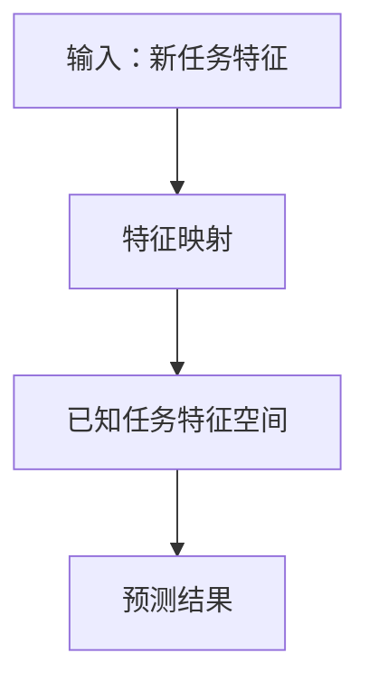
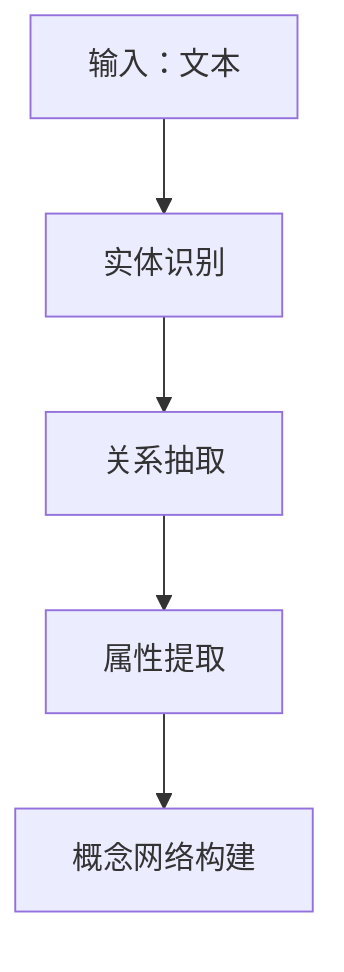
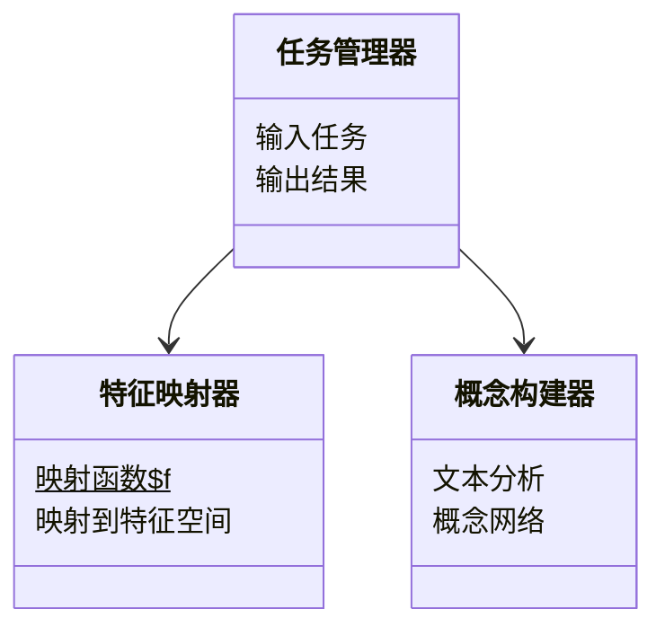
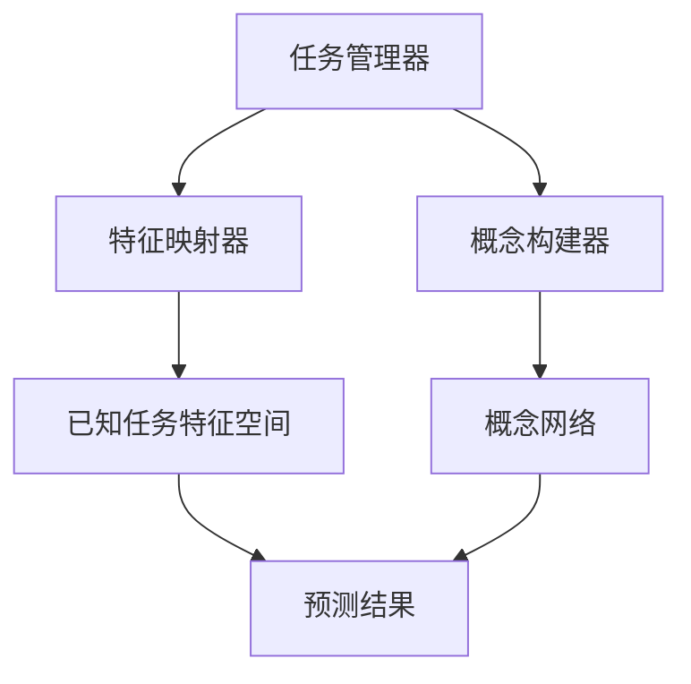
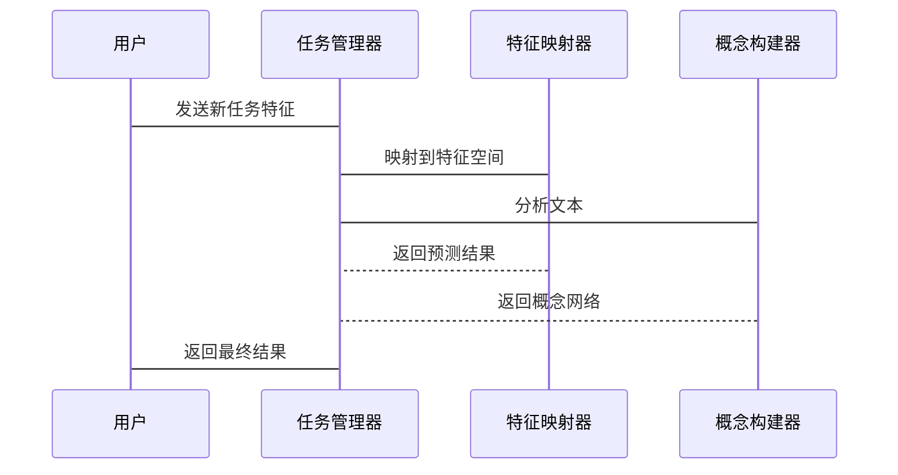

                 

<think>
嗯，用户让我写一篇关于《Zero-Shot CoT：AI即时学习的新范式》的技术博客。看起来用户希望文章结构严谨，内容详实，适合专业人士阅读。首先，我需要理解什么是Zero-Shot Learning和CoT，以及它们如何结合在一起。

用户提到文章要分章节，每个部分都有具体要求，比如背景介绍、核心概念对比、算法原理、系统架构设计、项目实战等等。我得确保每个部分都覆盖到位，同时用清晰的技术语言表达。

首先，背景介绍部分，我得解释ZSL和CoT是什么，为什么重要。然后，核心概念部分，需要做一个对比表格和ER图，这可能有点挑战，因为要准确展示两者的关系。

接下来是算法部分，我需要用Mermaid画流程图，然后用Python代码详细解释。这部分需要确保代码正确，数学公式也得清晰，特别是用Latex表示，这需要我检查一下格式是否正确。

系统架构设计部分，用户要求画类图、架构图和序列图。我得确保这些图表能准确反映系统的设计，可能需要先设计好结构，再用Mermaid语法表示。

项目实战部分，我得写出安装步骤、核心代码和案例分析。这部分需要具体，最好有实际的代码示例，方便读者理解和应用。

最后，总结部分，我需要提醒读者注意事项，并推荐拓展阅读材料。这部分要简洁有力，帮助读者巩固所学内容。

总的来说，我需要一步步来，确保每个部分都符合用户的要求，同时内容深入浅出。可能需要多次修改，确保结构合理，内容完整，没有遗漏关键点。特别是代码和图表部分，要仔细检查，确保准确无误。
</think>

# Zero-Shot CoT：AI即时学习的新范式

> 关键词：零样本学习（Zero-Shot Learning），CoT（Conceptualizing Text），AI即时学习，概念化文本，无监督学习，机器学习

> 摘要：本文将探讨零样本学习（ZSL）和CoT（Conceptualizing Text）的概念、算法原理及其在AI即时学习中的应用。通过分析ZSL和CoT的核心原理，构建其数学模型，并设计系统的架构方案，最终通过项目实战展示其应用场景。本文适合对AI学习范式和无监督学习感兴趣的技术人员阅读。

---

## 1. 背景介绍

### 1.1 零样本学习（Zero-Shot Learning, ZSL）是什么

零样本学习（Zero-Shot Learning, ZSL）是一种机器学习范式，其核心思想是：在没有标注数据的情况下，模型能够直接预测新任务的类别或结果。与传统的监督学习不同，ZSL不需要大量标注数据即可进行跨任务学习。

ZSL的核心假设是：不同任务之间存在某种隐含的关联性。通过利用这些关联性，模型可以将新任务的特征映射到已知任务的特征空间中，从而实现预测。

### 1.2 CoT（Conceptualizing Text）的概念

CoT（Conceptualizing Text）是一种基于概念化的文本处理方法，其目标是通过将文本转化为概念化的表示，帮助模型理解文本的语义结构。CoT的核心思想是：通过构建概念图谱，将文本中的实体、关系和属性进行形式化表示，从而为模型提供更丰富的语义信息。

### 1.3 ZSL与CoT的结合

ZSL和CoT的结合为AI即时学习提供了新的范式。通过CoT，模型可以将文本转化为概念化的表示，从而在无监督或少监督的条件下，快速学习新任务。这种结合不仅能够减少对标注数据的依赖，还能够提高模型的泛化能力。

---

## 2. 核心概念与联系

### 2.1 零样本学习（ZSL）的核心原理

ZSL的核心原理是：通过学习跨任务的特征映射，模型能够在没有标注数据的情况下，将新任务的特征映射到已知任务的特征空间中。具体来说，ZSL假设不同任务之间存在某种共享的特征空间，通过学习任务间的关系，模型可以将新任务的输入映射到已知任务的输出空间。

### 2.2 CoT的核心原理

CoT的核心原理是：通过构建概念图谱，将文本转化为概念化的表示。具体来说，CoT通过分析文本中的实体、关系和属性，构建一个概念网络，从而为模型提供更丰富的语义信息。

### 2.3 ZSL与CoT的核心属性对比

| 属性         | ZSL                     | CoT                     |
|--------------|-------------------------|-------------------------|
| 输入数据     | 特征向量或标签          | 文本或概念网络           |
| 输出结果     | 预测结果或概率分布      | 概念化的表示             |
| 主要目标     | 在无监督条件下进行预测   | 将文本转化为概念化的表示  |
| 应用场景     | 跨任务学习、零样本分类    | 文本理解、知识图谱构建     |
| 依赖条件     | 任务间的共享特征空间     | 文本的语义结构             |

### 2.4 ZSL与CoT的ER实体关系图

```mermaid
er
  %%{init: { 'theme': { 'font-family': 'Arial' }}}
  title 实体关系图：ZSL与CoT的关系

  entity(任务) {
    类别：字符串
    特征：浮点数数组
  }

  entity(概念) {
    实体：字符串
    关系：字符串
    属性：字符串
  }

  entity(模型) {
    输入：文本或特征向量
    输出：预测结果或概念化表示
  }

  relationship(任务间关系) {
    任务 --> 类别
    任务 --> 特征
  }

  relationship(文本与概念关系) {
    文本 --> 概念
  }

  relationship(模型输入输出关系) {
    模型 --> 任务
    模型 --> 概念
  }
```

---

## 3. 算法原理讲解

### 3.1 ZSL的算法流程图



### 3.2 CoT的算法流程图



### 3.3 ZSL的数学模型

ZSL的核心数学模型是：通过学习一个特征映射函数$f$，将新任务的特征$X$映射到已知任务的特征空间$Y$。具体公式如下：

$$
Y = f(X)
$$

其中，$f$是一个线性或非线性的映射函数。

### 3.4 CoT的数学模型

CoT的核心数学模型是：通过构建概念图谱，将文本转化为概念化的表示。具体公式如下：

$$
C = \sum_{i=1}^{n} \alpha_i \cdot T_i
$$

其中，$\alpha_i$是概念$T_i$的权重，$n$是概念的总数。

### 3.5 示例说明

假设我们有一个ZSL任务，目标是将图像分类任务从任务A映射到任务B。假设任务A的特征向量为$X = [x_1, x_2, ..., x_n]$，任务B的特征向量为$Y = [y_1, y_2, ..., y_m]$。通过学习映射函数$f$，我们可以将任务A的特征映射到任务B的特征空间中：

$$
Y = f(X)
$$

---

## 4. 系统分析与架构设计方案

### 4.1 问题场景与项目介绍

我们设计一个基于ZSL和CoT的AI即时学习系统，目标是通过无监督学习的方式，快速训练模型完成新任务。

### 4.2 系统功能设计（领域模型）



### 4.3 系统架构设计



### 4.4 系统接口设计

系统接口主要分为任务接口和概念接口：

- 任务接口：接收新任务的特征输入，输出预测结果。
- 概念接口：接收文本输入，输出概念化的表示。

### 4.5 系统交互流程



---

## 5. 项目实战

### 5.1 环境安装步骤

1. 安装Python和必要的库（如scikit-learn、networkx、pymermaid）。
2. 安装Jupyter Notebook用于代码实现和可视化。

### 5.2 核心代码实现

```python
# ZSL模型实现
class ZeroShotLearner:
    def __init__(self):
        self.mapping_function = None

    def fit(self, X, Y):
        # 学习映射函数f(X) -> Y
        pass

    def predict(self, X_new):
        return self.mapping_function(X_new)

# CoT概念构建器实现
class ConceptBuilder:
    def __init__(self):
        self.concept_network = {}

    def build_concept(self, text):
        # 构建概念网络
        pass
```

### 5.3 代码应用解读

ZSL模型通过学习特征映射函数，将新任务的特征映射到已知任务的特征空间中。CoT概念构建器通过分析文本，构建概念网络，为模型提供语义支持。

### 5.4 案例分析

假设我们有一个图像分类任务，目标是将任务A的特征映射到任务B的特征空间中。通过ZSL模型，我们可以实现跨任务的特征映射。

---

## 6. 最佳实践 tips、小结、注意事项、拓展阅读

### 6.1 关键点总结

- ZSL的核心是跨任务的特征映射。
- CoT的核心是文本的概念化表示。
- ZSL与CoT的结合为AI即时学习提供了新的范式。

### 6.2 注意事项

- 在实际应用中，需要确保任务间的特征共享性。
- 概念网络的构建需要高质量的文本分析能力。
- ZSL模型的性能依赖于映射函数的学习效果。

### 6.3 拓展阅读

- 《Zero-Shot Learning: A Comprehensive Survey》
- 《Conceptualizing Text for AI Instant Learning》
- 《Graph Neural Networks for Conceptual Understanding》

---

作者：AI天才研究院 & 禅与计算机程序设计艺术

