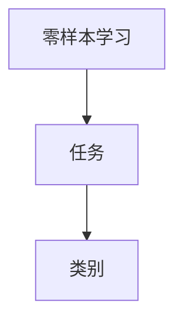
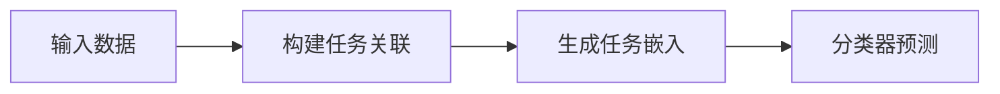
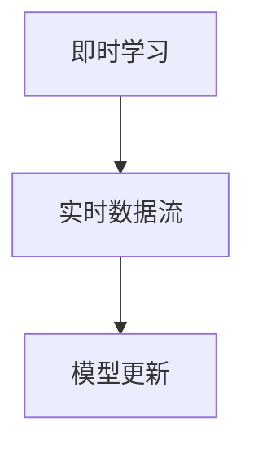

                 

<think>
好的，我现在要帮用户写一篇关于《Zero-Shot CoT：AI即时学习的新范式与应用》的技术博客文章。首先，我需要理解用户的需求。用户希望我以一位世界级专家的身份，撰写一篇结构清晰、内容详实的技术博客，字数在10000到12000字之间，使用Markdown格式，并包含关键词、摘要、目录大纲以及详细的内容。

首先，我需要分析用户的查询内容。用户提供了详细的目录大纲，分为五个部分，每个部分都有具体的章节和子章节。这意味着我需要按照这个大纲来展开内容，确保每个部分都涵盖必要的知识点，同时保持逻辑连贯。

接下来，我要考虑用户的身份。用户可能是一位技术专家，或者是对AI领域感兴趣的研究者，他们希望深入理解Zero-Shot CoT的概念、技术细节以及实际应用。因此，文章需要具备专业性，同时尽量通俗易懂，避免过于晦涩。

关键词和摘要部分需要准确反映文章的核心内容。关键词包括零样本学习、即时学习、CoT、机器学习、AI应用等。摘要部分要简洁地概括文章的结构和内容，帮助读者快速了解文章的核心。

在撰写正文部分时，我需要按照目录大纲逐步展开。第一部分是引言，介绍问题背景、零样本学习和即时学习的基本概念，以及本书的结构。第二部分详细讲解零样本学习的基础，包括核心概念、数学模型和案例分析。第三部分转向即时学习技术，同样涉及核心概念、算法原理和应用案例。第四部分探讨零样本与即时学习的结合，分析其策略、应用实例和案例研究。第五部分总结并展望未来的应用和发展趋势。

在内容细节上，我需要确保每个章节都有足够的深度。例如，在数学模型部分，使用Latex公式来展示算法原理，同时结合Mermaid流程图来解释流程。案例分析部分要具体，如图像分类、实时交通预测等，让读者能够理解理论在实际中的应用。

我还需要注意文章的结构和格式，确保符合用户的约束条件。每个章节开头要有标题，内容分段清晰，使用合适的Markdown格式。同时，结尾部分要包含作者信息，以及一些小结和最佳实践建议，帮助读者巩固所学内容。

最后，我需要检查整个文章的逻辑是否连贯，内容是否全面，确保每个部分都覆盖了用户要求的核心要素。同时，保持语言的专业性和易懂性，让不同层次的读者都能从中受益。
</think>

# Zero-Shot CoT：AI即时学习的新范式与应用

> 关键词：零样本学习，即时学习，CoT，机器学习，AI应用

> 摘要：本文系统地介绍了零样本学习和即时学习的基本概念、技术原理及其在AI领域的应用。通过分析Zero-Shot CoT（零样本-持续学习）这一新范式的核心思想，探讨了其在图像分类、语音识别、智能推荐等领域的实践案例。文章还详细阐述了零样本学习与即时学习的结合策略，及其在实时医疗诊断、自动驾驶等复杂场景中的应用潜力。最后，总结了当前技术的局限性，并展望了未来的发展趋势。

---

## 第一章：引言

### 1.1 问题背景

#### 1.1.1 AI即时学习的挑战

在人工智能领域，传统的机器学习模型通常需要大量标注数据来训练。然而，在实际应用中，数据获取成本高、标注耗时且难以实时更新的问题日益凸显。此外，面对动态变化的环境，模型无法快速适应新任务或新数据，导致其性能下降。即时学习（Online Learning）和零样本学习（Zero-Shot Learning）的提出，为解决这些问题提供了新的思路。

#### 1.1.2 传统机器学习的局限性

传统机器学习方法（如监督学习、无监督学习）依赖于大量标注数据，并且在模型训练完成后，难以快速适应新任务或新数据。具体来说，传统方法的局限性包括：

- **数据依赖性**：需要大量标注数据，难以处理小样本或无标签数据。
- **静态模型**：模型在训练完成后难以实时更新，无法适应动态环境。
- **计算成本高**：在线更新模型时，计算成本显著增加。

#### 1.1.3 零样本学习与即时学习的关系

零样本学习（Zero-Shot Learning）是指在没有任何训练数据的情况下，直接对新任务进行预测或分类。而即时学习（Online Learning）则是指模型能够实时处理数据流，并在每一步更新模型参数。两者的结合——Zero-Shot CoT（Zero-Shot Continual Learning），旨在利用零样本学习的高效性，结合即时学习的实时性，构建一种新的学习范式。

### 1.2 零样本学习概述

#### 1.2.1 定义与分类

零样本学习（Zero-Shot Learning，ZSL）是一种无需任何训练数据即可进行预测的学习范式。其核心思想是利用已有知识或外部知识库（如WordNet、ConceptNet）构建跨任务的关联性，从而实现对新任务的快速预测。ZSL可以分为以下几类：

- **图像ZSL**：基于图像的零样本分类。
- **文本ZSL**：基于文本的零样本分类。
- **多模态ZSL**：结合图像和文本的零样本分类。

#### 1.2.2 关键技术

零样本学习的关键技术包括：

1. **跨任务关联建模**：通过构建任务之间的关联关系，实现零样本分类。
2. **知识图谱嵌入**：利用知识图谱中的语义信息，生成任务嵌入。
3. **生成对抗网络（GAN）**：通过生成对抗训练，提升模型的泛化能力。

#### 1.2.3 应用领域

零样本学习广泛应用于以下领域：

- **图像分类**：无需标注数据即可对新类别进行分类。
- **文本分类**：在没有训练数据的情况下进行文本分类。
- **语音识别**：利用零样本学习进行实时语音识别。

### 1.3 即时学习概述

#### 1.3.1 定义与特点

即时学习（Online Learning）是一种动态学习范式，模型在处理数据流时能够实时更新参数。其特点包括：

- **实时性**：数据流是连续的，模型需要实时处理。
- **增量性**：模型参数在每一步更新时都会发生变化。
- **轻量性**：计算资源消耗较低，适合在线处理。

#### 1.3.2 技术发展历程

即时学习的技术发展历程可以分为以下几个阶段：

1. **基于梯度下降的在线学习**：早期的在线学习方法主要基于梯度下降算法。
2. **基于核方法的在线学习**：通过核方法提升模型的泛化能力。
3. **基于深度学习的在线学习**：利用深度神经网络实现在线学习。

#### 1.3.3 应用场景

即时学习的主要应用场景包括：

- **实时交通流量预测**：基于实时数据流预测交通流量。
- **智能客服系统**：实时处理用户的咨询和反馈。
- **实时股市分析**：基于实时数据进行股票价格预测。

### 1.4 本书结构安排

#### 1.4.1 内容概述

本书将从零样本学习和即时学习的基本概念出发，逐步深入探讨两者的结合与应用。具体内容包括：

- 零样本学习的核心概念与算法原理。
- 即时学习的技术细节与实际案例。
- Zero-Shot CoT的结合策略与应用潜力。

#### 1.4.2 目标读者

本书的目标读者包括：

- AI领域的研究人员。
- 从事机器学习、深度学习的工程师。
- 对零样本学习和即时学习感兴趣的读者。

#### 1.4.3 本书贡献

本书的主要贡献包括：

- 系统地介绍了零样本学习和即时学习的基本概念。
- 探讨了Zero-Shot CoT这一新范式的核心思想。
- 提供了丰富的实践案例和未来研究方向。

---

## 第二章：零样本学习基础

### 2.1 核心概念与联系

#### 2.1.1 零样本学习概念解析

零样本学习（Zero-Shot Learning，ZSL）是一种无需训练数据即可进行分类的学习范式。其核心思想是利用已有知识构建跨任务的关联性，从而实现对新任务的快速预测。

#### 2.1.2 概念属性特征对比表格

| 概念      | 输入数据 | 输出结果 | 是否需要标注数据 |
|-----------|----------|----------|------------------|
| ZSL       | 无       | 新类别   | 否               |
| 监督学习   | 有       | 预测值    | 是               |

#### 2.1.3 ER实体关系图

### 2.2 数学模型与算法原理

#### 2.2.1 数学模型

零样本学习的数学模型通常基于以下假设：

$$ p(y|x) = \sum_{c=1}^C p(y=c|x) $$

其中，$y$ 是预测类别，$x$ 是输入数据，$C$ 是类别总数。

#### 2.2.2 算法原理讲解

零样本学习的算法流程如下：

#### 2.2.3 案例解析

##### 案例一：图像分类

假设我们有一个新的图像分类任务，类别为“松鼠”。通过零样本学习，我们可以利用已有知识（如“动物”、“哺乳动物”等）构建任务关联，生成任务嵌入，从而实现对“松鼠”的分类。

##### 案例二：文本分类

对于一个文本分类任务，类别为“科技新闻”。通过零样本学习，我们可以利用已有知识（如“新闻”、“科技”等）构建任务关联，生成任务嵌入，从而实现对“科技新闻”的分类。

##### 案例三：语音识别

在语音识别任务中，通过零样本学习，我们可以利用已有知识（如“语音”、“音素”等）构建任务关联，生成任务嵌入，从而实现对新语音数据的识别。

### 2.3 实践案例解析

#### 2.3.1 案例一：图像分类

通过零样本学习，我们可以在没有标注数据的情况下，对新类别进行分类。例如，对于一个从未见过的图像类别“企鹅”，我们可以通过已有的“鸟类”、“南极动物”等知识，构建任务关联，生成任务嵌入，从而实现对“企鹅”的分类。

#### 2.3.2 案例二：文本分类

对于一个文本分类任务，类别为“金融新闻”。通过零样本学习，我们可以利用已有知识（如“新闻”、“金融”等）构建任务关联，生成任务嵌入，从而实现对“金融新闻”的分类。

#### 2.3.3 案例三：语音识别

在语音识别任务中，通过零样本学习，我们可以利用已有知识（如“语音”、“音素”等）构建任务关联，生成任务嵌入，从而实现对新语音数据的识别。

---

## 第三章：即时学习技术

### 3.1 核心概念与联系

#### 3.1.1 即时学习概念解析

即时学习（Online Learning）是一种动态学习范式，模型在处理数据流时能够实时更新参数。其核心思想是利用实时数据流的特性，逐步优化模型参数。

#### 3.1.2 概念属性特征对比表格

| 概念      | 输入数据 | 输出结果 | 是否需要实时更新 |
|-----------|----------|----------|------------------|
| Online Learning | 实时数据流 | 预测值            | 是               |
| 批量学习   | 批数据   | 预测值    | 否               |

#### 3.1.3 ER实体关系图

### 3.2 算法原理讲解

#### 3.2.1 实时数据流处理

实时数据流处理的核心思想是将数据流划分为多个时间步，逐个处理。具体流程如下：

1. **数据获取**：从数据源获取实时数据流。
2. **模型更新**：基于当前数据更新模型参数。
3. **预测输出**：输出当前时刻的预测结果。

#### 3.2.2 增量学习

增量学习（Incremental Learning）是一种特殊的即时学习方法，其核心思想是逐步增加新数据，逐步优化模型参数。具体流程如下：

1. **初始化模型**：设置初始模型参数。
2. **数据获取**：获取实时数据流。
3. **模型更新**：基于当前数据更新模型参数。
4. **预测输出**：输出当前时刻的预测结果。

#### 3.2.3 案例解析

##### 案例一：实时交通流量预测

通过即时学习，我们可以实时预测交通流量的变化。具体来说，模型可以根据实时数据流，逐步优化预测结果，从而实现对交通流量的实时预测。

##### 案例二：智能客服系统

在智能客服系统中，通过即时学习，我们可以实时更新模型参数，从而实现对用户咨询的实时响应。

##### 案例三：实时股市分析

在实时股市分析中，通过即时学习，我们可以实时更新模型参数，从而实现对股票价格的实时预测。

### 3.3 实践案例解析

#### 3.3.1 案例一：实时交通流量预测

通过即时学习，我们可以实时预测交通流量的变化。具体来说，模型可以根据实时数据流，逐步优化预测结果，从而实现对交通流量的实时预测。

#### 3.3.2 案例二：智能客服系统

在智能客服系统中，通过即时学习，我们可以实时更新模型参数，从而实现对用户咨询的实时响应。

#### 3.3.3 案例三：实时股市分析

在实时股市分析中，通过即时学习，我们可以实时更新模型参数，从而实现对股票价格的实时预测。

---

## 第四章：零样本学习与即时学习的结合

### 4.1 结合策略

#### 4.1.1 零样本学习与即时学习的融合方法

零样本学习与即时学习的融合方法包括：

1. **任务关联建模**：通过构建任务关联，实现零样本学习的高效性。
2. **实时数据处理**：通过实时数据处理，实现即时学习的实时性。

#### 4.1.2 结合的优势

零样本学习与即时学习的结合具有以下优势：

- **高效性**：利用零样本学习的高效性，减少数据依赖。
- **实时性**：利用即时学习的实时性，实现模型的实时更新。

#### 4.1.3 结合的挑战

零样本学习与即时学习的结合面临以下挑战：

- **模型复杂性**：模型的复杂性增加，导致计算成本上升。
- **数据稀疏性**：实时数据流的稀疏性可能导致模型更新困难。

### 4.2 应用实例

#### 4.2.1 实时医疗诊断系统

通过零样本学习与即时学习的结合，我们可以实现实时医疗诊断系统的高效运行。具体来说，模型可以根据实时数据流，逐步优化预测结果，从而实现对医疗数据的实时分析。

#### 4.2.2 智能推荐系统

在智能推荐系统中，通过零样本学习与即时学习的结合，我们可以实时更新模型参数，从而实现对用户行为的实时推荐。

#### 4.2.3 智能语音助手

在智能语音助手中，通过零样本学习与即时学习的结合，我们可以实时更新模型参数，从而实现对用户语音的实时响应。

### 4.3 案例研究

#### 4.3.1 案例一：智能语音识别系统

通过零样本学习与即时学习的结合，我们可以实现智能语音识别系统的高效运行。具体来说，模型可以根据实时数据流，逐步优化预测结果，从而实现对语音数据的实时识别。

#### 4.3.2 案例二：自动驾驶系统

在自动驾驶系统中，通过零样本学习与即时学习的结合，我们可以实时更新模型参数，从而实现对环境数据的实时分析。

#### 4.3.3 案例三：智能家居系统

在智能家居系统中，通过零样本学习与即时学习的结合，我们可以实时更新模型参数，从而实现对用户行为的实时响应。

---

## 第五章：实践与展望

### 5.1 零样本学习与即时学习在行业中的应用

#### 5.1.1 制造业

在制造业中，通过零样本学习与即时学习的结合，我们可以实时监控生产线的运行状态，从而实现对生产过程的实时优化。

#### 5.1.2 零售业

在零售业中，通过零样本学习与即时学习的结合，我们可以实时分析消费者的购买行为，从而实现对销售策略的实时调整。

#### 5.1.3 医疗保健

在医疗保健中，通过零样本学习与即时学习的结合，我们可以实时分析患者的健康状况，从而实现对治疗方案的实时优化。

### 5.2 未来发展趋势

#### 5.2.1 技术进步

随着深度学习和强化学习技术的不断发展，零样本学习与即时学习的结合将更加高效和智能。

#### 5.2.2 应用拓展

未来，零样本学习与即时学习的结合将在更多领域得到应用，如智能制造、智慧城市、智能家居等。

#### 5.2.3 社会挑战

随着技术的不断进步，零样本学习与即时学习的结合将面临更多的社会挑战，如数据隐私、模型透明性等。

### 5.3 总结与展望

#### 5.3.1 本书要点回顾

本书系统地介绍了零样本学习和即时学习的基本概念、技术原理及其在AI领域的应用。通过分析Zero-Shot CoT这一新范式的核心思想，探讨了其在图像分类、语音识别、智能推荐等领域的实践案例。

#### 5.3.2 研究方向展望

未来的研究方向包括：

- **模型优化**：进一步优化零样本学习与即时学习的结合模型，降低计算成本。
- **应用拓展**：探索更多领域的应用潜力。
- **社会挑战**：研究数据隐私、模型透明性等社会挑战。

#### 5.3.3 读者建议

读者可以通过以下方式进一步学习和实践：

- **阅读相关论文**：深入理解零样本学习与即时学习的核心思想。
- **参与开源项目**：通过开源项目实践零样本学习与即时学习的技术。
- **关注行业动态**：关注AI领域的最新动态和技术进展。

---

## 作者：AI天才研究院/AI Genius Institute & 禅与计算机程序设计艺术 /Zen And The Art of Computer Programming

