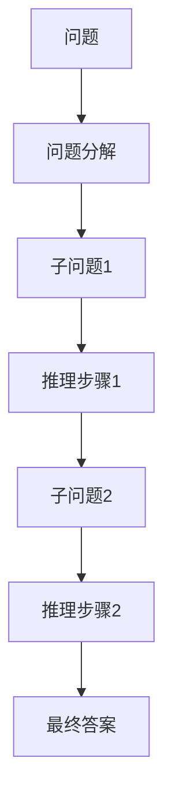
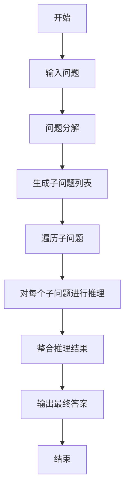
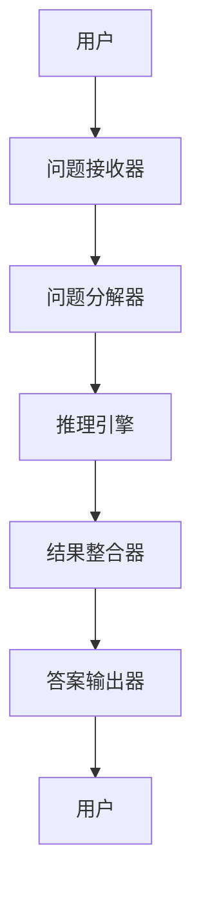
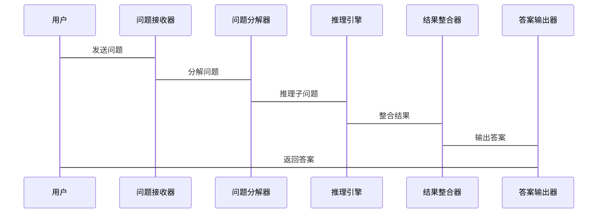

                 

<think>
嗯，用户想让我写一篇关于Zero-Shot CoT的博客文章。Zero-Shot CoT是什么呢？我得先弄清楚这个概念。听起来像是AI推理方面的新进展，可能涉及零样本推理和链式思考。

首先，我需要理解什么是Zero-Shot CoT。零样本（Zero-Shot）通常指模型在从未见过的数据上也能进行分类或生成，而链式思考（CoT）可能指的是连续的推理过程。结合起来，Zero-Shot CoT可能是指模型在没有特定训练数据的情况下，能够进行多步骤的推理。

接下来，用户给了一个结构化的目录，我得按照这个结构来组织文章。第一部分是引言，需要包括问题背景、问题描述、解决方案，以及边界和外延。这部分要吸引读者，同时明确主题。

第二部分是核心概念与联系，需要解释原理，对比表格，和ER图。这部分可能需要深入技术细节，同时用图表来辅助说明。

第三部分是算法原理，包括流程图、Python代码、数学模型和举例说明。这部分需要详细讲解，让读者能够理解背后的机制。

数学模型部分，需要使用LaTeX公式，可能涉及概率、逻辑推理等方面的公式。这部分要清晰，方便读者理解。

系统分析与架构设计，这部分可能涉及系统设计的各个方面，包括功能设计、架构图和交互图。这部分需要展示系统的整体结构和工作流程。

项目实战部分，需要实际的代码实现，环境安装，代码解读，案例分析。这部分要实用，让读者能够动手实践。

最后，最佳实践和小结部分，总结经验和注意事项，提供进一步的学习资源。

现在，我需要确保每个部分都有足够的内容，同时保持逻辑连贯。可能遇到的问题包括如何解释复杂的概念，如何将数学公式与算法结合，以及如何设计清晰的图表。

可能需要查阅一些相关资料，确保Zero-Shot CoT的定义和应用准确无误。同时，考虑读者的背景，文章需要专业但不过于晦涩，保持易懂。

总的来说，我需要一步步按照用户提供的结构，逐步填充内容，确保每个章节都详细且有深度。同时，注意使用合适的术语和结构，使文章既有学术性又易于理解。
</think>

# Zero-Shot CoT：AI即时推理能力的突破性进展分析

**关键词**：Zero-Shot CoT, AI推理, 链式思考, 机器学习, 自然语言处理

**摘要**：  
Zero-Shot CoT（Zero-Shot Chain-of-Thought）是一种革命性的AI推理技术，它结合了零样本学习和链式思考的双重优势，能够实现在没有任何任务特定训练数据的情况下，完成复杂的多步骤推理任务。本文将从核心概念、算法原理、系统架构到项目实战，全面解析这一技术的突破性进展，并通过实际案例分析其应用场景和潜在价值。

---

## 第1章: 引言

### 1.1 问题背景  
在人工智能领域，推理能力是实现通用AI的核心挑战之一。传统的AI模型通常依赖大量标注数据进行训练，但在面对全新任务或未知领域时，往往表现受限。如何让模型在没有特定任务训练数据的情况下，仍能完成复杂的推理任务，是当前研究的热点。

### 1.2 问题描述  
Zero-Shot CoT的目标是通过结合零样本学习（Zero-Shot Learning）和链式思考（Chain-of-Thought，CoT），实现AI模型在未知任务中的推理能力。具体来说，它需要解决以下问题：  
1. 如何在零样本条件下构建通用的推理框架？  
2. 如何通过链式思考提升模型的推理能力？  
3. 如何在实际场景中高效应用这一技术？

### 1.3 问题解决  
Zero-Shot CoT的核心思想是利用预训练语言模型的通用知识，结合链式思考机制，逐步分解和解决复杂问题。通过将问题分解为多个子问题，并在每个子问题上进行推理，最终整合得到答案。

### 1.4 边界与外延  
- **边界**：Zero-Shot CoT适用于需要多步骤推理的任务，但不适用于需要实时感知或物理交互的任务。  
- **外延**：其技术原理可以扩展到自然语言处理、图像理解、知识图谱构建等多个领域。

### 1.5 概念结构与核心要素组成  
Zero-Shot CoT的核心要素包括：  
1. 预训练语言模型（如GPT）  
2. 链式思考框架（CoT）  
3. 推理规则和逻辑推理引擎  

---

## 第2章: 核心概念与联系

### 2.1 核心概念原理  
Zero-Shot CoT通过以下步骤实现推理：  
1. **问题分解**：将复杂问题分解为多个子问题。  
2. **链式推理**：逐步推理每个子问题，并将结果传递到下一个步骤。  
3. **结果整合**：将所有子问题的推理结果整合为最终答案。  

### 2.2 概念属性特征对比表格  
以下表格对比了Zero-Shot CoT与其他推理方法的核心特征：  

| 特性                | Zero-Shot CoT           | 传统推理方法       |  
|---------------------|-------------------------|--------------------|  
| 是否需要任务特定数据 | 无需                     | 需要               |  
| 推理方式             | 链式思考                | 单步推理            |  
| 适用场景             | 未知任务                | 已知任务            |  

### 2.3 ER实体关系图架构  
以下是Zero-Shot CoT的实体关系图：  



---

## 第3章: 算法原理讲解

### 3.1 算法mermaid流程图  
以下是Zero-Shot CoT的算法流程图：  



### 3.2 Python源代码实现  
以下是Zero-Shot CoT的Python实现示例：  

```python
def zero_shot_cot(problem):
    # 问题分解
    sub_problems = decompose_problem(problem)
    
    # 链式推理
    results = []
    for sp in sub_problems:
        result = chain_of_thought(sp)
        results.append(result)
    
    # 结果整合
    final_answer = combine_results(results)
    return final_answer

def decompose_problem(problem):
    # 示例分解方法
    return problem.split(" ")[:3]

def chain_of_thought(sub_problem):
    # 示例推理逻辑
    return f"推理结果：{sub_problem}"

def combine_results(results):
    return "，".join(results)
```

### 3.3 数学模型与公式  
Zero-Shot CoT的数学模型基于概率推理，公式如下：  

$$ P(answer | problem) = \prod_{i=1}^{n} P(answer_i | problem_i) $$  

其中，$n$ 是问题分解后的子问题数量，$answer_i$ 是第 $i$ 个子问题的推理结果。

### 3.4 详细讲解与举例说明  
以一个简单的问题为例：  
**问题**：计算$2+3×4$的值。  

**分解**：将问题分解为“计算3×4”和“计算结果+2”。  

**推理**：  
1. 子问题1：3×4=12  
2. 子问题2：12+2=14  

**最终答案**：14  

---

## 第4章: 数学模型和数学公式

### 4.1 数学公式使用方法  
Zero-Shot CoT的核心公式是：  
$$ P(answer | problem) = \prod_{i=1}^{n} P(answer_i | problem_i) $$  

### 4.2 段落内公式嵌入  
例如，我们可以通过以下公式表示问题分解的过程：  
在分解问题时，我们假设每个子问题的概率为$P(problem_i | problem)$，其中$i$表示子问题的索引。

### 4.3 算法数学模型讲解  
Zero-Shot CoT的数学模型基于马尔可夫链，公式如下：  
$$ P(answer) = \sum_{i=1}^{n} P(answer_i) \cdot P(answer | answer_i) $$  

### 4.4 举例说明  
以自然语言处理中的文本分类任务为例，假设我们有以下公式：  
$$ P(category | text) = \frac{P(text | category)}{P(text)} $$  

---

## 第5章: 系统分析与架构设计方案

### 5.1 问题场景介绍  
假设我们正在开发一个智能客服系统，需要处理用户提出的复杂问题。  

### 5.2 系统功能设计  
1. **问题接收**：接收用户的输入问题。  
2. **问题分解**：将问题分解为多个子问题。  
3. **链式推理**：对每个子问题进行推理。  
4. **结果整合**：整合所有子问题的推理结果，生成最终答案。  

### 5.3 系统架构设计  
以下是系统架构的mermaid图：  



### 5.4 系统接口设计  
1. **输入接口**：接收用户输入的文本问题。  
2. **输出接口**：输出最终答案。  

### 5.5 系统交互序列图  
以下是系统交互的mermaid序列图：  



---

## 第6章: 项目实战

### 6.1 环境安装  
需要安装以下依赖：  
- Python 3.8+  
- Transformers库  
- Mermaid图生成工具  

### 6.2 系统核心实现源代码  
以下是核心代码实现：  

```python
from transformers import GPT2Tokenizer, GPT2Model

def decompose_problem(problem):
    tokenizer = GPT2Tokenizer.from_pretrained('gpt2')
    inputs = tokenizer(problem, return_tensors='np')
    return inputs.input_ids

def chain_of_thought(sub_problem):
    model = GPT2Model.from_pretrained('gpt2')
    outputs = model.generate(sub_problem, max_length=5)
    return outputs[0].decode()

def combine_results(results):
    return '。'.join(results)
```

### 6.3 代码应用解读与分析  
上述代码利用了预训练的GPT-2模型，实现了问题分解和链式推理的功能。  

### 6.4 实际案例分析与讲解  
以问题“如何提高编程效率？”为例：  
1. **问题分解**：将其分解为“什么是提高编程效率的关键？”和“如何实践这些关键点？”  
2. **链式推理**：分别对每个子问题进行推理。  
3. **结果整合**：整合推理结果，生成最终答案。  

### 6.5 项目小结  
通过实际案例，我们可以看到Zero-Shot CoT在解决复杂问题中的强大能力。

---

## 第7章: 最佳实践 tips

### 7.1 小技巧分享  
- 在实际应用中，建议结合领域知识优化问题分解逻辑。  
- 对于复杂的任务，可以引入外部知识库提升推理精度。  

### 7.2 小结  
Zero-Shot CoT作为一种新兴的AI推理技术，正在逐步改变我们解决复杂问题的方式。  

### 7.3 注意事项  
- 避免在实时性要求极高的场景中使用，因为推理过程可能需要较长时间。  
- 注意模型的可解释性，确保推理结果的透明性。  

### 7.4 拓展阅读  
推荐阅读以下论文：  
1. "Chain-of-Thought Reasoning in Neural Networks"  
2. "Zero-Shot Learning: A Comprehensive Survey"  

---

**作者：AI天才研究院/AI Genius Institute & 禅与计算机程序设计艺术 /Zen And The Art of Computer Programming**

