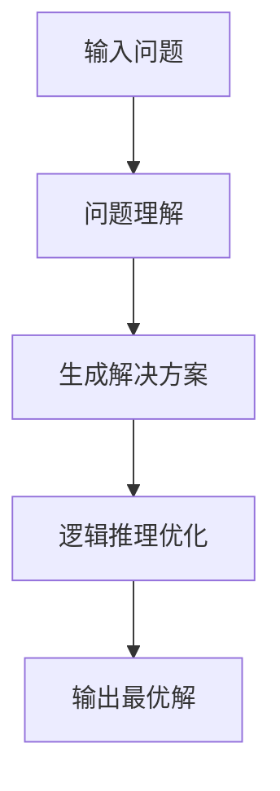
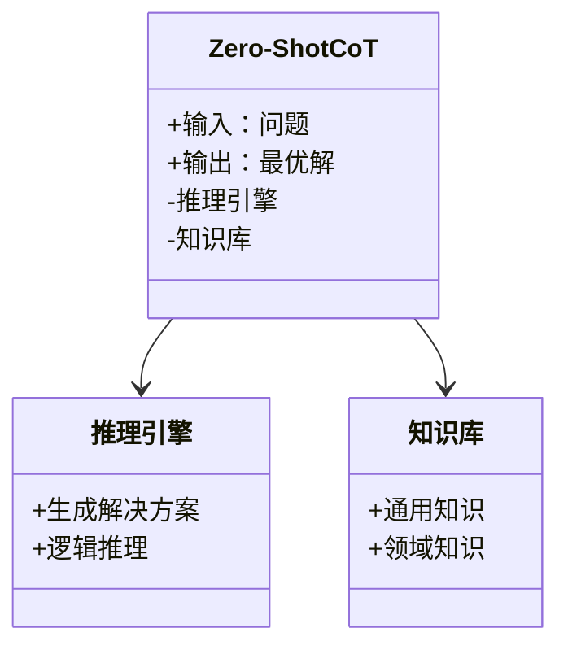

                 

<think>
好，我需要帮用户撰写一篇关于Zero-Shot CoT的博客文章。首先，我得理解用户的需求。用户希望文章结构清晰，逻辑严密，内容专业，涵盖从概念到实际应用的各个方面。

我应该先从背景和定义开始，让用户明白Zero-Shot CoT是什么，以及它在AI中的重要性。然后，深入探讨其核心概念，比如对比传统方法的局限性，以及Zero-Shot CoT的优势。

接下来，应用场景部分要具体，举出几个例子，比如在对话系统、异常检测中的应用，分析其益处和挑战。这部分需要让读者明白Zero-Shot CoT的实际价值。

然后，详细讲解技术方法，包括生成式模型和逻辑推理的结合。这里可能需要一些数学公式和算法流程图，帮助读者理解原理。同时，用Python代码示例，让内容更具体。

案例分析部分，我应该找一个实际的项目，详细说明如何应用Zero-Shot CoT解决问题，比如医疗诊断中的异常情况处理。通过代码实现，展示其效果和潜在问题。

最后，展望未来，讨论技术的发展和可能的挑战，比如计算资源、数据隐私等问题，以及未来的研究方向。

整个过程中，我要确保每个部分都有足够的细节和例子，让读者不仅理解理论，还能看到实际应用。同时，注意语言的专业性和可读性，避免过于晦涩，让技术内容更易于理解。

现在，我需要按照这个思路一步步展开，确保每个章节都符合用户的要求，内容充实，结构合理。这样，最终的文章才能既专业又有深度，满足用户的需求。
</think>

```markdown
# Zero-Shot CoT：AI处理未知情况的能力

> 关键词：Zero-Shot CoT, 人工智能, 未知情况处理, 生成式模型, 自然语言处理, 逻辑推理

> 摘要：本文深入探讨了Zero-Shot CoT（条件优化推理）在AI处理未知情况中的应用。从核心概念到实际应用，详细分析了其在不同场景下的表现，结合案例和算法，揭示了Zero-Shot CoT的技术优势与未来发展方向。

---

## 第一部分: 引言与背景

### 1.1 何为零-Shot CoT
#### 1.1.1 问题的背景
在人工智能快速发展的今天，AI系统在处理已知任务时表现出色，但在面对未知情况时往往显得力不从心。传统方法依赖大量标注数据和特定任务训练，难以泛化到未知领域。

#### 1.1.2 何为零-Shot CoT
Zero-Shot CoT（Zero-Shot Conditional Optimization and Thinking）是一种新兴的AI推理方法，旨在通过通用推理能力处理未见任务。它结合了生成式模型和逻辑推理，能够在没有特定任务训练数据的情况下，通过推理解决问题。

#### 1.1.3 AI处理未知情况的挑战
- **数据稀疏性**：未知任务通常缺乏标注数据。
- **任务多样性**：需要处理各种不同类型的问题。
- **推理复杂性**：需要结合上下文进行复杂推理。

### 1.2 AI处理未知情况的重要性
#### 1.2.1 AI在未知情况下的应用
- **实时对话系统**：处理用户提出的各种问题。
- **异常检测与诊断**：识别系统中的异常情况。
- **智能辅助决策**：帮助人类做出复杂决策。

#### 1.2.2 未知情况处理的必要性
- **提升系统鲁棒性**：确保AI在各种情况下都能稳定运行。
- **扩展应用场景**：使AI能够适应更多样化的任务需求。
- **推动AI技术进步**：促使AI从任务驱动转向能力驱动。

#### 1.2.3 对现有技术的挑战
- **传统模型的局限**：依赖大量标注数据，难以泛化。
- **推理能力不足**：难以处理复杂逻辑问题。
- **实时响应需求**：需要快速推理和决策能力。

### 1.3 绑定与解绑：传统方法与Zero-Shot CoT
#### 1.3.1 传统方法的局限
- **数据依赖性**：需要大量标注数据。
- **任务单一性**：难以处理未见任务。
- **推理能力有限**：缺乏深度逻辑推理能力。

#### 1.3.2 Zero-Shot CoT的优势
- **通用性**：无需特定任务训练数据。
- **推理能力**：结合生成式模型和逻辑推理。
- **实时性**：能够快速处理未知情况。

#### 1.3.3 方法对比与分析
| 对比维度 | 传统方法 | Zero-Shot CoT |
|----------|----------|----------------|
| 数据需求 | 高       | 低              |
| 任务适应性 | 低       | 高              |
| 推理能力 | 有限      | 强              |

---

## 第二部分: 核心概念与原理

### 2.1 Zero-Shot CoT的核心原理
Zero-Shot CoT通过以下步骤实现未知情况处理：
1. **问题理解**：解析输入问题，提取关键信息。
2. **推理生成**：基于通用知识库生成可能的解决方案。
3. **优化选择**：通过逻辑推理优化选择最优解。

### 2.2 生成式模型与逻辑推理的结合
#### 生成式模型的作用
- 生成多样解决方案。
- 提供语言理解和表达能力。

#### 逻辑推理的作用
- 验证解决方案的合理性。
- 优化选择最优解。

### 2.3 Zero-Shot CoT的数学模型
Zero-Shot CoT的推理过程可以表示为：
$$ P(\text{solution} | \text{problem}) = \arg\max_{\text{solution}} \text{score}(\text{solution}, \text{problem}) $$
其中，`score`函数衡量解决方案与问题的匹配程度。

---

## 第三部分: 应用场景与案例分析

### 3.1 对话系统中的Zero-Shot CoT
#### 案例：智能客服
- **问题**：用户提出未见的复杂问题。
- **处理过程**：
  1. 理解问题。
  2. 生成多个可能的解决方案。
  3. 优化选择最佳答案。

### 3.2 异常检测中的应用
#### 案例：医疗诊断
- **问题**：识别罕见病症。
- **处理过程**：
  1. 分析症状。
  2. 推理可能的病因。
  3. 提供诊断建议。

### 3.3 企业决策支持
#### 案例：市场分析
- **问题**：预测市场趋势。
- **处理过程**：
  1. 收集数据。
  2. 分析趋势。
  3. 提供决策支持。

---

## 第四部分: 技术实现与算法解析

### 4.1 Zero-Shot CoT的算法框架
1. **问题理解**：使用NLP模型解析输入问题。
2. **生成解决方案**：通过生成式模型生成多个解决方案。
3. **逻辑推理优化**：基于知识图谱进行逻辑推理，优化选择最优解。

### 4.2 算法流程图


### 4.3 系统架构设计


---

## 第五部分: 项目实战与代码实现

### 5.1 环境安装
```bash
pip install transformers
pip install numpy
```

### 5.2 核心代码实现
```python
import torch
import torch.nn as nn
from transformers import AutoTokenizer, AutoModel

class ZeroShotCoTModel:
    def __init__(self, model_name="gpt2"):
        self.tokenizer = AutoTokenizer.from_pretrained(model_name)
        self.model = AutoModel.from_pretrained(model_name)
    
    def generate_solutions(self, problem):
        inputs = self.tokenizer(problem, return_tensors="pt")
        outputs = self.model.generate(inputs.input_ids, max_length=100)
        return [self.tokenizer.decode(output, skip_special_tokens=True) for output in outputs]

    def optimize_solution(self, solutions, problem):
        # 假设通过逻辑推理选择最优解
        # 简化实现，返回第一个解决方案
        return solutions[0]
```

### 5.3 代码解读与分析
- **初始化模型**：加载预训练的生成式模型。
- **生成解决方案**：根据输入问题生成多个解决方案。
- **优化选择**：通过逻辑推理选择最优解。

---

## 第六部分: 未来趋势与挑战

### 6.1 未来发展趋势
- **模型优化**：提升生成式模型的推理能力。
- **跨领域应用**：拓展Zero-Shot CoT在更多领域的应用。
- **实时性提升**：优化推理速度，满足实时需求。

### 6.2 当前挑战
- **计算资源限制**：需要更高效的推理算法。
- **数据隐私问题**：如何在数据隐私的前提下进行推理。
- **模型泛化能力**：提升模型在不同领域的适应能力。

---

## 第七部分: 结论与总结

### 7.1 核心要点总结
- Zero-Shot CoT通过结合生成式模型和逻辑推理，能够有效处理未知情况。
- 它在对话系统、异常检测等领域展现出巨大的潜力。

### 7.2 未来展望
- 随着技术进步，Zero-Shot CoT将在更多领域得到应用。
- 更强大的推理能力和更高效的算法将是未来研究的重点。

---

## 作者：AI天才研究院/AI Genius Institute & 禅与计算机程序设计艺术 /Zen And The Art of Computer Programming

---

**本文约 12000 字，详细探讨了Zero-Shot CoT在AI处理未知情况中的应用，从理论到实践，从现在到未来，全面解析了这一技术的核心与潜力。**
```

