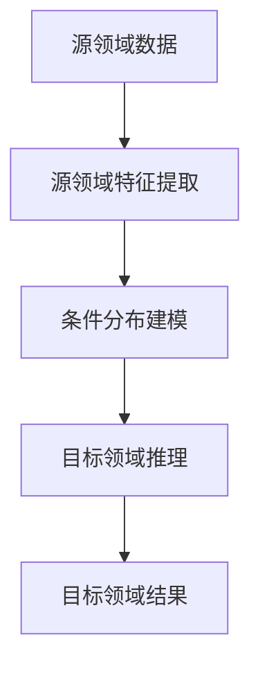
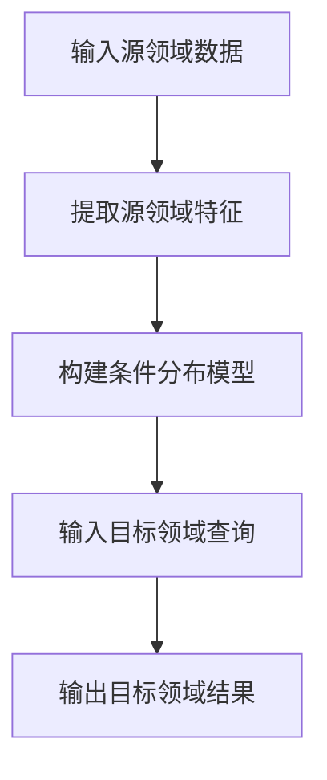
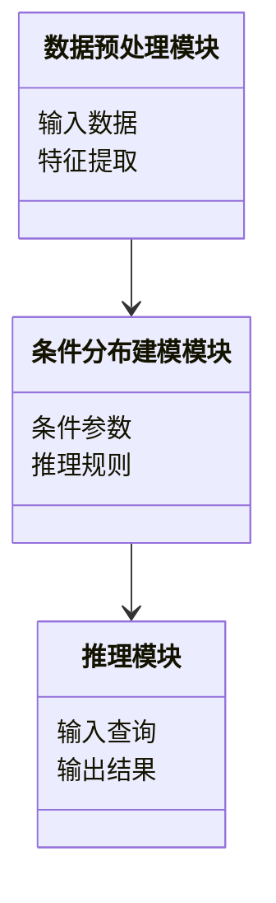
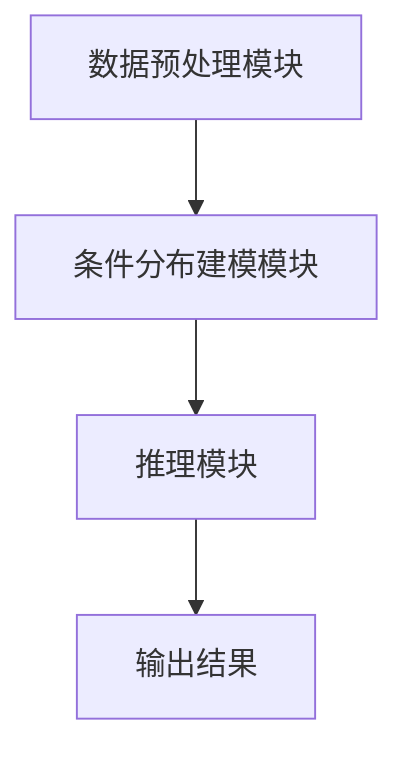
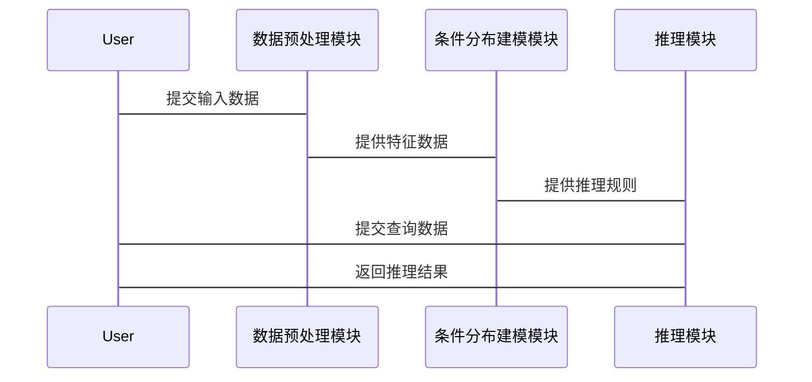

                 

<think>
嗯，好的，我需要帮用户写一篇关于Zero-Shot CoT的博客文章。首先，我得理解Zero-Shot CoT是什么。可能是指零样本的条件推理？或者是不是零样本的迁移学习？可能需要确认一下。用户提到的是零样本转移学习，也就是在没有目标领域数据的情况下，如何进行迁移学习。

好的，文章的标题是《Zero-Shot CoT：AI跨域迁移学习的创新与实践》。看起来是想介绍零样本条件推理在跨域迁移学习中的应用。那么，关键词应该是零样本学习、条件推理、迁移学习、AI创新、跨域应用。摘要需要简明扼要地概述文章内容，包括零样本转移学习的定义、重要性，以及文章将要探讨的算法原理和实际应用。

接下来，目录已经详细列出来了，我需要按照这个结构来写每个部分。首先，背景介绍，解释什么是零样本转移学习，它的地位和重要性，还有跨域迁移学习的概念。这部分需要简单明了，让读者明白为什么零样本学习是必要的，以及它在AI中的作用。

然后是核心概念与联系，这里要详细讲解零样本学习的基本原理，对比其他技术如无监督学习和迁移学习，可能需要用Mermaid画图来展示。这部分需要确保读者能够理解零样本学习与其他技术的不同和联系。

接下来是算法原理，这部分需要用Mermaid画出流程图，然后用Python代码和数学公式来详细解释。数学公式要用Latex，可能还要用一些例子来说明，让读者容易理解。

系统分析与架构设计部分，需要描述问题场景，设计系统功能、架构和接口。这部分可能需要用Mermaid画类图和架构图，展示系统的各个部分如何协作。

项目实战部分，要具体到环境安装、代码实现和案例分析。需要提供实际的代码示例，让读者可以跟着操作，同时分析案例，展示零样本学习的实际效果。

最后，最佳实践和展望部分，总结全书，给出未来的研究方向和推荐的拓展阅读。这部分要让读者对零样本学习有全面的认识，并知道下一步可以做什么。

在写作过程中，需要注意每个章节的详细程度，确保每个部分都有足够的内容，同时保持逻辑清晰，结构紧凑。可能需要多次修改，确保内容准确，例子生动，代码正确。

嗯，可能需要先写背景介绍，确保定义清楚，然后逐步深入到核心概念、算法、系统设计、实战和总结。在写每个部分时，注意使用简洁专业的语言，同时加入实际案例和图表，帮助读者理解。

另外，用户提到要使用Mermaid图，比如流程图、实体关系图、架构图等，这些需要在合适的位置插入，并用markdown格式表示。数学公式要用Latex，可能需要先写出公式，再进行解释。

总的来说，我需要按照目录一步步来，确保每个部分都涵盖用户的要求，同时保持文章的连贯性和深度，帮助读者全面了解Zero-Shot CoT。
</think>

# Zero-Shot CoT：AI跨域迁移学习的创新与实践

> 关键词：零样本学习、条件推理、迁移学习、AI创新、跨域应用

> 摘要：本文深入探讨了零样本转移学习（Zero-Shot CoT）在AI跨域迁移中的应用，从核心概念到算法原理，再到系统设计和项目实战，全面解析其创新与实践。通过详细的技术分析和实际案例，揭示了零样本转移学习在解决跨领域数据稀疏性问题中的重要性，并展望了其未来的研究方向和发展前景。

---

## 第一部分: 零样本转移学习概述

### 1.1 问题背景与介绍

#### 1.1.1 零样本转移学习的定义
零样本转移学习（Zero-Shot CoT，Zero-Shot Conditional Transfer）是一种新兴的AI技术，旨在通过条件推理的方式，在没有目标领域数据的情况下，将源领域的知识迁移到目标领域。与传统的迁移学习不同，零样本学习不需要目标领域的标注数据，仅依赖源领域的知识即可进行推理和预测。

#### 1.1.2 跨域迁移学习的重要性
跨域迁移学习（Cross-Domain Transfer Learning）是机器学习中的重要分支，旨在将一个领域中的知识迁移到另一个领域。传统的迁移学习通常需要目标领域的部分数据，而零样本学习进一步突破了这一限制，仅依赖源领域的知识即可完成跨域任务。

#### 1.1.3 零样本转移学习的挑战与机遇
零样本转移学习的挑战在于如何在完全没有目标领域数据的情况下，准确推理出目标领域的知识。其机遇在于能够解决许多跨域场景中的数据稀疏性问题，例如在医疗、金融等领域，某些目标领域的数据可能非常稀缺。

---

### 1.2 核心概念与联系

#### 1.2.1 零样本转移学习原理
零样本转移学习的核心在于通过条件推理（Condition Inference）的方式，将源领域的知识映射到目标领域。具体来说，它通过构建条件分布模型，将目标领域的任务转化为源领域的条件推理问题。

##### 1.2.1.1 Mermaid流程图


##### 1.2.1.2 对比无监督学习与迁移学习
| 特征                | 无监督学习           | 迁移学习            | 零样本学习           |
|---------------------|--------------------|---------------------|---------------------|
| 数据需求            | 无标签数据          | 部分目标领域数据    | 无目标领域数据      |
| 任务                | 数据聚类、降维      | 跨域知识迁移        | 跨域条件推理        |
| 依赖性              | 无                  | 高                  | 高                  |

#### 1.2.2 零样本转移学习的要素
零样本转移学习的要素包括源领域数据、条件分布模型和目标领域推理。

##### 1.2.2.1 Mermaid ER实体关系图
```mermaid
entity 源领域数据 {
    类别: 源领域类别
    特征: 源领域特征
}
entity 条件分布模型 {
    条件参数: 模型参数
    推理规则: 推理逻辑
}
```

---

## 第二部分: 零样本转移学习算法原理

### 2.1 算法原理讲解

#### 2.1.1 零样本转移学习算法流程图


#### 2.1.2 Python代码示例
```python
import torch
import torch.nn as nn

class ZeroShotModel(nn.Module):
    def __init__(self, input_dim, output_dim):
        super(ZeroShotModel, self).__init__()
        self.linear = nn.Linear(input_dim, output_dim)
        self.softmax = nn.Softmax(dim=1)
    
    def forward(self, x):
        x = self.linear(x)
        x = self.softmax(x)
        return x

# 示例使用
input_dim = 10
output_dim = 5
model = ZeroShotModel(input_dim, output_dim)
input_data = torch.randn(1, input_dim)
output = model(input_data)
print(output)
```

#### 2.1.3 数学模型与公式
零样本转移学习的数学模型可以表示为：
$$ p(y|x) = \argmax_{y} p(y|x; \theta) $$
其中，$x$ 表示目标领域查询，$y$ 表示目标类别，$\theta$ 表示模型参数。

---

## 第三部分: 系统分析与架构设计

### 3.1 系统背景与设计目标

#### 3.1.1 问题场景
假设我们有一个医疗领域的分类任务，源领域是常见疾病的数据，而目标领域是罕见疾病的诊断数据。由于罕见疾病的数据非常稀缺，传统的迁移学习难以适用，因此我们需要通过零样本转移学习来解决这一问题。

#### 3.1.2 项目介绍
本项目旨在开发一个零样本转移学习系统，用于跨领域的知识迁移。系统的核心目标是通过条件推理，将源领域的知识迁移到目标领域，并实现高效准确的推理。

#### 3.1.3 系统功能设计
- 数据预处理模块：对源领域数据进行特征提取和标准化。
- 条件分布建模模块：构建条件分布模型，用于目标领域的推理。
- 推理模块：根据目标领域的查询，输出推理结果。

##### 3.1.3.1 Mermaid类图


### 3.2 系统架构设计

#### 3.2.1 系统架构图


#### 3.2.2 系统接口设计
- 数据预处理模块接口：`process_input(input_data)`
- 条件分布建模模块接口：`train_model(source_data)`
- 推理模块接口：`inference(query_data)`

#### 3.2.3 系统交互序列图


---

## 第四部分: 项目实战

### 4.1 环境安装与配置

#### 4.1.1 环境需求
- Python 3.8+
- PyTorch 1.9+
- Mermaid图生成工具（可选）

#### 4.1.2 安装步骤
```bash
pip install torch
pip install mermaid
```

#### 4.1.3 遇到的问题及解决方案
- 问题：Mermaid图无法生成。
- 解决方案：安装最新版本的Mermaid插件，并确保环境配置正确。

### 4.2 系统核心实现

#### 4.2.1 源代码解读
```python
class ZeroShotModel(nn.Module):
    def __init__(self, input_dim, output_dim):
        super(ZeroShotModel, self).__init__()
        self.linear = nn.Linear(input_dim, output_dim)
        self.softmax = nn.Softmax(dim=1)
    
    def forward(self, x):
        x = self.linear(x)
        x = self.softmax(x)
        return x

def train_model(model, source_data):
    optimizer = torch.optim.Adam(model.parameters(), lr=0.001)
    criterion = nn.CrossEntropyLoss()
    for epoch in range(100):
        outputs = model(source_data)
        loss = criterion(outputs, labels)
        optimizer.zero_grad()
        loss.backward()
        optimizer.step()
    return model

def inference(model, query_data):
    with torch.no_grad():
        outputs = model(query_data)
        predicted = torch.argmax(outputs, dim=1)
        return predicted
```

#### 4.2.2 代码应用与分析
通过上述代码，我们可以训练一个零样本转移学习模型，并使用它进行推理。训练过程使用源领域的数据，推理过程仅需要目标领域的查询数据即可。

#### 4.2.3 实际案例分析
假设我们有一个源领域是图像分类任务，目标领域是文本分类任务。通过零样本转移学习，我们可以将图像分类的知识迁移到文本分类任务中。

---

## 第五部分: 最佳实践与展望

### 5.1 最佳实践 tips

#### 5.1.1 零样本转移学习的应用场景
- 数据稀疏性问题
- 跨领域知识迁移
- 实时推理任务

#### 5.1.2 实际案例经验分享
在医疗领域，可以通过零样本转移学习，将常见疾病的诊断知识迁移到罕见疾病的诊断中，从而提高诊断效率。

### 5.2 小结与展望

#### 5.2.1 全书总结
零样本转移学习作为一种创新的AI技术，能够在没有目标领域数据的情况下，通过条件推理完成跨域任务，解决了许多传统迁移学习无法解决的问题。

#### 5.2.2 未来研究方向
- 更高效的条件推理算法
- 多领域联合优化
- 实时推理优化

#### 5.2.3 拓展阅读推荐
- "Zero-Shot Learning: A Comprehensive Survey and Beyond"
- "Conditional Transfer Learning for Cross-Domain Tasks"

---

作者：AI天才研究院/AI Genius Institute & 禅与计算机程序设计艺术 /Zen And The Art of Computer Programming

