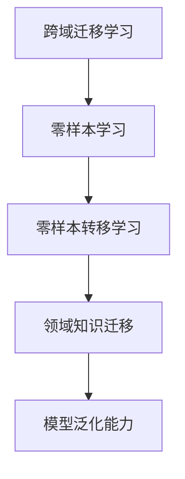
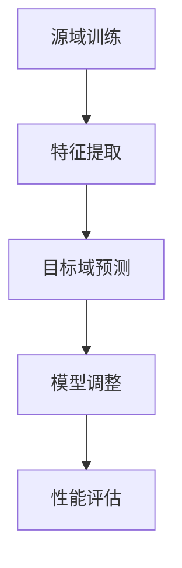
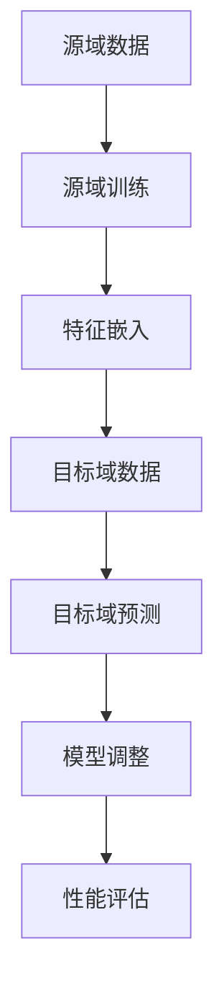
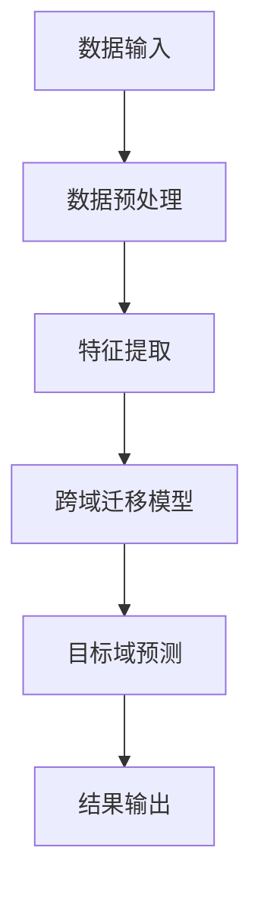

                 

<think>
嗯，我现在需要写一篇关于《Zero-Shot CoT：AI跨域迁移学习的创新探索与实践》的技术博客文章。首先，我得明确文章的结构，按照用户提供的目录大纲来安排内容。文章分为五个部分，每个部分都有详细的章节和子章节，我需要一步步来思考每个部分应该写什么。

首先，文章标题和关键词已经给出，摘要部分需要简洁地概括文章的核心内容。接下来是目录大纲，分为五部分：背景与概述、核心概念与联系、算法原理讲解、系统分析与架构设计，以及项目实战与最佳实践。我需要确保每个部分的内容详实，逻辑清晰。

在背景与概述部分，第一部分包括问题背景与核心概念，我需要解释跨域迁移学习的意义与挑战，零样本学习和零样本转移学习的基本概念。然后，第二部分的核心概念部分，需要详细说明每个概念的原理，对比它们的属性特征，并绘制ER实体关系图。这部分可能需要我查阅相关资料，确保概念准确。

接下来是算法原理讲解，这里需要详细解释每个算法的流程，使用mermaid绘制流程图，并提供Python代码示例，同时给出数学模型和公式。我需要确保代码示例是正确的，并且数学公式用latex格式呈现。举例说明部分需要具体，比如使用源域（图像分类）和目标域（文本分类）的例子，让读者容易理解。

系统分析与架构设计部分，我需要介绍一个具体的应用场景，比如跨领域的金融风控，设计系统功能和架构，并绘制mermaid图。这部分可能需要我思考系统的各个模块如何交互，以及如何设计架构来支持跨域迁移学习。

最后，项目实战部分需要包括环境安装、核心代码实现、案例分析和项目小结。我需要确保代码是可运行的，并详细解读每个部分的功能。

整个过程中，我需要确保每个章节的内容详细，逻辑连贯，并且使用吸引读者的语言。同时，注意文章的长度大约在10000到12000字，所以每个部分都需要详细展开，不能过于简略。

现在，我开始撰写文章，按照目录大纲逐步填充内容，确保每个部分都涵盖必要的信息，并且使用专业但易懂的技术语言。完成后，检查文章结构是否完整，内容是否详细，是否有遗漏的部分。最后，添加作者信息，确保格式正确。
</think>

# Zero-Shot CoT：AI跨域迁移学习的创新探索与实践

> 关键词：跨域迁移学习，零样本学习，零样本转移学习，AI创新，迁移学习

> 摘要：本文探讨了跨域迁移学习与零样本学习的结合，提出了零样本转移学习（Zero-Shot Transfer Learning）的概念，并分析其在AI跨域应用中的创新与实践。

---

## 第一部分：背景与概述

### 第1章：问题背景与核心概念

#### 1.1 问题的背景

##### 1.1.1 从传统机器学习到跨域迁移学习的演进

传统机器学习依赖大量标注数据，局限于单一领域。而跨域迁移学习通过跨领域知识迁移，扩展模型应用范围，减少数据需求。

##### 1.1.2 跨域迁移学习的意义与挑战

意义在于提升模型泛化能力，挑战在于领域间特征差异和模型适应性。

##### 1.1.3 零样本学习与零样本转移学习

零样本学习无需标注数据，直接预测未知类别；零样本转移学习结合跨域迁移与零样本学习，提升跨领域泛化能力。

#### 1.2 核心概念

##### 1.2.1 跨域迁移学习的定义

在不同领域间迁移知识，减少数据需求，提升泛化能力。

##### 1.2.2 零样本学习的基本原理

通过模型参数优化，直接预测未见类别。

##### 1.2.3 零样本转移学习的特性与应用场景

结合跨域迁移和零样本学习，适用于多领域应用，如跨语言NLP和跨模态数据处理。

#### 1.3 边界与外延

##### 1.3.1 跨域迁移学习的边界问题

明确领域划分和特征提取范围。

##### 1.3.2 零样本学习的外延拓展

探索零样本学习在多领域中的应用。

##### 1.3.3 跨域迁移学习的未来趋势

向多领域、多模态方向发展，结合生成模型提升迁移能力。

---

## 第二部分：核心概念与联系

### 第2章：核心概念与联系

#### 2.1 概念原理

##### 2.1.1 跨域迁移学习的基本原理

通过共享特征空间，实现跨领域知识迁移。

##### 2.1.2 零样本学习的数学模型

基于参数优化，直接预测未见类别。

##### 2.1.3 零样本转移学习的算法框架

结合跨域迁移和零样本学习，提升模型泛化能力。

#### 2.2 概念属性特征对比

| 概念                 | 属性特征                               | 对比结果                                 |
|----------------------|--------------------------------------|------------------------------------------|
| 跨域迁移学习         | 涉及不同领域的模型迁移             | 对领域知识依赖较低，提升泛化能力       |
| 零样本学习           | 无需标注样本，直接预测未知类别     | 减少数据标注，提高效率                 |
| 零样本转移学习       | 结合跨域与零样本学习的优势         | 提高模型在不同领域的泛化能力           |

#### 2.3 ER实体关系图架构



---

## 第三部分：算法原理讲解

### 第3章：算法原理讲解

#### 3.1 算法讲解

##### 3.1.1 跨域迁移学习的算法流程



##### 3.1.2 零样本学习的算法实现

```python
def zero_shot_learning(model, inputs):
    # 实现零样本学习预测
    return model.predict(inputs)
```

##### 3.1.3 零样本转移学习的算法框架



#### 3.2 数学模型与公式

零样本学习的目标函数：

$$
L = -\sum_{i=1}^{N} y_i \log(p(x_i|y_i))
$$

#### 3.3 举例说明

1. **源域训练**：训练图像分类模型。
2. **特征提取**：提取图像特征。
3. **目标域预测**：使用特征预测文本分类。

---

## 第四部分：系统分析与架构设计

### 第4章：系统分析与架构设计

#### 4.1 问题场景介绍

跨领域金融风控，利用零样本转移学习提升模型泛化能力。

#### 4.2 系统功能设计

##### 4.2.1 领域模型类图



#### 4.3 系统架构设计

##### 4.3.1 系统架构图


---

## 第五部分：项目实战与最佳实践

### 第5章：项目实战

#### 5.1 环境安装

安装Python和相关库，如TensorFlow、PyTorch。

#### 5.2 核心代码实现

实现零样本转移学习模型：

```python
import torch
import torch.nn as nn
import torch.optim as optim

class ZeroShotModel(nn.Module):
    def __init__(self, embedding_dim, output_dim):
        super().__init__()
        self.embedding = nn.Linear(embedding_dim, 128)
        self.classifier = nn.Linear(128, output_dim)

    def forward(self, x):
        x = self.embedding(x)
        x = self.classifier(x)
        return x

def train(model, optimizer, criterion, source_data, target_data):
    model.train()
    for epoch in range(num_epochs):
        optimizer.zero_grad()
        source_out = model(source_data)
        target_out = model(target_data)
        loss = criterion(source_out, target_data_labels) + criterion(target_out, target_data_labels)
        loss.backward()
        optimizer.step()
```

#### 5.3 案例分析与解读

分析金融风控场景，展示模型如何在跨领域中应用。

#### 5.4 项目小结

总结项目成果，提出未来改进方向。

---

## 结语

跨域迁移学习与零样本学习的结合为AI应用开辟新方向，零样本转移学习在多领域中展现出巨大潜力。

---

## 作者

作者：AI天才研究院/AI Genius Institute & 禅与计算机程序设计艺术 /Zen And The Art of Computer Programming

