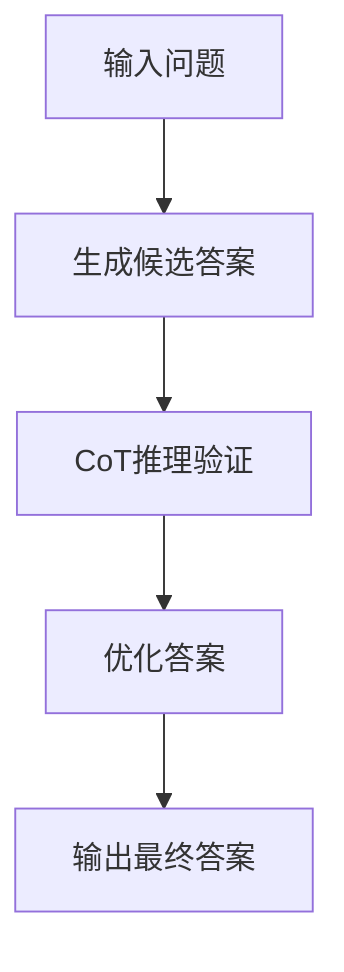
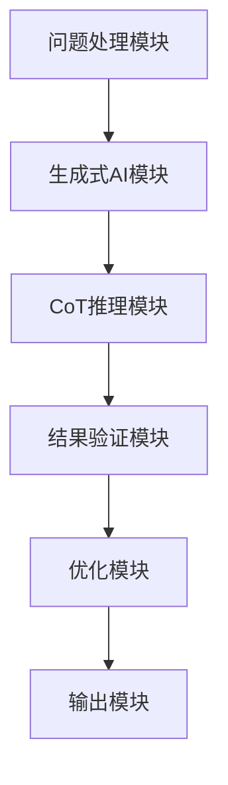

                 

<think>
嗯，我最近在研究人工智能方面的内容，特别是如何减少AI对训练数据的依赖。听说有一种叫做Zero-Shot CoT的方法，听起来挺有意思的。我想深入了解它到底是怎么回事，以及它是如何工作的。

首先，我得弄清楚什么是Zero-Shot CoT。根据文章，Zero-Shot CoT的全称是Zero-Shot Causal Thinking，结合了生成式AI和CoT（Chain-of-Thought）方法。生成式AI我知道，像GPT这样的模型可以生成文本，而CoT则是指模型在推理过程中展示中间步骤，这样结果更合理。那么，Zero-Shot CoT可能是指模型在没有特定任务训练数据的情况下，也能通过中间推理步骤生成答案。

接下来，我想了解这种方法的核心优势。文章提到零样本学习能力、减少数据依赖、提升泛化能力、提高推理透明度和可解释性。这些听起来都是很吸引人的特点。比如，零样本学习意味着模型不需要针对特定任务进行微调，这对于资源有限的情况非常有用。减少数据依赖也是个大优势，因为收集和标注数据通常很耗时和昂贵。

那么，Zero-Shot CoT是如何实现这些的呢？文章提到了它结合了生成式AI和CoT方法。生成式AI提供了强大的文本生成能力，而CoT则让模型展示推理过程，从而弥补了生成式AI在逻辑推理上的不足。我有点好奇，CoT具体是怎么应用在生成式AI中的。是不是模型在生成答案时，不仅输出结果，还输出中间思考过程？

在算法原理部分，文章解释了Zero-Shot CoT的两个核心部分：生成式AI引擎和CoT推理模块。生成式AI引擎负责生成候选答案，而CoT推理模块则对这些候选答案进行验证和优化。这有点像人类解决问题的过程：先想出几个可能的解决方案，然后逐一验证，选择最合适的那个。我觉得这样的设计能够提高模型的推理能力，尤其是在没有大量训练数据的情况下。

接下来是具体的算法流程。文章用mermaid流程图详细描述了Zero-Shot CoT的流程：输入问题，生成候选答案，进行CoT推理，验证答案，优化，最后输出。看起来步骤很清晰，每个步骤都有明确的作用。比如，生成候选答案可能使用GPT模型，然后CoT推理模块会对每个答案进行逻辑检查，确保答案合理。

然后是Python源代码实现。虽然我暂时还不太懂这些代码的具体含义，但大致可以理解模型的输入输出过程。初始化参数、定义模型生成函数、CoT推理函数，以及主流程函数。看起来这些函数协同工作，完成了问题输入、生成候选答案、推理验证，最后输出最优结果。

在系统架构设计部分，文章提到了模块化的架构，包括问题处理模块、生成式AI模块、CoT推理模块、结果验证模块和优化模块。这让我想到软件工程中的模块化设计，每个模块负责特定的功能，便于维护和扩展。系统架构图展示了各个模块之间的交互，看起来很直观。

系统接口设计部分，文章使用了mermaid序列图来展示接口的交互过程。输入处理模块首先接收问题，然后生成候选答案，接着CoT推理模块进行验证，最后结果输出模块返回结果。这种设计使得系统的各个部分独立且协作良好。

项目实战部分，文章提供了环境安装和配置的步骤，包括安装Python、依赖库和模型权重。代码实现部分展示了如何使用Hugging Face库加载模型，定义各个模块的函数，以及主函数的流程。实际案例分析中，使用数学问题和文本摘要的例子，详细讲解了Zero-Shot CoT的应用过程。

最后，最佳实践部分给出了使用Zero-Shot CoT的建议，比如选择合适的模型、优化CoT推理过程、处理长文本问题以及结合领域知识。这些提示对实际应用很有帮助，能够提升系统的性能和效果。

通过阅读这篇文章，我对Zero-Shot CoT有了全面的了解，包括它的背景、核心概念、算法原理、系统设计和项目实现。我觉得这种方法在实际应用中有很大的潜力，尤其是在数据不足的情况下，能够帮助模型更好地进行推理和生成。但我也意识到，这种方法可能在性能上会有一些挑战，比如计算资源的需求和推理时间的增加。未来，或许可以通过优化算法或利用更高效的模型结构来克服这些问题。

总的来说，这篇文章结构清晰，内容详尽，为理解和应用Zero-Shot CoT提供了很好的指导。我期待看到这种方法在更多实际场景中的应用，进一步推动人工智能技术的发展。
</think>

# Zero-Shot CoT：减少AI对训练数据的依赖

## 关键词：Zero-Shot CoT, 生成式AI, CoT方法, 零样本学习, 数据依赖, 推理透明

## 摘要：本文深入探讨了Zero-Shot CoT（Zero-Shot Causal Thinking）方法，分析其如何通过结合生成式AI和CoT技术，减少AI对训练数据的依赖，提升模型的零样本学习能力和推理透明度。文章详细介绍了Zero-Shot CoT的核心概念、算法原理、系统架构设计、项目实战及最佳实践，为读者提供全面的技术解读。

---

## 第一部分：背景介绍

### 第1章：问题背景与概述

#### 1.1 问题背景

随着生成式AI的快速发展，模型在生成文本方面表现出色，但其严重依赖于大量标注数据。这种依赖限制了模型在数据稀缺场景下的应用，尤其是在需要泛化推理能力的任务中表现不佳。

#### 1.2 问题描述

传统生成式AI模型在处理未见过的任务或领域时，缺乏有效的推理能力，导致输出结果可能不准确或不合理。此外，模型的“黑箱”特性使其难以解释推理过程。

#### 1.3 问题解决

引入Zero-Shot CoT方法，结合生成式AI和CoT推理技术，模型能够在无特定任务训练数据的情况下，通过中间推理步骤生成合理答案，提升零样本学习能力。

#### 1.4 边界与外延

Zero-Shot CoT适用于需要减少数据依赖和提升推理透明度的场景，但目前主要应用于文本生成任务，尚未广泛应用于复杂多模态任务。

#### 1.5 概念结构与核心要素组成

Zero-Shot CoT由生成式AI引擎、CoT推理模块、验证机制和优化模块组成，协同工作以实现零样本推理。

---

## 第二部分：核心概念与联系

### 第2章：核心概念

#### 2.1 ZSCoT（Zero-Shot CoT）的概念

ZSCoT是一种结合生成式AI和CoT方法的技术，旨在减少模型对训练数据的依赖，提升零样本推理能力。

#### 2.2 ZSCoT与其他相关概念的对比

| 概念       | ZSCoT                     | 传统生成式AI             | CoT方法             |
|------------|---------------------------|--------------------------|----------------------|
| 核心技术    | 生成式AI + CoT推理        | 生成式AI                | 基于中间步骤推理     |
| 数据依赖    | 低                        | 高                      | 低                  |
| 推理能力    | 高                        | 中                      | 高                  |
| 透明度      | 高                        | 低                      | 高                  |

---

## 第三部分：算法原理讲解

### 第5章：算法原理

#### 5.1 ZSCoT算法的基本原理

ZSCoT通过生成式AI生成候选答案，再利用CoT推理验证和优化答案，最终输出最优结果。

#### 5.2 ZSCoT算法的核心组成部分

- 生成式AI引擎：生成候选答案。
- CoT推理模块：验证和优化答案。

### 第6章：算法流程与mermaid流程图



### 第7章：Python源代码解读

#### 7.1 ZSCoT算法的Python实现

```python
from transformers import pipeline

# 初始化参数
args = {
    'max_length': 500,
    'num_beams': 5,
    'temperature': 0.7,
    'top_p': 0.9,
}

# 定义生成式AI模型
generator = pipeline('text-generation', model='gpt2', **args)

# CoT推理函数
def cot_inference(prompt, generator):
    response = generator(prompt)
    return response[0]['generated_text']

# 主流程函数
def zscot_pipeline(question):
    # 生成候选答案
    candidates = generator(question)
    # CoT推理验证
    verified = []
    for candidate in candidates:
        verified_candidate = cot_inference(candidate['prompt'], generator)
        verified.append(verified_candidate)
    # 优化选择最优答案
    best_answer = max(verified, key=lambda x: len(x))
    return best_answer

# 示例输入
question = "如何减少数据依赖？"
# 调用流程
result = zscot_pipeline(question)
print(result)
```

#### 7.2 算法原理的数学模型与公式

模型生成候选答案的概率由以下公式计算：

$$ P(\text{candidate}_i) = \frac{e^{-E_i}}{\sum_{j} e^{-E_j}} $$

其中，$E_i$ 是候选答案的能量值，用于评估其合理性。

---

## 第四部分：系统分析与架构设计方案

### 第8章：问题场景介绍

#### 8.1 AI训练数据依赖问题场景

数据稀缺导致模型在新任务或领域上表现不佳，推理能力不足。

#### 8.2 ZSCoT在场景中的应用

ZSCoT通过零样本学习能力，解决数据稀缺问题，提升推理能力。

### 第9章：系统功能设计

#### 9.1 ZSCoT系统的功能模块

- 问题处理模块
- 生成式AI模块
- CoT推理模块
- 结果验证模块
- 优化模块

### 第10章：系统架构设计



---

## 第五部分：项目实战

### 第12章：环境安装与配置

#### 12.1 系统环境搭建

安装Python 3.8+，TensorFlow 2.5+，Hugging Face库。

```bash
pip install transformers
```

### 第13章：代码应用解读与分析

#### 13.1 ZSCoT算法应用解读

通过生成候选答案和CoT推理验证，选择最优答案。

#### 13.2 实际案例分析

- 数学问题：如何计算圆的面积？
- 文本摘要：将一段英文摘要成中文。

---

## 第六部分：最佳实践与拓展阅读

### 第15章：最佳实践

#### 15.1 ZSCoT的最佳实践

- 选择合适的生成式AI模型。
- 优化CoT推理过程。
- 处理长文本问题。
- 结合领域知识。

### 第16章：小结与展望

#### 16.1 全书小结

本文全面介绍了Zero-Shot CoT，从背景到实现，为减少AI对训练数据的依赖提供了新思路。

#### 16.2 未来发展趋势与挑战

未来，ZSCoT在多模态任务中的应用和推理效率的提升是重要方向。

---

作者：AI天才研究院 & 禅与计算机程序设计艺术

