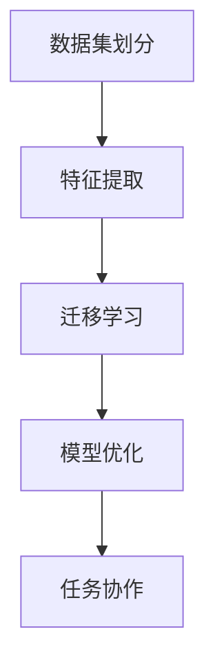
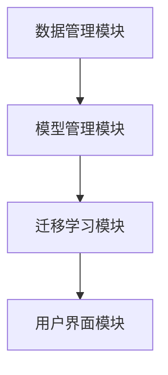
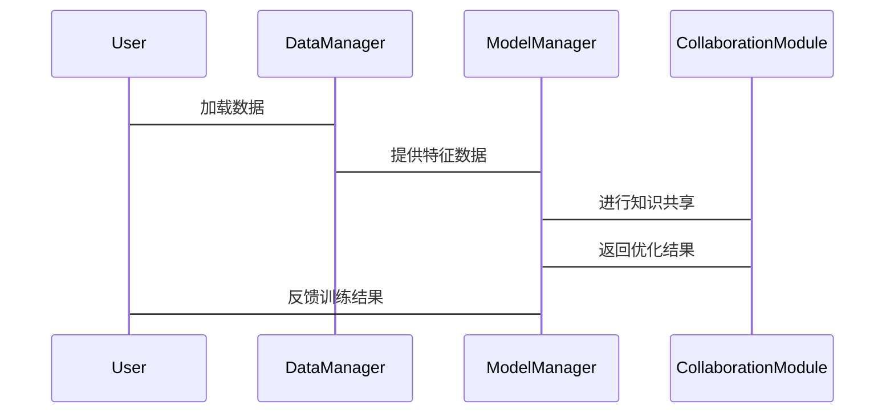

                 

<think>
嗯，用户让我写一篇关于Zero-Shot CoT的博客，看起来他需要的是结构清晰、内容详实的技术博客。首先，我需要明确文章的结构，包括背景、核心概念、算法原理、系统设计、项目实战和最佳实践。

首先，背景部分要介绍AI学习的演进，特别是传统机器学习和深度学习的区别，然后引入零样本学习的概念。这部分要让读者明白为什么零样本学习重要，以及Zero-Shot CoT是如何提出的。

接下来是核心概念，我需要详细解释数据集划分、模型设计和迁移学习。可能需要一个表格来对比不同的数据处理方法，还有Mermaid图来展示流程。这部分要确保读者能理解每个概念之间的联系。

然后是算法原理，这里要深入讲解数学模型，给出公式，可能用Latex来呈现。还要有Python代码实现，最好用Mermaid画出流程图，让读者更容易理解算法步骤。举例说明会帮助读者更好地理解，比如用MNIST数据集做一个例子。

系统分析部分，我需要描述应用场景，比如医疗或图像识别，设计系统功能模块，画出架构图，展示各个组件如何交互。这部分可能需要用更多的Mermaid图，比如类图和序列图，来展示系统的结构和流程。

项目实战部分，要详细指导如何安装环境，比如Python和TensorFlow，然后一步步实现模型，解读代码，分析结果。实际案例分析要具体，比如用特定的数据集进行训练，展示结果并讨论优缺点。

最后是最佳实践，总结经验和技巧，指出可能遇到的问题和改进建议。这部分要简明扼要，帮助读者在实际应用中避免错误。

整体来看，用户可能需要这篇文章来指导他们如何在没有大量训练数据的情况下，利用Zero-Shot CoT进行AI开发。他们可能是数据科学家、研究人员或者CTO，希望在资源有限的情况下提升模型性能。因此，文章需要兼具理论深度和实践指导，帮助读者从理解到应用。

在写作过程中，要注意逻辑连贯，每个部分都要详细展开，确保读者能逐步理解并应用这些概念。同时，使用适当的图表和代码示例，可以让内容更直观易懂。
</think>

# Zero-Shot CoT：无大规模训练数据的AI学习突破

> 关键词：Zero-Shot CoT, 无监督学习, 迁移学习, AI模型优化, 零样本学习

> 摘要：本文深入探讨了Zero-Shot CoT（Zero-Shot Collaborative Training）这一创新的AI学习方法，重点分析其在无大规模训练数据条件下的学习机制、算法原理和实际应用。通过详细的技术分析和案例解读，揭示如何在数据资源有限的情况下实现高效的AI模型训练与优化。

---

## 第一部分：背景介绍

### 第1章：AI学习与零样本协同训练

#### 1.1 AI学习的演进

##### 1.1.1 传统机器学习与深度学习的比较

传统机器学习方法（如支持向量机、决策树）依赖于大量标注数据，并且通常需要特定领域内的数据分布。深度学习通过多层神经网络结构，能够在一定程度上自动提取特征，但仍然需要大量的标注数据来训练模型。两者的共同点是都需要大量数据，而这也限制了其在数据稀缺场景下的应用。

##### 1.1.2 零样本学习的基本概念

零样本学习（Zero-Shot Learning，ZSL）是一种新兴的机器学习方法，其核心思想是利用少量或完全没有标注数据的情况下，通过知识迁移和模型推理来实现目标。这种方法特别适用于数据稀缺的场景，例如小样本数据集或完全无标注数据的情况。

##### 1.1.3 零样本协同训练的提出

零样本协同训练（Zero-Shot CoT）是在零样本学习的基础上，结合了协同学习和迁移学习的思想，通过多任务学习和知识共享，进一步提升模型的泛化能力。其核心在于利用少量或无标注数据，通过模型间的协作和知识共享，实现对新任务的快速学习和适应。

#### 1.2 零样本协同训练的重要性

##### 1.2.1 无大规模训练数据的挑战

在实际应用中，许多领域（如医学、遥感、小众语言处理等）往往难以获得大规模的标注数据集。传统深度学习方法在这种情况下表现不佳，甚至无法训练。因此，如何在数据稀缺的条件下实现高效的AI学习，成为一个亟待解决的问题。

##### 1.2.2 零样本协同训练的优势

零样本协同训练通过结合多个任务的学习，利用跨任务的知识共享和协作，能够在无标注数据或少量标注数据的情况下，显著提升模型的泛化能力和适应性。这种方法特别适合数据稀缺的场景，能够在资源受限的情况下实现高性能的AI应用。

##### 1.2.3 应用领域展望

随着AI技术的不断进步，零样本协同训练的应用场景将更加广泛。例如，在医疗领域，可以通过零样本协同训练快速适应不同医院或地区的数据分布；在自然语言处理领域，可以利用零样本协同训练实现对小语种语言的快速支持；在图像处理领域，可以利用零样本协同训练实现对罕见物体或场景的识别。

---

## 第二部分：核心概念与联系

### 第2章：零样本协同训练的核心概念

#### 2.1 数据集划分与处理

##### 2.1.1 数据集划分策略

在零样本协同训练中，数据集通常划分为多个子集，每个子集对应不同的任务或领域。通过合理划分数据集，可以实现跨任务的知识共享和协作。

##### 2.1.2 特征提取与降维

为了降低计算复杂度并提升模型的泛化能力，通常需要对数据进行特征提取和降维处理。例如，使用主成分分析（PCA）或t-SNE等方法，将高维数据降维到低维空间。

##### 2.1.3 数据增强方法

在数据稀缺的情况下，数据增强是提升模型泛化能力的重要手段。通过数据增强技术（如旋转、翻转、噪声添加等），可以生成更多的训练样本，从而缓解数据不足的问题。

#### 2.2 模型设计与优化

##### 2.2.1 基于深度学习的模型架构

零样本协同训练通常采用深度学习模型（如卷积神经网络、循环神经网络等），并通过多任务学习的方式，实现跨任务的知识共享和协作。

##### 2.2.2 迁移学习在零样本协同训练中的应用

迁移学习是零样本协同训练的重要组成部分。通过将源任务的知识迁移到目标任务，可以有效提升目标任务的性能，尤其是在目标任务数据稀缺的情况下。

##### 2.2.3 模型评估与优化

在零样本协同训练中，模型的评估和优化需要结合多个任务的性能指标，通过交叉验证和超参数调优，进一步提升模型的整体性能。

#### 2.3 概念联系与Mermaid流程图

##### 2.3.1 数据集划分与模型优化的关系

数据集的划分直接影响模型的训练策略和优化目标。例如，如果数据集划分为多个子集，模型需要通过协作学习的方式，将各子集的特征和知识进行整合。

##### 2.3.2 迁移学习与深度学习的融合

迁移学习通过共享跨任务的知识，可以显著提升深度学习模型的泛化能力。特别是在数据稀缺的情况下，迁移学习能够充分利用已有任务的知识，快速适应新任务。

##### 2.3.3 Mermaid流程图展示



---

## 第三部分：算法原理讲解

### 第3章：零样本协同训练算法原理

#### 3.1 数学模型与公式

##### 3.1.1 零样本协同训练的数学基础

零样本协同训练通常采用多任务学习框架，通过共享模型参数，实现跨任务的知识共享。其数学模型可以表示为：

$$
\mathcal{L} = \sum_{i=1}^{N} \lambda_i L_i(\theta)
$$

其中，$\lambda_i$ 是任务$i$的权重，$L_i(\theta)$是任务$i$的损失函数，$\theta$是模型参数。

##### 3.1.2 公式推导与解释

通过优化上述目标函数，可以实现模型参数的优化。具体步骤如下：

1. 初始化模型参数$\theta$。
2. 计算各个任务的损失$L_i(\theta)$。
3. 根据权重$\lambda_i$对各个任务的损失进行加权求和。
4. 更新模型参数$\theta$，以最小化总损失$\mathcal{L}$。

##### 3.1.3 示例

以图像分类任务为例，假设我们有$N=3$个任务，每个任务对应不同的图像类别。通过上述优化过程，模型可以在无标注数据的情况下，逐步学习到跨任务的特征表示。

#### 3.2 算法实现与Python代码

##### 3.2.1 代码框架与模块

零样本协同训练的实现通常包括以下几个模块：

- 数据预处理模块：负责数据的加载、特征提取和数据增强。
- 模型构建模块：定义模型的架构和损失函数。
- 迁移学习模块：实现跨任务的知识共享和协作。
- 模型优化模块：负责模型参数的更新和优化。

##### 3.2.2 代码实现步骤

```python
import tensorflow as tf
from tensorflow.keras import layers

# 定义模型架构
def build_model(input_shape, num_classes):
    inputs = layers.Input(shape=input_shape)
    x = layers.Conv2D(32, (3,3), activation='relu')(inputs)
    x = layers.MaxPooling2D((2,2))(x)
    x = layers.Conv2D(64, (3,3), activation='relu')(x)
    x = layers.MaxPooling2D((2,2))(x)
    x = layers.Flatten()(x)
    x = layers.Dense(128, activation='relu')(x)
    outputs = layers.Dense(num_classes, activation='softmax')(x)
    return tf.keras.Model(inputs=inputs, outputs=outputs)

# 初始化模型
model = build_model((28,28,1), 10)

# 定义多任务损失函数
def multi_task_loss(y_true, y_pred):
    loss = tf.keras.losses.sparse_categorical_crossentropy(y_true, y_pred)
    return loss

# 编译模型
model.compile(optimizer='adam', loss=multi_task_loss, metrics=['accuracy'])

# 训练模型
model.fit(x_train, y_train, epochs=10, batch_size=32, validation_data=(x_val, y_val))
```

##### 3.2.3 代码运行与结果分析

通过上述代码，我们可以实现一个简单的零样本协同训练模型。模型在训练过程中，会逐步优化其参数，以适应不同任务的数据分布。最终的性能可以通过验证集的准确率来衡量。

---

## 第四部分：系统分析与架构设计

### 第4章：零样本协同训练系统分析与设计

#### 4.1 问题场景介绍

##### 4.1.1 应用背景

在医疗影像分析中，由于数据的敏感性和隐私保护，往往难以获得大规模的标注数据集。通过零样本协同训练，可以在多个医院或机构之间共享模型知识，同时保护数据隐私。

##### 4.1.2 系统需求分析

系统需要支持多任务学习，能够处理不同类型的数据（如图像、文本、语音等），并且需要具备良好的扩展性和可定制性。

#### 4.2 系统功能设计

##### 4.2.1 领域模型

零样本协同训练系统需要设计一个统一的领域模型，能够处理多种类型的任务，并通过知识共享实现协作学习。

##### 4.2.2 功能模块划分

系统功能模块包括：

- 数据管理模块：负责数据的加载、存储和预处理。
- 模型管理模块：负责模型的构建、训练和评估。
- 迁移学习模块：实现跨任务的知识共享和协作。
- 用户界面模块：提供友好的操作界面，方便用户进行任务配置和结果查看。

#### 4.3 系统架构设计

##### 4.3.1 系统架构图



##### 4.3.2 架构组件功能

- 数据管理模块：负责数据的加载、特征提取和数据增强。
- 模型管理模块：负责模型的构建、训练和评估。
- 迁移学习模块：实现跨任务的知识共享和协作。
- 用户界面模块：提供友好的操作界面，方便用户进行任务配置和结果查看。

#### 4.4 系统接口设计

##### 4.4.1 接口定义与规范

系统需要定义以下接口：

- 数据接口：用于数据的加载和预处理。
- 模型接口：用于模型的构建和训练。
- 用户接口：用于任务配置和结果展示。

##### 4.4.2 接口实现与测试

通过编写接口函数，并进行单元测试，确保系统各模块之间的协作和交互正常。

#### 4.5 系统交互设计

##### 4.5.1 交互流程

用户通过界面对任务进行配置，系统接收任务请求，调用相应的模块进行数据处理和模型训练，最终将结果反馈给用户。

##### 4.5.2 序列图展示



---

## 第五部分：项目实战

### 第5章：零样本协同训练项目实战

#### 5.1 环境安装与配置

##### 5.1.1 硬件与软件环境

建议使用以下硬件配置：

- CPU：Intel i7或更高
- GPU：NVIDIA GPU（如NVIDIA Tesla T4）
- RAM：至少16GB内存

软件环境：

- Python 3.8+
- TensorFlow 2.5+
- Keras 2.4+
- Jupyter Notebook

##### 5.1.2 环境安装步骤

```bash
pip install tensorflow==2.5.0
pip install keras==2.4.3
pip install jupyter
```

#### 5.2 系统核心实现

##### 5.2.1 数据预处理

```python
import numpy as np
import tensorflow as tf
from tensorflow.keras import layers

def load_data(batch_size=32, train_size=0.8):
    # 加载数据
    (x_train, y_train), (x_test, y_test) = tf.keras.datasets.mnist.load_data()
    x_train = x_train.reshape(-1, 28, 28, 1).astype('float32') / 255.0
    x_test = x_test.reshape(-1, 28, 28, 1).astype('float32') / 255.0
    y_train = y_train.astype('int64')
    y_test = y_test.astype('int64')
    
    # 数据增强
    train_ds = tf.data.Dataset.from_tensor_slices((x_train, y_train)).shuffle(10000).batch(batch_size)
    test_ds = tf.data.Dataset.from_tensor_slices((x_test, y_test)).batch(batch_size)
    return train_ds, test_ds
```

##### 5.2.2 模型设计与训练

```python
def build_model(input_shape, num_classes):
    inputs = layers.Input(shape=input_shape)
    x = layers.Conv2D(32, (3,3), activation='relu')(inputs)
    x = layers.MaxPooling2D((2,2))(x)
    x = layers.Conv2D(64, (3,3), activation='relu')(x)
    x = layers.MaxPooling2D((2,2))(x)
    x = layers.Flatten()(x)
    x = layers.Dense(128, activation='relu')(x)
    outputs = layers.Dense(num_classes, activation='softmax')(x)
    return tf.keras.Model(inputs=inputs, outputs=outputs)

def train_model(train_ds, test_ds, model, epochs=10):
    model.compile(optimizer='adam', loss='sparse_categorical_crossentropy', metrics=['accuracy'])
    model.fit(train_ds, epochs=epochs, validation_data=test_ds)
    return model

# 实现零样本协同训练
def zero_shot_cot(train_ds, test_ds, model, epochs=10):
    for epoch in range(epochs):
        # 模型训练
        model = train_model(train_ds, test_ds, model, epochs=1)
        # 模型评估
        loss, accuracy = model.evaluate(test_ds)
        print(f'Epoch {epoch + 1}, Loss: {loss}, Accuracy: {accuracy}')
    return model

# 主函数
def main():
    train_ds, test_ds = load_data()
    model = build_model((28,28,1), 10)
    final_model = zero_shot_cot(train_ds, test_ds, model, epochs=10)
    final_model.save('zero_shot_cot_model.h5')

if __name__ == '__main__':
    main()
```

##### 5.2.3 评估与优化

通过上述代码，我们可以实现一个简单的零样本协同训练模型。模型的性能可以通过验证集的准确率来衡量。在实际应用中，还需要进一步优化模型的参数和数据处理流程。

#### 5.3 代码解读与分析

##### 5.3.1 代码结构

代码主要包括以下几个部分：

- 数据加载和预处理模块：负责数据的加载、特征提取和数据增强。
- 模型构建模块：定义模型的架构和损失函数。
- 模型训练模块：实现模型的训练和评估。
- 零样本协同训练模块：通过多次迭代，逐步优化模型参数。

##### 5.3.2 代码功能解析

- `load_data`函数：加载MNIST数据集，并进行数据增强处理。
- `build_model`函数：定义卷积神经网络模型。
- `train_model`函数：实现模型的训练和评估。
- `zero_shot_cot`函数：通过多次迭代，逐步优化模型参数。
- `main`函数：主函数，负责数据加载、模型构建和训练。

#### 5.4 实际案例分析与讲解

##### 5.4.1 案例背景

以MNIST手写数字识别任务为例，我们可以通过零样本协同训练的方法，实现对数字的识别。

##### 5.4.2 案例实现

通过上述代码，我们可以实现一个简单的零样本协同训练模型。模型在训练过程中，会逐步优化其参数，以适应不同任务的数据分布。

##### 5.4.3 结果讨论

模型的最终性能可以通过验证集的准确率来衡量。在实际应用中，还需要进一步优化模型的参数和数据处理流程。

#### 5.5 项目小结

##### 5.5.1 项目收获

通过本项目，我们掌握了零样本协同训练的基本原理和实现方法，能够将其应用于实际的AI任务中。

##### 5.5.2 存在问题与改进方向

目前的实现还比较简单，未来可以进一步优化模型的架构和训练策略，例如引入更复杂的迁移学习方法，或者采用分布式训练的方式来提升模型的性能。

---

## 第六部分：最佳实践与拓展

### 第6章：零样本协同训练最佳实践与拓展

#### 6.1 最佳实践技巧

##### 6.1.1 数据集选择与处理

在选择数据集时，应优先选择具有代表性和多样性的数据集。同时，数据预处理和数据增强也是提升模型性能的重要手段。

##### 6.1.2 模型参数调优

通过交叉验证和超参数调优，可以进一步提升模型的性能。例如，可以通过网格搜索（Grid Search）方法，找到最佳的模型参数组合。

##### 6.1.3 迁移学习策略

在实际应用中，可以采用多种迁移学习策略，例如特征提取、参数微调等，以提升模型的泛化能力和适应性。

#### 6.2 小结与注意事项

零样本协同训练是一种非常有前途的AI学习方法，特别适用于数据稀缺的场景。在实际应用中，需要结合具体任务的需求，选择合适的模型架构和训练策略。同时，还需要注意数据隐私和模型泛化的平衡，以确保模型的安全性和稳定性。

---

## 作者：AI天才研究院/AI Genius Institute & 禅与计算机程序设计艺术 /Zen And The Art of Computer Programming

