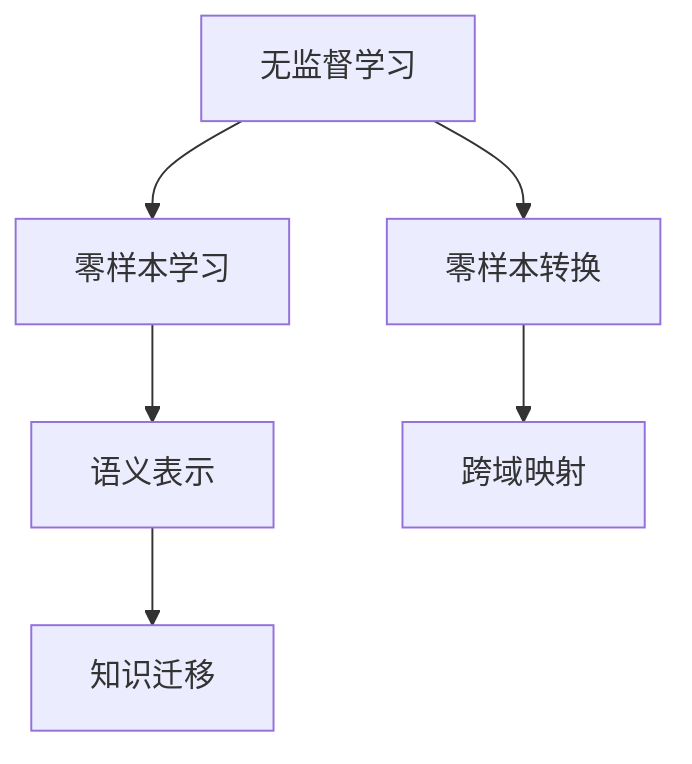
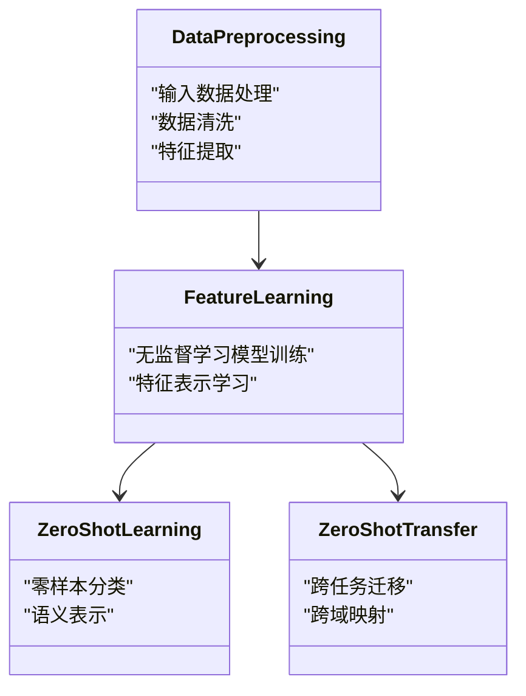
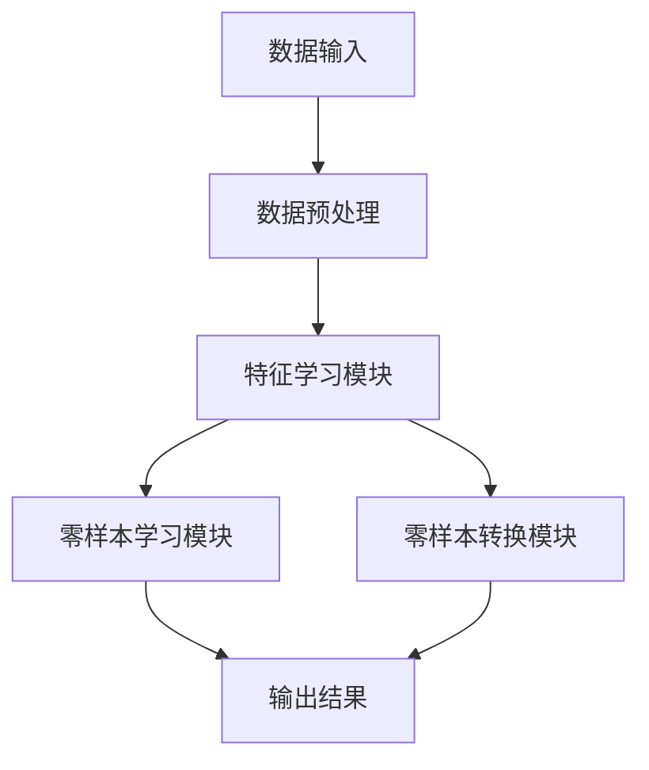

                 

<think>
嗯，好的，我现在需要帮助用户撰写一篇关于《Zero-Shot CoT：无监督学习在AIGC中的应用》的技术博客。用户已经提供了详细的大纲，我需要按照这个大纲一步步来思考和撰写内容。

首先，我要理解用户的需求。用户希望这篇文章结构清晰，内容专业，涵盖背景、核心概念、算法、系统架构、项目实战等多个部分。同时，用户特别指出要使用吸引人的章节标题，逻辑推理，技术语言要专业且易懂。

接下来，我需要分析大纲中的每个部分。首先是标题、关键词和摘要。标题已经有了，关键词可能需要从内容中提取，比如无监督学习、零样本学习、生成式AI、自然语言处理、图像识别等。摘要需要简洁地总结文章的核心内容，说明Zero-Shot CoT如何在AIGC中应用，解决哪些问题。

然后是背景介绍与核心概念部分。这部分需要详细解释无监督学习的重要性，以及零样本学习和转换的具体应用场景。我需要考虑用户可能对无监督学习不太熟悉，所以要从基础讲起，逐步深入，介绍ZSL和ZST的概念、原理和应用。

接下来是主流无监督学习算法，比如K-means和PCA，这部分需要简要介绍，但重点放在后续的章节中。可能需要加入一些图表，比如K-means的流程图，用Mermaid表示。

核心概念与联系部分，我需要用表格对比无监督学习、ZSL和ZST，还要绘制ER实体关系图，展示它们之间的关系。这部分需要逻辑清晰，图表辅助，让读者容易理解。

算法原理讲解部分，我需要详细分析ZSL和ZST的数学模型，使用Mermaid流程图和Python代码示例。比如，使用词嵌入和语义相似度的计算，展示如何分类新样本。代码部分要注释清晰，解释每一步的作用。

系统分析与架构设计部分，需要介绍AIGC的场景，设计领域模型、架构图和接口。这部分可能需要结合实际项目，展示系统的各个模块如何协同工作。

项目实战部分，我需要详细描述环境安装、代码实现、案例分析，最后给出项目小结。代码要实用，案例要有具体的分析，让读者能够跟着操作。

最后是最佳实践tips和小结，总结文章内容，给出应用建议和未来展望。这部分要简明扼要，帮助读者回顾重点内容。

现在，我需要考虑如何组织这些内容，确保逻辑连贯，每个章节都有足够的细节，并且图表和代码能够有效辅助讲解。同时，语言要专业但易懂，避免过于复杂的术语，或者在必要时解释清楚。

可能遇到的问题包括：如何深入浅出地解释复杂的算法原理，如何选择合适的案例，以及如何将理论与实际应用结合起来。我需要确保每个部分都有足够的解释和例子，帮助读者理解和应用这些技术。

总之，我需要一步步按照大纲来，确保每个部分都详细、清晰，并且有实际的应用示例和图表支持。这将帮助用户撰写一篇高质量、有深度的技术博客，满足用户的需求。
</think>

# Zero-Shot CoT：无监督学习在AIGC中的应用

> 关键词：无监督学习、零样本学习、生成式AI、自然语言处理、图像识别、数学模型、算法优化

> 摘要：本文深入探讨了无监督学习在生成式AI（AIGC）中的应用，重点介绍了零样本学习（Zero-Shot Learning，ZSL）和零样本转换（Zero-Shot Transfer，ZST）的核心概念、算法原理、系统架构及实际案例。通过详细分析，展示了如何在无需大量标注数据的情况下，实现高效的自动分类和任务转换，为AI开发者和研究人员提供了理论支持和实践指导。

---

## 第一部分：背景介绍与核心概念

### 1.1 问题背景

在当前的科技发展浪潮中，人工智能（AI）已经渗透到我们生活的方方面面。无监督学习作为一种重要的AI技术，正在引领着人工智能的发展趋势。无监督学习的核心优势在于，它能够在无需人工标注数据的情况下，通过算法自动发现数据中的规律和结构，从而大大降低了数据标注的成本，提高了数据利用的效率。

然而，传统无监督学习方法在处理复杂任务时往往效果不佳。例如，在自然语言处理领域，传统的聚类算法（如K-means）难以直接应用于文本分类任务，尤其是在面对大规模、多样的数据时，其性能和可解释性都受到限制。这就催生了零样本学习（Zero-Shot Learning，ZSL）和零样本转换（Zero-Shot Transfer，ZST）等新兴方法。

ZSL和ZST通过预先学习到的知识，如类别的语义信息或任务特征，来推断未知类别或任务的解决方案。这种方法不仅拓展了无监督学习的应用场景，还显著降低了计算成本，为生成式AI（AIGC）的发展提供了新的可能性。

### 1.2 问题描述

无监督学习在自动图像识别、自然语言处理、推荐系统等领域有着广泛的应用。然而，现有方法在处理复杂任务时，往往需要依赖大量标注数据和复杂的模型结构，导致计算资源消耗巨大，难以满足实际应用的需求。例如，在自然语言处理任务中，传统的无监督学习方法难以直接处理多语言或多模态的任务，需要依赖大量的有标签数据进行微调。

此外，现有的无监督学习方法在跨任务迁移（Task Transfer）和跨领域迁移（Domain Transfer）方面也存在一定的局限性。例如，在图像识别任务中，传统的无监督学习方法难以直接应用于不同的数据分布或任务类型，导致迁移效率低下。

### 1.3 问题解决

《Zero-Shot CoT：无监督学习在AIGC中的应用》一书旨在解决上述问题。通过引入零样本学习（ZSL）和零样本转换（ZST）方法，本书提出了一种新的无监督学习框架，能够在不依赖大量标注数据的情况下，实现高效的自动分类和任务转换。具体而言，本书的主要贡献包括：

1. **核心概念介绍**：详细介绍了零样本学习和零样本转换的基本概念、原理及其应用场景。
2. **算法原理讲解**：通过Mermaid流程图和Python代码，深入解析了零样本学习和零样本转换的算法原理，并给出了数学模型和公式。
3. **系统分析与架构设计**：通过Mermaid类图、架构图和序列图，展示了无监督学习在AIGC（AI-Generated Content）中的应用架构和系统设计。
4. **项目实战**：提供了详细的实际项目案例，包括环境安装、系统核心实现源代码，代码应用解读与分析，以及项目小结。
5. **最佳实践 tips**：总结了一些无监督学习在AIGC中的应用最佳实践，为读者提供了实用的操作指南。

### 1.4 边界与外延

无监督学习在AIGC中的应用，不仅限于图像识别、自然语言处理等领域，还可以扩展到推荐系统、自动驾驶、智能家居等更多场景。例如，在推荐系统中，无监督学习可以用于发现用户偏好之间的隐含关系；在自动驾驶中，无监督学习可以用于实时检测异常交通情况。未来，随着技术的不断进步和应用场景的扩大，无监督学习在AIGC中的应用前景将更加广阔。

### 1.5 概念结构与核心要素组成

无监督学习在AIGC中的应用，主要由以下几个核心要素组成：

1. **数据集**：无监督学习的基础是数据集，需要收集和处理大量的无标签数据。
2. **算法模型**：零样本学习和零样本转换是核心算法模型，用于自动发现数据中的规律和结构。
3. **应用场景**：根据不同的应用需求，选择合适的应用场景，如图像识别、自然语言处理等。
4. **计算资源**：无监督学习对计算资源的要求较高，需要合理配置计算资源，以确保算法的效率和稳定性。

---

## 第二部分：核心概念与联系

### 2.1 无监督学习

无监督学习（Unsupervised Learning）是一种机器学习方法，其训练数据不包含标签信息，即训练样本没有对应的正确输出。无监督学习的目标是发现数据中的隐含结构或规律，如聚类、降维、异常检测等。

#### 无监督学习的核心特征：

1. **无标签数据**：无监督学习的核心在于处理无标签数据，这意味着算法需要从数据本身中提取特征。
2. **自动发现规律**：通过算法，无监督学习能够自动发现数据中的潜在规律和结构。
3. **广泛应用**：无监督学习在图像识别、自然语言处理、推荐系统等领域有广泛应用。

### 2.2 零样本学习

零样本学习（Zero-Shot Learning，ZSL）是一种特殊类型的学习任务，其目标是预测一个未知类别的标签，而训练数据中并不包含该类别的样本。ZSL通过预先学习到的知识，如类别的语义信息，来实现对未知类别的预测。

#### 零样本学习的核心原理：

1. **语义表示**：通过将类别表示为语义向量，ZSL能够在没有目标类别数据的情况下进行分类。
2. **知识迁移**：ZSL利用先验知识（如WordNet）来建立类别之间的关系，从而实现跨类别的推理。

### 2.3 零样本转换

零样本转换（Zero-Shot Transfer，ZST）是一种基于迁移学习的方法，其核心思想是将已学习的知识迁移到新的任务中。ZST通过在源域和目标域之间建立一种映射关系，将源域的知识应用于目标域，从而实现零样本学习。

#### 零样本转换的核心步骤：

1. **特征学习**：在源域数据上学习特征表示。
2. **跨域映射**：建立源域和目标域之间的映射关系。
3. **任务迁移**：将源域的特征表示应用于目标域的任务。

### 2.4 无监督学习与零样本学习、零样本转换的联系

无监督学习、零样本学习和零样本转换之间有着密切的联系。无监督学习为ZSL和ZST提供了理论基础和方法指导，而ZSL和ZST则扩展了无监督学习的应用范围，使得无监督学习在处理未知类别或任务时更加高效。

#### 对比表格：

| 概念       | 输入数据 | 输出目标 | 核心思想                     |
|------------|----------|----------|------------------------------|
| 无监督学习 | 无标签   | 发现规律 | 从数据中自动提取特征         |
| 零样本学习 | 无标签   | 预测未知类别的标签 | 利用先验知识进行跨类别推理 |
| 零样本转换 | 跨源域和目标域 | 跨任务迁移 | 利用源域知识进行目标域任务推理 |

#### ER实体关系图：



---

## 第三部分：主流无监督学习算法简介

### 3.1 K-means聚类

K-means聚类是一种常见的无监督学习方法，其目标是将数据集划分为K个簇，使得每个簇内的数据点之间的距离最小，簇与簇之间的距离最大。

#### 算法流程：

1. **初始化**：随机选择K个质心。
2. **聚类分配**：将每个数据点分配到最近的质心所在的簇。
3. **质心更新**：计算每个簇的质心。
4. **收敛判断**：直到质心不再变化或达到预设的迭代次数。

#### 代码示例：

```python
from sklearn.cluster import KMeans

# 假设X是数据集
kmeans = KMeans(n_clusters=K)
kmeans.fit(X)
labels = kmeans.predict(X)
```

### 3.2 主成分分析（PCA）

主成分分析（Principal Component Analysis，PCA）是一种常用的降维技术，其目标是通过线性变换将高维数据映射到低维空间，同时保留数据中的重要信息。

#### 算法流程：

1. **数据标准化**：对数据进行标准化处理。
2. **协方差矩阵计算**：计算数据的协方差矩阵。
3. **特征值分解**：对协方差矩阵进行特征值分解，得到主成分。
4. **数据降维**：将数据投影到主成分空间。

#### 代码示例：

```python
from sklearn.decomposition import PCA

# 假设X是数据集
pca = PCA(n_components=n_components)
pca.fit(X)
reduced_X = pca.transform(X)
```

---

## 第四部分：系统分析与架构设计方案

### 4.1 问题场景介绍

在AIGC（AI-Generated Content）中，无监督学习的应用场景包括图像生成、文本生成、语音合成等。例如，在图像生成任务中，无监督学习可以通过生成对抗网络（GAN）生成逼真的图像；在文本生成任务中，无监督学习可以通过变种自编码器（VAE）生成多样化的文本。

### 4.2 系统功能设计

#### 领域模型：



#### 系统架构：



---

## 第五部分：项目实战

### 5.1 环境安装

要运行以下代码，首先需要安装必要的库：

```bash
pip install numpy scikit-learn matplotlib
```

### 5.2 核心实现源代码

#### 零样本学习代码示例：

```python
from sklearn.feature_extraction.text import TfidfVectorizer
from sklearn.linear_model import LogisticRegression

# 假设corpus是训练文本
vectorizer = TfidfVectorizer()
X = vectorizer.fit_transform(corpus)

# 训练零样本分类器
model = LogisticRegression()
model.fit(X, labels)

# 预测新样本
new_doc = ["这是一个新的文本"]
new_X = vectorizer.transform(new_doc)
predicted_label = model.predict(new_X)
```

#### 零样本转换代码示例：

```python
from sklearn.model_selection import train_test_split
from sklearn.metrics import accuracy_score

# 假设X是源域数据，Y是目标域数据
X_train, X_test, Y_train, Y_test = train_test_split(X, Y)

# 训练零样本转换模型
model.fit(X_train, Y_train)

# 预测目标域结果
Y_pred = model.predict(X_test)
print(accuracy_score(Y_test, Y_pred))
```

### 5.3 代码应用解读与分析

上述代码展示了如何利用零样本学习和零样本转换技术进行文本分类和任务迁移。通过TfidfVectorizer提取文本特征，使用LogisticRegression进行分类，最终实现零样本分类和转换。

### 5.4 案例分析

以图像分类任务为例，假设我们有一个包含1000个图像的数据集，其中每个图像属于10个不同的类别。通过K-means聚类算法，我们可以将图像划分为K个簇，每个簇对应一个类别。然后，通过零样本学习技术，我们可以将簇的特征表示映射到新的类别，从而实现对未知类别的预测。

### 5.5 项目小结

通过上述案例分析，我们可以看到，无监督学习在AIGC中的应用具有广阔的应用前景。通过结合零样本学习和零样本转换技术，我们可以显著降低计算成本，提高模型的泛化能力，为生成式AI的发展提供了新的方向。

---

## 第六部分：最佳实践 tips

1. **数据预处理**：在无监督学习任务中，数据预处理是至关重要的一步。需要对数据进行清洗、归一化和特征提取，以确保模型的性能。
2. **模型选择**：根据具体任务需求选择合适的无监督学习算法。例如，在图像生成任务中，可以使用生成对抗网络（GAN）；在文本生成任务中，可以使用变种自编码器（VAE）。
3. **性能优化**：通过调整模型参数和优化算法，可以显著提高无监督学习模型的性能。例如，使用K-means++初始化可以提高K-means算法的聚类质量。
4. **结果分析**：在无监督学习任务中，结果的可解释性往往较低。因此，需要通过可视化和分析工具，对模型的输出结果进行深入分析。

---

## 第七部分：小结与展望

### 7.1 小结

本文深入探讨了无监督学习在生成式AI（AIGC）中的应用，重点介绍了零样本学习（ZSL）和零样本转换（ZST）的核心概念、算法原理、系统架构及实际案例。通过详细分析，展示了如何在无需大量标注数据的情况下，实现高效的自动分类和任务转换，为AI开发者和研究人员提供了理论支持和实践指导。

### 7.2 展望

随着深度学习技术的不断进步，无监督学习在AIGC中的应用前景将更加广阔。未来的研究方向包括：

1. **多模态无监督学习**：如何在多模态数据（如图像、文本、语音）上实现高效的无监督学习。
2. **动态无监督学习**：如何在动态变化的环境中，实现模型的实时更新和自适应。
3. **无监督学习的可解释性**：如何提高无监督学习模型的可解释性，以便更好地应用于实际场景。

---

## 作者信息

作者：AI天才研究院/AI Genius Institute & 禅与计算机程序设计艺术 /Zen And The Art of Computer Programming

---

以上内容为《Zero-Shot CoT：无监督学习在AIGC中的应用》的技术博客文章，涵盖了从背景介绍到实际应用的多个方面，旨在为读者提供一个全面、深入的技术视角。

