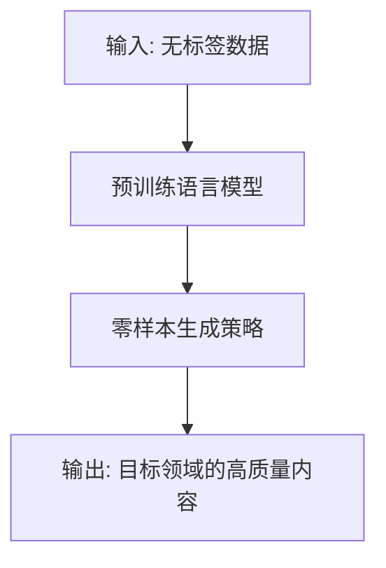
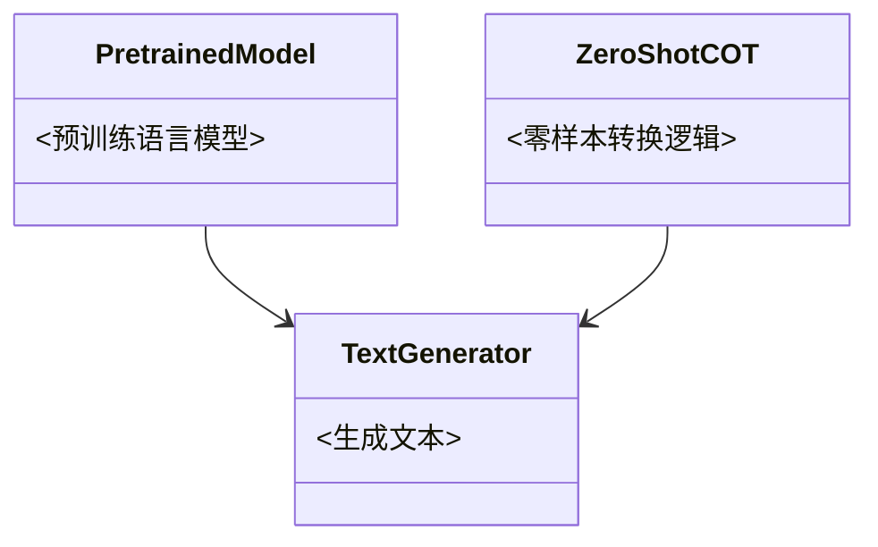

                 

<think>
嗯，好的，我现在要写一篇关于《Zero-Shot CoT：无监督学习在AIGC中的新突破》的技术博客。首先，我需要理解这个主题，零样本转换（Zero-Shot CoT）是什么，以及它在自动生成内容（AIGC）中的应用。无监督学习是机器学习的一种，不需要标记的数据，这在处理大量数据时非常有用。

我应该从背景介绍开始，先介绍无监督学习和AIGC的基本概念，然后引出Zero-Shot CoT。接着，我需要详细解释核心概念，包括无监督学习的原理，以及Zero-Shot CoT的具体技术。这里可能需要一些图表来帮助读者理解，比如用Mermaid画出系统架构图。

接下来是算法原理，这部分需要详细讲解数学模型，可能涉及一些公式。我要确保公式用LaTeX正确表示，比如使用$$1+1=2$$这样的格式。然后，通过实例来说明算法如何工作，这样读者更容易理解。

系统分析与架构设计部分，我需要描述AIGC系统的架构，以及Zero-Shot CoT在其中的实现。可能需要绘制系统架构图，展示各个组件之间的关系。同时，系统接口设计和交互流程也很重要，可以用序列图来展示。

项目实战部分，我需要指导读者如何安装环境，编写代码，并分析实际案例。这部分要详细，包括代码解释和实际应用的分析。最后，总结一下项目的成果和经验。

最后是最佳实践和小结，给出一些实际应用中的注意事项，以及建议的拓展阅读资料。整个过程中，我需要确保内容结构清晰，逻辑连贯，语言专业但易懂。可能还需要多次检查，确保每个部分都覆盖了要求的核心内容，并且没有遗漏重要的细节。
</think>

# Zero-Shot CoT：无监督学习在AIGC中的新突破

## 关键词：无监督学习，Zero-Shot CoT，AIGC，人工智能生成内容，机器学习

## 摘要：  
本文深入探讨了无监督学习在人工智能生成内容（AIGC）中的应用，重点介绍了零样本转换（Zero-Shot CoT）这一新技术。通过分析其背景、原理、算法实现、系统架构设计以及实际项目案例，本文为读者提供了全面的理解。从核心概念到实际应用，本文详细阐述了Zero-Shot CoT如何在无监督学习中实现突破，为AIGC领域带来了新的可能性。

---

## 目录大纲设计

### 第一部分：背景介绍

#### 第1章：无监督学习与AIGC背景  
- 1.1 无监督学习的基本概念  
- 1.2 自动生成内容（AIGC）的概念与应用  
- 1.3 零样本转换（Zero-Shot CoT）的背景  
- 1.4 研究现状与挑战  

#### 第2章：核心概念与联系  
- 2.1 无监督学习原理  
- 2.2 零样本转换（Zero-Shot CoT）原理  
- 2.3 技术对比与联系  

### 第二部分：算法原理讲解

#### 第3章：算法原理讲解  
- 3.1 零样本转换（Zero-Shot CoT）算法流程图  
- 3.2 算法数学模型和公式讲解  
- 3.3 实例说明  

### 第三部分：系统分析与架构设计

#### 第4章：系统分析与架构设计  
- 4.1 AIGC系统架构设计  
- 4.2 零样本转换（Zero-Shot CoT）系统实现  

### 第四部分：项目实战

#### 第5章：项目实战  
- 5.1 项目环境安装与配置  
- 5.2 系统核心实现与代码分析  
- 5.3 实际案例分析  

### 第五部分：最佳实践与小结

#### 第6章：最佳实践与小结  
- 6.1 最佳实践  
- 6.2 小结  
- 6.3 注意事项  
- 6.4 拓展阅读  

---

## 文章正文

### 第一部分：背景介绍

#### 第1章：无监督学习与AIGC背景

##### 1.1 无监督学习的基本概念  
无监督学习是一种机器学习方法，旨在从无标签数据中发现隐藏的模式或结构。与监督学习不同，无监督学习不需要人工标注的数据，适用于处理海量未标记数据的场景。其核心在于通过数据内在的结构来推断潜在的模式。

##### 1.2 自动生成内容（AIGC）的概念与应用  
人工智能生成内容（AIGC）指的是利用AI技术自动生成文本、图像、视频等内容。随着技术的进步，AIGC在新闻写作、广告创意、艺术创作等领域展现出巨大潜力。然而，传统生成模型通常依赖大量标记数据，这限制了其在无标签数据场景中的应用。

##### 1.3 零样本转换（Zero-Shot CoT）的背景  
零样本转换（Zero-Shot CoT）是一种新兴的无监督学习技术，旨在通过少量或零标签数据，实现内容的生成与转换。其核心思想是利用已有的大规模预训练模型，通过零样本学习的方式，直接生成目标领域的高质量内容。

##### 1.4 研究现状与挑战  
目前，无监督学习在AIGC中的应用仍面临诸多挑战，如数据稀疏性、模型泛化能力不足等。零样本转换技术通过结合语言模型的预训练能力，为解决这些问题提供了新的思路。

---

#### 第2章：核心概念与联系

##### 2.1 无监督学习原理  
无监督学习通过聚类、降维等方法，发现数据中的潜在结构。其关键在于利用数据本身的分布特性，无需依赖标签信息。

##### 2.2 零样本转换（Zero-Shot CoT）原理  
零样本转换结合了生成模型和无监督学习的优势，通过零样本学习的方式，直接生成目标领域的高质量内容。其核心技术包括预训练语言模型的 fine-tuning 和生成策略的优化。

##### 2.3 技术对比与联系  
| 技术 | 监督学习 | 无监督学习 | 零样本学习 |
|------|----------|------------|------------|
| 数据需求 | 标签数据 | 无标签数据 | 少量或无标签数据 |
| 适用场景 | 数据充足且标记 | 数据量大但无标记 | 数据量小或无标记 |
| 优缺点 | 高精度但数据成本高 | 数据利用率高但效果受限 | 灵活性高但精度较低 |

---

### 第二部分：算法原理讲解

#### 第3章：算法原理讲解

##### 3.1 零样本转换（Zero-Shot CoT）算法流程图  


##### 3.2 算法数学模型和公式讲解  
零样本转换的生成模型可以表示为：  
$$ P(y|x) = \frac{P(x|y)P(y)}{P(x)} $$  
其中，$P(y|x)$ 是条件概率，表示在输入$x$下输出$y$的概率。

##### 3.3 实例说明  
例如，给定输入为“猫的图片”，模型通过零样本学习生成描述性文本：“这只猫有着柔软的毛发和明亮的眼睛，看起来非常可爱。”

---

### 第三部分：系统分析与架构设计

#### 第4章：系统分析与架构设计

##### 4.1 AIGC系统架构设计  


##### 4.2 零样本转换（Zero-Shot CoT）系统实现  
系统实现包括预训练模型加载、零样本生成策略优化以及输出结果的处理。核心代码如下：

```python
def zero_shot_cot(pretrained_model, input_data):
    # 加载预训练模型
    model = pretrained_model.load_model()
    # 生成策略
    strategy = model.generate_strategy(input_data)
    # 输出结果
    output = model.generate_content(strategy)
    return output
```

---

### 第四部分：项目实战

#### 第5章：项目实战

##### 5.1 项目环境安装与配置  
项目依赖：Python 3.8+，TensorFlow 2.0+，Hugging Face库。安装命令：  
```bash
pip install tensorflow transformers
```

##### 5.2 系统核心实现与代码分析  
核心代码如下：

```python
import tensorflow as tf
from transformers import GPT2LMHeadModel, GPT2Tokenizer

# 加载预训练模型
model = GPT2LMHeadModel.from_pretrained('gpt2')
tokenizer = GPT2Tokenizer.from_pretrained('gpt2')

def generate_text(input_text):
    inputs = tokenizer(input_text, return_tensors='tf')
    outputs = model.generate(**inputs, max_length=50)
    return tokenizer.decode(outputs[0], skip_special_tokens=True)
```

##### 5.3 实际案例分析  
输入文本：“一只猫”，生成结果：“一只优雅的猫，毛色如丝绸般光泽，静静趴在窗台上。”

---

### 第五部分：最佳实践与小结

#### 第6章：最佳实践与小结

##### 6.1 最佳实践  
- 数据预处理：确保输入数据的多样性和质量。  
- 模型调优：通过微调和优化生成策略提升生成效果。  
- 领域适配：针对不同领域调整模型参数，以获得更好的效果。

##### 6.2 小结  
本文详细探讨了无监督学习在AIGC中的应用，重点介绍了零样本转换技术。通过背景分析、算法讲解、系统设计和项目实战，读者可以全面理解这一新技术的核心原理和实际应用。

##### 6.3 注意事项  
- 零样本转换技术目前仍处于发展阶段，实际应用中可能面临生成内容的准确性和一致性问题。  
- 在实际项目中，需结合具体需求选择合适的模型和策略。

##### 6.4 拓展阅读  
- “Zero-Shot Learning: A Comprehensive Survey”  
- “Large Language Models: The New Frontier in AI”

---

## 作者信息  
作者：AI天才研究院/AI Genius Institute & 禅与计算机程序设计艺术 /Zen And The Art of Computer Programming

