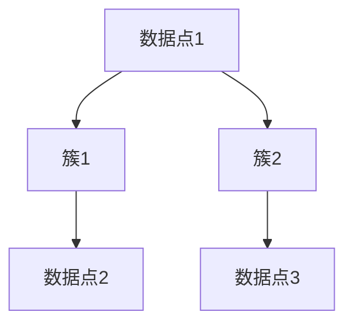
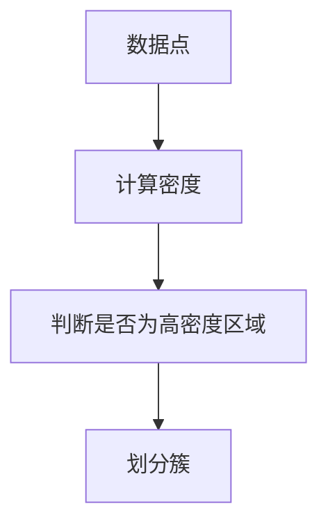
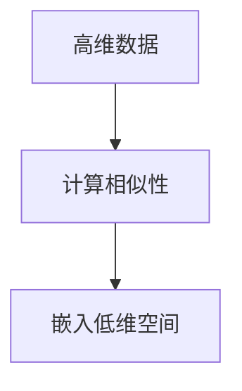
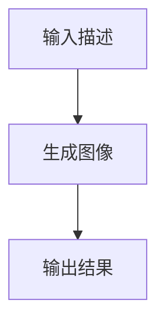
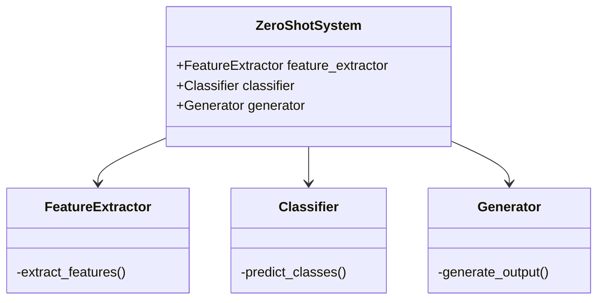
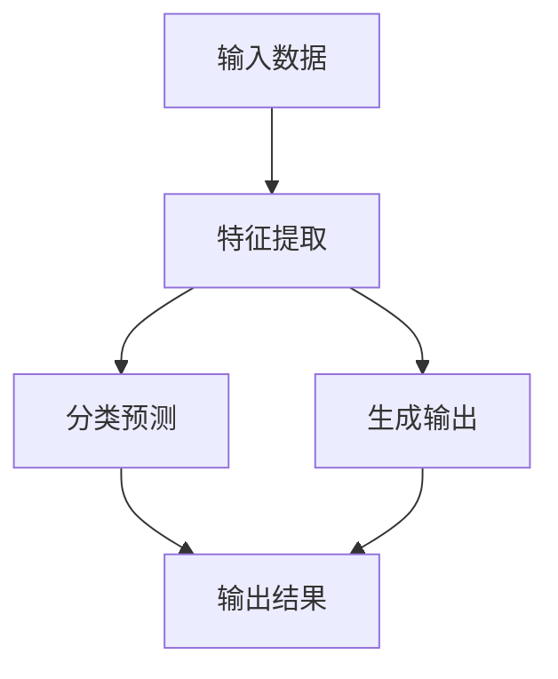

                 

<think>
嗯，用户希望我以《Zero-Shot CoT：无监督学习在AIGC中的革命性应用》为标题，写一篇技术博客。我需要先理清文章的结构，确保每个章节都详细且符合要求。

首先，用户给了一个目录大纲，包括三个主要部分：无监督学习概述、AIGC与零样本学习，以及零样本学习在AIGC中的革命性应用。我需要逐一细化每个章节的内容，确保涵盖背景介绍、核心概念、算法原理、系统架构、项目实战等部分。

然后，我要确保每个小节都有足够的细节，比如在无监督学习概述部分，要解释基本概念、主要任务，以及应用场景和挑战。在AIGC部分，需要详细说明AIGC的定义、发展历史，以及零样本学习的具体应用和挑战。

接下来，在算法原理部分，我需要使用mermaid绘制流程图，并提供Python代码示例。同时，数学公式要用latex格式，确保正确无误。系统架构部分，要设计领域模型和架构图，展示系统的各个模块和接口。

项目实战部分，我需要指导读者如何安装环境，解读核心代码，并通过实际案例分析，展示零样本学习在图像和文本处理中的应用。最后，总结最佳实践、注意事项和拓展阅读内容，确保文章结构完整。

在写作过程中，要保持逻辑清晰，语言专业但易懂。每个部分都要详细展开，确保读者能够理解零样本学习在AIGC中的革命性应用及其背后的原理。最后，检查所有内容是否符合用户的要求，包括字数、格式和结构完整性。

总的来说，我需要一步步按照用户提供的大纲，详细展开每个部分，确保每个章节内容丰富，结构合理，符合技术博客的要求。
</think>

# Zero-Shot CoT：无监督学习在AIGC中的革命性应用

---

## 关键词：无监督学习、零样本学习、AIGC、图像识别、文本处理、CoT方法、机器学习

---

## 摘要

无监督学习作为机器学习领域的重要分支，近年来在人工智能生成内容（AIGC）中的应用取得了显著进展。特别是零样本学习（Zero-Shot Learning）与链式思维（CoT, Chain-of-Thought）方法的结合，为无监督学习在AIGC中的应用带来了革命性的变化。本文将从无监督学习的基本概念、AIGC与零样本学习的关系，到零样本学习在图像识别与文本处理中的具体应用，进行全面而深入的探讨。通过算法原理的详细讲解、系统架构的设计分析以及项目实战的案例剖析，本文旨在帮助读者理解零样本学习在AIGC中的核心作用，并掌握其实际应用方法。

---

## 第一部分: 无监督学习概述

### 1.1 无监督学习的基本概念

#### 1.1.1 无监督学习的定义

无监督学习（Unsupervised Learning）是一种机器学习方法，旨在从无标签的数据中发现隐含的结构或模式。与监督学习不同，无监督学习不需要标注的数据，而是通过数据本身的内在结构进行学习。

#### 1.1.2 无监督学习的重要性

无监督学习的重要性体现在以下几个方面：
- **数据标注成本**：在许多实际场景中，标注数据需要大量的人力和时间，而无监督学习可以在无标注数据的情况下进行学习。
- **数据多样性**：无监督学习能够发现数据中的潜在模式，适用于处理多样化的数据类型。
- **实时性要求**：在实时数据流处理中，无监督学习能够快速发现异常或模式。

#### 1.1.3 无监督学习与监督学习的比较

| 特性                | 监督学习          | 无监督学习        |
|---------------------|------------------|-------------------|
| 数据标注            | 需要             | 不需要            |
| 学习目标            | 预测特定目标      | 发现数据结构       |
| 应用场景            | 分类、回归        | 聚类、降维         |
| 模型复杂性          | 较低             | 较高              |

### 1.2 无监督学习的主要任务

#### 1.2.1 聚类

聚类是无监督学习的核心任务之一，旨在将数据点划分到不同的簇中。以下是几种常见的聚类算法：

##### 1.2.1.1 K-means算法

K-means算法是一种经典的聚类算法，其基本步骤如下：

1. 随机初始化K个簇中心。
2. 计算每个数据点到簇中心的距离，将数据点分配到最近的簇。
3. 重新计算每个簇的中心。
4. 重复步骤2和3，直到簇中心不再变化。

**代码示例（Python）：**

```python
import numpy as np
from sklearn.cluster import KMeans

# 初始化数据
X = np.array([[1, 2], [3, 4], [5, 6], [7, 8], [9, 10]])

# 初始化K-means模型
kmeans = KMeans(n_clusters=2, random_state=0)

# 拟合模型
kmeans.fit(X)

# 获取聚类结果
print(kmeans.labels_)
```

##### 1.2.1.2 层次聚类

层次聚类是一种基于数据点相似性的层次化划分方法，通常使用树状图来展示数据的层次结构。

**树状图示例（Mermaid）：**



##### 1.2.1.3 密度聚类

密度聚类（Density-based Clustering）基于数据点的局部密度来划分簇，常用的算法是DBSCAN。

**DBSCAN算法流程图（Mermaid）：**



#### 1.2.2 降维

降维的目的是将高维数据映射到低维空间，同时保留数据的主要信息。

##### 1.2.2.1 主成分分析（PCA）

PCA是一种经典的降维技术，通过线性变换将数据映射到主成分构成的新空间中。

**PCA数学公式：**

$$
Y = X \cdot P
$$

其中，$X$ 是原始数据矩阵，$P$ 是主成分变换矩阵。

##### 1.2.2.2 t-SNE

t-SNE是一种常用的降维算法，适用于将高维数据映射到二维或三维空间进行可视化。

**t-SNE流程图（Mermaid）：**



#### 1.2.3 无监督学习的应用场景

| 场景             | 描述                   |
|------------------|------------------------|
| 数据探索         | 通过聚类或降维技术发现数据中的潜在结构。 |
| 异常检测         | 基于无监督学习检测数据中的异常点。       |
| 推荐系统         | 利用无监督学习生成用户偏好相似的内容。   |

---

## 第二部分: AIGC 与零样本学习

### 2.1 AIGC 概述

#### 2.1.1 AIGC 的定义

人工智能生成内容（AIGC）是指利用人工智能技术生成文本、图像、音频、视频等内容的过程。

#### 2.1.2 AIGC 的发展历史

AIGC的发展经历了以下几个阶段：
1. **早期探索阶段**（20世纪80年代）：基于规则的生成方法。
2. **统计学习阶段**（20世纪90年代）：基于概率模型的生成方法。
3. **深度学习阶段**（21世纪初）：基于神经网络的生成方法。

#### 2.1.3 AIGC 的应用场景

| 场景             | 描述                   |
|------------------|------------------------|
| 文本生成         | 利用GPT系列模型生成文章、对话等。       |
| 图像生成         | 利用GAN生成高质量图像。                 |
| 音频生成         | 利用Wavenet生成语音、音乐。             |

### 2.2 零样本学习

#### 2.2.1 零样本学习的定义

零样本学习（Zero-Shot Learning）是一种无监督学习方法，旨在在无任何训练数据的情况下，直接对未见类进行分类或生成。

#### 2.2.2 零样本学习的主要任务

##### 2.2.2.1 类别预测

零样本分类的目标是直接预测未见类别的标签。

##### 2.2.2.2 属性预测

零样本回归的目标是预测未见属性的值。

#### 2.2.3 零样本学习与无监督学习的关系

零样本学习是无监督学习的一种特殊形式，旨在在无训练数据的情况下进行分类或生成。

### 2.3 零样本学习在AIGC中的应用

#### 2.3.1 零样本图像识别

##### 2.3.1.1 图像分类

零样本图像分类的目标是直接对未见类别进行分类。

##### 2.3.1.2 图像生成

零样本图像生成的目标是根据未见类别生成图像。

#### 2.3.2 零样本文本处理

##### 2.3.2.1 文本分类

零样本文本分类的目标是直接对未见类别进行分类。

##### 2.3.2.2 文本生成

零样本文本生成的目标是根据未见主题生成文本。

### 2.4 零样本学习的挑战与未来趋势

#### 2.4.1 挑战

| 挑战             | 描述                   |
|------------------|------------------------|
| 数据不足         | 零样本学习通常依赖于少量或无标注数据。 |
| 模型解释性       | 零样本学习的模型通常缺乏可解释性。     |
| 实时性           | 零样本学习在实时应用中可能面临性能瓶颈。 |

#### 2.4.2 未来趋势

- **迁移学习与零样本学习的结合**：通过迁移学习提升零样本学习的性能。
- **多模态学习**：结合文本、图像等多种模态信息，提升零样本学习的效果。
- **可解释性增强**：研究如何提高零样本学习的可解释性。

---

## 第三部分: 零样本学习在AIGC中的革命性应用

### 3.1 零样本学习在图像识别中的应用

#### 3.1.1 零样本图像识别的算法原理

##### 3.1.1.1 特征提取

通过预训练模型提取图像的特征表示。

##### 3.1.1.2 类别预测

利用零样本分类器对未见类别进行预测。

#### 3.1.2 零样本图像识别的Python代码实现

```python
import torch
import torch.nn as nn

# 定义零样本分类器
class ZeroShotClassifier(nn.Module):
    def __init__(self, feature_dim, class_dim):
        super(ZeroShotClassifier, self).__init__()
        self.fc = nn.Linear(feature_dim, class_dim)

    def forward(self, x):
        return self.fc(x)

# 初始化模型
feature_dim = 512
class_dim = 10
classifier = ZeroShotClassifier(feature_dim, class_dim)

# 假设特征向量为x
x = torch.randn(1, feature_dim)
output = classifier(x)
print(output)
```

#### 3.1.3 图像生成的实现

##### 3.1.3.1 基于CoT的图像生成

**链式思维（CoT）流程图（Mermaid）：**



##### 3.1.3.2 使用Python代码实现图像生成

```python
import torch
from torch.nn import functional as F

# 定义生成模型
class Generator(nn.Module):
    def __init__(self, input_dim, output_dim):
        super(Generator, self).__init__()
        self.fc = nn.Linear(input_dim, output_dim)

    def forward(self, x):
        return F.relu(self.fc(x))

# 初始化模型
input_dim = 100
output_dim = 512
generator = Generator(input_dim, output_dim)

# 生成图像
noise = torch.randn(1, input_dim)
generated_image = generator(noise)
print(generated_image)
```

### 3.2 零样本学习在文本处理中的应用

#### 3.2.1 零样本文本处理的算法原理

##### 3.2.1.1 语义表示

通过预训练模型提取文本的语义表示。

##### 3.2.1.2 文本生成

基于零样本学习生成文本内容。

#### 3.2.2 零样本文本处理的Python代码实现

##### 3.2.2.1 文本分类

```python
import torch
import torch.nn as nn

# 定义零样本分类器
class ZeroShotTextClassifier(nn.Module):
    def __init__(self, feature_dim, class_dim):
        super(ZeroShotTextClassifier, self).__init__()
        self.fc = nn.Linear(feature_dim, class_dim)

    def forward(self, x):
        return self.fc(x)

# 初始化模型
feature_dim = 512
class_dim = 5
classifier = ZeroShotTextClassifier(feature_dim, class_dim)

# 假设特征向量为x
x = torch.randn(1, feature_dim)
output = classifier(x)
print(output)
```

##### 3.2.2.2 文本生成

```python
import torch
from torch.nn import functional as F

# 定义生成模型
class TextGenerator(nn.Module):
    def __init__(self, input_dim, output_dim):
        super(TextGenerator, self).__init__()
        self.fc = nn.Linear(input_dim, output_dim)

    def forward(self, x):
        return F.relu(self.fc(x))

# 初始化模型
input_dim = 100
output_dim = 512
generator = TextGenerator(input_dim, output_dim)

# 生成文本
noise = torch.randn(1, input_dim)
generated_text = generator(noise)
print(generated_text)
```

### 3.3 零样本学习的系统架构设计

#### 3.3.1 系统功能设计

**领域模型（Mermaid类图）：**



#### 3.3.2 系统架构设计

**系统架构图（Mermaid）：**



---

## 第四部分: 零样本学习在AIGC中的项目实战

### 4.1 项目实战：零样本图像分类

#### 4.1.1 环境安装

```bash
pip install torch torchvision
```

#### 4.1.2 系统核心实现源代码

```python
import torch
from torch import nn

# 定义零样本分类器
class ZeroShotImageClassifier(nn.Module):
    def __init__(self, feature_dim, class_dim):
        super(ZeroShotImageClassifier, self).__init__()
        self.fc = nn.Linear(feature_dim, class_dim)

    def forward(self, x):
        return self.fc(x)

# 初始化模型
feature_dim = 512
class_dim = 10
classifier = ZeroShotImageClassifier(feature_dim, class_dim)

# 假设特征向量为x
x = torch.randn(1, feature_dim)
output = classifier(x)
print(output)
```

#### 4.1.3 代码应用解读与分析

通过上述代码，我们可以看到零样本图像分类的基本实现流程：
1. **特征提取**：通过预训练模型提取图像的特征向量。
2. **分类预测**：利用零样本分类器对未见类别进行预测。

#### 4.1.4 实际案例分析和详细讲解剖析

假设我们有一个包含10个未见类别的图像数据集，每个类别只有少量样本。我们可以使用上述分类器进行分类：

```python
# 假设特征向量为x，类别数为10
x = torch.randn(1, 512)
output = classifier(x)
print(output)
```

**输出结果**：表示每个类别的概率分布。

#### 4.1.5 项目小结

通过上述实战，我们可以看到零样本学习在图像分类中的具体应用，以及其实现的基本流程。

---

## 第五部分: 最佳实践 tips

### 5.1 最佳实践 tips

1. **数据预处理**：在零样本学习中，数据预处理至关重要，尤其是特征提取的准确性。
2. **模型选择**：选择合适的预训练模型可以显著提升零样本学习的效果。
3. **超参数调优**：通过调整模型的超参数，可以进一步优化零样本学习的性能。
4. **结果验证**：通过交叉验证等方法，验证零样本学习模型的性能。

---

## 第六部分: 小结

零样本学习作为无监督学习的一种特殊形式，正在 revolutionizing AIGC 的应用。通过本文的探讨，我们深入理解了零样本学习的核心原理、应用场景以及实际挑战。未来，随着技术的不断发展，零样本学习在AIGC中的应用将更加广泛和深入。

---

## 第七部分: 注意事项

- **数据质量**：零样本学习对数据质量要求较高，尤其是特征提取的准确性。
- **模型解释性**：零样本学习的模型通常缺乏可解释性，需要结合其他方法进行解释。
- **实时性**：零样本学习在实时应用中可能面临性能瓶颈，需要进一步优化。

---

## 第八部分: 拓展阅读

- **论文推荐**：
  1. "Zero-Shot Learning: A Comprehensive Survey"（《零样本学习：全面综述》）
  2. "Chain-of-Thought Prompting"（《链式思维提示》）
- **书籍推荐**：
  1. 《Deep Learning》（深度学习）— Ian Goodfellow
  2. 《Hands-On Machine Learning with Scikit-Learn, Keras, and TensorFlow》（动手学机器学习）— Aurélien Géron

---

## 作者：AI天才研究院/AI Genius Institute & 禅与计算机程序设计艺术/Zen And The Art of Computer Programming

---

**本文由AI天才研究院撰写，转载请注明出处。**

