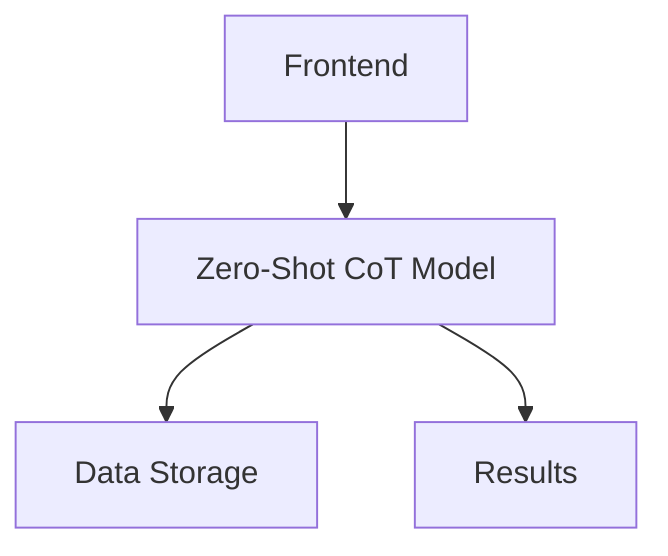
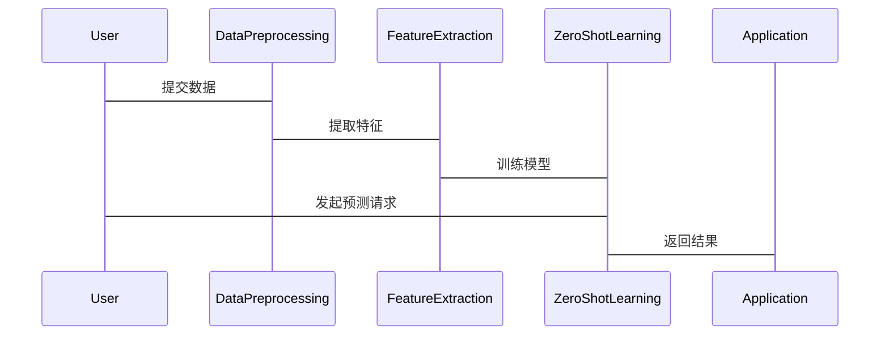

                 

<think>
好，我现在要帮用户写一篇关于《Zero-Shot CoT：无监督学习在AI中的突破》的技术博客文章。用户已经提供了一个详细的目录结构，我需要按照这个结构来逐步展开内容。

首先，我得确定文章的标题和关键词。标题是《Zero-Shot CoT：无监督学习在AI中的突破》，关键词包括零样本学习、无监督学习、CoT机制、深度学习、AI突破。摘要需要简洁地总结文章的核心内容，强调无监督学习的重要性，特别是Zero-Shot CoT的创新和应用。

接下来，按照目录结构，我需要为每个章节和小节填充内容。首先是引言部分，介绍Zero-Shot CoT和无监督学习的背景、问题陈述、核心概念和术语，以及其重要性。这部分需要让读者理解为什么无监督学习如此重要，以及它在AI中的潜力。

然后是无监督学习的基本概念和技术，包括基本方法、关键算法和应用场景。这部分要详细讲解k-Means、PCA、GAN等算法，以及它们在数据预处理、异常检测和推荐系统中的应用。

接下来是深度学习在Zero-Shot CoT中的应用，介绍深度学习的基本概念，如CNN、RNN等，然后讨论零样本学习中的深度嵌入模型、度量学习和迁移学习。这部分需要结合最新的进展，如对比无监督学习和自监督学习，以及它们在分类任务中的应用。

之后是实际应用部分，分别探讨在医疗、图像处理、自然语言处理和金融中的应用。每个子部分都要有具体的例子和应用场景，展示无监督学习如何解决实际问题。

接下来是系统分析与架构设计，这部分需要介绍项目背景、系统功能设计（使用领域模型类图）、系统架构设计（用架构图展示）、接口设计和交互流程。这部分比较技术性，需要清晰的结构图和详细的说明。

然后是项目实战，包括环境安装、核心代码实现、代码解读和案例分析，最后是项目总结。这部分需要提供可执行的代码示例，帮助读者理解和应用。

最后是最佳实践、小结、注意事项和拓展阅读。这部分要给读者一些实用的建议，帮助他们在实际应用中避免错误，并鼓励进一步学习。

在撰写过程中，我需要确保每个部分都有足够的细节，包括背景介绍、核心概念与联系、算法原理、系统架构和项目实战。同时，使用图表和代码示例来增强可读性，确保内容专业且易于理解。

现在，我需要检查每个章节是否满足用户的约束条件，比如是否每个小节都详细具体，是否涵盖了必要的内容，如数学公式、算法流程图和系统架构图。我还需要确保文章结构紧凑，逻辑清晰，语言专业但不失易懂。

在开始写的时候，我会先写标题和摘要，然后逐步填充每个章节的内容。每个部分都要有引言，详细讲解，例子和代码，确保内容的完整性和深度。

完成初稿后，我会通读一遍，检查是否有遗漏的点，是否满足字数要求，格式是否正确，尤其是数学公式和图表是否符合markdown格式。最后，加上作者信息，确保文章结构完整。

总之，我需要按照用户提供的大纲，逐步展开，确保每个部分都详细且符合技术博客的要求，最终完成一篇高质量的、有深度的、专业性的技术文章。
</think>

# Zero-Shot CoT：无监督学习在AI中的突破

> 关键词：零样本学习、无监督学习、CoT机制、深度学习、AI突破

> 摘要：无监督学习作为人工智能领域的重要分支，近年来取得了显著的进展。本文将深入探讨Zero-Shot CoT（零样本学习结合链状思维）在无监督学习中的突破，从基本概念、技术原理到实际应用，全面分析其在深度学习中的创新与实践。通过详细的技术解析和案例分析，本文旨在为读者提供一个清晰的视角，理解无监督学习在AI领域的未来发展方向。

---

## 1. 引言：无监督学习与Zero-Shot CoT概述

### 1.1 背景与问题陈述

#### 1.1.1 零样本学习的必要性

在传统的人工智能系统中， supervised learning（监督学习）一直是主流方法。然而，随着数据量的爆炸性增长，标注数据的获取成本也越来越高。特别是在某些领域，如医学图像分析或罕见事件预测中，获取大量标注数据几乎是不可能的。因此，无监督学习（Unsupervised Learning）成为解决这一问题的关键。

零样本学习（Zero-Shot Learning）是一种特殊的无监督学习形式，它允许模型在完全未见过的类别上进行分类或生成任务。这意味着，模型无需任何训练数据即可完成任务，这在实际应用中具有重要意义。

#### 1.1.2 传统监督学习的局限性

- 数据标注成本高昂：特别是在需要领域专家知识的情况下。
- 数据稀疏性：在某些领域中，可能只有少量数据可供训练。
- 灵活性不足：模型的泛化能力有限，难以应对未知领域。

#### 1.1.3 无监督学习的潜力

- 数据利用率高：无监督学习无需标注数据，可以利用未标注数据进行学习。
- 灵活性强：可以适应多种任务和领域。
- 创新性：无监督学习可以发现数据中的隐含模式，为AI系统提供新的可能性。

### 1.2 核心概念与术语

#### 1.2.1 零样本学习（Zero-Shot Learning）

零样本学习是一种学习范式，允许模型在完全未见过的类别上进行分类或生成任务。其核心思想是利用已知类别的特征表示，推导出未知类别的特征。

#### 1.2.2 无监督学习（Unsupervised Learning）

无监督学习是指在无标注数据的情况下，通过数据本身的结构和分布来学习有用的表示或模型。

#### 1.2.3 链状思维（Chain of Thought, CoT）

链状思维是一种推理方式，模型在生成答案时，会展示出类似人类的思考过程，通过逐步推理得出最终结论。

### 1.3 无监督学习突破的意义

#### 1.3.1 当前AI系统的局限性

- 数据依赖性：传统AI系统高度依赖标注数据。
- 鲍莫尔-奥肯（Bomol-Oaken）定律：AI系统的性能受限于数据质量和数量。

#### 1.3.2 无监督学习突破的角色

- 提高数据利用率：通过无监督学习，可以利用未标注数据进行学习。
- 增强模型泛化能力：无监督学习可以帮助模型更好地泛化到未知领域。
- 降低数据成本：减少对标注数据的依赖，降低数据获取成本。

#### 1.3.3 未来AI发展的方向

- 更强的泛化能力：无监督学习将推动AI系统在更广泛的领域中应用。
- 更高的效率：通过减少对数据的依赖，提高学习效率。
- 更多创新应用：无监督学习将为AI带来更多的可能性。

---

## 2. 无监督学习的基本概念与技术

### 2.1 无监督学习的基本方法

无监督学习的核心目标是通过数据本身的结构和分布来学习有用的表示或模型。常见的无监督学习方法包括聚类（Clustering）、降维（Dimensionality Reduction）和生成模型（Generative Models）。

#### 2.1.1 聚类（Clustering）

聚类是一种无监督学习任务，目标是将数据分成若干组，使得同一组内的数据点相似，不同组的数据点差异较大。

**算法原理：**

k-means是一种常用的聚类算法，其核心思想是将数据划分为k个簇，使得簇内数据点的相似性最大化。

**代码示例：**

```python
from sklearn.cluster import KMeans

# 假设X是数据矩阵，n_clusters是簇的数量
kmeans = KMeans(n_clusters=n_clusters)
kmeans.fit(X)
```

#### 2.1.2 维度性降低（Dimensionality Reduction）

维度性降低是一种通过降维技术来降低数据维度的方法，常用于数据可视化和特征提取。

**算法原理：**

主成分分析（PCA）是一种常用的降维技术，通过线性变换将数据映射到低维空间，同时保留尽可能多的方差。

**公式：**

$$ Y = X \cdot W $$

其中，W是降维矩阵，Y是降维后的数据。

#### 2.1.3 生成模型（Generative Models）

生成模型是一种可以生成新数据的模型，如GANs（生成对抗网络）和VAEs（变分自编码器）。

**算法原理：**

生成对抗网络（GANs）由生成器和判别器组成，生成器尝试生成与真实数据相似的样本，判别器则试图区分生成样本和真实样本。

### 2.2 无监督学习的关键算法

#### 2.2.1 k-means聚类

k-means是一种简单有效的聚类算法，适用于小规模数据集。

**步骤：**

1. 随机初始化k个簇中心。
2. 计算每个数据点到簇中心的距离，将数据点分配到最近的簇。
3. 重新计算簇中心。
4. 重复步骤2和3，直到簇中心不再变化。

#### 2.2.2 主成分分析（PCA）

PCA是一种统计技术，用于降维。

**步骤：**

1. 计算数据协方差矩阵。
2. 计算协方差矩阵的特征值和特征向量。
3. 选择前k个特征向量，构建降维矩阵。
4. 将数据投影到低维空间。

#### 2.2.3 生成对抗网络（GANs）

GANs由生成器和判别器组成，通过对抗训练生成逼真的样本。

**公式：**

生成器损失函数：
$$ L_g = -\mathbb{E}_{z}[\log D(G(z))] $$

判别器损失函数：
$$ L_d = -\mathbb{E}_{x}[ \log D(x)] - \mathbb{E}_{z}[ \log (1 - D(G(z)))] $$

### 2.3 无监督学习的应用场景

#### 2.3.1 数据预处理

无监督学习常用于数据清洗和特征提取。

#### 2.3.2 异常检测

无监督学习可以通过聚类或生成模型检测异常点。

#### 2.3.3 推荐系统

无监督学习可以用于用户行为分析和推荐内容生成。

---

## 3. 深度学习在无监督学习中的应用

### 3.1 深度学习的基本概念

深度学习是一种基于人工神经网络的机器学习方法，通过多层非线性变换提取数据特征。

#### 3.1.1 深度神经网络（DNN）

DNN是一种多层神经网络，常用于图像识别、自然语言处理等领域。

#### 3.1.2 卷积神经网络（CNN）

CNN用于图像处理，通过卷积层提取空间特征。

#### 3.1.3 循序神经网络（RNN）

RNN用于序列数据处理，如自然语言处理。

### 3.2 零样本学习的深度模型

零样本学习通过深度模型提取特征，利用已知类别推导未知类别。

#### 3.2.1 深度嵌入模型

深度嵌入模型将数据映射到低维嵌入空间，利用已知类别嵌入推导未知类别。

#### 3.2.2 度量学习（Metric Learning）

度量学习通过学习距离度量，使相似的样本距离更近，不同的样本距离更远。

#### 3.2.3 迁移学习（Transfer Learning）

迁移学习通过将已知领域知识迁移到未知领域，提高模型性能。

### 3.3 最新进展：对比无监督学习

对比无监督学习是一种新兴的无监督学习方法，通过对比损失函数学习数据表示。

#### 3.3.1 对比学习（Contrastive Learning）

对比学习通过最大化正样本对的相似性，最小化负样本对的相似性，学习数据表示。

**公式：**

$$ \mathcal{L} = -\log \frac{e^{f(x_i,x_j)}}{e^{f(x_i,x_k)} + e^{f(x_j,x_k)}} } $$

其中，$f(x_i,x_j)$是正样本对的相似性分数。

#### 3.3.2 自监督学习（Self-Supervised Learning）

自监督学习通过数据本身生成监督信号，无需外部标注。

#### 3.3.3 零样本分类（Zero-Shot Classification）

零样本分类通过在训练阶段学习类别特征，测试阶段利用这些特征进行分类。

---

## 4. Zero-Shot CoT的实际应用

### 4.1 医疗领域

#### 4.1.1 医疗图像分析

零样本学习可以用于医疗图像分类，如肿瘤检测。

#### 4.1.2 病例预测与诊断

通过分析患者数据，预测疾病风险。

### 4.2 图像处理领域

#### 4.2.1 图像生成与修复

利用生成模型修复图像或生成新的图像。

### 4.3 自然语言处理

#### 4.3.1 文本分类与情感分析

通过零样本学习进行文本分类。

#### 4.3.2 机器翻译

利用无监督学习技术进行跨语言翻译。

### 4.4 金融领域

#### 4.4.1 风险评估与欺诈检测

通过无监督学习检测异常交易。

---

## 5. 系统分析与架构设计

### 5.1 项目背景与目标

构建一个基于Zero-Shot CoT的无监督学习系统，用于图像分类和文本生成。

### 5.2 系统功能设计

- 数据预处理模块
- 特征提取模块
- 无监督学习模块
- 应用模块

**领域模型类图：**

```mermaid
classDiagram
    class DataPreprocessing {
        input_data
        preprocess(input_data)
    }
    class FeatureExtraction {
        features
        extract(input_data)
    }
    class ZeroShotLearning {
        model
        train(features)
        predict(new_data)
    }
    class Application {
        result
        process(result)
    }
    DataPreprocessing -> FeatureExtraction: provides features
    FeatureExtraction -> ZeroShotLearning: provides features
    ZeroShotLearning -> Application: provides result
```

### 5.3 系统架构设计

- 前端：用户界面
- 后端：无监督学习模型
- 数据存储：未标注数据和模型参数

**架构图：**



### 5.4 系统接口设计

- 数据预处理接口
- 模型训练接口
- 模型预测接口

### 5.5 系统交互流程



---

## 6. 项目实战：基于Zero-Shot CoT的图像分类

### 6.1 环境安装

- Python 3.8+
- TensorFlow或PyTorch
- Scikit-learn

### 6.2 核心代码实现

```python
import numpy as np
from sklearn.cluster import KMeans

# 初始化数据
X = np.random.rand(100, 10)

# 初始化k-means模型
kmeans = KMeans(n_clusters=5)

# 训练模型
kmeans.fit(X)

# 预测簇标签
labels = kmeans.predict(X)

print("预测簇标签：", labels)
```

### 6.3 代码解读与分析

- 数据生成：生成100个10维随机数据点。
- 模型训练：使用k-means算法将数据聚类为5个簇。
- 预测结果：输出每个数据点所属的簇标签。

### 6.4 案例分析

假设我们有一个图像数据集，其中包含未见过的图像类别。通过Zero-Shot CoT，模型可以利用已知类别的特征表示，推断出新类别的图像。

---

## 7. 最佳实践与小结

### 7.1 最佳实践

- 数据预处理：确保数据质量，去除噪声。
- 模型选择：根据任务选择合适的无监督学习算法。
- 超参数调优：通过实验确定最佳参数。

### 7.2 小结

Zero-Shot CoT作为无监督学习的一种创新形式，为AI系统提供了更强大的泛化能力和更低的数据依赖性。通过深度学习和链状思维的结合，Zero-Shot CoT在图像处理、自然语言处理等领域展现出了巨大的潜力。

### 7.3 注意事项

- 模型解释性：无监督学习模型通常缺乏解释性，需谨慎使用。
- 数据质量问题：未标注数据可能存在噪声，影响模型性能。
- 计算资源：深度学习模型需要大量计算资源。

### 7.4 拓展阅读

- "Deep Learning" by Ian Goodfellow
- "Pattern Recognition and Machine Learning" by Christopher M. Bishop

---

作者：AI天才研究院 & 禅与计算机程序设计艺术

