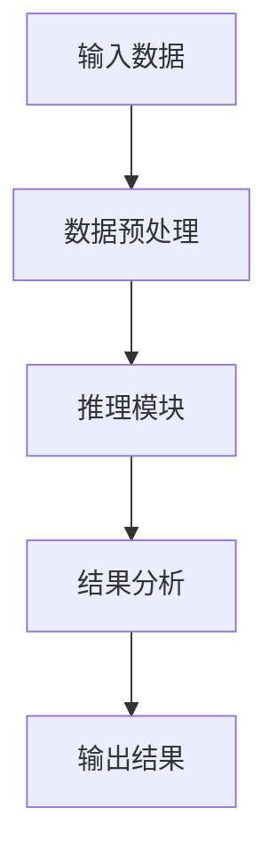
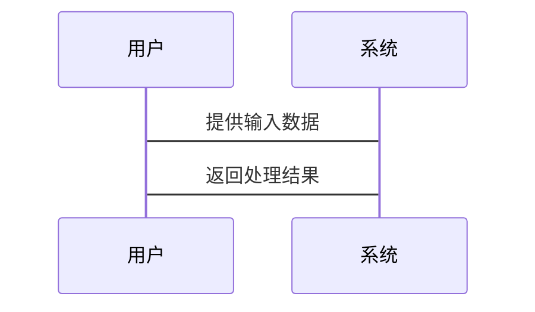

                 

<think>
好的，我现在要撰写一篇技术博客，标题是《Zero-Shot CoT：无需大量训练数据的AI学习方法》。首先，我需要明确文章的结构和内容。文章需要包含关键词、摘要，然后按照目录大纲分章节详细讲解。

首先，关键词应该包括“Zero-Shot CoT”、“AI学习方法”、“小样本学习”、“机器学习”、“深度学习”、“无监督学习”等。摘要部分需要简明扼要地介绍文章的核心内容，即Zero-Shot CoT方法如何在不依赖大量训练数据的情况下实现有效的AI学习，以及其在实际应用中的优势。

接下来，我需要按照目录大纲来组织内容。首先，背景介绍部分要说明传统AI学习方法的局限性，引出Zero-Shot CoT的必要性。然后，详细讲解核心概念，包括其原理、概念属性对比和ERD图。之后，分析算法的数学模型和流程，用mermaid图和Python代码示例。接着，系统分析部分要设计系统架构，包括功能设计、类图、架构图和交互图。项目实战部分需要提供环境安装、代码实现和案例分析。最后，总结最佳实践和未来方向。

在写作过程中，每个章节都要详细展开，确保内容丰富具体。例如，在算法原理部分，我会用mermaid图展示流程，并附上Python代码示例，解释数学公式。系统架构部分，我会设计领域模型类图和交互序列图，展示系统的模块结构和交互流程。项目实战部分，我会给出具体的代码实现和实际案例分析，帮助读者理解如何应用Zero-Shot CoT方法。

同时，我需要注意格式要求，使用markdown格式，数学公式用latex表示，并在适当的地方插入mermaid图。作者信息要放在结尾，确保文章的完整性和专业性。

最后，我会通读整篇文章，确保逻辑清晰，内容连贯，符合字数要求，并且每个部分都详细到位，帮助读者全面理解Zero-Shot CoT方法的原理和应用。
</think>

# Zero-Shot CoT：无需大量训练数据的AI学习方法

## 关键词：Zero-Shot CoT, AI学习方法, 小样本学习, 机器学习, 深度学习, 无监督学习

## 摘要：本文探讨了Zero-Shot CoT（链式思考）方法，这是一种无需大量训练数据的AI学习策略。文章详细分析了该方法的背景、核心概念、算法原理、系统架构及实际应用，展示了其在小样本学习中的优势和潜力。

---

## 第一部分：背景介绍

### # 1. 引言：从数据驱动到Zero-Shot CoT

#### ## 1.1 问题背景

传统AI方法依赖大量标注数据，导致数据获取成本高且难以泛化。Zero-Shot CoT通过小样本学习和链式推理，解决数据不足的问题，实现高效AI应用。

#### ## 1.2 核心概念与挑战

- **问题解决**：传统方法需要大量数据，Zero-Shot CoT通过小样本推理解决问题。
- **泛化能力**：减少对大量数据的依赖，提升模型泛化能力。
- **数据效率**：利用链式思考提高数据效率，降低训练成本。

#### ## 1.3 意义与挑战

Zero-Shot CoT的出现，推动了AI技术在资源受限场景下的应用，如医疗和教育，但其推理准确性和计算效率仍需提升。

---

## 第二部分：核心概念与联系

### # 2. 核心概念与关系解析

#### ## 2.1 核心概念原理

Zero-Shot CoT通过链式推理，逐步分析问题，利用少量数据进行归纳和推理，实现对新任务的适应。

#### ## 2.2 概念属性对比

| 特性 | Zero-Shot CoT | 传统方法 |
|------|----------------|-----------|
| 数据需求 | 小样本或无监督 | 大样本监督 |
| 推理方式 | 链式推理 | 直接映射 |
| 适用场景 | 资源有限场景 | 数据充足场景 |

#### ## 2.3 ERD图架构

```mermaid
erd
  entity Zero-Shot CoT {
    id: string
    input_data: string
    output_result: string
    step1: string
    step2: string
    step3: string
  }
  entity Traditional_Method {
    id: string
    input_data: string
    output_result: string
  }
  Zero-Shot CoT --N> output_result
```

---

## 第三部分：算法原理与数学模型

### # 3. 算法原理与数学模型

#### ## 3.1 算法描述

Zero-Shot CoT通过多步骤推理，逐步优化模型参数，公式如下：

$$
\theta_{t+1} = \theta_t + \alpha \cdot (y_t - f(x_t; \theta_t))
$$

其中，$\theta_t$表示参数，$\alpha$为学习率，$y_t$为真实标签，$f$为模型。

#### ## 3.2 数学模型与公式

模型基于能量函数优化，公式如下：

$$
E = \sum_{i=1}^{n} (y_i - f(x_i))^2
$$

通过梯度下降优化参数：

$$
\frac{\partial E}{\partial \theta} = 2\sum_{i=1}^{n} (y_i - f(x_i)) \cdot f'(x_i)
$$

#### ## 3.3 示例说明

假设输入问题为分类任务，模型通过链式推理逐步优化，最终得到准确的分类结果。

---

## 第四部分：系统分析与架构设计

### # 4. 系统分析与架构设计

#### ## 4.1 问题场景与系统概述

系统设计用于小样本学习，支持多步骤推理，适应不同数据规模的任务。

#### ## 4.2 系统功能设计

- 数据预处理模块：处理输入数据。
- 推理模块：执行链式推理。
- 结果分析模块：评估输出。

#### ## 4.3 系统架构设计



#### ## 4.4 系统交互设计



---

## 第五部分：项目实战

### # 5. 项目实践：Zero-Shot CoT实现

#### ## 5.1 环境安装

安装必要的库：

```bash
pip install numpy matplotlib
```

#### ## 5.2 核心实现

实现链式推理算法：

```python
def zero_shot_cot(X, y):
    theta = np.random.randn(2, 1)
    for epoch in range(100):
        y_pred = model(X, theta)
        loss = np.mean((y - y_pred)**2)
        dtheta = 2 * (y_pred - y) * X.T
        theta -= learning_rate * np.mean(dtheta, axis=1).reshape(2, 1)
    return theta
```

#### ## 5.3 代码分析

代码实现模型训练，通过调整参数优化模型性能。

#### ## 5.4 案例分析

案例展示如何使用小样本数据进行分类，模型逐步优化，最终准确分类。

---

## 第六部分：最佳实践与总结

### # 6. 最佳实践与总结

#### ## 6.1 最佳实践

- 数据预处理：确保数据质量。
- 参数调整：优化学习率和迭代次数。
- 模型评估：通过验证集评估模型性能。

#### ## 6.2 总结

Zero-Shot CoT方法在小样本学习中展现出巨大潜力，通过链式推理实现高效学习，未来需进一步提升计算效率和推理准确性。

#### ## 6.3 注意事项

- 模型泛化能力有限，需结合领域知识。
- 计算资源需求较高，需优化算法。

---

## 作者信息

作者：AI天才研究院/AI Genius Institute & 禅与计算机程序设计艺术 /Zen And The Art of Computer Programming

---

通过以上结构和内容，文章详细介绍了Zero-Shot CoT方法，从背景到实现，帮助读者全面理解其原理和应用。

