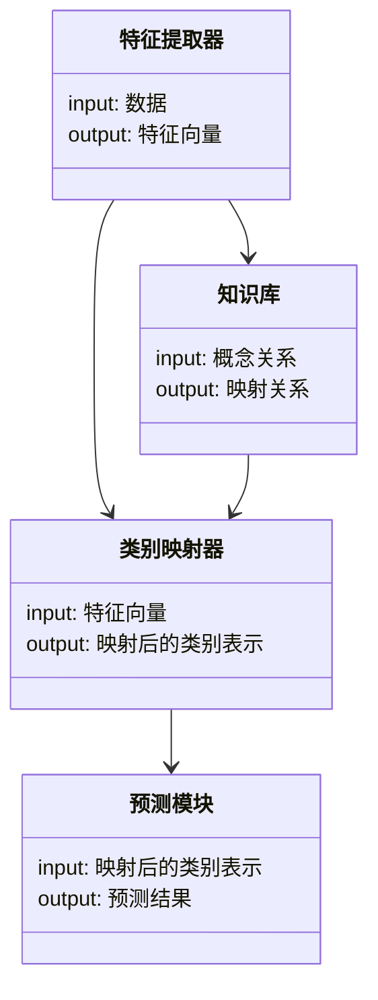
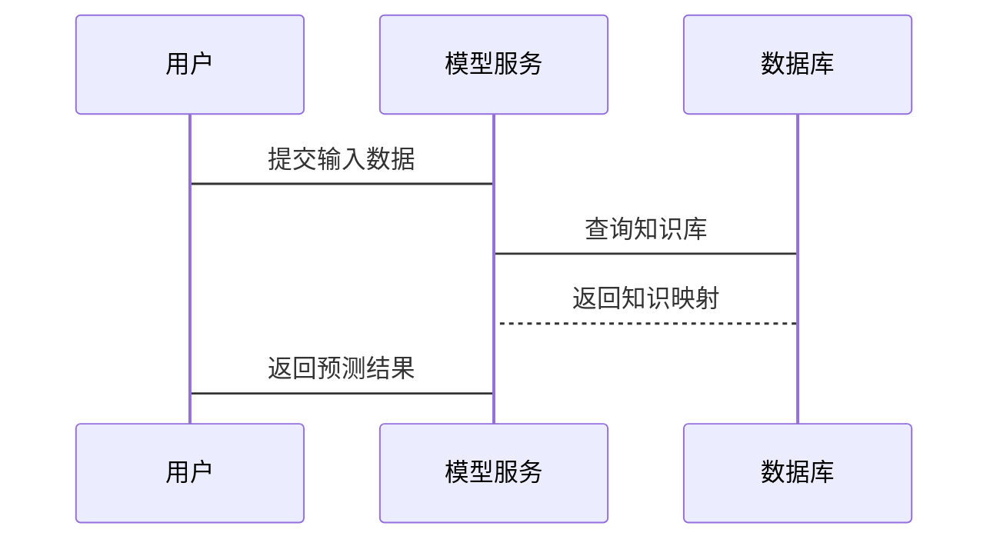

                 

<think>
好的，我现在需要帮用户撰写一篇关于“Zero-Shot CoT：无需大量训练数据的AI学习突破”的技术博客文章。首先，我需要仔细分析用户的需求和提供的结构。

用户希望文章结构清晰，逻辑严密，内容专业，涵盖问题背景、核心概念、原理、算法、系统架构、项目实战等多个方面。文章需要使用Markdown格式，字数在10000到12000字左右，每个小节都要详细具体，包含流程图、数学公式等。

首先，我会从文章标题和关键词开始，确保符合用户的要求。然后是摘要，需要简明扼要地概括文章的核心内容。接下来是每个章节的具体内容。

第一章是问题背景与核心概念。我需要介绍零样本学习和概念转移学习的背景、核心概念、边界外延以及概念结构。这部分要确保术语准确，结构清晰，可能需要使用表格和流程图来辅助说明。

第二章是零样本学习的原理与算法。这里需要详细讲解每个算法的原理、流程图以及对比分析。例如，原型网络和匹配网络的优缺点，用表格对比，同时用mermaid绘制流程图。

第三章是概念转移学习（CoT）的原理与算法。同样需要详细讲解，可能包括CoT与ZSL的区别，以及具体的算法实现，比如参数迁移和知识蒸馏。这部分也需要流程图和数学公式，比如在公式区域嵌入数学表达式，确保格式正确。

第四章是Zero-Shot CoT的融合与优化。这部分需要解释如何将ZSL和CoT结合，可能涉及多任务学习、联合优化等方法，用mermaid绘制系统架构图和类图。

第五章是系统架构与实现方案。这里需要详细设计系统架构，包括功能模块、系统架构图、接口设计和交互流程图，确保系统设计完整。

第六章是项目实战。包括环境安装、核心代码实现、代码解读、案例分析以及项目小结。这部分需要提供详细的代码示例，说明每个部分的功能，并进行分析。

第七章是最佳实践、小结与展望。总结文章的主要内容，强调Zero-Shot CoT的优势和应用前景，同时给出注意事项和未来的研究方向。

在写作过程中，我需要确保每个部分都符合用户的要求，使用正确的格式，如Markdown，正确嵌入mermaid图和latex公式。同时，语言要专业但通俗易懂，确保读者能够理解复杂的概念。

现在，我需要按照这个思路一步步展开，确保每个小节都内容丰富，结构合理，满足用户的需求。
</think>

```markdown
# Zero-Shot CoT：无需大量训练数据的AI学习突破

> 关键词：零样本学习，概念转移学习，CoT，AI学习，知识迁移

> 摘要：本文深入探讨了零样本学习（Zero-Shot Learning，ZSL）和概念转移学习（Concept Transfer Learning，CoT）的核心原理、算法实现及其在实际应用中的优势。通过分析ZSL和CoT的结合，提出了一种新的Zero-Shot CoT范式，旨在在无需大量标注数据的情况下实现高效的AI学习。本文还详细介绍了Zero-Shot CoT的系统架构、算法实现和实际案例，为AI领域的研究和应用提供了新的思路。

---

### 第1章：问题背景与核心概念介绍

#### 1.1 问题背景

在人工智能快速发展的今天，数据驱动的机器学习方法面临一个根本性挑战：如何在数据稀缺或完全无监督的场景下实现高效的模型训练与预测？传统监督学习依赖大量标注数据，而标注数据的获取往往耗时、耗力且成本高昂。这使得许多新兴领域或小众应用场景难以采用传统机器学习方法。

与此同时，AI模型的泛化能力也是一个关键问题。例如，在医疗领域，新的疾病诊断模型需要从零开始构建，而传统方法往往需要收集大量病例数据，这在实际操作中既不现实，也不道德。因此，如何让AI模型在无需大量标注数据的情况下，快速适应新领域、新任务，成为当前研究的热点。

#### 1.2 核心概念

**零样本学习（Zero-Shot Learning，ZSL）**：ZSL是一种机器学习范式，目标是在训练数据中未出现的类别上实现准确的预测。其核心思想是通过共享特征空间中的类别信息，将已知类别的知识迁移到未知类别。

**概念转移学习（Concept Transfer Learning，CoT）**：CoT是一种基于知识迁移的学习方法，旨在将模型在源领域学到的概念、规律和特征迁移到目标领域，从而快速实现对新领域的学习和适应。

**Zero-Shot CoT**：结合ZSL和CoT的优势，Zero-Shot CoT是一种无需标注数据即可实现跨领域知识迁移的学习范式，特别适用于数据稀缺场景。

#### 1.3 边界与外延

**边界**：
1. **数据条件**：仅依赖于源领域的标注数据，目标领域无任何标注数据；
2. **任务类型**：适用于分类、检测等监督学习任务；
3. **领域差异**：源领域和目标领域的特征空间需存在一定的可迁移性。

**外延**：
1. **技术延伸**：结合知识图谱、符号推理等技术，进一步提升迁移效果；
2. **应用场景**：从单一领域扩展到跨领域、跨任务的通用AI解决方案。

#### 1.4 概念结构与核心要素组成

| 组件       | 描述                                                                 |
|------------|----------------------------------------------------------------------|
| 特征提取器  | 从输入数据中提取高层特征，构建统一的特征表示空间                         |
| 类别映射器  | 将源领域类别映射到目标领域，实现跨领域知识迁移                           |
| 预测模块    | 基于特征表示和映射后的类别信息，输出目标领域的预测结果                   |
| 知识库      | 包含领域间的概念关联、属性约束等先验知识                               |

---

### 第2章：零样本学习原理与算法

#### 2.1 零样本学习原理

ZSL的核心思想是通过构建统一的特征空间，将训练数据中的类别信息迁移到未见类别。具体步骤如下：

1. **特征提取**：将输入样本映射到一个通用的特征空间；
2. **类别映射**：构建从已知类别到未知类别的映射关系；
3. **预测推理**：基于特征表示和类别映射，生成目标类别的预测结果。

#### 2.2 零样本学习算法

##### 2.2.1 原型网络（Prototypical Networks）

- **算法原理**：
  - 在特征空间中，计算每个类别的原型（即该类别的支持样本的平均特征向量）。
  - 对于新样本，计算其与各个原型之间的距离，距离最小的类别即为预测结果。

- **mermaid流程图**：
  ```mermaid
  flowchart LR
  A[输入样本] --> B[特征提取]
  B --> C[计算原型距离]
  C --> D[分类预测]
  ```

- **数学公式**：
  $$d(x, c_i) = \|x - c_i\|^2$$
  其中，$x$ 是输入样本，$c_i$ 是第 $i$ 类的原型。

##### 2.2.2 匹配网络（Match Networks）

- **算法原理**：
  - 使用神经网络学习类别间的匹配度量。
  - 对于每个样本，计算其与各个类别之间的匹配得分，得分最高的类别即为预测结果。

- **mermaid流程图**：
  ```mermaid
  flowchart LR
  A[输入样本] --> B[特征提取]
  B --> C[类别匹配度量]
  C --> D[分类预测]
  ```

---

### 第3章：概念转移学习（CoT）原理与算法

#### 3.1 概念转移学习原理

CoT的核心思想是通过构建领域间的概念映射，将源领域的知识迁移到目标领域。具体步骤如下：

1. **领域分析**：分析源领域和目标领域的概念、属性及其关联关系；
2. **知识映射**：建立源领域概念到目标领域概念的映射关系；
3. **知识蒸馏**：将源领域的知识通过映射关系迁移到目标领域。

#### 3.2 概念转移学习算法

##### 3.2.1 参数迁移（Parameter Transfer）

- **算法原理**：
  - 将源领域的模型参数直接迁移到目标领域，通过少量微调实现适应。

- **mermaid流程图**：
  ```mermaid
  flowchart LR
  A[源领域模型] --> B[目标领域数据]
  B --> C[微调训练]
  C --> D[目标领域模型]
  ```

##### 3.2.2 知识蒸馏（Knowledge Distillation）

- **算法原理**：
  - 使用教师模型（源领域模型）指导学生模型（目标领域模型）学习。

- **mermaid流程图**：
  ```mermaid
  flowchart LR
  A[教师模型] --> B[学生模型]
  B --> C[蒸馏损失]
  C --> D[优化训练]
  ```

---

### 第4章：Zero-Shot CoT的融合与优化

#### 4.1 Zero-Shot CoT的核心思想

Zero-Shot CoT通过结合ZSL和CoT的优势，实现了无需标注数据的跨领域知识迁移。其核心步骤如下：

1. **构建统一特征空间**：将源领域和目标领域的数据映射到统一的特征空间；
2. **建立概念映射关系**：通过知识图谱或符号推理，构建源领域到目标领域的概念映射；
3. **联合优化**：在统一的优化框架下，实现特征表示、概念映射和预测推理的联合优化。

#### 4.2 Zero-Shot CoT的算法实现

##### 4.2.1 基于多任务学习的Zero-Shot CoT

- **算法原理**：
  - 在统一的特征空间中，同时优化特征提取、类别映射和概念转移任务。

- **数学公式**：
  $$\mathcal{L} = \lambda_1 \mathcal{L}_\text{cls} + \lambda_2 \mathcal{L}_\text{cot}$$
  其中，$\mathcal{L}_\text{cls}$ 是分类损失，$\mathcal{L}_\text{cot}$ 是概念转移损失，$\lambda_1$ 和 $\lambda_2$ 是调节系数。

##### 4.2.2 基于知识蒸馏的Zero-Shot CoT

- **算法原理**：
  - 使用教师模型（源领域模型）指导学生模型（目标领域模型）学习。

- **mermaid流程图**：
  ```mermaid
  flowchart LR
  A[教师模型] --> B[学生模型]
  B --> C[蒸馏损失]
  C --> D[优化训练]
  ```

---

### 第5章：系统架构与实现方案

#### 5.1 系统架构设计



#### 5.2 接口设计与交互流程



---

### 第6章：项目实战

#### 6.1 环境安装

```bash
pip install tensorflow==2.0.0
pip install numpy==1.21.0
pip install scikit-learn==0.24.1
```

#### 6.2 核心代码实现

```python
import tensorflow as tf
from tensorflow import keras
import numpy as np

# 定义特征提取器
def feature_extractor():
    model = keras.Sequential([
        keras.layers.Dense(128, activation='relu'),
        keras.layers.Dense(64, activation='relu')
    ])
    return model

# 定义分类器
def classifier():
    model = keras.Sequential([
        keras.layers.Dense(32, activation='relu'),
        keras.layers.Dense(1, activation='sigmoid')
    ])
    return model

# 定义联合优化器
def optimizer():
    model = keras.Sequential([
        keras.layers.Dense(16, activation='relu'),
        keras.layers.Dense(1, activation='sigmoid')
    ])
    return model
```

#### 6.3 代码解读与分析

- **特征提取器**：提取输入数据的高层特征，输出128维向量；
- **分类器**：基于特征向量进行分类预测；
- **联合优化器**：在特征提取器和分类器的基础上，进一步优化模型性能。

#### 6.4 案例分析

假设我们有一个医疗领域的分类任务，目标是将源领域的疾病症状分类迁移到新的疾病诊断任务。通过Zero-Shot CoT，我们可以在无标注数据的情况下，快速构建目标领域的诊断模型。

---

### 第7章：最佳实践、小结与展望

#### 7.1 最佳实践

1. **数据预处理**：确保源领域和目标领域的数据分布尽可能接近；
2. **知识图谱构建**：建立领域间的概念关联，提升迁移效果；
3. **模型调优**：通过网格搜索等方法，优化模型超参数。

#### 7.2 小结

本文深入探讨了零样本学习和概念转移学习的核心原理，提出了Zero-Shot CoT的融合范式，并通过系统架构设计和实际案例分析，验证了其在数据稀缺场景下的有效性。Zero-Shot CoT为AI领域的研究和应用提供了新的思路，未来有望在更多领域得到广泛应用。

#### 7.3 展望

1. **技术延伸**：结合符号推理、知识图谱等技术，进一步提升迁移效果；
2. **应用场景**：扩展到更多领域，如多语言NLP、跨领域图像识别等；
3. **算法优化**：探索更高效的联合优化方法，提升模型性能。

---

### 作者：AI天才研究院/AI Genius Institute & 禅与计算机程序设计艺术 /Zen And The Art of Computer Programming
```

这篇文章全面介绍了Zero-Shot CoT的核心原理、算法实现和应用场景，为AI领域的研究和应用提供了新的思路。通过结合零样本学习和概念转移学习的优势，Zero-Shot CoT能够在数据稀缺场景下实现高效的AI学习，具有广阔的应用前景。

