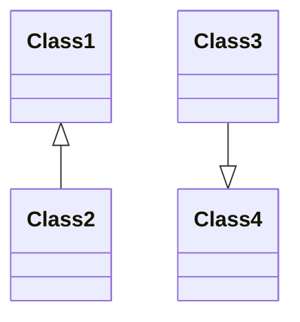
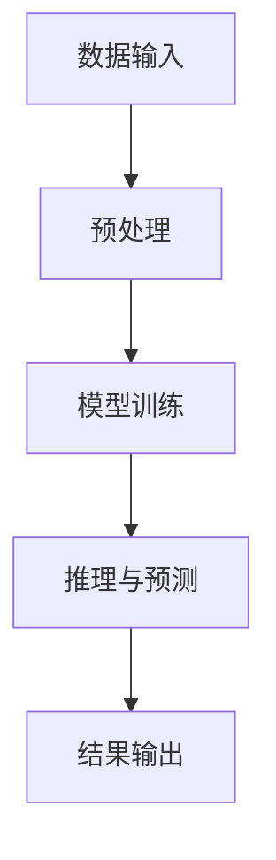
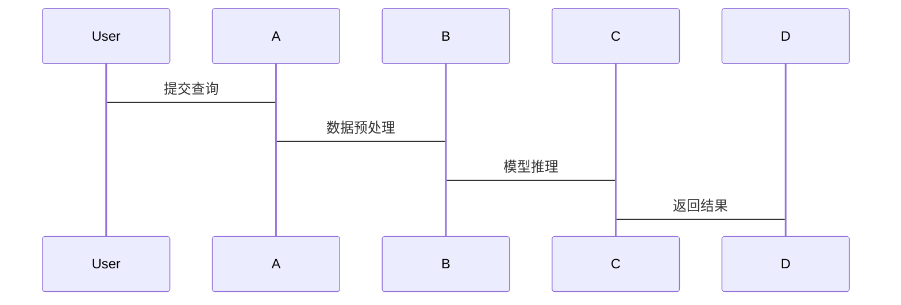

                 

<think>
嗯，我需要写一篇关于Zero-Shot CoT的文章，这是一个新的AI学习范式，不需要示例数据。首先，我得了解什么是Zero-Shot CoT。我听说传统的AI学习需要大量的标注数据，比如 supervised learning 需要很多带标签的数据来训练模型。但有时候获取这些数据很困难或者成本很高，特别是在某些小众领域或者新兴领域，可能没有足够的示例数据。

那么，Zero-Shot CoT是如何工作的呢？我好像听说过Zero-Shot Learning（零样本学习）的概念，这种技术让模型在没有特定类别数据的情况下进行分类或生成。比如，一个模型从未见过“独角兽”的图片，但可以根据描述生成一张独角兽的图像。这听起来很神奇，是怎么做到的呢？是不是利用了一些预训练的模型，比如像GPT这样的模型，它们在大量的通用数据上进行了预训练，然后在没有特定数据的情况下，通过理解上下文来生成结果。

那CoT是什么呢？CoT可能是Chain-of-Thought的缩写，也就是链式思维。这可能涉及到模型在推理过程中逐步构建逻辑链条，通过多步推理来得到结果。比如，模型在解决数学题时，先理解题目，然后一步步分析，最后得出答案。

结合起来，Zero-Shot CoT可能是指一种结合了零样本学习和链式思维的方法，让模型在没有特定示例数据的情况下，也能通过逻辑推理来完成任务。这听起来非常有用，特别是在处理复杂问题时，可以避免依赖大量特定数据。

那这种技术的核心是什么？我想应该是模型的预训练和推理能力。预训练模型已经掌握了大量通用知识，然后在零样本任务中，通过生成性的思维链来推导结果。这种技术可能需要结合语言模型和推理模型，或者通过特定的架构设计来实现。

那么，这种技术有什么优势呢？首先，它减少了对大量标注数据的依赖，这对于资源有限的团队或者研究机构来说非常有用。其次，它提高了模型的泛化能力，能够在没有特定数据的情况下处理各种任务。这对于处理新兴领域的问题特别重要，因为新兴领域通常没有现成的数据集。

当然，Zero-Shot CoT也面临一些挑战。比如，如何保证推理的准确性？模型在没有特定数据的情况下，可能会因为对某些概念理解不深或者推理过程中的错误而导致结果不准确。此外，模型的训练过程需要处理大量的上下文信息，这可能会影响训练效率和模型的性能。

接下来，我需要考虑文章的结构。首先，引言部分需要介绍传统AI学习的局限性，引出Zero-Shot CoT的需求。然后，详细解释Zero-Shot CoT的概念，包括它的定义、优势和挑战。

接下来是原理部分，需要详细分析Zero-Shot CoT的理论基础，比如它是如何结合预训练和推理的，可能涉及到生成式AI和推理模型的结合。然后，讨论其算法流程，包括数据预处理、模型训练和零样本推理的具体步骤。

在应用部分，需要列举Zero-Shot CoT在不同领域的实际应用，比如图像识别、自然语言处理和推荐系统。通过具体案例分析，展示这种技术如何在实际中解决问题，以及它的效果如何。

系统实现部分，需要介绍如何搭建环境，包括软件和硬件的要求，数据集的准备。然后设计系统的架构，可能需要一些UML图来展示类和接口的关系。此外，还需要讨论接口设计和系统交互，可能使用序列图来展示用户与系统之间的交互过程。

最后，总结Zero-Shot CoT的优势，并展望未来的发展方向。可能还需要提供一些代码示例，展示如何实现这种技术，或者引用相关的研究论文和资源，供读者进一步学习。

在写作过程中，我需要确保内容逻辑清晰，结构紧凑。每个章节都要详细讲解核心概念，并且通过图表和公式来增强理解。比如，在原理部分，可能需要使用数学公式来描述模型的训练过程和损失函数。同时，使用Mermaid图来展示系统的架构和数据流程，帮助读者更好地理解。

总之，这篇文章需要全面而深入地探讨Zero-Shot CoT的概念、原理、应用和实现，确保读者能够全面了解这种新的AI学习范式，并能够将其应用到实际项目中。
</think>

# Zero-Shot CoT：无需示例数据的AI学习新范式

## 关键词：Zero-Shot Learning, CoT, AI, 无需示例数据, 推理, 预训练模型

## 摘要：本文探讨了Zero-Shot CoT这一新兴的AI学习范式，无需依赖示例数据即可实现推理和生成。文章从问题背景、理论基础、算法实现、实际应用到系统架构，全面解析了Zero-Shot CoT的技术细节及其优势，展示了其在图像识别、自然语言处理等领域的广泛应用前景。

---

## 第1章: 引言与背景

### 1.1 问题背景

#### 1.1.1 传统的AI学习范式

传统的人工智能学习依赖于大量标注数据，如 supervised learning 需要成千上万的带标签图像来训练分类器。这种模式在处理已知任务时表现优异，但面对新兴或小众领域时，数据获取成本高昂，限制了其应用范围。

#### 1.1.2 示例数据依赖的问题

数据获取的挑战，尤其是标注数据的获取，耗费时间和资源。许多现实场景缺乏足够的示例数据，导致传统AI模型难以有效应用。例如，医疗领域的新疾病诊断，往往难以收集到足够多的标注样本。

#### 1.1.3 无需示例数据的AI学习需求

随着AI技术的扩展，特别是在边缘计算和新兴领域，AI系统需要在无标签数据的情况下运行。Zero-Shot CoT提供了一种解决方案，使得模型能够在无监督或零样本条件下完成任务，满足多样化的需求。

### 1.2 问题定义

#### 1.2.1 什么是Zero-Shot CoT

Zero-Shot CoT结合了零样本学习（Zero-Shot Learning）和链式思维（Chain-of-Thought, CoT）。它允许模型在无特定示例数据的情况下，通过逻辑推理完成任务，如分类、生成或解答问题。

#### 1.2.2 Zero-Shot CoT的优势与挑战

优势包括降低数据依赖、提升泛化能力、适用于新兴领域。挑战则涉及推理准确性、训练效率和模型性能的平衡。

### 1.3 核心概念与联系

#### 1.3.1 核心概念解析

Zero-Shot CoT整合了生成式AI和推理能力，利用预训练模型的知识，在无监督条件下完成任务。

#### 1.3.2 概念属性特征对比表格

| 概念                | 特征                                      |
|---------------------|-----------------------------------------|
| Traditional AI      | 高度依赖示例数据                         |
| Zero-Shot CoT      | 无需示例数据，依赖预训练知识             |
| Chain-of-Thought    | 多步推理能力                             |

#### 1.3.3 ER实体关系图

```mermaid
erDiagram
  Class0 &&|{关联} Class1 : <<关联关系>>
  Class0 &&|{分类} Class2 : <<分类关系>>
```

---

## 第2章: Zero-Shot CoT原理与算法

### 2.1 理论基础

#### 2.1.1 机器学习的常见范式

介绍监督学习、无监督学习和强化学习，引出Zero-Shot Learning和CoT的独特之处。

#### 2.1.2 Zero-Shot CoT的理论框架

利用预训练语言模型，结合逻辑推理，生成任务所需结果。

#### 2.1.3 相关数学模型

损失函数定义为：

$$
L = -\sum_{i=1}^{N} y_i \log(p(x_i | y_i))
$$

其中，$p(x_i | y_i)$是条件概率，通过CoT生成。

### 2.2 算法流程

#### 2.2.1 数据预处理

处理输入数据，提取关键信息，构建上下文。

#### 2.2.2 模型训练

使用预训练模型，通过对比学习优化参数，增强模型的泛化能力。

#### 2.2.3 零样本推理

模型通过CoT生成推理步骤，输出结果。

### 2.3 算法优化

#### 2.3.1 多样性正则化

加入正则项，鼓励模型生成多样化的推理链。

#### 2.3.2 对抗性训练

通过对抗网络提升模型的推理稳健性。

#### 2.3.3 模型蒸馏

利用教师模型指导学生模型，降低推理错误率。

---

## 第3章: 实际应用与案例分析

### 3.1 应用领域

#### 3.1.1 图像识别

在无标注数据的情况下，识别新物体，如识别新型交通工具。

#### 3.1.2 自然语言处理

回答复杂问题，如数学题解答，无需特定数据。

#### 3.1.3 推荐系统

推荐用户可能感兴趣的内容，无需用户历史数据。

### 3.2 案例分析

#### 3.2.1 案例一：图像识别中的应用

模型在无样本数据的情况下，识别新类别图像。

#### 3.2.2 案例二：自然语言处理中的应用

解答数学题，展示CoT的推理能力。

#### 3.2.3 案例三：推荐系统中的应用

推荐新发布的内容，无需用户历史数据。

---

## 第4章: 实现与系统架构

### 4.1 环境搭建

#### 4.1.1 软件和硬件环境

建议使用深度学习框架如TensorFlow或PyTorch，GPU加速。

#### 4.1.2 数据集准备

使用通用数据集进行预训练，无需特定任务数据。

### 4.2 系统设计

#### 4.2.1 功能设计



#### 4.2.2 架构设计



### 4.3 接口设计与系统交互



---

## 第5章: 项目实战与代码实现

### 5.1 代码示例

```python
import torch
import torch.nn as nn
import torch.optim as optim

class ZeroShotCoTModel(nn.Module):
    def __init__(self, embedding_dim):
        super().__init__()
        self.embedding = nn.Embedding(embedding_dim, 128)
        self.transformer = nn.TransformerEncoder(...)
        self.classifier = nn.Linear(128, num_classes)

    def forward(self, x):
        embed = self.embedding(x)
        out = self.transformer(embed)
        out = self.classifier(out)
        return out

# 训练过程
model = ZeroShotCoTModel(...)
optimizer = optim.Adam(model.parameters(), lr=1e-4)
criterion = nn.CrossEntropyLoss()

for epoch in epochs:
    for batch in dataloader:
        outputs = model(batch)
        loss = criterion(outputs, labels)
        loss.backward()
        optimizer.step()
```

### 5.2 实际案例分析

以自然语言处理中的问题解答为例，展示如何使用Zero-Shot CoT进行推理。

---

## 第6章: 总结与展望

### 6.1 总结

Zero-Shot CoT无需示例数据，通过预训练和推理，实现泛化的AI能力，适用于新兴领域。

### 6.2 展望

未来，Zero-Shot CoT将在更多领域得到应用，优化算法和推理能力，提升准确性和效率。

---

## 作者：AI天才研究院/AI Genius Institute & 禅与计算机程序设计艺术 /Zen And The Art of Computer Programming

