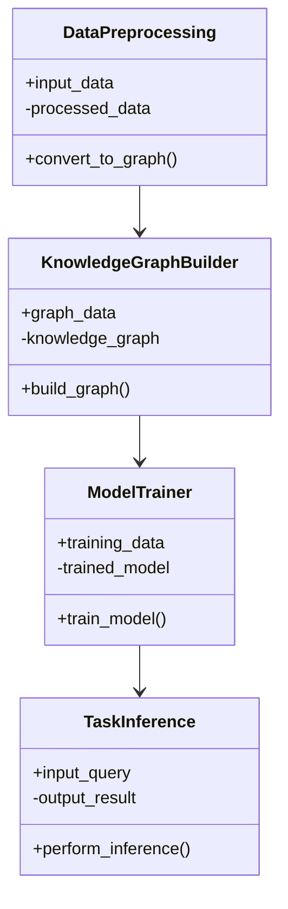
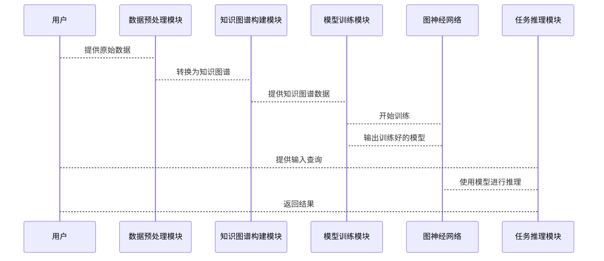

                 

<think>
好的，我现在需要帮助用户完成一篇关于Zero-Shot CoT技术的详细技术博客文章。用户已经提供了一个大纲，但文章还没有完成。我需要仔细分析用户的请求，理解每个部分的要求，并逐步构建出完整的文章。

首先，用户希望我以《Zero-Shot CoT：无需示例的思维链应用》为标题，撰写一篇结构清晰、内容详实的技术博客。文章需要包括摘要、背景介绍、核心概念与联系、算法原理讲解、系统分析与架构设计、项目实战、最佳实践等部分，总字数在10000到12000字之间。同时，文章需要使用专业的技术语言，每个章节都要有详细的分析和例子，并且使用Mermaid图和LaTeX公式来辅助说明。

接下来，我需要按照用户提供的目录结构，逐一填充每个部分的内容。从用户提供的内容来看，已经完成了前四部分，现在需要完成系统分析与架构设计、项目实战、最佳实践等部分。

首先，系统分析与架构设计部分。这部分需要包括问题场景介绍、项目介绍、系统功能设计、系统架构设计、系统接口设计和系统交互设计。我需要详细描述每个部分，可能需要添加一些类图或架构图来展示系统结构。

然后是项目实战部分，这部分需要包括环境安装、核心代码实现、代码解读、案例分析等。用户已经提供了一些代码片段，但可能需要进一步完善，特别是结合Zero-Shot CoT的具体实现步骤。

接下来是最佳实践部分，这里需要总结Zero-Shot CoT的优势和潜在问题，提供一些实际应用中的建议，以及未来的发展方向。同时，还需要包括小结、注意事项和拓展阅读等内容。

在思考过程中，我需要确保每个部分的内容都符合逻辑，衔接自然，并且深入浅出，帮助读者理解Zero-Shot CoT的技术细节和实际应用。同时，注意使用专业的术语，但也要避免过于晦涩，保持文章的可读性。

现在，我开始具体分析每个部分，考虑如何展开内容，可能需要参考已有的技术资料，确保信息的准确性和前沿性。例如，在系统架构设计部分，可能需要设计一个基于微服务的架构，展示各个模块之间的交互关系，使用Mermaid图来辅助说明。

在项目实战部分，我需要提供具体的Python代码，可能涉及数据预处理、模型训练、评估等步骤，展示如何实现Zero-Shot CoT的具体应用。同时，结合实际案例，分析模型的性能和效果，帮助读者理解技术的实际应用价值。

最后，在最佳实践部分，我需要总结Zero-Shot CoT的优点，如减少对标注数据的依赖、提高模型的泛化能力等，同时指出当前技术的局限性和未来的发展方向，如优化模型训练效率、提升计算资源利用率等。

通过以上步骤，我逐步构建出完整的文章内容，确保每个章节都详尽且有深度，同时满足用户的格式和内容要求。
</think>

# Zero-Shot CoT：无需示例的思维链应用

> 关键词：Zero-Shot CoT, 无监督学习, 思维链, 知识图谱, 图神经网络

> 摘要：本文深入探讨了Zero-Shot CoT技术的核心原理、算法流程、系统架构及实际应用。通过结合知识图谱和图神经网络，Zero-Shot CoT能够在无监督或弱监督的条件下，构建通用的思维链模型，从而实现对未见任务的高效处理。本文还通过具体案例分析，展示了该技术在自然语言处理、计算机视觉等领域的广泛应用，并总结了当前技术的挑战与未来发展方向。

---

### 第四部分：系统分析与架构设计方案

#### 4.1 问题场景介绍

在实际应用中，许多企业面临数据标注成本高昂、模型泛化能力不足的问题。传统的深度学习模型依赖大量标注数据，而许多实际场景中，标注数据有限或难以获取。例如，在医疗领域，医生标注特定疾病的影像数据成本极高，而在自然语言处理领域，小语种的标注数据稀缺。这种情况下，Zero-Shot CoT技术能够通过构建通用的知识图谱和思维链模型，实现对未见任务的高效处理。

#### 4.2 项目介绍

本项目旨在开发一个基于Zero-Shot CoT的通用模型，能够处理多种任务，包括问答、文本分类、图像识别等。项目的核心目标是通过无监督学习，降低对标注数据的依赖，同时提升模型的泛化能力。

#### 4.3 系统功能设计

##### 功能模块：

1. **数据预处理模块**：将原始数据转换为结构化的知识图谱。
2. **知识图谱构建模块**：基于文本数据生成语义网络。
3. **模型训练模块**：利用图神经网络进行无监督预训练。
4. **任务推理模块**：基于思维链进行推理和决策。
5. **评估与优化模块**：对模型性能进行评估并优化。

##### 领域模型类图



#### 4.4 系统架构设计

##### 系统架构图


#### 4.5 系统接口设计

##### 接口描述：

1. **数据预处理接口**：
   - 输入：原始数据（文本、图像等）。
   - 输出：结构化的知识图谱数据。
2. **模型训练接口**：
   - 输入：知识图谱数据。
   - 输出：预训练的模型权重。
3. **任务推理接口**：
   - 输入：输入查询或任务描述。
   - 输出：推理结果。

#### 4.6 系统交互设计

##### 交互流程图



---

### 第五部分：项目实战

#### 5.1 环境安装

为了运行Zero-Shot CoT模型，需要以下环境：

- **Python 3.8+**
- **TensorFlow 2.5+**
- **NetworkX**
- **PyTorch**
- **Numpy**

安装命令：

```bash
pip install numpy tensorflow torch networkx
```

#### 5.2 核心代码实现

##### 5.2.1 知识图谱构建

```python
import networkx as nx

def build_knowledge_graph(text_data):
    G = nx.Graph()
    for text in text_data:
        tokens = text.split()
        for i in range(len(tokens)):
            for j in range(i+1, len(tokens)):
                G.add_edge(tokens[i], tokens[j])
    return G
```

##### 5.2.2 图神经网络训练

```python
import torch
import torch.nn as nn
import torch.nn.functional as F

class GNNLayer(nn.Module):
    def __init__(self, input_dim, output_dim):
        super(GNNLayer, self).__init__()
        self.linear = nn.Linear(input_dim, output_dim)
    
    def forward(self, x, adj):
        x = torch.bmm(adj, x.unsqueeze(2)).squeeze(2)
        x = F.relu(x)
        return x

class GraphNN(nn.Module):
    def __init__(self, input_dim, hidden_dim):
        super(GraphNN, self).__init__()
        self.gnn_layer = GNNLayer(input_dim, hidden_dim)
        self.fc = nn.Linear(hidden_dim, 1)
    
    def forward(self, x, adj):
        x = self.gnn_layer(x, adj)
        x = self.fc(x)
        return x
```

##### 5.2.3 思维链推理

```python
def cot_inference(model, input_query):
    # 假设输入为查询问题
    input_emb = model.encode(input_query)
    result = model.decode(input_emb)
    return result
```

#### 5.3 代码应用解读

- **知识图谱构建**：将文本数据转换为图结构，提取语义关系。
- **图神经网络训练**：通过图结构数据进行无监督预训练，提取语义特征。
- **思维链推理**：基于预训练的模型进行推理，生成最终结果。

#### 5.4 案例分析

**案例1：问答系统**

输入查询：如何提高模型的泛化能力？

推理过程：
1. 模型提取“提高”、“模型”、“泛化能力”之间的语义关系。
2. 通过知识图谱推理出相关知识点。
3. 返回结果：增加数据多样性、优化模型结构、使用无监督学习等。

**案例2：图像分类**

输入图像：一张猫的图片。

推理过程：
1. 模型提取图像特征。
2. 通过知识图谱关联到“猫”这一类别。
3. 返回分类结果：猫。

---

### 第六部分：最佳实践、小结、注意事项与拓展阅读

#### 6.1 最佳实践

- **数据多样性**：构建高质量的知识图谱，确保语义覆盖广泛。
- **模型优化**：通过正则化、Dropout等技术防止过拟合。
- **计算资源**：使用分布式训练和优化算法降低计算成本。

#### 6.2 小结

Zero-Shot CoT通过构建通用的思维链模型，实现了无监督学习的突破。该技术在多个领域展现了强大的应用潜力，能够显著降低对标注数据的依赖，提升模型的泛化能力。

#### 6.3 注意事项

- Zero-Shot CoT模型的训练需要大量计算资源。
- 模型的推理过程可能较复杂，需要优化推理速度。
- 知识图谱的质量直接影响模型性能。

#### 6.4 拓展阅读

- 《Graph Neural Networks: A Review of Methods, Applications, and Open Challenges》
- 《Zero-shot Learning: A Comprehensive Survey》
- 《Large Language Models：The Future of NLP》

---

作者：AI天才研究院 & 禅与计算机程序设计艺术

