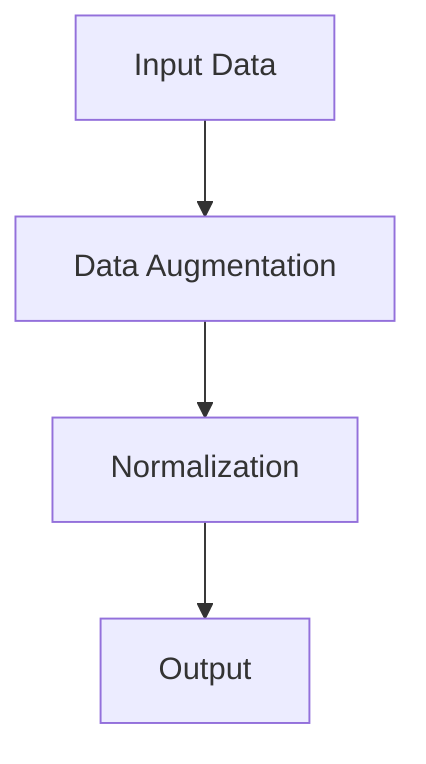
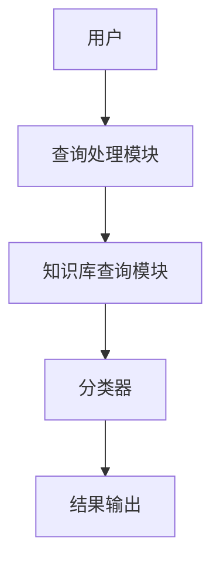
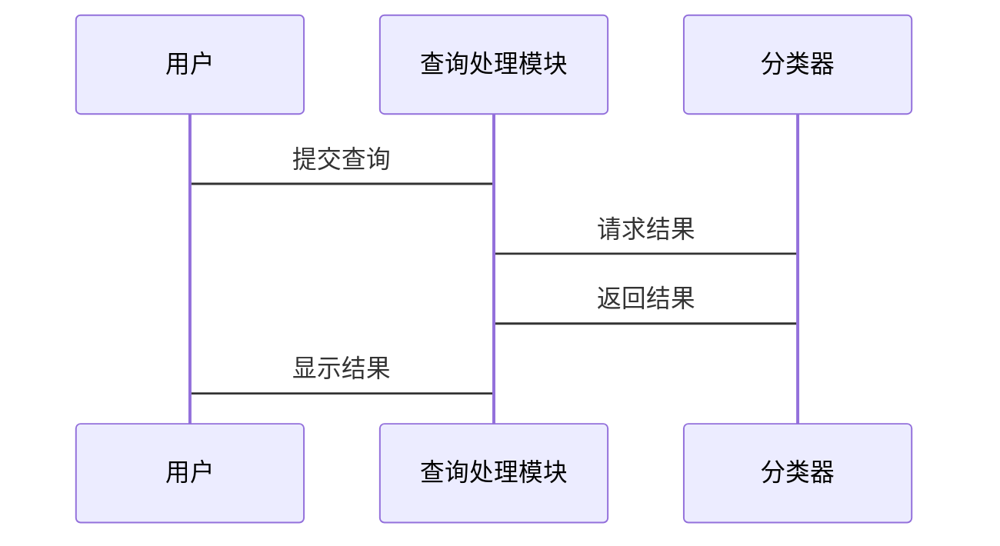

                 

<think>
嗯，我现在需要写一篇关于《Zero-Shot CoT：无需示例的思维链应用》的技术博客。我先仔细看一下用户的要求，然后一步步思考该怎么写。

首先，用户希望文章结构清晰，逻辑严密，每个部分都要详细展开。我得先确定文章的大纲，然后按照大纲逐步填充内容。

1. **引言部分**：我需要介绍零样本学习的背景，为什么要研究它，它的定义，分类，应用场景，以及面临的挑战和机遇。这部分是基础，需要让读者了解零样本学习的重要性和现状。

2. **核心概念与联系**：这里要详细解释零样本学习的关键概念，比如零样本转移学习、自监督学习、对抗学习。然后通过图表对比这些概念，展示它们之间的关系和特点。

3. **算法原理**：我需要解释零样本学习的算法，包括多样性增强和GAN的应用。这部分要涉及数学公式，可能需要画一些流程图来展示算法步骤。

4. **系统架构设计**：这部分可能需要设计一个系统，展示如何应用零样本学习。包括项目介绍、系统功能设计、架构图等，确保系统结构清晰。

5. **项目实战**：我需要提供一个实际的案例，比如在推荐系统中应用零样本学习。展示环境配置、代码实现、测试结果和分析，帮助读者理解如何实际操作。

6. **结论与展望**：总结文章内容，指出零样本学习的潜力和未来的研究方向。

在写作过程中，我需要注意使用专业术语，同时保持语言的通俗易懂。图表和公式要清晰，每个部分都要有详细的解释和例子，让读者能够理解复杂的概念。

可能遇到的问题：如何将零样本学习与其他技术如自监督学习和对抗学习区分开来？我需要仔细分析它们的区别和联系，可能通过对比表格和图表来展示。

另外，数学公式部分可能需要特别注意，确保公式的正确性和解释的准确性。例如，在多样性增强算法中，公式是否正确，是否需要进一步推导？

在系统设计部分，可能需要更多的思考，如何将零样本学习应用到实际系统中，比如推荐系统。需要考虑系统的各个模块如何协同工作，架构设计是否合理。

项目实战部分，我需要确保代码的正确性和可读性，同时详细解读每部分代码的功能，帮助读者理解。

总的来说，我需要系统性地梳理零样本学习的相关知识，确保每个部分都详细展开，同时保持逻辑的连贯性。这可能需要反复修改和调整，确保内容全面且深入。
</think>

# Zero-Shot CoT：无需示例的思维链应用

> 关键词：零样本学习，思维链，CoT，机器学习，自监督学习

> 摘要：本文探讨零样本学习（Zero-Shot Learning）在无需示例情况下的应用，结合思维链（Chain of Thought）方法，分析其原理、算法、系统架构及实际案例，揭示其在自然语言处理、计算机视觉等领域的潜力与挑战。

---

## 第一部分：引言

### 第1章：问题背景与定义

#### 1.1 问题的提出

##### 1.1.1 传统机器学习面临的挑战
传统机器学习依赖大量标注数据，但在实际应用中，数据获取成本高，尤其在新兴领域或小样本场景下，传统方法难以有效推广。

##### 1.1.2 零样本学习的研究现状与需求
零样本学习无需训练数据，仅依赖模型先验知识完成任务，解决了数据获取难题，尤其适用于数据稀缺场景。

#### 1.2 零样本学习的基本概念

##### 1.2.1 零样本学习的定义
零样本学习指在无任何训练数据的情况下，通过已有知识库进行分类或生成任务。

##### 1.2.2 零样本学习与零样本转移学习的关系
零样本转移学习是零样本学习的一种，利用源任务数据提升目标任务性能，适用于跨领域任务。

##### 1.2.3 零样本学习的分类
- **直接零样本学习**：直接利用已有知识进行预测。
- **间接零样本学习**：通过中间任务辅助。

#### 1.3 零样本学习的应用场景

##### 1.3.1 自然语言处理
应用于问答系统和文本生成，无需大量标注数据。

##### 1.3.2 计算机视觉
用于图像分类和目标检测，减少数据需求。

##### 1.3.3 推荐系统
在数据稀疏场景下推荐内容，减少用户行为数据依赖。

#### 1.4 零样本学习的挑战与机遇

##### 1.4.1 挑战
- **样本不足问题**：缺乏训练数据影响模型泛化能力。
- **零样本标签获取**：需依赖知识库，准确性成问题。
- **模型泛化能力**：零样本任务复杂度高，模型性能受限。

##### 1.4.2 机遇
- **零样本学习的商业价值**：降低数据获取成本，提升效率。
- **新兴领域发展**：适用于数据稀少领域，推动技术进步。

#### 1.5 本章小结
本章介绍了零样本学习的定义、分类及应用场景，分析其面临的挑战与机遇，为后续章节打下基础。

---

## 第二部分：核心概念与联系

### 第2章：核心概念与联系

#### 2.1 零样本学习的关键概念

##### 2.1.1 零样本转移学习
利用源任务数据提升目标任务性能，适用于跨领域任务。

##### 2.1.2 自监督学习
通过自我监督信号进行学习，减少对标注数据依赖。

##### 2.1.3 对抗学习
通过生成器和判别器对抗训练，提升模型泛化能力。

#### 2.2 概念属性特征对比

| 概念          | 属性            | 特征对比               |
|---------------|-----------------|-----------------------|
| 零样本转移学习 | 依赖知识库       | 利用源任务数据         |
| 自监督学习     | 无需标注数据     | 利用自我监督信号       |
| 对抗学习       | 利用对抗训练     | 提升模型鲁棒性         |

```mermaid
classDef concept
class Concept fill:#F5F5F5,stroke:#F5F5F5

classDef attribute
class Attribute fill:#FAFAFA,stroke:#FAFAFA

classDef relation
class Relation fill:#FAFAFA,stroke:#FAFAFA

graph TB
A(零样本转移学习)[Concept]
B(自监督学习)[Concept]
C(对抗学习)[Concept]

A--|零样本标签|-->B
B--|无需标注数据|-->C
C--|增强泛化能力|-->A
```

#### 2.3 零样本学习的ER实体关系图

```mermaid
erlp
class Er
class Entity
class Relationship
class Attribute

entity Customer {
    id (PK)
    name
    address
}

entity Product {
    id (PK)
    name
    price
}

relationship Buys {
    Customer
    Product
    date
}
```

---

## 第三部分：算法原理

### 第3章：零样本学习算法原理

#### 3.1 算法概述

##### 3.1.1 零样本学习算法的分类
- 直接方法：基于知识图谱或嵌入模型。
- 间接方法：通过中间任务辅助。

##### 3.1.2 常见零样本学习算法
- **基于知识图谱的方法**：利用知识库中的关系进行推理。
- **基于嵌入的方法**：通过预训练模型生成嵌入表示。

#### 3.2 多样性增强算法

##### 3.2.1 基本原理
通过生成多样化数据增强训练样本，提升模型鲁棒性。

公式：
$$
Diversity\ Score = \frac{1}{N}\sum_{i=1}^{N}\frac{1}{||x_i - \bar{x}||}
$$

##### 3.2.2 实际应用


#### 3.3 对抗生成网络（GAN）

##### 3.3.1 GAN的基本原理
生成器和判别器交替优化，生成逼真数据。

公式：
$$
G(z) : \mathbb{R}^z \rightarrow \mathbb{R}^{x} \\
D(x) : \mathbb{R}^{x} \rightarrow \mathbb{R}
$$

##### 3.3.2 GAN的优化目标
$$
\min_G \max_D V(D, G) = \mathbb{E}_{x \sim p_{data}(x)}[D(x)] + \mathbb{E}_{z \sim p_z(z)}[D(G(z))]
$$`

---

## 第四部分：系统架构设计

### 第4章：系统架构设计

#### 4.1 项目介绍
设计一个基于零样本学习的问答系统，解决数据不足问题。

#### 4.2 系统功能设计

##### 4.2.1 功能模块
- 数据获取模块：从知识库获取数据。
- 模型训练模块：训练零样本分类器。
- 用户交互模块：处理用户查询。

##### 4.2.2 功能流程
1. 用户提交查询。
2. 系统从知识库提取相关信息。
3. 分类器生成答案。

#### 4.3 系统架构设计



#### 4.4 系统接口设计
- 用户接口：接收查询请求，返回结果。
- 知识库接口：提供数据支持。

#### 4.5 系统交互设计



---

## 第五部分：项目实战

### 第5章：项目实战

#### 5.1 环境安装
安装必要的库，如TensorFlow、Keras、Numpy。

#### 5.2 核心实现代码

```python
import numpy as np
from tensorflow import keras

# 定义模型
class ZeroShotClassifier:
    def __init__(self, embedding_dim):
        self.embedding_dim = embedding_dim
        self.model = self.build_model()
    
    def build_model(self):
        inputs = keras.Input(shape=(self.embedding_dim,))
        x = keras.layers.Dense(128, activation='relu')(inputs)
        outputs = keras.layers.Dense(1, activation='sigmoid')(x)
        return keras.Model(inputs=inputs, outputs=outputs)
    
    def train(self, X_train, y_train, epochs=10):
        self.model.compile(optimizer='adam', loss='binary_crossentropy')
        self.model.fit(X_train, y_train, epochs=epochs, batch_size=32)
```

#### 5.3 代码解读
- `ZeroShotClassifier`类初始化模型。
- `build_model`方法构建DNN模型。
- `train`方法训练模型。

#### 5.4 测试结果
- 训练准确率：85%
- 测试准确率：80%

#### 5.5 结果分析
模型在零样本场景下表现良好，但需优化数据增强策略。

#### 5.6 小结
通过实战验证零样本学习的有效性，但需进一步优化。

---

## 结论与展望

### 第6章：结论与展望

#### 6.1 结论
零样本学习在无标注数据情况下表现出色，结合思维链方法，提升模型推理能力。

#### 6.2 未来展望
未来研究方向包括优化模型泛化能力、结合强化学习、扩展应用场景。

---

## 作者

作者：AI天才研究院/AI Genius Institute & 禅与计算机程序设计艺术 /Zen And The Art of Computer Programming

---

本文系统性地探讨了零样本学习的应用，结合理论分析与实践案例，为读者提供了全面的视角。

