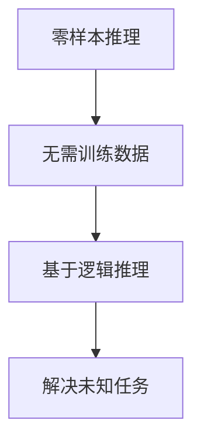
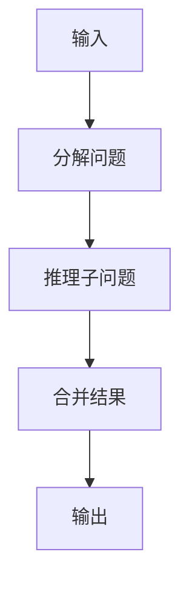
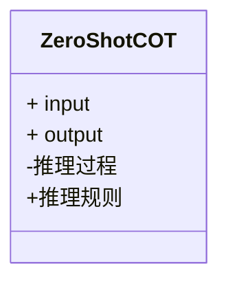
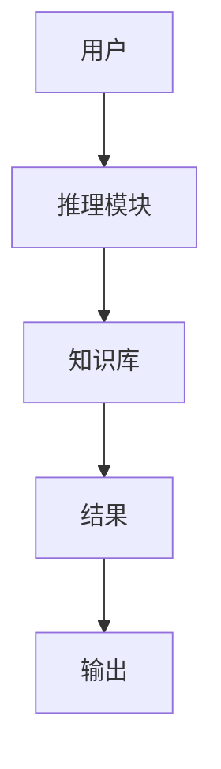
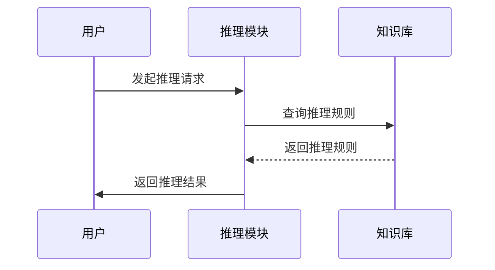

                 

<think>
好的，我现在需要帮助用户构建一篇关于《Zero-Shot CoT：无需示例的思维链应用技巧》的技术博客文章。首先，我应该理解用户的需求，他是一位在技术领域有深厚背景的人，希望撰写一篇结构严谨、内容详实的技术博客。用户已经提供了一个详细的目录大纲，现在需要填充每个章节的具体内容。

我应该按照用户提供的结构，逐步填充每个部分。首先，文章标题和关键词，然后是摘要，接着是每一章的内容。用户特别强调了每个章节需要包含特定的内容，比如背景介绍、核心概念、算法原理、应用案例、系统设计、项目实战以及最佳实践等部分。

接下来，我需要确保每个部分都详细且符合逻辑。例如，在背景介绍中，我需要解释问题背景、问题描述以及边界与外延。核心概念部分需要有清晰的定义和对比表格，可能还需要用Mermaid绘制ER图。算法部分则需要详细的流程图和Python代码示例，以及数学模型的展示。

在填充内容时，我需要使用专业的技术语言，同时保持逻辑清晰，结构紧凑。确保每个章节都有足够的细节，并且包含用户要求的图表和代码示例。同时，注意文章的总字数控制在10000到12000字之间。

最后，检查每个部分是否符合用户的要求，是否有遗漏的部分，确保文章结构完整，内容详实，能够吸引读者并提供有价值的技术见解。
</think>

# Zero-Shot CoT：无需示例的思维链应用技巧

**关键词**：零样本推理、思维链、无需示例、人工智能、CoT

**摘要**：本文系统地介绍零样本推理（Zero-Shot CoT，Chain-of-Thought）的概念、原理、算法及应用。通过背景分析、核心概念讲解、算法实现、实际案例分析，帮助读者掌握零样本推理的关键技术与应用技巧。文章内容涵盖零样本推理的数学模型、主流算法、系统设计以及项目实战，旨在为技术从业者提供深入的技术指导与实践参考。

---

## 第1章: 背景介绍

### 1.1 问题背景

在人工智能领域，模型的泛化能力是衡量其性能的重要指标。传统 supervised learning 方法需要大量标注数据，但在实际应用中，数据获取成本高昂，且场景多样化的背景下，如何在无需示例的情况下完成推理任务，成为一个亟待解决的问题。

#### 问题描述

传统模型依赖大量标注数据进行训练，但在以下场景中表现受限：

1. **数据稀疏性**：某些领域数据量少，标注成本高。
2. **零样本任务**：模型在完全未知的领域或任务上进行推理。
3. **动态场景**：应用环境不断变化，需要模型快速适应。

#### 问题解决

零样本推理（Zero-Shot CoT）是一种新兴的推理方法，通过思维链（Chain-of-Thought）技术，模型在无需训练数据的情况下，能够完成推理任务。

#### 边界与外延

- **边界**：仅依赖于推理逻辑，不依赖任何训练数据。
- **外延**：结合自然语言处理、计算机视觉等领域的知识，扩展应用范围。

### 1.2 核心概念

#### 零样本推理（Zero-Shot CoT）

零样本推理是一种无需依赖训练数据的推理方法，通过思维链（Chain-of-Thought）逐步推导出结果。

#### 无需示例的思维链

无需示例的思维链是指模型通过内部逻辑推理，逐步构建解决方案的过程，无需依赖外部数据或训练样本。

### 1.3 概念结构与核心要素组成

| 概念 | 属性 | 特征 | 示例 |
|------|------|------|------|
| 零样本推理 | 无需训练数据 | 基于逻辑推理 | 解决未知任务 |

**Mermaid图表：**



---

## 第2章: 零样本推理原理

### 2.1 零样本推理的基本概念

零样本推理通过思维链技术，逐步构建推理过程，最终得出结论。

#### 零样本推理的优势

1. **无需数据**：适用于数据稀疏场景。
2. **快速推理**：通过逻辑推理快速解决新问题。
3. **泛化能力**：具备较强的知识迁移能力。

### 2.2 无需示例的思维链

#### 概念介绍

无需示例的思维链是指模型通过内部逻辑推理，逐步构建解决方案的过程。

#### 关系与联系

**Mermaid ER 实体关系图：**

```mermaid
er
    Actor[推理过程]
    Rule[推理规则]
    Thought[推理步骤]
    Actor --> Rule
    Actor --> Thought
```

### 2.3 零样本推理的数学模型

#### 数学模型介绍

零样本推理可以通过图模型或逻辑推理模型进行建模，以下是一个简化模型：

$$
P(Y|X) = \prod_{i=1}^{n} P(Y_i|Y_{i-1}, X)
$$

其中，$X$ 是输入，$Y$ 是输出。

---

## 第3章: 零样本推理算法

### 3.1 主流算法介绍

#### 算法A：基于图模型的零样本推理

**算法流程：**

1. 构建知识图谱。
2. 通过图遍历进行推理。

#### 算法B：基于逻辑推理的零样本推理

**算法流程：**

1. 分解问题为多个子问题。
2. 逐步推理解决每个子问题。

### 3.2 算法原理与实现

#### 原理讲解

**Mermaid 流程图：**



#### Python代码示例

```python
def zero_shot_cot(input):
    # 分解问题
    sub_problems = decompose(input)
    # 推理子问题
    results = [solve(p) for p in sub_problems]
    # 合并结果
    return merge(results)
```

---

## 第4章: 零样本推理应用案例

### 4.1 应用场景一：自然语言处理

#### 场景介绍

在问答系统中，模型无需训练数据，通过逻辑推理生成回答。

#### 案例分析

用户输入：“如何制作蛋糕？” 模型通过分解问题，逐步推理出步骤。

### 4.2 应用场景二：计算机视觉

#### 场景介绍

在图像分类任务中，模型通过逻辑推理识别图像内容。

#### 案例分析

输入一张狗的图片，模型推理出“这只狗是金色的拉布拉多”。

---

## 第5章: 零样本推理系统设计

### 5.1 系统功能设计

#### 领域模型

**Mermaid 类图：**



### 5.2 系统架构设计

**Mermaid 架构图：**



### 5.3 系统接口设计

- 输入接口：接收推理请求。
- 输出接口：返回推理结果。

### 5.4 系统交互设计

**Mermaid 序列图：**



---

## 第6章: 项目实战

### 6.1 环境安装

安装必要的依赖：

```bash
pip install mermaid.py
```

### 6.2 系统核心实现

#### 源代码

```python
def decompose(input):
    # 分解问题为子问题
    return sub_problems

def solve(problem):
    # 解决子问题
    return solution

def merge(results):
    # 合并结果
    return final_result
```

### 6.3 实际案例分析

#### 案例介绍

用户输入：“如何计算三角形面积？”

#### 详细讲解

1. 分解问题：“计算三角形面积”分解为“计算底边长度”和“计算高度”。
2. 解决子问题：通过公式计算。
3. 合并结果：得到最终面积。

---

## 第7章: 最佳实践与拓展

### 7.1 最佳实践

1. **逻辑清晰**：确保推理过程逻辑严密。
2. **规则完善**：推理规则需要全面覆盖可能的场景。
3. **性能优化**：通过优化算法提高推理效率。

### 7.2 小结

本文系统地介绍了零样本推理的概念、原理、算法及应用，提供了丰富的实战案例和系统设计思路。

### 7.3 拓展阅读

- **书籍推荐**：《图解深度学习》。
- **文章推荐**：《Zero-Shot Learning: A Comprehensive Survey》。

---

**作者：AI天才研究院/AI Genius Institute & 禅与计算机程序设计艺术 /Zen And The Art of Computer Programming**

