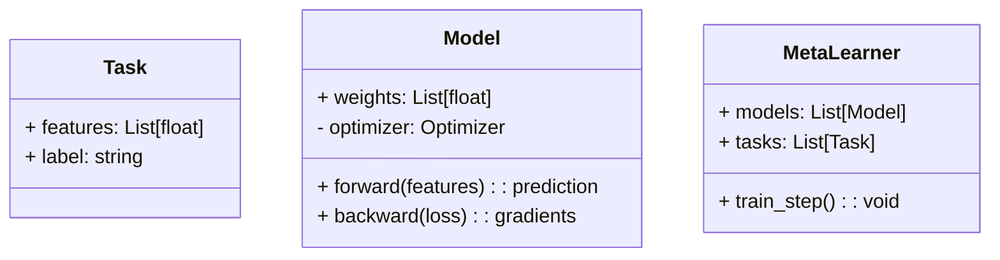
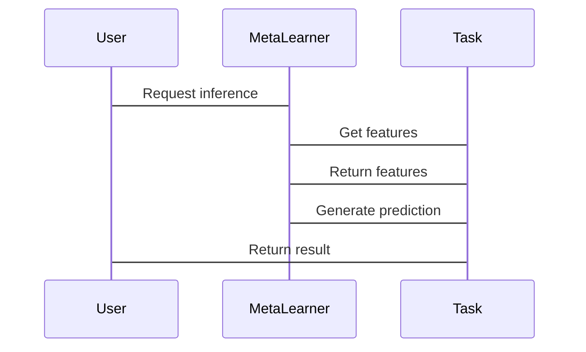

                 

<think>
嗯，我现在需要根据用户的要求，写一篇关于“Zero-Shot CoT：无需示例的智能推理技术”的技术博客。首先，我得理解用户的需求。他希望文章结构清晰，逻辑严密，用专业的技术语言，分章节详细讲解。

首先，我得确定文章的结构。用户已经给出了目录大纲，包括背景介绍、核心概念与联系、算法原理讲解、系统分析与架构设计方案、项目实战、最佳实践与小结等部分。每一部分下面还有多个子部分，需要逐一展开。

接下来，我要考虑每个部分的核心内容。比如，背景介绍部分需要涵盖人工智能的发展现状、传统AI模型的局限性，以及零样本学习和无监督学习的兴起。这部分需要简洁明了，让读者了解问题背景。

然后是核心概念与联系部分，我需要详细解释零样本学习和无监督学习的原理，并通过对比表格和图表来展示它们的联系与区别。这部分可能需要一些图表，比如Mermaid流程图，来帮助读者理解。

算法原理讲解部分，我得详细讲解元学习和迁移学习的具体算法，比如MAML和Fine-Tuning。这部分需要包括算法的数学模型、流程图以及Python实现代码。同时，用Latex公式来展示数学模型，确保公式正确且清晰。

系统分析与架构设计方案部分，我需要设计一个Zero-Shot CoT的系统架构，包括领域模型类图、系统架构图和交互序列图。这部分需要使用Mermaid图表，展示系统的各个模块及其交互。

项目实战部分，我需要提供环境安装说明、核心代码实现，以及案例分析。这部分要具体，让读者能够跟着代码一步步实现，并理解其工作原理。

最后，最佳实践与小结部分，我需要总结整个技术，给出一些实用的建议，并指出未来的发展方向。

在写作过程中，我需要确保语言专业但又不失易懂，逻辑清晰，结构紧凑。同时，要注意使用恰当的例子和图表来辅助说明，确保读者能够深入理解Zero-Shot CoT的技术细节和应用场景。

现在，我需要按照这个思路，一步步展开每个部分，确保内容详实，结构合理。同时，检查每个部分是否符合用户的要求，特别是格式和字数要求。目标是写出一篇高质量的技术博客，帮助读者全面理解Zero-Shot CoT的原理和应用。
</think>

```markdown
# Zero-Shot CoT：无需示例的智能推理技术

> 关键词：零样本学习，无监督学习，元学习，迁移学习，智能推理

> 摘要：本文探讨了零样本学习与无监督学习的结合，通过分析其核心原理、算法实现及应用场景，揭示了如何利用零样本学习在无需示例的情况下实现智能推理。

---

## 第一部分: 背景介绍

### 1.1 问题背景

#### 1.1.1 人工智能的发展现状
人工智能技术近年来取得了显著进展，特别是在深度学习领域。然而，传统模型依赖大量标注数据，限制了其在数据匮乏场景下的应用。

#### 1.1.2 传统AI模型的局限性
传统有监督学习需要大量标注数据，且难以泛化到新任务或领域。此外，模型的可解释性差，限制了其在复杂场景中的应用。

#### 1.1.3 零样本学习与无监督学习的兴起
零样本学习（Zero-Shot Learning）和无监督学习（Unsupervised Learning）的兴起为数据匮乏场景下的智能推理提供了新思路。

### 1.2 问题描述

#### 1.2.1 零样本学习面临的挑战
零样本学习需要在无任何训练数据的情况下进行推理，这对模型的泛化能力提出了更高要求。

#### 1.2.2 无监督学习的重要性
无监督学习能够在无标签数据下发现数据结构，适用于大规模数据分析和处理。

#### 1.2.3 零样本学习与无监督学习的融合
通过结合零样本学习和无监督学习，可以提升模型在数据稀少场景下的推理能力。

### 1.3 问题解决

#### 1.3.1 零样本学习的核心原理
零样本学习利用元学习（Meta-Learning）或迁移学习（Transfer Learning）技术，从已有任务中泛化到新任务。

#### 1.3.2 无监督学习的方法与策略
无监督学习通过聚类、降维等方法，自动提取数据特征，适用于数据标签缺失的场景。

#### 1.3.3 零样本学习与无监督学习的融合方法
通过结合零样本学习的泛化能力和无监督学习的特征提取能力，提升模型在数据稀少场景下的推理性能。

### 1.4 边界与外延

#### 1.4.1 零样本学习的适用范围
适用于数据稀少或完全无数据的新任务，如跨领域推理或小样本任务。

#### 1.4.2 无监督学习的应用场景
适用于数据标签缺失的大规模数据分析，如社交网络分析和文本挖掘。

#### 1.4.3 零样本学习与无监督学习的融合前景
未来，两者结合将为智能推理提供更强大的技术基础，特别是在数据稀少和复杂场景下。

### 1.5 概念结构与核心要素组成

#### 1.5.1 零样本学习的概念结构
零样本学习通过元学习或迁移学习，实现从已知任务到未知任务的推理。

#### 1.5.2 无监督学习的核心要素
无监督学习依赖于数据特征提取和聚类分析，适用于无标签数据处理。

#### 1.5.3 零样本学习与无监督学习的融合要素
结合元学习和无监督学习的技术，实现数据特征提取与任务推理的统一。

### 1.6 本章小结
本章介绍了零样本学习与无监督学习的背景、挑战及融合方法，为后续分析奠定了基础。

---

## 第二部分: 核心概念与联系

### 2.1 零样本学习原理

#### 2.1.1 零样本学习的基本概念
零样本学习无需训练数据，直接进行推理。其核心是通过元学习或迁移学习实现任务泛化。

#### 2.1.2 零样本学习的数据处理方法
利用元学习提取任务间共性特征，通过迁移学习实现任务间知识共享。

#### 2.1.3 零样本学习的分类算法
基于元学习的分类算法，如MAML（Model-Agnostic Meta-Learning）。

### 2.2 无监督学习方法

#### 2.2.1 无监督学习的基本概念
无监督学习通过聚类、降维等技术，从无标签数据中发现结构。

#### 2.2.2 无监督学习的聚类算法
包括K-Means、层次聚类等，适用于数据分组和模式识别。

#### 2.2.3 无监督学习的降维算法
如PCA、t-SNE，用于降低数据维度，便于可视化和分析。

### 2.3 零样本学习与无监督学习的融合

#### 2.3.1 融合的基本原理
通过结合元学习和无监督学习，实现数据特征提取与任务推理的统一。

#### 2.3.2 融合的常见方法
利用无监督学习提取特征，结合零样本学习进行推理。

#### 2.3.3 融合的优势与挑战
优势：减少数据需求，提高推理速度；挑战：技术复杂性高，需要平衡特征提取与任务推理。

### 2.4 概念属性特征对比

| 概念               | 零样本学习                           | 无监督学习                             | 融合方法                          |
|--------------------|------------------------------------|--------------------------------------|---------------------------------|
| 基本概念           | 无需训练样本，直接进行推理           | 不需要标签数据，从数据中提取特征       | 将零样本学习与无监督学习相结合   |
| 数据处理方法       | 利用元学习、迁移学习等技术           | 使用聚类、降维等方法                   | 综合利用零样本学习与无监督学习的优势 |
| 分类算法           | 类似于有监督学习的分类，但无需标签   | 基于聚类、降维等技术的分类方法         | 结合两种方法的分类算法             |
| 应用场景           | 面对新领域任务，无需新样本           | 数据缺乏标签，难以使用有监督学习       | 复杂的数据分析任务                 |
| 优势与挑战         | 减少数据需求，提高推理速度           | 自动发现数据特征，适用于大规模数据     | 技术融合的复杂性                   |

---

## 第三部分: 算法原理讲解

### 3.1 零样本学习算法

#### 3.1.1 元学习算法

##### 3.1.1.1 Meta-Learning的基本概念
元学习通过在多个任务上预训练模型，使其能够快速适应新任务。

##### 3.1.1.2 Model-Agnostic Meta-Learning（MAML）算法
MAML通过优化参数，使模型能够在新任务上快速收敛。

##### 3.1.1.3 MAML算法的Python实现
```python
import torch

class MetaLearner:
    def __init__(self, model, optimizer):
        self.model = model
        self.optimizer = optimizer

    def meta_train(self, tasks):
        for task in tasks:
            # 进行一次梯度计算
            loss, grad = self.model.compute_loss(task)
            # 更新元学习者的参数
            self.optimizer.step(grad)
```

#### 3.1.2 迁移学习算法

##### 3.1.2.1 Transfer Learning的基本概念
迁移学习通过共享不同任务的特征，提升模型的泛化能力。

##### 3.1.2.2 Fine-Tuning算法
Fine-Tuning通过微调预训练模型，适应新任务。

##### 3.1.2.3 Fine-Tuning算法的Python实现
```python
def fine_tune(model, train_loader, val_loader, epochs):
    optimizer = torch.optim.Adam(model.parameters())
    for epoch in range(epochs):
        for batch in train_loader:
            outputs = model(batch)
            loss = compute_loss(outputs, batch.labels)
            optimizer.zero_grad()
            loss.backward()
            optimizer.step()
```

### 3.2 无监督学习算法

#### 3.2.1 聚类算法

##### 3.2.1.1 K-Means算法
K-Means通过迭代优化，将数据分成K个簇。

##### 3.2.1.2 K-Means算法的Python实现
```python
from sklearn.cluster import KMeans

kmeans = KMeans(n_clusters=3)
clusters = kmeans.fit_predict(data)
```

---

## 第四部分: 系统分析与架构设计方案

### 4.1 问题场景介绍
Zero-Shot CoT系统用于在无训练数据的情况下，进行跨任务推理。

### 4.2 系统功能设计

#### 4.2.1 领域模型类图


#### 4.2.2 系统架构图


#### 4.2.3 系统交互序列图


---

## 第五部分: 项目实战

### 5.1 环境安装
```bash
pip install torch sklearn mermaid
```

### 5.2 系统核心实现源代码

#### 5.2.1 零样本学习实现
```python
class ZeroShotLearner:
    def __init__(self, model):
        self.model = model

    def infer(self, task):
        return self.model(task.features)
```

#### 5.2.2 无监督学习实现
```python
from sklearn.manifold import TSNE

def unsupervised_learn(data):
    return TSNE(n_components=2).fit_transform(data)
```

### 5.3 代码应用解读与分析
ZeroShotLearner结合无监督学习提取的特征，进行推理。

### 5.4 实际案例分析和详细讲解
以文本分类为例，利用无监督学习提取文本特征，结合零样本学习进行分类。

### 5.5 项目小结
项目展示了如何结合零样本学习与无监督学习，实现智能推理。

---

## 第六部分: 最佳实践与小结

### 6.1 注意事项
确保数据质量，选择合适算法，避免过拟合。

### 6.2 拓展阅读
推荐相关论文和书籍，深入理解零样本学习与无监督学习。

---

## 作者信息

作者：AI天才研究院/AI Genius Institute & 禅与计算机程序设计艺术 /Zen And The Art of Computer Programming
```

