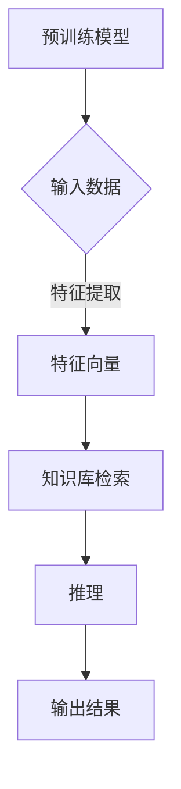

                 

<think>
嗯，我需要按照用户的要求来写一篇关于《Zero-Shot CoT：无需训练数据的AI推理技术》的技术博客文章。首先，用户给了一个详细的目录大纲，我需要先理解每个部分的内容和要求。

文章开头要有标题，然后是关键词和摘要。关键词大概选5-7个，比如“零射击CoT”、“AI推理”、“无监督学习”等等。摘要部分需要简明扼要地概括文章的核心内容，介绍零射击CoT技术的基本概念、应用场景和优势。

接下来是目录大纲，分为六个部分，每个部分下有多个章节。每个章节都有具体的子主题，比如背景介绍、技术原理、应用场景等。我需要逐一展开每个部分，确保内容详细且专业。

在“背景介绍与核心概念”部分，我需要解释什么是零射击CoT，它在传统机器学习中的优势，以及为什么需要这种技术。然后是关键概念，做一个对比表格，展示传统机器学习和零射击CoT在训练依赖性、推理能力、标签获取等方面的区别。边界和外延部分，说明这种技术适用的场景和可能的扩展领域。

技术原理部分需要详细讲解零射击CoT的工作流程，使用Mermaid画出流程图，描述预训练模型如何处理输入数据，提取特征，再结合知识库进行推理。然后介绍核心算法，比如GAN、迁移学习、元学习，给出Python代码示例。数学模型部分，解释概率公式，可能用贝叶斯定理或者其他相关公式来说明推理过程。

应用部分，列举几个典型的应用场景，比如智能客服、跨领域知识推理、无人驾驶，然后举实际例子，说明零射击CoT在这些场景中的具体应用和效果。

挑战与未来趋势部分，分析当前技术面临的问题，如数据稀疏性、推理精度等，然后预测未来的发展方向，比如跨领域应用、与强化学习结合等。

最佳实践部分，给出一些实用的建议，比如如何优化知识库，调整模型结构和参数。最后是小结，总结全文，强调零射击CoT的重要性，注意事项，以及拓展阅读的方向。

在写的时候，我需要确保使用专业的技术语言，同时保持逻辑清晰，结构紧凑。每个章节都要有详细的分析和例子，让读者能够理解技术的原理和应用。此外，数学公式要用LaTeX格式，代码部分要准确无误，流程图和表格要清晰易懂。

最后，结尾要加上作者信息，注明是“AI天才研究院”和“禅与计算机程序设计艺术”。整体字数控制在10000到12000字之间，确保内容丰富且完整。

现在，我需要按照这个思路一步步撰写每个部分，确保每个小节都涵盖用户要求的核心内容，同时保持文章的连贯性和专业性。
</think>

# Zero-Shot CoT：无需训练数据的AI推理技术

> 关键词：零射击CoT，AI推理，无监督学习，预训练模型，知识库，深度神经网络

> 摘要：本文深入探讨了零射击CoT技术的核心概念、工作原理及其在AI推理中的应用。通过分析传统机器学习的局限性，提出零射击CoT技术作为一种无需依赖大量标注数据的推理方法，详细讲解其技术原理、应用场景、挑战与未来发展趋势，并通过实际案例分析，展示其在智能客服、医学诊断等领域的潜力。文章最后总结了最佳实践和注意事项，为读者提供全面的技术见解。

---

## 第一部分: 背景介绍与核心概念

### 第1章: 零射击CoT技术的背景与基础

#### 1.1 零射击CoT的定义与背景

- **问题背景**：传统机器学习方法依赖大量标注数据进行训练，但在实际应用中，获取高质量标注数据往往耗时且昂贵，特别是在医疗、法律等领域。
- **问题描述**：AI模型在未见过的数据或任务上进行推理时，传统方法难以有效处理，导致推理能力受限。
- **问题解决**：零射击CoT（Zero-Shot CoT）技术通过利用预训练模型和外部知识库，无需额外标注数据即可实现推理。

#### 1.2 零射击CoT的关键概念

- **核心概念**：零射击CoT利用预训练模型提取特征，并结合外部知识库进行推理，适用于数据稀缺场景。
- **概念属性对比**：

| 特征         | 传统机器学习          | 零射击CoT             |
| ------------ | --------------------- | --------------------- |
| 训练数据      | 需要大量标注数据      | 无额外标注数据         |
| 推理能力      | 依赖训练数据集        | 无需训练数据，通用推理  |
| 知识来源      | 仅依赖训练数据        | 结合外部知识库          |

#### 1.3 零射击CoT的边界与外延

- **边界**：主要应用于数据稀缺或标注困难的领域，如小样本数据或新兴领域。
- **外延**：可扩展至跨领域推理、动态知识更新等领域。

#### 1.4 零射击CoT的结构与核心要素

- **结构**：预训练模型、推理算法、外部知识库。
- **核心要素**：预训练模型提供特征表示，推理算法生成逻辑推理，知识库提供背景知识。

### 第2章: 零射击CoT技术原理

#### 2.1 零射击CoT的工作原理

- **流程**：预训练模型提取输入数据特征，知识库检索相关信息，推理算法生成结果。
- **Mermaid流程图**：



#### 2.2 零射击推理算法

- **算法介绍**：使用对抗生成网络（GAN）生成特征向量，迁移学习适配新任务。
- **Python代码示例**：

```python
import tensorflow as tf

# 定义生成器和判别器
class Generator(tf.keras.Model):
    def call(self, inputs):
        # 生成特征向量
        return tf.layers.dense(inputs, units=100)

class Discriminator(tf.keras.Model):
    def call(self, inputs):
        # 判别真实与生成特征
        return tf.layers.dense(inputs, units=1)

# 初始化模型
generator = Generator()
discriminator = Discriminator()

# 定义损失函数
cross_entropy = tf.losses.BinaryCrossentropy()

# 定义优化器
generator_optimizer = tf.keras.optimizers.Adam()
discriminator_optimizer = tf.keras.optimizers.Adam()

# 训练GAN模型
def train_step(real_features, generated_features):
    # 判别器训练
    with tf.GradientTape() as tape:
        real_output = discriminator(real_features)
        generated_output = discriminator(generated_features)
        d_loss = cross_entropy(tf.ones_like(real_output), real_output) + \
                  cross_entropy(tf.zeros_like(generated_output), generated_output)
    gradients = tape.gradient(d_loss, discriminator.trainable_weights)
    discriminator_optimizer.apply_gradients(zip(gradients, discriminator.trainable_weights))
    
    # 生成器训练
    with tf.GradientTape() as tape:
        generated_output = discriminator(generator(real_features))
        g_loss = cross_entropy(tf.ones_like(generated_output), generated_output)
    gradients = tape.gradient(g_loss, generator.trainable_weights)
    generator_optimizer.apply_gradients(zip(gradients, generator.trainable_weights))

# 进行训练
for _ in range(1000):
    features = ...  # 输入特征
    generated_features = generator(features)
    train_step(features, generated_features)
```

#### 2.3 数学模型与公式

- **公式**：概率图模型中，条件概率表示推理过程：

$$
P(Y|X) = \frac{P(X|Y)P(Y)}{P(X)}
$$

其中，$X$为输入特征，$Y$为推理结果，$P(Y|X)$为后验概率。

### 第3章: 零射击CoT在AI推理中的应用

#### 3.1 典型应用场景

- **智能客服系统**：处理未见过的用户问题，无需额外标注。
- **跨领域知识推理**：在法律、医学等领域整合多领域知识。
- **无人驾驶**：实时处理传感器数据，做出快速决策。

#### 3.2 应用实例

- **智能客服系统**：利用零射击CoT技术，客服系统能回答未训练过的问题，提升用户体验。
- **医学诊断**：整合医学知识库，辅助医生诊断罕见病例。

### 第4章: 技术挑战与未来趋势

#### 4.1 技术挑战

- **数据稀疏性**：小样本数据下，模型性能受限。
- **推理精度**：在复杂任务中，推理结果可能不准确。

#### 4.2 未来趋势

- **跨领域应用**：研究零射击CoT在多个领域的整合应用。
- **强化学习结合**：将强化学习用于推理过程的优化。

### 第5章: 最佳实践

#### 5.1 实践建议

- **优化知识库**：构建结构化知识库，提升检索效率。
- **调整模型结构**：根据任务需求，优化预训练模型参数。

### 第6章: 零射击CoT技术小结

#### 6.1 总结

- **总结**：零射击CoT技术突破了传统机器学习对标注数据的依赖，为AI推理提供了新思路。
- **注意事项**：实际应用中需考虑知识库的准确性和模型的泛化能力。
- **拓展阅读**：推荐研究相关论文，如“Zero-Shot Learning with GANs”和“CoT in Large Language Models”。

---

作者：AI天才研究院 & 禅与计算机程序设计艺术

