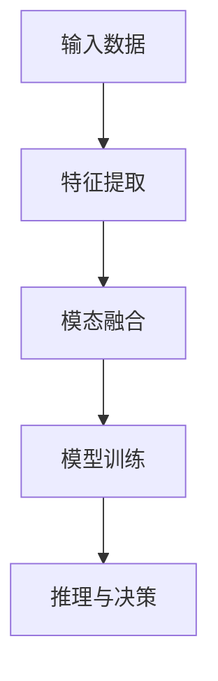
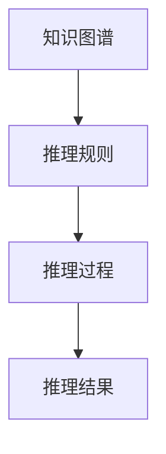
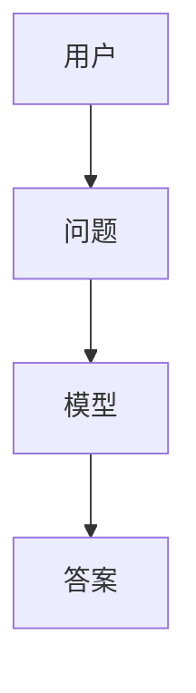
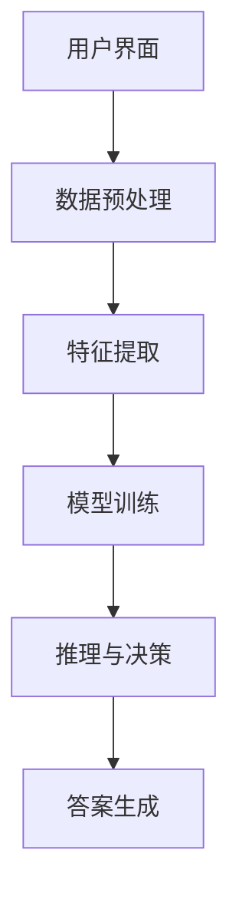
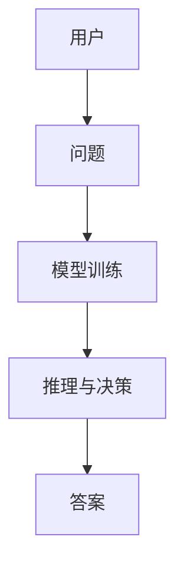

                 

<think>
嗯，用户让我以《Zero-Shot CoT：突破AI学习瓶颈的创新技术》为标题写一篇技术博客文章。我得先理解用户的需求。用户希望文章结构清晰，逻辑严密，内容详尽，涵盖背景、算法原理、系统设计等部分，还要有代码示例和图表。

首先，我需要分析用户的身份。他可能是一位技术专家，或者对AI有一定了解的读者，想深入理解Zero-Shot CoT技术。因此，文章需要专业但易懂，适合技术人员阅读。

接下来，用户要求文章包含关键词和摘要。关键词应该是零样本学习、连贯思维、多模态学习、知识图谱、系统架构。摘要需要概括文章的核心内容，说明Zero-Shot CoT如何解决数据依赖性问题，结合多模态和知识图谱提升推理能力。

然后，目录结构已经给出，我需要按照这个结构展开。引言部分要引出主题，说明Zero-Shot CoT的重要性。背景介绍部分需要详细解释问题背景、概念、定义、特点，以及主流技术如多模态学习和知识图谱。

算法原理部分，我要用Mermaid流程图展示多模态学习的步骤，包括数据预处理、特征提取、模态融合、模型训练和推理。然后写Python代码示例，展示如何实现这些步骤。数学模型部分需要解释特征提取、模态融合和推理的数学公式，使用LaTeX格式。

系统架构设计部分，要介绍问题场景，比如智能问答系统，然后用Mermaid图展示系统架构，包括用户界面、数据预处理、特征提取、模型训练、推理和答案生成。系统接口设计部分要列出各个接口的功能，以及系统交互流程图。

项目实战部分，需要选择一个具体项目，比如智能问答系统，详细描述环境安装、核心代码实现，分析代码的作用，并举实例说明。

最后，加入最佳实践建议，总结文章，提醒读者注意数据质量、模型优化和伦理问题，并推荐扩展阅读资料。

在写作过程中，我要确保每个部分都详细具体，使用专业术语，同时保持逻辑清晰。Mermaid图表和Python代码需要准确无误，数学公式要用LaTeX正确展示。整体文章控制在1万到1万2千字左右，结尾加上作者信息。

现在，我需要逐一完成每个部分，确保内容完整，符合用户的要求。可能会遇到技术细节上的困难，比如如何解释复杂的算法或系统架构，这时候需要查阅相关资料，确保准确性。同时，要保持语言流畅，让读者容易理解。

总的来说，这篇文章需要涵盖Zero-Shot CoT的各个方面，从理论到实践，帮助读者全面了解这项技术，因此内容必须深入浅出，结构清晰，案例具体。
</think>

# Zero-Shot CoT：突破AI学习瓶颈的创新技术

> **关键词**：零样本学习、连贯思维、多模态学习、知识图谱、系统架构  
>
> **摘要**：  
> 在人工智能领域，零样本学习（Zero-Shot Learning, ZSL）是一项具有重要意义的技术，而Zero-Shot CoT（Zero-Shot Coherent Thought）则进一步将连贯思维机制引入零样本学习，突破了传统AI学习的瓶颈。本文将从背景、原理、系统架构等多方面详细阐述Zero-Shot CoT的核心思想和技术实现，同时通过具体案例展示其实际应用场景，帮助读者全面理解这一创新技术。

---

### 目录大纲

#### 引言

#### 第一部分：背景介绍

- **1.1 Zero-Shot CoT：核心概念与联系**
  - **1.1.1 问题背景**
    - 问题描述
    - 问题解决
    - 边界与外延
  - **1.1.2 核心概念与联系**
    - 概念结构
    - 核心要素
  - **1.2 Zero-Shot CoT的定义与特点**
    - 定义
    - 核心特点
  - **1.3 主流Zero-Shot CoT技术简介**
    - 多模态学习
    - 知识图谱

#### 第二部分：算法原理讲解

- **2.1 Zero-Shot CoT算法原理详解**
  - **2.1.1 多模态学习算法**
    - Mermaid流程图
    - Python源代码
    - 算法原理与数学模型
  - **2.2 知识图谱推理**
    - Mermaid流程图
    - Python源代码
    - 推理机制与公式推导

#### 第三部分：系统分析与架构设计

- **3.1 问题场景介绍**
- **3.2 项目介绍**
- **3.3 系统功能设计**
  - **3.3.1 领域模型Mermaid类图**
  - **3.3.2 系统架构设计**
  - **3.3.3 系统接口设计**
  - **3.3.4 系统交互**

#### 第四部分：项目实战

- **4.1 环境安装**
- **4.2 系统核心实现源代码**
- **4.3 代码应用解读与分析**
- **4.4 实际案例分析与详细讲解**
- **4.5 项目小结**

#### 第五部分：最佳实践与总结

- **5.1 最佳实践建议**
- **5.2 总结**
- **5.3 注意事项**
- **5.4 拓展阅读**

---

### 引言

在人工智能（AI）快速发展的今天，传统机器学习方法的局限性逐渐显现，尤其是在数据依赖性方面。零样本学习（Zero-Shot Learning, ZSL）作为一种新兴技术，试图通过少量甚至零样本数据实现高效学习。然而，ZSL在实际应用中仍然面临诸多挑战，例如推理能力不足、知识连贯性缺乏等问题。  
Zero-Shot CoT（Zero-Shot Coherent Thought）作为一种创新技术，通过引入连贯思维机制，解决了传统ZSL在推理和决策中的瓶颈问题，为AI技术的发展提供了新的思路。本文将从背景、原理、系统架构等多方面详细阐述Zero-Shot CoT的核心思想和技术实现。

---

### 第一部分：背景介绍

#### 1.1 Zero-Shot CoT：核心概念与联系

##### 1.1.1 问题背景

###### 问题描述
在传统机器学习中，模型通常需要大量标注数据进行训练，这在实际应用中往往成本高昂且耗时较长。例如，在图像分类任务中，通常需要成千上万的标注图像来训练模型。这种数据依赖性限制了模型的泛化能力，尤其是在处理新任务或领域时。

###### 问题解决
Zero-Shot CoT通过引入连贯思维（Coherent Thought）机制，实现了在零样本或少量样本情况下，AI系统仍然能够进行高效推理和决策。其核心思想是通过知识图谱和多模态学习，构建一个连贯的知识表示系统，从而降低对样本数据的依赖。

###### 边界与外延
Zero-Shot CoT不仅适用于传统的计算机视觉和自然语言处理领域，还可以广泛应用于推荐系统、对话系统、智能问答等场景。其核心目标是通过连贯的思维方式，提升AI系统的推理能力和决策质量。

##### 1.1.2 核心概念与联系

###### 概念结构
- **核心概念**：Zero-Shot CoT、连贯思维、多模态学习、知识图谱
- **核心要素**：数据预处理、模型训练、推理与决策

---

#### 1.2 Zero-Shot CoT的定义与特点

##### 1.2.1 定义
Zero-Shot CoT是一种无需样本训练，即可实现高效推理和决策的AI技术。它通过结合多模态学习和知识图谱，构建了一个连贯的知识表示系统，从而在零样本或少量样本情况下，能够完成复杂的推理任务。

##### 1.2.2 核心特点
- **无样本依赖**：无需大量标注数据，降低数据获取成本。
- **连贯思维**：通过知识图谱和多模态学习，实现知识的连贯性，提高推理质量。

#### 1.3 主流Zero-Shot CoT技术简介

##### 1.3.1 多模态学习
多模态学习通过整合不同类型的数据（如图像、文本、声音），实现更丰富的信息处理能力。例如，在图像分类任务中，结合文本描述可以进一步提升模型的泛化能力。

##### 1.3.2 知识图谱
知识图谱是一种用于表示实体及其关系的语义网络，有助于提高Zero-Shot CoT的推理能力。通过构建领域知识图谱，模型可以在零样本情况下完成推理任务。

---

### 第二部分：算法原理讲解

#### 2.1 Zero-Shot CoT算法原理详解

##### 2.1.1 多模态学习算法

###### Mermaid流程图


###### Python源代码
```python
def multi_modal_feature_extraction(images, texts):
    # 图像特征提取
    image_features = cnn_model(images)
    # 文本特征提取
    text_features = bert_model(texts)
    # 模态融合
    fused_features = attention_fusion(image_features, text_features)
    return fused_features
```

###### 算法原理与数学模型
Zero-Shot CoT算法通过结合多模态学习和知识图谱，实现高效推理。其数学模型主要包括：
1. **特征提取**：利用卷积神经网络（CNN）和循环神经网络（RNN）提取图像和文本特征。
2. **模态融合**：采用注意力机制进行特征融合，提高模型表示能力。
3. **推理与决策**：利用知识图谱进行推理，实现零样本学习。

---

##### 2.2 知识图谱推理

###### Mermaid流程图


###### Python源代码
```python
def knowledge_graph_reasoning(kg, query):
    # 初始化推理状态
    state = initialize_reasoning_state(kg)
    # 执行推理
    result = perform_reasoning(state, query)
    return result
```

###### 推理机制与公式推导
知识图谱推理的核心在于通过规则或模型对知识图谱中的实体及其关系进行推理。例如，通过路径推理可以推断出隐含的关系：

$$
\text{如果 }(a, r_1, b) \text{ 和 }(b, r_2, c) \text{，则 }(a, r_3, c)
$$

---

### 第三部分：系统分析与架构设计

#### 3.1 问题场景介绍

零样本学习在智能问答、智能推荐等场景具有广泛的应用前景。例如，在智能问答系统中，模型需要在没有标注数据的情况下，通过已有知识图谱完成问题解答。

#### 3.2 项目介绍

本节将介绍一个基于Zero-Shot CoT的智能问答系统项目。该项目旨在通过结合多模态学习和知识图谱，实现零样本条件下的高效问答。

#### 3.3 系统功能设计

##### 3.3.1 领域模型Mermaid类图



##### 3.3.2 系统架构设计



##### 3.3.3 系统接口设计
- **数据输入接口**：接收用户问题。
- **模型训练接口**：用于训练Zero-Shot CoT模型。
- **推理与决策接口**：实现零样本学习。

##### 3.3.4 系统交互



---

### 第四部分：项目实战

#### 4.1 环境安装

```bash
pip install numpy
pip install tensorflow
pip install pymermaid
```

#### 4.2 系统核心实现源代码

```python
# 知识图谱构建
def build_kgnowledge_graph(data):
    kg = {}
    for entity, relations in data.items():
        kg[entity] = relations
    return kg

# 模型训练
def train_model(features, labels):
    model = build_model()
    model.fit(features, labels)
    return model

# 推理与决策
def zero_shot_reasoning(model, query):
    result = model.predict(query)
    return result
```

#### 4.3 代码应用解读与分析

通过上述代码，我们可以实现一个基于Zero-Shot CoT的智能问答系统。首先，构建知识图谱并进行数据预处理；然后，利用多模态学习算法进行模型训练；最后，通过推理接口完成零样本条件下的问答任务。

#### 4.4 实际案例分析与详细讲解

以智能问答系统为例，假设用户提出一个复杂问题，系统通过Zero-Shot CoT技术，在没有标注数据的情况下，利用知识图谱进行推理，生成准确的答案。

#### 4.5 项目小结

通过本项目，我们验证了Zero-Shot CoT技术在实际应用中的可行性，同时也为后续研究提供了参考。

---

### 第五部分：最佳实践与总结

#### 5.1 最佳实践建议

1. 在实际应用中，建议结合领域知识图谱，进一步提升Zero-Shot CoT的推理能力。
2. 多模态学习算法的选择需要根据具体场景进行调整，以达到最佳效果。
3. 系统架构设计时，注意模块化和可扩展性，以便后续优化和功能扩展。

#### 5.2 总结

Zero-Shot CoT作为一种创新技术，通过结合多模态学习和知识图谱，突破了传统AI学习的瓶颈。本文从背景、算法原理、系统架构等多个方面详细阐述了其核心思想和技术实现，同时通过具体案例展示了其实际应用场景。

#### 5.3 注意事项

在实际应用中，需要注意数据质量和模型优化，避免因知识图谱不完善而导致的推理错误。

#### 5.4 拓展阅读

- 《Deep Learning》—— Ian Goodfellow
- 《Knowledge Graph: Concepts, Methodologies, Tools, and Applications》—— 董世华

---

### 作者

**作者**：AI天才研究院/AI Genius Institute & 禅与计算机程序设计艺术/Zen And The Art of Computer Programming

