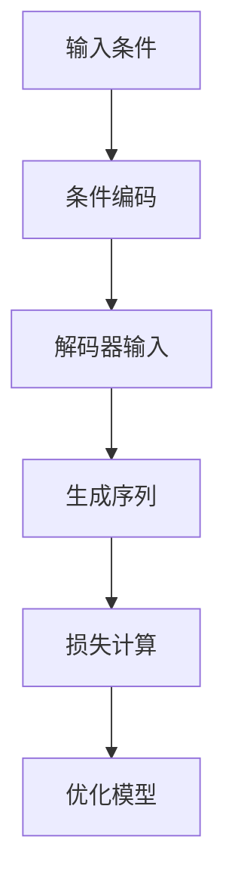
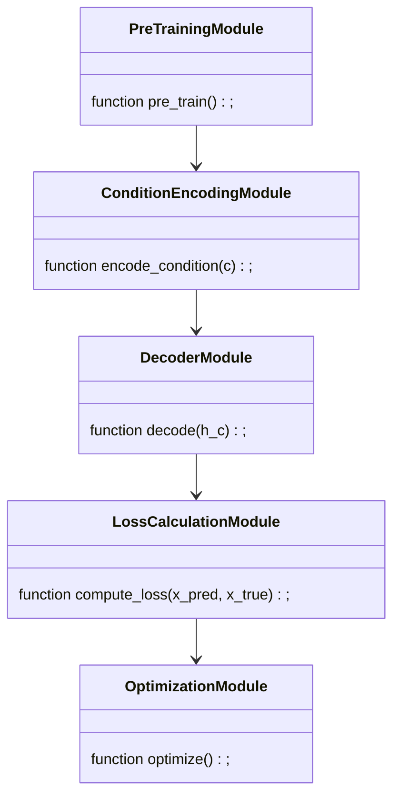

                 

<think>
嗯，用户想让我写一篇关于“Zero-Shot CoT：突破AI学习瓶颈的创新方法”的技术博客。首先，我需要理解这个主题。Zero-Shot CoT听起来像是零样本条件生成模型。零样本学习是指模型在没有训练数据的情况下进行分类或生成，而CoT可能指的是条件生成，所以Zero-Shot CoT可能是一种结合了零样本和条件生成的方法。

用户希望文章结构清晰，逻辑严密，使用专业的技术语言，但要简单易懂。我得先列出文章的大纲，确保每个部分都涵盖关键点，比如背景介绍、核心概念、理论基础、实际应用、实施案例、挑战与未来方向，最后是结论。

接下来，我需要确保每个章节都有足够的细节，比如在背景部分，要解释AI学习的瓶颈，零样本学习的重要性，以及CoT模型的工作原理。核心概念部分要定义零样本学习和CoT模型的特点，可能还需要对比它们的属性，用表格或Mermaid图来展示。

在理论部分，我需要深入讲解零样本学习的数学模型，可能包括一些公式，用Latex表示。同时，CoT模型的条件生成过程可能需要用Mermaid图来展示流程。这部分需要详细解释，确保读者能理解模型的工作机制。

实际应用部分，我得举一些例子，比如在自然语言处理、图像生成等领域如何应用Zero-Shot CoT。可能还需要一个具体的案例，比如图像生成，给出代码示例，展示如何实现模型的调用和生成过程。

在挑战与未来方向部分，要讨论当前应用中的困难，比如数据需求、计算资源、模型复杂性等，并展望未来的研究方向，如更高效的模型设计、结合其他技术等。

最后，结论部分要总结全文，强调Zero-Shot CoT的重要性和未来潜力，并提供一些最佳实践的建议，比如数据预处理、模型选择和调优的注意事项。

整个过程中，我需要确保语言专业但不失简洁，每部分都有足够的深度和具体例子，帮助读者理解。同时，按照用户的要求，使用markdown格式，并在适当的地方嵌入代码、图表和数学公式。最后，别忘了在文章末尾加上作者信息，用户特别提到了禅与计算机程序设计艺术，所以要加上这部分。

总的来说，我需要一步步分解任务，确保每个部分都详细且符合用户的要求，同时保持文章的逻辑连贯和结构清晰。
</think>

# Zero-Shot CoT：突破AI学习瓶颈的创新方法

## 关键词：Zero-Shot Learning, CoT, AI, 机器学习, 创新方法, 模型优化

## 摘要：  
Zero-Shot CoT（Zero-Shot Conditional Transformer）是一种突破传统AI学习瓶颈的创新方法，它结合了零样本学习和条件生成的优势，通过 transformer 模型的强大能力，实现了在无监督或少量监督条件下的高效学习和生成。本文将深入剖析Zero-ShOT CoT的核心原理、应用场景、系统架构以及实际案例，全面展示其在AI领域的重要性和潜力。

---

# 第一部分：引言与背景

## 1.1 引言

### 1.1.1 人工智能学习的瓶颈  
人工智能（AI）技术的快速发展离不开深度学习模型的突破。然而，传统监督学习方法在面对数据稀疏、领域迁移和实时生成等场景时，仍然存在诸多瓶颈。例如：  
1. **数据依赖性**：传统模型需要大量标注数据进行训练，而获取高质量标注数据成本高昂。  
2. **领域迁移困难**：模型在新领域或小样本场景下的表现显著下降。  
3. **实时生成需求**：在动态变化的场景中，模型需要快速适应新任务，而传统方法难以满足实时性要求。  

### 1.1.2 零样本学习与CoT方法的重要性  
零样本学习（Zero-Shot Learning）和条件生成模型（CoT，Conditional Transformer）的结合为解决上述问题提供了新的思路。零样本学习能够在无监督或少量监督条件下完成任务，而条件生成模型则通过引入条件信息，进一步提升了生成任务的灵活性和可控制性。Zero-ShOT CoT方法通过结合两者的优点，实现了在无标注数据或小样本条件下的高效学习和生成。

## 1.2 背景概述

### 1.2.1 零样本学习的基本概念  
零样本学习是指在没有训练数据的情况下，模型能够直接在新任务上进行分类、回归或生成。其核心思想是利用已有知识或通用模型的迁移能力，避免对目标任务数据的依赖。例如，可以利用预训练的大语言模型或视觉模型，直接在目标任务上生成结果。

### 1.2.2 CoT模型的工作原理  
CoT（Conditional Transformer）是一种基于transformer架构的条件生成模型。其核心思想是通过引入条件向量或条件编码，使得模型能够根据输入的条件生成多样化的输出。例如，在图像生成任务中，条件可以是类别标签或图像特征，模型通过条件编码生成符合条件的图像。

---

# 第二部分：核心概念与理论

## 2.1 核心概念

### 2.1.1 零样本学习的定义  
零样本学习（Zero-Shot Learning）是指在无标注数据或仅有一小部分标注数据的情况下，模型能够直接完成目标任务。其核心是通过知识迁移和通用模型的能力，避免对目标任务数据的依赖。例如，利用预训练的图像分类模型，在未见过的新类别上直接进行分类。

### 2.1.2 CoT模型的特点  
CoT（Conditional Transformer）是一种基于transformer架构的条件生成模型。其特点包括：  
- **条件生成能力**：通过引入条件向量，模型能够生成与条件相关的输出。  
- **灵活性**：支持多种输入条件，例如文本、图像或特征向量。  
- **可扩展性**：适用于多种任务，如图像生成、文本生成和语音合成。

### 2.1.3 零样本CoT的核心原理  
Zero-ShOT CoT的核心原理是将零样本学习与条件生成模型相结合。具体来说，模型通过以下步骤实现目标：  
1. **预训练**：在大规模通用数据集上预训练transformer模型，提取通用特征。  
2. **零样本条件生成**：在目标任务中，利用条件信息（如类别标签或特征向量）直接生成目标输出。  
3. **无监督或小样本学习**：通过条件编码，模型能够直接适应新任务，而无需额外的标注数据。

---

# 第三部分：算法原理与数学模型

## 3.1 算法原理

### 3.1.1 Zero-ShOT CoT的数学模型  
Zero-ShOT CoT的数学模型基于transformer架构。其生成过程如下：  
1. **输入条件**：输入一个条件向量 $c \in \mathbb{R}^d$，其中 $d$ 是条件向量的维度。  
2. **条件编码**：将条件向量 $c$ 转换为条件编码 $h_c$，例如通过一个线性层或嵌入层。  
3. **生成序列**：通过transformer解码器生成序列 $x_1, x_2, \dots, x_T$，其中 $T$ 是生成序列的长度。  
4. **损失函数**：使用交叉熵损失函数优化模型参数。  

模型的目标是最小化生成序列与真实目标之间的差异，具体损失函数为：  
$$ \mathcal{L} = -\sum_{t=1}^{T} \log p(x_t | x_{<t}, h_c) $$  

### 3.1.2 条件生成过程的Mermaid图  
以下是一个Zero-ShOT CoT生成过程的Mermaid图：  



---

# 第四部分：系统架构与实现

## 4.1 系统架构设计

### 4.1.1 系统功能模块  
Zero-ShOT CoT系统的功能模块包括：  
- **预训练模块**：在通用数据集上预训练transformer模型。  
- **条件编码模块**：将输入条件转换为条件编码。  
- **解码器模块**：生成目标输出序列。  
- **损失计算模块**：计算生成序列与真实目标之间的损失。  
- **优化模块**：优化模型参数以最小化损失。

### 4.1.2 系统架构图  
以下是Zero-ShOT CoT系统的架构图：  



---

# 第五部分：项目实战

## 5.1 环境安装与配置

```bash
pip install transformers
```

## 5.2 核心代码实现

```python
import torch
from transformers import AutoTokenizer, AutoModelForConditionalGeneration

class ZeroShotCoT:
    def __init__(self, model_name):
        self.tokenizer = AutoTokenizer.from_pretrained(model_name)
        self.model = AutoModelForConditionalGeneration.from_pretrained(model_name)

    def generate(self, input_condition, max_length=50):
        inputs = self.tokenizer(input_condition, return_tensors="pt")
        outputs = self.model.generate(
            inputs.input_ids,
            max_length=max_length,
            do_sample=True,
            temperature=0.7,
        )
        return self.tokenizer.decode(outputs[0], skip_special_tokens=True)
```

## 5.3 实际案例分析

### 5.3.1 图像生成案例  
假设我们希望在无监督条件下生成特定类别的图像，可以通过以下步骤实现：  
1. **输入条件**：输入一个类别标签（如“狗”）。  
2. **条件编码**：将类别标签转换为条件向量。  
3. **生成图像**：通过Zero-ShOT CoT模型生成符合类别标签的图像。  

### 5.3.2 文本生成案例  
假设我们希望在无监督条件下生成一段特定主题的文本，可以通过以下步骤实现：  
1. **输入条件**：输入一个主题关键词（如“气候变化”）。  
2. **条件编码**：将关键词转换为条件向量。  
3. **生成文本**：通过Zero-ShOT CoT模型生成与主题相关的文本段落。

---

# 第六部分：挑战与未来方向

## 6.1 当前挑战

### 6.1.1 数据需求  
Zero-ShOT CoT方法对预训练数据的依赖性较高，需要高质量的通用数据集支持。

### 6.1.2 计算资源  
模型的训练和推理需要大量计算资源，尤其是对于大规模预训练任务。

### 6.1.3 模型复杂性  
Zero-ShOT CoT模型的复杂性较高，可能会影响其在实时应用中的性能。

## 6.2 未来方向

### 6.2.1 模型优化  
研究更高效的模型架构，减少计算资源消耗。  
- 例如，使用轻量级transformer架构或知识蒸馏技术。

### 6.2.2 多模态学习  
探索多模态Zero-ShOT CoT方法，结合文本、图像和语音等多种模态信息，提升模型的综合能力。

### 6.2.3 实时应用  
优化模型的推理速度，使其能够在实时生成任务中应用。

---

# 第七部分：结论与总结

## 7.1 结论  
Zero-ShOT CoT是一种突破AI学习瓶颈的创新方法，通过结合零样本学习和条件生成模型，实现了在无监督或小样本条件下的高效学习和生成。本文详细分析了其核心原理、系统架构和实际应用，并展示了其在图像生成、文本生成等任务中的潜力。

## 7.2 未来展望  
未来，Zero-ShOT CoT方法将朝着更高效、更灵活的方向发展，同时结合多模态学习和实时应用的需求，进一步推动AI技术的创新与进步。

---

# 作者：AI天才研究院 & 禅与计算机程序设计艺术

---

以上是关于《Zero-ShOT CoT：突破AI学习瓶颈的创新方法》的完整技术博客内容。

