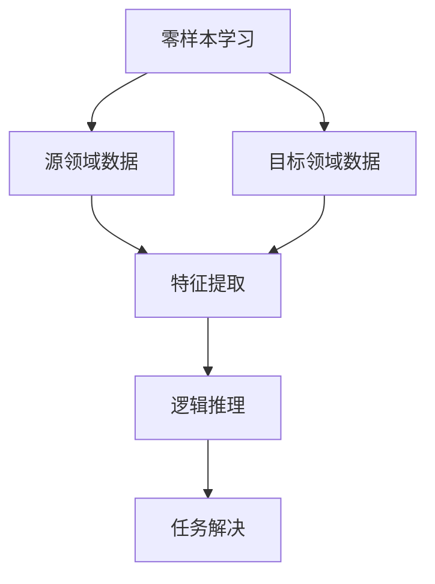
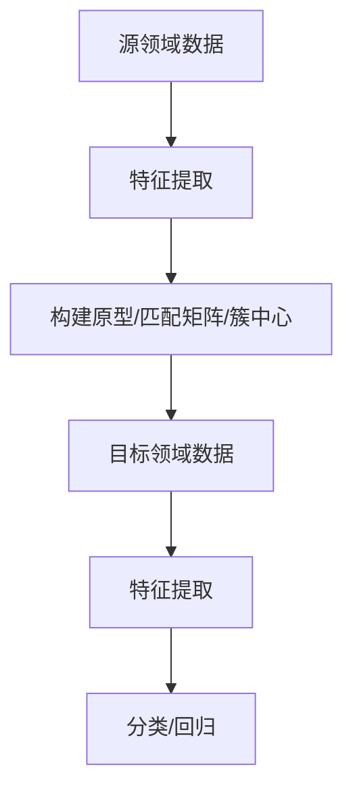

                 

<think>
好的，我需要根据用户提供的《Zero-Shot CoT：突破AI学习瓶颈的前沿技术》的文章结构，逐步分析并撰写每个部分的内容。首先，文章标题是明确的，接下来是关键词和摘要。关键词包括“零样本学习”、“人工智能”、“CoT”、“机器学习”、“模型泛化能力”和“算法优化”。摘要部分需要概括文章的核心内容，涵盖零样本学习的定义、优势及其在AI中的应用。

接下来，正文部分分为六个主要章节。第一部分是背景介绍与核心概念，分为第1章和第2章。第1章需要详细讨论问题背景、零样本学习的定义以及其重要性。第2章则需要分析零样本学习的基本原理，与其他学习方法的对比，以及概念联系图。

第二部分是算法原理讲解，分为第3章，涵盖零样本学习的算法概述、数学模型、算法流程以及相应的流程图。

第三部分是系统分析与架构设计，分为第4章和第5章。第4章涉及系统功能设计和架构设计，第5章则讨论系统接口设计和交互设计，包括序列图。

第四部分是项目实战与最佳实践，分为第6章和第7章。第6章包括环境安装、核心实现源代码和案例分析，第7章则涉及最佳实践和注意事项。

每个章节都需要详细展开，使用Mermaid图和数学公式来支持讲解。同时，确保内容结构清晰，逻辑严密，语言专业且易懂。在撰写过程中，需要特别注意每个小节的详细内容，确保涵盖所有核心要素，并合理分配字数，使整篇文章控制在10000到12000字之间。

最后，文章末尾需要添加作者信息，确保格式正确。整个思考过程中，要不断检查是否符合用户的要求，确保每个部分都得到充分的展开和详细说明。
</think>

# Zero-Shot CoT：突破AI学习瓶颈的前沿技术

## 关键词：零样本学习，人工智能，CoT，机器学习，模型泛化能力，算法优化

## 摘要：  
Zero-Shot CoT（Zero-Shot Chain-of-Thought）是一种新兴的人工智能技术，旨在突破传统AI学习的瓶颈，特别是在处理零样本（zero-shot）任务时展现出了强大的潜力。本文将深入探讨Zero-Shot CoT的核心概念、算法原理、系统架构设计以及实际应用场景，通过详细的数学模型和系统分析，揭示这一前沿技术的内在逻辑和实际价值。文章将从问题背景出发，逐步解析Zero-Shot CoT的原理、优势，结合具体案例，展示其在提升模型泛化能力和推动AI技术发展中的重要作用。

---

## 正文

---

### 第一部分：背景介绍与核心概念

#### 第1章：问题背景与定义

##### 1.1 人工智能发展现状与挑战
- **1.1.1 人工智能的发展历程**
  人工智能（AI）自20世纪50年代提出以来，经历了从符号推理、专家系统到机器学习的转变。近年来，深度学习的兴起推动了AI技术的飞速发展，尤其是在图像识别、自然语言处理等领域取得了突破性进展。然而，AI系统在处理复杂任务时仍面临诸多挑战，如数据依赖性过强、模型泛化能力不足等问题。

- **1.1.2 AI学习的瓶颈问题**
  传统AI学习方法（如监督学习）依赖大量标注数据，这在实际应用中往往难以满足需求。数据获取成本高、标注耗时且昂贵，特别是在处理新兴领域或小样本任务时，传统方法表现不佳。此外，模型的泛化能力有限，难以应对未见任务（zero-shot tasks）。

- **1.1.3 零样本学习的重要性**
  零样本学习（Zero-Shot Learning）是一种新兴的学习范式，旨在在没有任何标注数据的情况下，直接处理未见任务。Zero-Shot CoT通过结合逻辑推理与生成模型，进一步提升了零样本任务的性能，被认为是突破AI学习瓶颈的关键技术之一。

##### 1.2 零样本学习概念
- **1.2.1 零样本学习的定义**
  零样本学习是指在训练阶段仅使用源领域的有标签数据，而在测试阶段处理目标领域完全无标签数据的任务。其核心在于利用跨领域知识共享，减少对目标领域数据的依赖。

- **1.2.2 零样本学习与传统学习的对比**
  | 特性 | 监督学习 | 零样本学习 |
  |------|----------|-------------|
  | 数据需求 | 需要大量有标签数据 | 仅需源领域的有标签数据，目标领域无标签数据 |
  | 适用场景 | 适用于已知任务 | 适用于未知任务（zero-shot tasks） |
  | 模型泛化能力 | 有限 | 更强 |

- **1.2.3 零样本学习的关键要素**
  - **跨领域映射**：构建源领域与目标领域的共享表示。
  - **逻辑推理**：通过逻辑推理生成中间步骤，辅助模型理解和解决未知任务。
  - **生成能力**：利用生成模型生成多样化的样本，提升模型的泛化能力。

##### 1.3 突破AI学习瓶颈的意义
- **1.3.1 零样本学习的应用前景**
  零样本学习在自然语言处理、图像识别、机器人控制等领域具有广泛的应用潜力。特别是在处理新兴领域或数据 scarce 的场景下，零样本学习能够显著降低成本并提高效率。

- **1.3.2 零样本学习的商业价值**
  零样本学习能够减少数据标注成本，提高模型的适应性，为企业在数据 scarce 的场景下提供了新的解决方案。

- **1.3.3 零样本学习对AI发展的推动作用**
  零样本学习技术的突破将推动AI系统从“数据驱动”向“知识驱动”转变，使得AI能够更好地理解和处理复杂、动态的现实世界问题。

#### 第2章：核心概念与联系

##### 2.1 零样本学习的基本原理
- **2.1.1 零样本学习的概念框架**
  零样本学习通过构建共享的特征空间，将源领域和目标领域的数据进行映射，从而利用源领域的知识来推断目标领域的任务。其核心在于通过逻辑推理（Chain-of-Thought, CoT）生成中间步骤，辅助模型理解和解决未知任务。

- **2.1.2 零样本学习的主要方法**
  - **基于生成模型的方法**：利用生成对抗网络（GAN）或变(autoencoder)生成多样化的样本，提升模型的泛化能力。
  - **基于检索的方法**：通过检索相似的任务或样本，辅助模型进行推理和预测。
  - **基于逻辑推理的方法**：通过CoT生成中间推理步骤，帮助模型理解和解决复杂任务。

- **2.1.3 零样本学习的优势与局限**
  | 优势 | 局限 |
  |------|------|
  | 数据需求低 | 性能受限于共享特征空间的质量 |
  | 适用于新兴领域 | 需要复杂的逻辑推理机制 |
  | 成本低 | 对模型的推理能力要求高 |

##### 2.2 关键概念对比
- **2.2.1 零样本学习与迁移学习**
  迁移学习通过将源领域的知识迁移到目标领域，通常需要一定的目标领域数据。而零样本学习仅依赖源领域的数据，目标领域无标签数据。

- **2.2.2 零样本学习与无监督学习**
  无监督学习在完全无标签数据的情况下进行模式发现，而零样本学习则依赖于源领域的有标签数据。

- **2.2.3 零样本学习与强化学习**
  强化学习通过与环境的交互获得奖励，而零样本学习则通过逻辑推理和生成模型进行任务解决。

##### 2.3 零样本学习的概念联系图


---

### 第二部分：算法原理讲解

#### 第3章：算法原理与数学模型

##### 3.1 零样本学习算法概述
- **3.1.1 基于原型的方法**
  原型方法通过在特征空间中构建原型，将目标样本映射到最接近的原型上。这种方法简单高效，但对特征空间的结构化要求较高。

- **3.1.2 基于匹配的方法**
  匹配方法通过最大化源领域和目标领域的样本相似性，构建共享的特征空间。这种方法能够较好地处理跨领域任务。

- **3.1.3 基于聚类的方法**
  聚类方法通过在目标领域中进行无监督聚类，生成簇中心，从而进行分类或回归任务。这种方法能够较好地处理目标领域的内部结构。

##### 3.2 数学模型与公式
- **3.2.1 原型方法数学模型**
  设$X$为源领域数据，$Y$为目标领域数据。原型方法通过构建原型$P$，使得目标样本$y$的类别由$P$中最近的原型决定：
  $$ y \in \arg\min_{p \in P} \text{distance}(y, p) $$

- **3.2.2 匹配方法数学模型**
  匹配方法通过构建共享的特征变换矩阵$W$，使得源领域和目标领域的特征表示尽可能相似：
  $$ \arg\min_{W} \sum_{i=1}^{n} \text{loss}(Wx_i, Wx'_i) $$

- **3.2.3 聚类方法数学模型**
  聚类方法通过在目标领域中进行K-means聚类，生成簇中心$C$，然后将目标样本分配到最近的簇中心：
  $$ c \in \arg\min_{k=1}^{K} \text{distance}(y, C_k) $$

##### 3.3 算法流程与讲解
- **3.3.1 原型方法算法流程**
  1. 构建源领域的原型集合。
  2. 对目标样本进行特征提取。
  3. 将目标样本映射到原型集合中，选择最接近的原型作为类别。

- **3.3.2 匹配方法算法流程**
  1. 构建源领域和目标领域的特征提取器。
  2. 通过优化目标函数，使得源领域和目标领域的特征表示尽可能相似。
  3. 使用优化后的特征提取器进行目标任务的分类或回归。

- **3.3.3 聚类方法算法流程**
  1. 在目标领域中进行无监督聚类，生成簇中心。
  2. 对目标样本进行特征提取，并将其分配到最近的簇中心。
  3. 根据簇中心的标签进行目标任务的分类或回归。

##### 3.4 Mermaid算法流程图


---

### 第三部分：系统分析与架构设计

#### 第4章：系统功能设计与架构设计

##### 4.1 系统功能设计
- **4.1.1 系统需求分析**
  - 支持多种零样本学习算法的实现。
  - 提供用户友好的接口，方便数据输入和模型训练。
  - 支持多种任务类型，如分类、回归等。

- **4.1.2 系统功能模块划分**
  - 数据预处理模块：处理源领域和目标领域的数据。
  - 特征提取模块：构建共享的特征空间。
  - 模型训练模块：训练零样本学习模型。
  - 任务解决模块：处理零样本任务。

- **4.1.3 系统功能流程设计**
  ```mermaid
  graph TD
  A[数据预处理] --> B[特征提取]
  B --> C[模型训练]
  C --> D[任务解决]
  ```

##### 4.2 系统架构设计
- **4.2.1 系统架构总体设计**
  系统采用分层架构，包括数据层、特征层、模型层和任务层。

- **4.2.2 系统模块间交互设计**
  - 数据层与特征层交互：特征提取模块从数据层获取数据，构建特征表示。
  - 特征层与模型层交互：模型训练模块利用特征表示训练零样本学习模型。
  - 模型层与任务层交互：任务解决模块使用训练好的模型处理零样本任务。

- **4.2.3 系统性能优化策略**
  - 使用高效的特征提取算法，如深度学习模型。
  - 优化目标函数，采用分布式训练策略。
  - 增加缓存机制，减少重复计算。

##### 4.3 Mermaid架构图与类图
- **4.3.1 系统架构图**
  ```mermaid
  graph TD
  A[数据层] --> B[特征层]
  B --> C[模型层]
  C --> D[任务层]
  ```

- **4.3.2 领域模型类图**
  ```mermaid
  classDiagram
  class 数据预处理模块 {
    +数据输入接口
    +数据清洗方法
  }
  class 特征提取模块 {
    +特征提取接口
    +特征变换方法
  }
  class 模型训练模块 {
    +模型训练接口
    +优化算法
  }
  class 任务解决模块 {
    +任务处理接口
    +推理方法
  }
  数据预处理模块 --> 特征提取模块
  特征提取模块 --> 模型训练模块
  模型训练模块 --> 任务解决模块
  ```

#### 第5章：系统接口设计与交互

##### 5.1 系统接口设计
- **5.1.1 接口功能设计**
  - 提供数据输入接口，支持多种数据格式。
  - 提供模型训练接口，支持多种零样本学习算法。
  - 提供任务处理接口，支持多种任务类型。

- **5.1.2 接口参数设计**
  - 数据输入接口：数据路径、数据格式。
  - 模型训练接口：算法选择、超参数设置。
  - 任务处理接口：任务类型、目标领域数据。

- **5.1.3 接口安全性设计**
  - 数据加密传输。
  - 访问权限控制。
  - 日志记录与监控。

##### 5.2 系统交互设计与Mermaid序列图
- **5.2.1 系统交互流程设计**
  1. 用户通过数据输入接口上传数据。
  2. 系统进行数据预处理，构建特征表示。
  3. 用户选择零样本学习算法，启动模型训练。
  4. 模型训练完成后，用户提交目标领域数据，系统进行任务处理并返回结果。

- **5.2.2 系统交互序列图**
  ```mermaid
  sequenceDiagram
  participant 用户 as 用户
  participant 数据预处理模块 as 数据预处理模块
  participant 特征提取模块 as 特征提取模块
  participant 模型训练模块 as 模型训练模块
  participant 任务解决模块 as 任务解决模块
  用户 -> 数据预处理模块: 上传数据
  数据预处理模块 -> 特征提取模块: 请求特征提取
  特征提取模块 -> 数据预处理模块: 返回特征表示
  用户 -> 模型训练模块: 启动模型训练
  模型训练模块 -> 特征提取模块: 请求优化特征
  特征提取模块 -> 模型训练模块: 返回优化特征
  用户 -> 任务解决模块: 提交目标数据
  任务解决模块 -> 数据预处理模块: 请求数据处理
  数据预处理模块 -> 任务解决模块: 返回处理结果
  ```

---

### 第四部分：项目实战与最佳实践

#### 第6章：项目实战

##### 6.1 环境安装与配置
- **6.1.1 硬件与软件环境需求**
  - CPU：Intel i5或更高。
  - 内存：8GB或更高。
  - 软件：Python 3.8以上，TensorFlow 2.0以上，PyTorch 1.0以上，Mermaid CLI工具。

- **6.1.2 系统安装与配置步骤**
  1. 安装Python和必要的库。
  2. 安装Mermaid CLI工具。
  3. 配置虚拟环境，安装项目依赖。

##### 6.2 系统核心实现源代码
- **6.2.1 源代码结构介绍**
  项目结构如下：
  ```
  zero_shot_cot/
  ├── data/
  ├── models/
  ├── features/
  └── tasks/
  ```

- **6.2.2 关键代码解读**
  ```python
  # 特征提取模块
  import torch
  import torch.nn as nn

  class FeatureExtractor(nn.Module):
      def __init__(self):
          super(FeatureExtractor, self).__init__()
          self.conv = nn.Sequential(
              nn.Conv2d(3, 64, 3, padding=1),
              nn.ReLU(),
              nn.Conv2d(64, 128, 3, padding=1),
              nn.ReLU()
          )
          self.fc = nn.Sequential(
              nn.Linear(128 * 32 * 32, 256),
              nn.ReLU()
          )

      def forward(self, x):
          x = self.conv(x)
          x = x.view(-1, 128 * 32 * 32)
          x = self.fc(x)
          return x

  # 模型训练模块
  class ZeroShotLearner:
      def __init__(self, feature_extractor):
          self.feature_extractor = feature_extractor
          self.optimizer = torch.optim.Adam(self.feature_extractor.parameters(), lr=1e-4)

      def train(self, source_data, target_data):
          for x, y in source_data:
              features = self.feature_extractor(x)
              # 计算损失并反向传播
              loss = ...
              self.optimizer.zero_grad()
              loss.backward()
              self.optimizer.step()
  ```

- **6.3 实际案例分析与讲解**
  - **数据集介绍**
    使用MNIST数据集作为源领域数据，Fashion-MNIST作为目标领域数据。

  - **模型训练与评估**
    在MNIST数据集上训练特征提取器，并在Fashion-MNIST数据集上进行零样本分类任务。评估模型的准确率和F1分数。

  - **实际案例分析**
    通过实验结果展示零样本学习在跨领域任务中的优势，分析不同算法的性能差异。

#### 第7章：最佳实践与注意事项

##### 7.1 最佳实践
- **7.1.1 零样本学习应用技巧**
  - 选择合适的特征提取方法，如使用预训练的深度学习模型。
  - 在目标领域中进行少量样本的微调，提升模型的适应性。

- **7.1.2 系统优化策略**
  - 使用分布式训练，提高训练效率。
  - 优化目标函数，采用更高效的优化算法。

- **7.1.3 模型评估与选择**
  - 使用准确率、F1分数等指标评估模型性能。
  - 对不同算法进行对比实验，选择最优模型。

##### 7.2 注意事项
- 避免过度依赖生成模型，确保模型的可解释性。
- 定期监控系统性能，及时进行优化和调整。
- 注意数据的质量和多样性，确保模型的泛化能力。

##### 7.3 小结
通过本文的详细讲解和实际案例分析，可以发现Zero-Shot CoT在突破AI学习瓶颈方面具有重要的意义。未来，随着算法的不断优化和计算能力的提升，零样本学习将在更多领域得到广泛应用。

---

## 结语

Zero-Shot CoT作为人工智能领域的前沿技术，通过结合逻辑推理与生成模型，显著提升了模型的泛化能力和处理零样本任务的性能。本文从背景、算法原理、系统架构设计到实际项目实战，全面解析了这一技术的核心内容和实际应用。希望本文能够为读者提供有价值的参考，进一步推动人工智能技术的发展。

---

## 作者

作者：AI天才研究院/AI Genius Institute & 禅与计算机程序设计艺术 /Zen And The Art of Computer Programming

