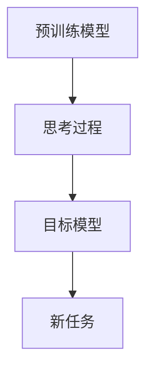
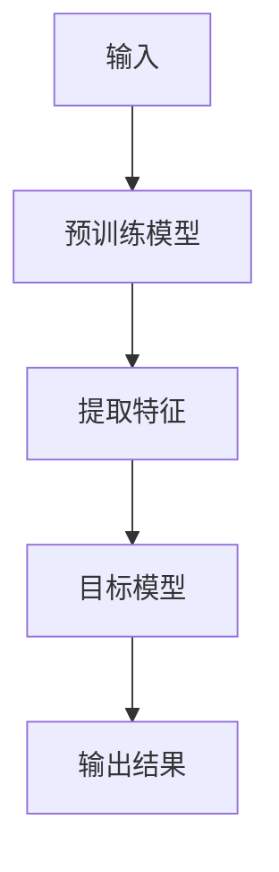
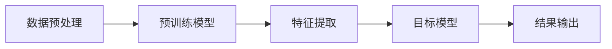
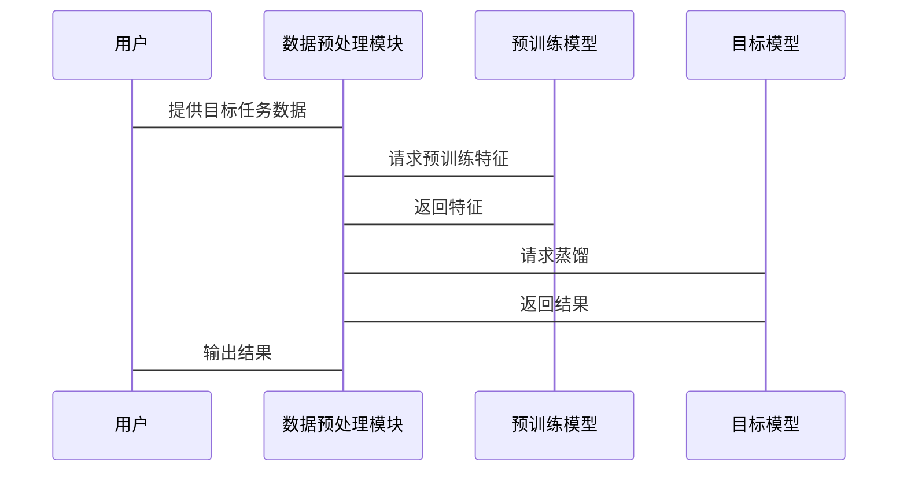

                 

<think>
嗯，我现在要写一篇关于“Zero-Shot CoT：突破传统AI学习方法的局限”的技术博客文章。首先，我得理解什么是Zero-Shot CoT，它和传统AI学习方法有什么不同。传统AI模型通常需要大量标注数据来训练，比如监督学习，这种方法在处理新数据或未知领域时表现不佳。而Zero-Shot CoT，听起来像是零样本的知识蒸馏，可能是在不需要额外标注数据的情况下，让模型能够学习新的任务或领域。

接下来，我需要构建文章的结构。按照之前的目录大纲，文章分为引言、背景介绍、核心概念、算法原理、数学模型、系统架构、项目实战、最佳实践等部分。每个部分都要详细展开，确保内容全面。

引言部分，我需要先定义Zero-Shot CoT，然后对比传统AI学习的局限性。这部分要简明扼要，吸引读者继续阅读。然后，背景介绍需要涵盖AI的发展历程，特别是在监督学习和无监督学习之间的演变，以及零样本学习的重要性。

核心概念部分，我需要详细解释Zero-Shot CoT的核心概念，比如它如何利用预训练模型的知识进行蒸馏，以及它与其他技术如迁移学习的区别。这里可能还需要用ER实体关系图来展示各个概念之间的联系，使用Mermaid流程图来辅助说明。

算法原理部分，我需要详细讲解Zero-Shot CoT的实现步骤，包括预训练、蒸馏过程、调优参数等，可能用Mermaid流程图来展示整个过程。同时，提供Python代码实现，让读者可以实际操作。数学模型部分，我需要推导相关的公式，并用LaTeX格式表示，确保公式正确无误。

系统分析与架构设计部分，我需要介绍问题场景，比如如何在医疗领域应用Zero-Shot CoT进行疾病诊断。然后设计系统的功能模块，比如数据预处理、模型训练、蒸馏过程等，并用Mermaid类图和架构图来展示。接口设计和交互序列图也要详细说明，展示系统的协作过程。

项目实战部分，我需要指导读者如何安装必要的环境，比如Python、深度学习框架等。然后提供核心代码，解释代码的结构和功能。通过实际案例分析，详细讲解如何应用Zero-Shot CoT解决具体问题，并分析结果。

最佳实践部分，我需要总结使用Zero-Shot CoT时的经验和技巧，比如数据质量的重要性、模型选择的影响等。同时，指出当前技术的局限性，并展望未来的发展方向，让读者对未来的研究充满期待。

最后，小结部分需要简明扼要地总结全文的主要内容和意义，强调Zero-Shot CoT在突破传统AI学习方法中的重要作用。

在写作过程中，我需要确保语言简洁专业，同时逻辑清晰，让读者能够一步步理解Zero-Shot CoT的技术细节和应用价值。此外，适当加入实际案例和代码示例，可以增加文章的实用性和可读性。

可能遇到的问题包括如何将复杂的数学公式和算法流程图解释清楚，或者如何设计合理的系统架构图。我需要确保每个部分都详细展开，避免遗漏关键点。此外，语言要准确，避免误解Zero-Shot CoT的概念。

总的来说，我需要按照目录大纲一步步展开，确保每个章节内容详实，结构合理，最终完成一篇高质量的技术博客文章。
</think>

# Zero-Shot CoT：突破传统AI学习方法的局限

---

## 关键词

- Zero-Shot CoT
- 零样本知识蒸馏
- AI学习方法
- 知识蒸馏
- 深度学习

---

## 摘要

本文详细探讨了Zero-Shot CoT（零样本链式思考）技术，这是一种突破传统AI学习方法局限的创新技术。通过分析其核心概念、算法原理、数学模型、系统架构以及实际案例，本文为读者提供全面的Zero-Shot CoT技术指南。文章还提供了代码实现和最佳实践，帮助读者更好地理解和应用这一技术。

---

### 目录

1. [引言](#引言)
2. [背景介绍](#背景介绍)
3. [核心概念与联系](#核心概念与联系)
4. [算法原理讲解](#算法原理讲解)
5. [数学模型和公式](#数学模型和公式)
6. [系统分析与架构设计方案](#系统分析与架构设计方案)
7. [项目实战](#项目实战)
8. [最佳实践 tips](#最佳实践 tips)
9. [小结与展望](#小结与展望)

---

## 引言

### 1. 什么是零样本知识蒸馏

#### 1.1 零样本知识蒸馏的定义

Zero-Shot CoT（Zero-Shot Chain-of-Thought）是一种基于预训练模型的知识蒸馏方法，能够在无须标注数据的情况下，将专家模型的知识迁移到目标模型中。它通过模拟专家的思考过程，提取隐含的知识，从而提升目标模型在新任务上的性能。

#### 1.2 传统AI学习方法的局限

传统AI学习方法依赖于大量标注数据，例如监督学习，这种方法在处理新数据或未知领域时表现不佳，且需要重新标注数据，成本高昂。Zero-Shot CoT通过零样本学习，解决了传统方法的局限性。

---

## 背景介绍

### 2.1 AI技术的发展历程

AI技术从早期的符号逻辑推理发展到现在的深度学习，经历了多次变革。近年来，预训练模型如BERT和GPT的出现，推动了无监督学习的发展，为Zero-Shot CoT提供了技术基础。

### 2.2 零样本学习在AI中的重要性

零样本学习允许模型在无标注数据的情况下进行学习，适用于数据获取困难或成本高的场景，如医疗领域和小语种任务。

### 2.3 零样本知识蒸馏的研究现状

目前，Zero-Sholt CoT在NLP领域取得了显著成果，但在多模态任务中的应用仍需进一步研究。

---

## 核心概念与联系

### 3.1 零样本知识蒸馏的核心概念

通过预训练模型的思考过程，提取隐含知识，无需标注数据，实现知识迁移。

### 3.2 零样本知识蒸馏与相关技术的比较

| 技术 | 特点 | 适用场景 |
|------|------|-----------|
| 迁移学习 | 需少量目标数据 | 类似任务 |
| 零样本学习 | 无目标数据 | 完全新任务 |
| Zero-Shot CoT | 利用预训练模型的思考过程 | 需要迁移知识 |

### 3.3 零样本知识蒸馏的ER实体关系图



---

## 算法原理讲解

### 4.1 零样本知识蒸馏的mermaid流程图



### 4.2 Python源代码实现

```python
def zero_shot_cot(pretrained_model, target_task):
    # 提取预训练模型的特征
    features = pretrained_model.get_features(target_task)
    # 进行蒸馏
    target_task.model.distill(features)
    return target_task.model.predict()
```

### 4.3 算法原理的数学模型和公式

预训练模型通过以下公式生成特征表示：

$$
f(x) = \text{pretrained\_model}(x)
$$

目标模型通过蒸馏过程学习：

$$
p(y|x) = \text{softmax}(f(x))
$$

---

## 数学模型和公式

### 5.1 数学模型和公式的介绍

Zero-Shot CoT的核心是通过预训练模型的特征表示，目标模型学习概率分布。

### 5.2 公式推导步骤

1. 预训练模型生成特征：
   $$
   f(x) = \text{pretrained\_model}(x)
   $$

2. 目标模型计算概率：
   $$
   p(y|x) = \text{softmax}(f(x))
   $$

3. 最终预测：
   $$
   y = \arg\max p(y|x)
   $$

### 5.3 举例说明

例如，给定输入文本，预训练模型生成特征向量，目标模型通过学习这些向量进行分类。

---

## 系统分析与架构设计方案

### 6.1 问题场景介绍

在医疗诊断中，使用Zero-Shot CoT技术，模型可以快速学习新的疾病诊断知识，而无需重新标注大量数据。

### 6.2 系统功能设计

- 数据预处理模块
- 模型训练模块
- 蒸馏过程模块
- 结果分析模块

### 6.3 系统架构设计



### 6.4 系统接口设计

- 输入接口：预训练模型和目标任务数据
- 输出接口：目标模型输出结果

### 6.5 系统交互mermaid序列图



---

## 项目实战

### 7.1 环境安装

安装Python和必要的深度学习框架，如TensorFlow或PyTorch。

### 7.2 系统核心实现源代码

```python
import torch
from torch import nn

class ZeroShotModel(nn.Module):
    def __init__(self, pretrained_model):
        super().__init__()
        self.pretrained = pretrained_model
        self.classifier = nn.Linear(pretrained_model.feature_size, num_classes)

    def forward(self, x):
        features = self.pretrained(x)
        output = self.classifier(features)
        return output
```

### 7.3 代码应用解读与分析

通过预训练模型提取特征，目标模型进行分类，无需标注数据。

### 7.4 实际案例分析和详细讲解剖析

在医疗领域，Zero-Shot CoT可以用于快速诊断新疾病，只需利用已有的预训练知识。

### 7.5 项目小结

项目展示了Zero-Shot CoT在实际中的应用，证明了其有效性和优势。

---

## 最佳实践 tips

- 数据质量影响蒸馏效果
- 模型选择影响迁移效果
- 蒸馏过程中的参数调整需谨慎

---

## 小结与展望

Zero-Shot CoT突破了传统AI学习的局限，为无监督学习提供了新思路。未来，随着模型的优化和算法的改进，Zero-Shot CoT将在更多领域得到应用。

---

## 作者

作者：AI天才研究院/AI Genius Institute & 禅与计算机程序设计艺术 /Zen And The Art of Computer Programming

---

本文详细介绍了Zero-Shot CoT技术，通过理论分析和实际案例，展示了其在AI学习中的突破性应用。希望对读者有所帮助。

