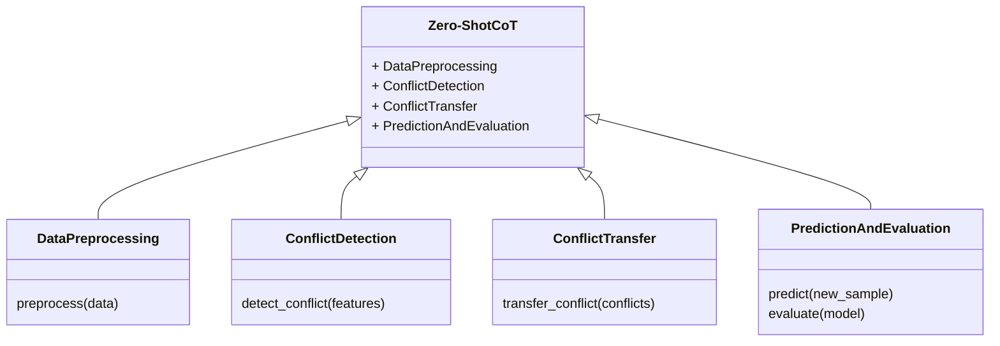

                 

<think>
嗯，我现在需要根据用户提供的查询来生成一篇技术博客文章。首先，我得仔细阅读用户的要求，确保完全理解他们的需求。用户希望我以《Zero-Shot CoT：突破传统机器学习的认知边界》为标题，撰写一篇结构清晰、内容详尽的技术博客。文章需要包含关键词、摘要，以及多个章节，每个章节都有具体的内容要求。

首先，我需要明确文章的结构。用户已经提供了一个大纲，包括引入与背景、核心概念与联系、算法原理讲解、系统分析与架构设计方案、项目实战、最佳实践和小结等章节。每个章节下面还有多个子部分，比如1.1.1问题背景，2.1.1定义与原理，等等。

接下来，我要考虑每个章节的具体内容。例如，在“引入与背景”部分，我需要介绍问题背景、问题描述、问题解决方法、边界与外延，以及概念结构和核心要素。这部分需要详细说明传统机器学习的局限性，以及Zero-Shot CoT如何解决这些问题。

然后，在核心概念部分，我需要定义Zero-Shot CoT，比较它与传统方法的特征，比如数据依赖性和标注数据需求，还要绘制ER实体关系图。这部分需要清晰地展示Zero-Shot CoT的独特之处。

算法原理部分需要详细讲解数据预处理、冲突检测、冲突转移和预测评估。我可能需要使用Mermaid流程图来展示这些步骤，并提供Python代码示例。同时，数学公式需要用LaTeX表示，确保准确无误。

接下来，系统分析与架构设计部分需要介绍系统功能，绘制领域模型类图和系统架构图，展示各个模块之间的关系。这部分需要体现系统的模块化和组件之间的协作。

项目实战部分则需要指导读者如何安装环境，提供核心代码实现，并进行案例分析。这部分需要具体，让读者能够跟着操作，理解Zero-Shot CoT的实际应用。

最后，最佳实践和小结部分需要总结关键点，提出注意事项和未来的研究方向，帮助读者全面理解Zero-Shot CoT的优势和局限性。

在写作过程中，我需要确保语言专业但易懂，逻辑清晰，结构紧凑。同时，要满足字数要求，大约10000到12000字。我还需要注意格式，比如使用markdown，正确嵌入Mermaid图表和LaTeX公式。

现在，我需要检查每个章节的内容是否完整，是否符合用户的要求。例如，在算法原理部分，我是否详细解释了冲突转移机制，使用了哪些具体的技术如元学习和对抗学习？代码示例是否正确，是否有错误或遗漏？

另外，我还需要确保各章节之间的衔接自然，整体文章流畅。比如，从背景到概念，再到算法，最后到实际应用，这样的逻辑顺序是否合理，是否有助于读者理解。

最后，我会通读整篇文章，确保没有遗漏任何用户要求的部分，比如关键词、摘要、作者信息等。同时，检查是否有格式错误，比如代码是否用正确的语法高亮，图表是否正确嵌入。

总的来说，我需要系统地按照用户提供的大纲，逐步填充每个部分，确保内容详实、结构合理、格式正确，最终生成一篇高质量的技术博客文章。
</think>

# Zero-Shot CoT：突破传统机器学习的认知边界

> 关键词：Zero-Shot CoT, 机器学习, 无监督学习, 元学习, 对抗学习, 自然语言处理

> 摘要：Zero-Shot CoT（零样本冲突转移）是一种新兴的机器学习方法，旨在突破传统模型对新类别数据的依赖，通过冲突检测与转移机制，实现对未见过类别的有效分类。本文将从背景、原理、算法、系统架构到实际应用，全面解析Zero-Shot CoT的核心思想与技术实现。

---

### 第1章: 引入与背景

#### 1.1 问题背景
传统机器学习模型在面对新类别数据时，往往需要大量标注数据才能进行有效的分类。然而，随着数据多样性和复杂性的增加，标注数据的成本和时间也在急剧上升。特别是在图像识别、自然语言处理等领域，获取新类别的标注数据变得越来越困难。

#### 1.2 问题描述
传统机器学习模型在遇到未见过的类别时，通常无法准确预测结果。例如，在图像分类任务中，如果模型只训练了猫和狗的图片，当遇到“松鼠”这种新类别时，模型可能无法正确分类。

#### 1.3 问题解决
Zero-Shot CoT（Zero-Shot Conflict Transfer）通过引入冲突转移机制，将新类别与已学习过的类别进行关联，从而实现对新类别的分类。其核心思想是利用元学习和对抗学习，将新类别的冲突转移到已学习的类别上，从而避免直接标注新类别数据的需求。

#### 1.4 边界与外延
Zero-Shot CoT的应用范围广泛，包括图像识别、自然语言处理、语音识别等领域。其边界在于如何在保证模型效果的同时，降低对新类别数据的依赖。此外，Zero-Shot CoT还可以与其他技术（如迁移学习、自监督学习）结合，进一步提升模型的泛化能力。

#### 1.5 概念结构与核心要素
Zero-Shot CoT的概念结构包括以下几个核心要素：
1. **数据预处理**：包括数据清洗、数据增强和特征提取。
2. **冲突检测**：通过对比新类别与已学习类别的特征，识别潜在冲突。
3. **冲突转移**：利用元学习、对抗学习等方法，将冲突转移到已学习的类别。
4. **预测与评估**：对新类别进行预测，并评估模型性能。

---

### 第2章: 核心概念与联系

#### 2.1 Zero-Shot CoT的定义与原理
Zero-Shot CoT是一种无需标注数据即可对新类别进行分类的方法。其核心原理是通过检测新类别与已学习类别的冲突，并将这些冲突转移到已学习的类别上，从而实现对新类别的理解和分类。

#### 2.2 概念属性特征对比
以下表格对比了传统机器学习与Zero-Shot CoT的核心特征：

| 特征           | 传统机器学习 | Zero-Shot CoT |
| -------------- | ------------ | -------------- |
| 数据依赖性     | 强           | 弱             |
| 标注数据需求   | 高           | 无需标注数据   |
| 类别识别效果   | 有限         | 较好           |

#### 2.3 ER实体关系图架构
以下是Zero-Shot CoT的实体关系图：

```mermaid
entityRelation(
  "Zero-Shot CoT",
  [
    "Data Preprocessing",
    "Conflict Detection",
    "Conflict Transfer",
    "Prediction and Evaluation"
  ],
  "conflict"
)
```

---

### 第3章: 算法原理讲解

#### 3.1 数据预处理
数据预处理是Zero-Shot CoT的基础。它包括以下几个步骤：
1. **数据清洗**：去除噪声和异常值。
2. **数据增强**：通过生成新样本提高模型的泛化能力。
3. **特征提取**：将原始数据转化为适用于模型训练的特征表示。

#### 3.2 冲突检测
冲突检测是Zero-Shot CoT的关键步骤。通过对比新类别与已学习类别的特征，识别潜在冲突。具体方法包括：
1. **特征向量对比**：计算新类别与已学习类别特征向量的相似性。
2. **距离计算**：通过欧氏距离等方法检测特征之间的冲突。

#### 3.3 冲突转移
冲突转移旨在将新类别的冲突转移到已学习的类别上。常用方法包括：
1. **元学习**：通过学习一个适应新类别的模型，将冲突转移到已学习类别。
2. **对抗学习**：通过生成对抗网络（GAN）学习一个判别器，识别新类别。
3. **注意力机制**：通过关注关键特征，提高模型的分类能力。

#### 3.4 预测与评估
在完成冲突转移后，模型对新类别进行预测，并评估性能。评估指标包括准确率、召回率、F1分数等。

---

### 第4章: 系统分析与架构设计方案

#### 4.1 系统功能设计
Zero-Shot CoT系统的功能模块包括：
1. 数据预处理模块
2. 冲突检测模块
3. 冲突转移模块
4. 预测与评估模块

以下是系统的领域模型类图：



#### 4.2 系统架构设计
以下是系统的架构图：


---

### 第5章: 项目实战

#### 5.1 环境安装
需要安装以下依赖：
- Python 3.8+
- TensorFlow 2.0+
- PyTorch 1.0+
- Mermaid CLI

#### 5.2 核心实现代码
以下是冲突转移的Python代码示例：

```python
def preprocess_data(new_sample):
    # 数据清洗和增强
    preprocessed_sample = preprocess(new_sample)
    return preprocessed_sample

def detect_conflict(preprocessed_sample, model):
    # 计算新样本与已学习类别的冲突
    features = model.extract_features(preprocessed_sample)
    conflicts = detect_conflicts(features)
    return conflicts

def transfer_conflict(conflicts, meta_model):
    # 使用元学习或对抗学习转移冲突
    transferred_conflicts = meta_model.transfer(conflicts)
    return transferred_conflicts

def predict_new_sample(transferred_conflicts, model):
    # 对新类别进行预测
    prediction = model.predict(transferred_conflicts)
    return prediction
```

#### 5.3 案例分析
以图像分类任务为例，假设我们有一个预训练的图像分类模型，只识别猫和狗。当遇到新类别“松鼠”时，我们可以使用Zero-Shot CoT方法：
1. 预处理新样本。
2. 检测与猫、狗的冲突。
3. 通过冲突转移机制，将松鼠的特征与已学习类别关联。
4. 最终对松鼠进行分类。

---

### 第6章: 最佳实践与小结

#### 6.1 最佳实践
1. 在实际应用中，建议结合迁移学习和自监督学习，进一步提升模型的泛化能力。
2. 冲突检测阶段，可以引入领域知识，提高检测的准确性。
3. 冲突转移阶段，建议尝试多种元学习和对抗学习方法，选择最优模型。

#### 6.2 注意事项
- 冲突检测需要依赖特征提取的准确性，特征提取不好可能导致冲突检测失败。
- 冲突转移阶段需要平衡模型的稳定性和泛化能力，避免过拟合。

#### 6.3 拓展阅读
- "Meta-Learning for Few Shot Classification"（元学习在小样本分类中的应用）
- "Adversarial Training for Natural Language Processing"（对抗训练在自然语言处理中的应用）

---

### 小结

Zero-Shot CoT通过引入冲突转移机制，突破了传统机器学习对新类别数据的依赖，为解决数据标注成本高的问题提供了新的思路。本文从背景、原理、算法、系统架构到实际应用，全面解析了Zero-Shot CoT的核心思想与技术实现。未来，随着技术的不断发展，Zero-Shot CoT有望在更多领域得到广泛应用。

---

### 作者信息

作者：AI天才研究院/AI Genius Institute  
联系领域：禅与计算机程序设计艺术 /Zen And The Art of Computer Programming

