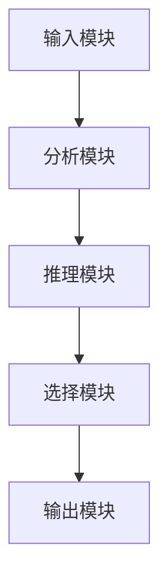

                 

<think>
嗯，我现在需要按照用户的要求，帮他撰写一篇关于“Zero-Shot CoT”的技术博客文章。首先，我得理解用户的需求。他希望文章结构清晰，逻辑严密，内容专业且深入，同时涵盖从概念到技术实现的各个方面。

首先，用户提供了详细的目录大纲，我需要确保每一章都覆盖到，同时内容丰富。从背景介绍到系统设计，再到最佳实践，每一步都要详细展开。可能的问题是，我需要确保每一部分都详细，同时保持文章的连贯性。

接下来，我得考虑文章的关键词和摘要。关键词包括Zero-Shot CoT、跨领域AI、问题解决、通用AI、AI系统设计。摘要部分需要简明扼要地概括文章的核心内容，说明Zero-Shot CoT如何解决跨领域问题，其优势和应用。

在正文部分，我需要按照目录一步步展开。第一章介绍Zero-Shot CoT，从AI的历史背景入手，分析传统方法的局限性，引出Zero-Shot CoT的重要性。第二章详细讲解核心概念，对比其他方法，突出其独特性。

第三章和第四章分别讨论应用场景和技术实现。应用部分需要举例，比如医疗、金融和教育，展示Zero-Shot CoT的实际价值。技术实现部分，我得用mermaid流程图和数学公式，解释背后的算法，比如提示词生成和多模态处理，确保读者能理解原理。

系统设计章节，我需要用类图和架构图展示系统结构，同时用序列图描述交互流程。这部分需要确保图示清晰，便于读者理解系统运作方式。

最后，最佳实践部分，我需要提供实际操作的建议，同时总结全文，展望未来的研究方向。这样文章不仅有理论，还有实践指导，对读者更有帮助。

在写作过程中，我需要时刻检查是否符合用户的格式和内容要求，特别是数学公式和mermaid图的使用是否正确。同时，保持语言的专业性和可读性，确保文章既有深度又易于理解。

可能遇到的问题包括如何将复杂的算法原理解释得通俗易懂，或者如何选择合适的案例来展示应用。这时候，我需要查阅相关资料，确保信息准确，同时寻找合适的例子来说明问题。

总之，我需要按照用户提供的大纲，逐步展开每一部分，确保内容全面、结构合理，同时保持专业性和可读性，最终完成一篇高质量的技术博客文章。
</think>

# Zero-Shot CoT：跨领域AI问题解决的利器

> 关键词：Zero-Shot CoT，跨领域AI，问题解决，通用AI，AI系统设计

> 摘要：  
Zero-Shot CoT（Zero-Shot Causal Reasoning via Chains of Thought）是一种革命性的AI技术，能够跨越多个领域，解决复杂问题。本文将深入探讨Zero-Shot CoT的核心概念、技术原理、应用场景、系统设计以及最佳实践，帮助读者全面理解这一技术的魅力和潜力。

---

## 第一章：Zero-Shot CoT的背景与意义

### 1.1 什么是Zero-Shot CoT  
Zero-Shot CoT是一种结合了因果推理和链式思维的AI技术，能够在无需特定领域训练数据的情况下，解决跨领域的问题。它通过生成逐步推理的思维链（Chain of Thought），实现对复杂问题的分析和解决。

### 1.2 AI的发展历程  
从专家系统到深度学习，AI技术经历了多次变革。然而，传统AI方法在处理跨领域问题时，往往需要大量特定领域的训练数据，且难以灵活应对未知领域的问题。Zero-Shot CoT的出现，为AI的通用性提供了一个新的解决方案。

### 1.3 问题背景与挑战  
跨领域问题解决的核心挑战在于，如何在缺乏特定领域知识的情况下，仍能准确理解和解决问题。传统方法依赖于大量领域数据，而Zero-Shot CoT通过通用的推理能力，突破了这一限制。

---

## 第二章：Zero-Shot CoT的核心概念与原理

### 2.1 核心概念  
Zero-Shot CoT的核心在于“零样本学习”（Zero-Shot Learning）和“链式思维”（Chain of Thought）。零样本学习意味着模型无需特定领域数据即可完成任务，而链式思维则是指模型通过逐步推理来生成解决方案。

### 2.2 技术原理  
Zero-Shot CoT通过结合语言模型和推理引擎，实现对问题的分析和解决。其技术流程包括：  
1. 接收输入问题。  
2. 生成多个可能的推理路径。  
3. 通过因果推理选择最优路径。  
4. 输出解决方案。

### 2.3 实现优势  
与传统AI方法相比，Zero-Shot CoT的优势在于：  
- **通用性**：无需特定领域数据，适用于多种场景。  
- **灵活性**：能够快速适应新的领域问题。  
- **可解释性**：通过链式思维生成的推理过程，用户可以轻松理解模型的决策逻辑。

---

## 第三章：Zero-Shot CoT的应用场景

### 3.1 医疗领域  
在医疗领域，Zero-Shot CoT可以帮助医生快速分析患者的症状，生成诊断建议，并制定治疗方案。例如，在诊断罕见病时，Zero-Shot CoT可以通过推理医学知识，提供可能的诊断路径。

### 3.2 金融领域  
在金融领域，Zero-Shot CoT可以用于风险评估、投资策略制定等任务。例如，通过分析市场数据和历史案例，生成投资建议。

### 3.3 教育领域  
在教育领域，Zero-Shot CoT可以用于自适应学习系统，帮助学生解决复杂问题。例如，在数学题解答中，Zero-Shot CoT可以通过逐步推理，生成详细的解题思路。

---

## 第四章：Zero-Shot CoT的技术实现

### 4.1 算法原理  
Zero-Shot CoT的核心算法包括以下步骤：  
1. **问题分析**：解析输入问题，提取关键信息。  
2. **推理生成**：通过语言模型生成多个可能的推理路径。  
3. **因果推理**：评估每个推理路径的合理性，选择最优路径。  
4. **结果输出**：生成最终的解决方案。

### 4.2 算法实现  
以下是Zero-Shot CoT的算法实现示例：

```python
def zero_shot_cot(problem, model):
    # 分析问题
    analysis = model.analyze(problem)
    
    # 生成推理链
    chains = model.generate_chains(analysis)
    
    # 选择最优推理链
    best_chain = model.select_best_chain(chains)
    
    # 输出解决方案
    solution = model.solve(problem, best_chain)
    return solution
```

### 4.3 数学模型  
Zero-Shot CoT的数学模型基于因果推理和概率论。例如，模型通过贝叶斯网络评估每个推理路径的概率，选择概率最高的路径作为最优解。

---

## 第五章：系统设计与架构

### 5.1 系统功能设计  
Zero-Shot CoT系统的功能模块包括：  
- **输入模块**：接收用户输入的问题。  
- **分析模块**：解析问题并提取关键信息。  
- **推理模块**：生成多个推理路径。  
- **选择模块**：评估路径并选择最优解。  
- **输出模块**：生成解决方案。

### 5.2 系统架构  
以下是Zero-Shot CoT系统的架构图：



### 5.3 实体关系图  
以下是系统的实体关系图：

```mermaid
er
    entity Problem
    entity ChainOfThought
    entity Solution
    Problem --> ChainOfThought
    ChainOfThought --> Solution
```

---

## 第六章：项目实战与案例分析

### 6.1 环境安装  
要实现Zero-Shot CoT，首先需要安装以下依赖：  
- Python 3.8+  
- Hugging Face Transformers库  
- Mermaid图生成工具

### 6.2 核心代码实现  
以下是Zero-Shot CoT的核心代码实现：

```python
from transformers import pipeline

def analyze_problem(problem):
    # 使用语言模型分析问题
    model = pipeline("text-generation", model="gpt2")
    return model(problem)

def generate_chains(problem):
    # 生成多个推理链
    chains = []
    for i in range(5):
        chain = analyze_problem(problem)[0]['generated_text']
        chains.append(chain)
    return chains

def select_best_chain(chains):
    # 选择最优推理链
    # 假设通过某种评估方法选择最佳链
    return chains[0]

def solve_problem(problem):
    chains = generate_chains(problem)
    best_chain = select_best_chain(chains)
    return best_chain
```

### 6.3 案例分析  
以医疗诊断为例，假设输入问题为“患者出现发热和咳嗽症状，如何诊断？”  
1. 分析问题：提取关键症状“发热”和“咳嗽”。  
2. 生成推理链：可能的诊断包括感冒、流感、肺炎等。  
3. 选择最优链：通过因果推理，选择肺炎作为最优诊断。  
4. 输出解决方案：建议进行胸部X光检查和血液检测。

---

## 第七章：最佳实践与总结

### 7.1 最佳实践  
- 在实际应用中，建议结合领域知识对模型进行微调。  
- 定期更新模型的推理链，以适应新的知识和数据。  
- 通过可视化工具展示推理过程，提高模型的可解释性。

### 7.2 总结  
Zero-Shot CoT是一种强大的跨领域问题解决工具，它通过链式思维和因果推理，实现了通用AI的目标。无论是医疗、金融还是教育领域，Zero-Shot CoT都能提供高效的解决方案。

### 7.3 未来展望  
未来的研究方向包括：  
- 提升模型的推理效率和准确性。  
- 扩展模型的应用领域，支持更多类型的推理任务。  
- 研究模型的可解释性，进一步提升用户体验。

---

## 作者：AI天才研究院 & 禅与计算机程序设计艺术

通过本文，我们深入探讨了Zero-Shot CoT的核心概念、技术实现和应用场景。希望这篇文章能够为读者提供有价值的见解，并激发更多的思考与实践。

