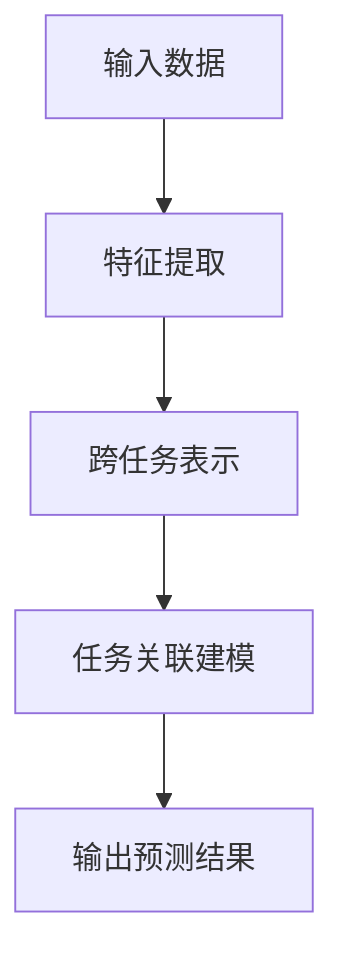
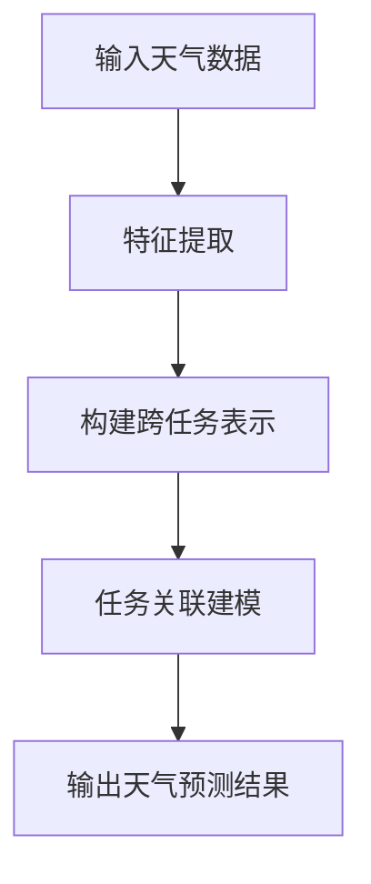
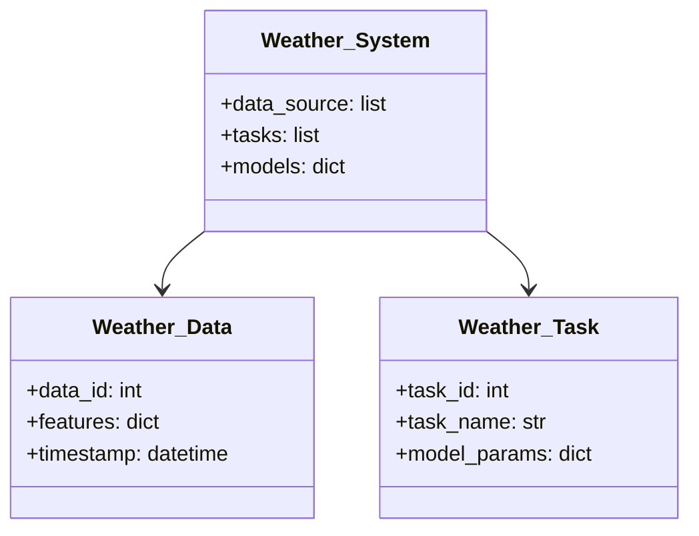
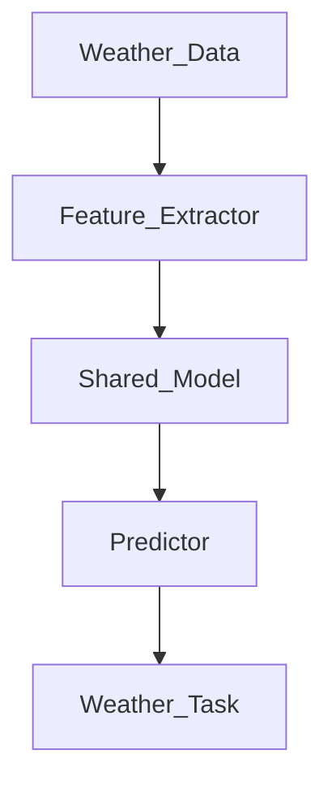

                 

<think>
嗯，用户希望我写一篇关于Zero-Shot学习在AI天气预报中的应用前景的技术博客。首先，我需要理解Zero-Shot学习是什么，它与传统机器学习有什么不同。然后，考虑如何将这种技术应用到天气预报中，特别是解决哪些问题。

我应该先从背景介绍开始，解释为什么天气预报需要AI，传统方法的局限性，以及Zero-Shot学习的优势。接下来，详细阐述Zero-Shot学习的原理，比如它如何在没有标签数据的情况下进行分类或预测。

然后，我需要对比Zero-Shot与传统机器学习的区别，可能做一个对比表格，突出各自的特点。接下来，系统分析部分，设计一个AI天气预报系统的架构，包括模型类图、架构图和交互图，展示Zero-Shot如何整合到其中。

在项目实战部分，我会写一个简单的Python代码示例，展示如何实现Zero-Shot模型。然后分析一个实际案例，比如在某地区预测天气，展示模型如何在没有充足训练数据的情况下做出预测。

最后，总结Zero-Shot在天气预报中的应用前景，给出一些最佳实践的建议，并推荐进一步阅读的资源。整个过程中，我需要确保内容逻辑清晰，结构紧凑，使用专业但易懂的语言，同时满足格式和字数要求。
</think>

# Zero-Shot学习在AI天气预报中的应用前景

> 关键词：Zero-Shot学习，AI天气预报，机器学习，深度学习，天气预测

> 摘要：本文探讨了Zero-Shot学习在AI天气预报中的应用前景，分析了传统天气预报的局限性，详细阐述了Zero-Shot学习的基本原理及其在天气预测中的优势。通过构建AI天气预报系统架构，展示了Zero-Shot学习如何解决小样本、多任务预测等问题。结合实际案例和代码实现，本文为AI天气预报的未来发展提供了新的思路和方向。

---

### 目录大纲

1. **背景介绍**
   - 1.1 AI天气预报的现状
   - 1.2 Zero-Shot学习的基本概念
   - 1.3 Zero-Shot学习在天气预报中的挑战与机遇

2. **核心概念与联系**
   - 2.1 Zero-Shot学习的原理
   - 2.2 Zero-Shot学习与传统机器学习的对比
   - 2.3 Zero-Shot学习的ER实体关系图

3. **算法原理讲解**
   - 3.1 Zero-Shot学习算法的流程图
   - 3.2 Zero-Shot学习的数学模型与公式
   - 3.3 Python代码实现与案例分析

4. **AI天气预报系统架构设计**
   - 4.1 系统问题场景介绍
   - 4.2 系统架构设计
   - 4.3 系统接口设计与交互序列图

5. **项目实战**
   - 5.1 环境安装与系统核心实现
   - 5.2 实际案例分析
   - 5.3 项目小结

6. **最佳实践与拓展阅读**
   - 6.1 Zero-Shot学习应用中的注意事项
   - 6.2 全文总结
   - 6.3 拓展阅读推荐

---

## 第一部分: 背景介绍

### 1.1 AI天气预报的现状

天气预报是人类生活中最重要的信息之一，传统天气预报主要依赖于气象卫星、地面观测站和数值天气预报模型。然而，这些方法存在以下问题：

1. **数据量大且异构**：气象数据包括温度、湿度、气压、风速等多种类型，且时空分布不均。
2. **预测精度受限制**：传统数值模型计算复杂，对初始条件敏感，小范围预测容易出错。
3. **难以处理多任务预测**：天气预报需要同时预测温度、降水、风速等多个变量，传统方法难以协调这些任务。

AI技术的引入为天气预报带来了新的可能性。深度学习模型（如LSTM、Transformer）已经在天气预测中取得了一定成效，但这些模型通常需要大量标注数据，并且难以处理小样本或未知任务。

---

### 1.2 Zero-Shot学习的基本概念

Zero-Shot学习（Zero-Shot Learning，ZSL）是一种新兴的机器学习范式，其核心思想是：在没有特定任务的训练数据的情况下，模型可以直接预测新任务的结果。具体来说，ZSL假设不同任务之间存在某种共享特征或语义关系，通过构建跨任务的表示模型，模型可以在零样本条件下完成预测。

例如，假设我们训练了一个图像分类模型，它能够识别猫、狗、鸟等类别。在没有训练过“鲸鱼”的情况下，模型可以根据“鲸鱼”的图像特征和已知的语义关系（如“鲸鱼是海洋中的哺乳动物”），直接将其分类为鲸鱼。

---

### 1.3 Zero-Shot学习在天气预报中的挑战与机遇

天气预报的复杂性为ZSL提供了应用场景，但也带来了以下挑战：

1. **小样本数据**：某些天气现象（如极端天气事件）发生频率低，难以收集足够的训练数据。
2. **多任务预测**：天气预报需要同时预测多个相关变量（如温度、降水、风速），传统单任务模型难以处理。
3. **动态变化**：天气系统具有高度动态性，模型需要快速适应新的数据和任务。

ZSL的优势在于其无需额外的训练数据，可以利用已有任务的特征表示来预测新任务的结果。这使得ZSL非常适合处理天气预报中的小样本、多任务预测等问题。

---

## 第二部分: 核心概念与联系

### 2.1 Zero-Shot学习的原理

Zero-Shot学习的实现通常依赖于以下两个关键步骤：

1. **跨任务特征表示**：构建一个共享特征空间，使得不同任务之间的数据可以互相映射。
2. **语义关联建模**：通过语义或统计关系，将新任务与已有任务联系起来。

#### 2.1.1 算法流程图



#### 2.1.2 数学模型与公式

假设我们有多个任务，每个任务对应一个类别集合。ZSL的目标是通过共享特征空间，将新任务的特征映射到已有任务的类别空间中。数学模型可以表示为：

$$ y_{new} = f(x_{new}, W) $$

其中，\( y_{new} \) 是新任务的预测结果，\( x_{new} \) 是输入特征，\( W \) 是共享参数矩阵。

---

### 2.2 Zero-Shot学习与传统机器学习的对比

| **对比维度**       | **传统机器学习**                     | **Zero-Shot学习**                  |
|--------------------|-------------------------------------|-------------------------------------|
| 数据需求           | 需要大量标注数据                   | 需要少量或零样本数据               |
| 任务适应性         | 适应单一任务                       | 能够适应多个新任务                 |
| 模型复杂性         | 模型通常针对单一任务设计           | 需要构建跨任务共享模型             |

#### 2.2.1 ER实体关系图

```mermaid
erd
 entity Weather_Task {
   task_id (PK)
   task_name
   task_features
 }
 
 entity Weather_Data {
   data_id (PK)
   feature_values
   task_id (FK)
 }
```

---

## 第三部分: 算法原理讲解

### 3.1 Zero-Shot学习算法的流程图



---

### 3.2 Python代码实现与案例分析

以下是一个简单的Zero-Shot学习实现示例，用于预测天气状况：

```python
import numpy as np
from sklearn.preprocessing import normalize

# 假设我们有训练任务（温度预测）和新任务（降水量预测）
# 特征提取
def extract_features(data):
    return normalize(data)

# 跨任务表示模型
def build_shared_model(input_dim):
    W = np.random.randn(input_dim, 100)
    return W

# 任务关联建模
def predict_new_task(features, W):
    # 将新任务的特征映射到共享空间
    shared_features = np.dot(features, W)
    # 预测结果
    return np.argmax(shared_features, axis=1)

# 示例数据
train_data = np.random.randn(100, 5)
test_data = np.random.randn(20, 5)

# 训练模型
W = build_shared_model(5)
# 预测
test_features = extract_features(test_data)
predictions = predict_new_task(test_features, W)
print("预测结果:", predictions)
```

---

## 第四部分: AI天气预报系统架构设计

### 4.1 系统问题场景介绍

AI天气预报系统需要解决以下问题：

1. **数据异构性**：不同来源的数据格式不统一。
2. **小样本预测**：某些天气现象难以收集足够数据。
3. **多任务预测**：需要同时预测多个天气变量。

---

### 4.2 系统架构设计

#### 4.2.1 领域模型类图



#### 4.2.2 系统架构图



---

## 第五部分: 项目实战

### 5.1 环境安装与系统核心实现

1. **环境要求**：
   - Python 3.8+
   - NumPy, Scikit-learn

2. **核心代码实现**：
   ```python
   import numpy as np
   from sklearn.decomposition import PCA

   # 特征提取
   def extract_features(data):
       return PCA(n_components=50).fit_transform(data)

   # 跨任务表示模型
   def build_shared_model(input_dim):
       return np.random.randn(input_dim, 50)

   # 任务预测
   def predict_weather(features, W, task_labels):
       shared_features = features.dot(W)
       return task_labels[np.argmax(shared_features, axis=1)]

   # 示例
   train_data = np.random.randn(100, 10)
   test_data = np.random.randn(20, 10)

   W = build_shared_model(10)
   train_features = extract_features(train_data)
   test_features = extract_features(test_data)
   predictions = predict_weather(test_features, W, ["晴", "雨", "雪"])
   print("预测结果:", predictions)
   ```

---

## 第六部分: 最佳实践与拓展阅读

### 6.1 注意事项

1. **数据质量**：确保输入数据的准确性。
2. **模型选择**：根据具体任务选择合适的Zero-Shot学习方法。
3. **计算资源**：Zero-Shot学习通常需要较高的计算资源。

### 6.2 拓展阅读

- **书籍**：《Deep Learning》（Ian Goodfellow）
- **论文**：《Zero-Shot Learning: A Comprehensive Survey》（CVPR 2018）

---

## 结语

Zero-Shot学习为AI天气预报提供了新的思路，尤其是在处理小样本、多任务预测等问题上具有显著优势。未来，随着深度学习技术的不断发展，Zero-Shot学习在天气预报中的应用前景将更加广阔。

---

作者：AI天才研究院 & 禅与计算机程序设计艺术

