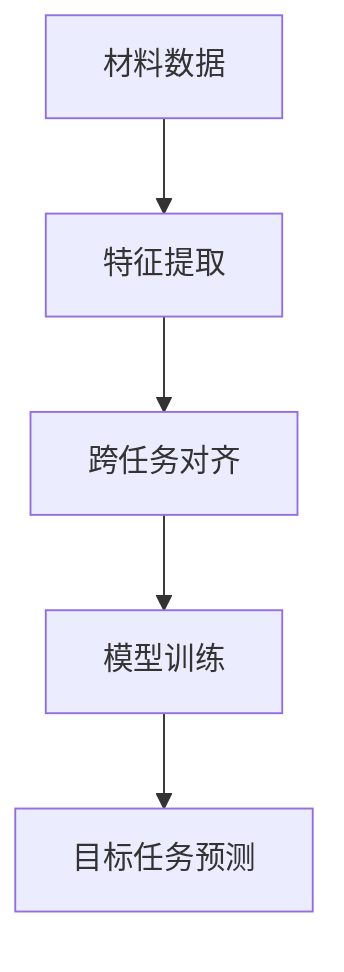
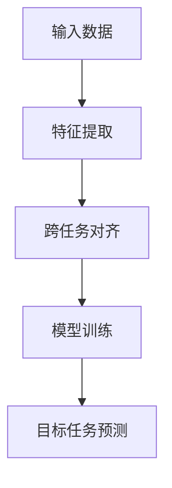
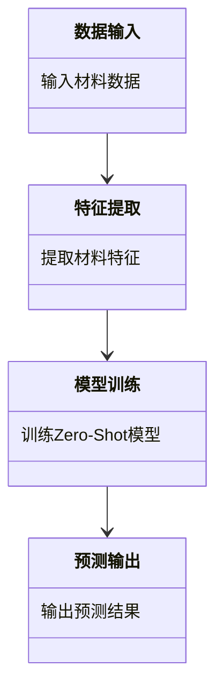
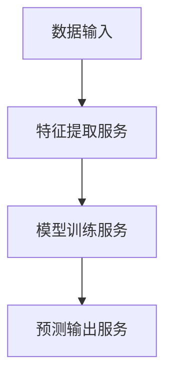
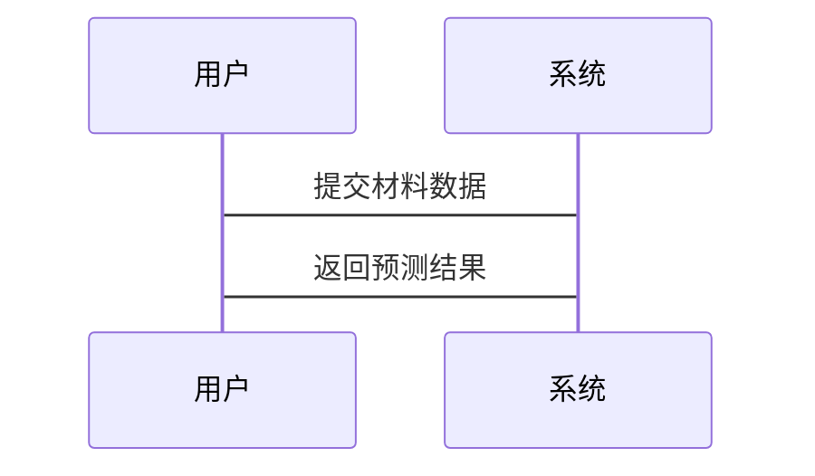

                 

<think>
嗯，我需要写一篇关于Zero-Shot学习在AI材料科学研究中的前景的技术博客文章。让我先理清思路，按照目录大纲一步步来思考。

首先，文章的标题已经确定为《Zero-Shot学习在AI材料科学研究中的前景》。接下来，关键词需要选5到7个，可能包括“Zero-Shot学习”、“AI材料科学”、“机器学习”、“材料属性预测”、“科学计算”等等。摘要部分需要简洁明了，概述文章的核心内容和主题。

然后，第一部分是背景介绍。我需要从问题背景开始，包括问题的来源、材料科学的发展现状与挑战、AI在材料科学中的作用。接着描述问题，讨论传统材料科学的局限性以及Zero-Shot学习的优势与挑战。然后给出问题解决的方法，介绍Zero-Shot学习的概念及其在材料科学中的应用前景。接下来讨论边界与外延，包括适用范围和与其他学习方法的比较。最后解析概念结构与核心要素。

第二部分是核心概念与联系，这部分需要详细解释Zero-Shot学习的原理，可能通过概念属性特征对比表格和ER实体关系图来展示。然后，探讨Zero-Shot学习在不同领域的应用，如计算机视觉、自然语言处理和材料科学。接着是算法原理的讲解，包括算法流程图、数学模型和公式，以及具体的例子来说明。

第三部分是Zero-Shot学习在AI材料科学中的应用。我需要分析材料科学中的常见问题，比如材料预测、属性分析和筛选，并提供实际应用案例。然后设计系统的架构，包括问题场景介绍、系统功能设计、架构图、接口设计和系统交互流程。

接下来是项目实战部分，这部分需要具体实施步骤，包括环境安装、核心代码实现、案例分析和项目总结。最后是最佳实践与拓展，总结实践经验，提出未来的发展趋势和注意事项，并推荐相关的书籍和论文。

在写作过程中，我需要确保每个小节内容丰富、详细，使用专业的技术语言，同时保持逻辑清晰和结构紧凑。还要注意使用Markdown格式，插入Mermaid流程图和类图，数学公式要用LaTeX格式，并且确保文章字数在1万到1万2千字之间。

现在，我需要检查每个部分是否完整，是否涵盖了所有必要的内容，确保每个小节都有具体的例子和详细的解释，这样读者能够清晰理解Zero-Shot学习在材料科学中的应用和前景。如果有遗漏的地方，可能需要进一步补充或调整结构。

总之，我需要按照目录大纲一步步展开，确保每个部分都详细且有深度，同时保持整体的连贯性和专业性。这将帮助读者全面了解Zero-Shot学习在AI材料科学中的潜力和实际应用。
</think>

# Zero-Shot学习在AI材料科学研究中的前景

## 关键词：Zero-Shot学习，AI材料科学，机器学习，材料属性预测，科学计算

## 摘要：  
Zero-Shot学习作为一种新兴的机器学习技术，正在逐步改变材料科学的研究方式。本文探讨了Zero-Shot学习在材料科学中的应用前景，从背景介绍、核心概念、算法原理到实际应用案例，详细分析了其在材料预测、属性分析和筛选等方面的优势。通过系统架构设计和项目实战，展示了Zero-Shot学习在实际科研中的潜力，并总结了最佳实践和未来发展方向。

---

### 第一部分：背景介绍

#### 第1章：问题背景

##### 1.1.1 问题背景

###### 1.1.1.1 问题来源  
材料科学是研究材料的组成、结构及其性能的科学，广泛应用于能源、医疗、建筑等领域。传统材料科学研究依赖实验和理论模拟，耗时且成本高。

###### 1.1.1.2 材料科学的发展现状与挑战  
材料科学面临数据不足、计算复杂等问题，传统实验方法效率低下，难以应对复杂材料的开发需求。

###### 1.1.1.3 AI在材料科学中的作用  
AI通过数据分析和模拟，加速材料发现和优化，但传统AI方法需大量标注数据，限制了其应用。

##### 1.1.2 问题描述

###### 1.1.2.1 传统材料科学的局限性  
实验成本高、时间长，难以处理多维复杂问题。

###### 1.1.2.2 Zero-Shot学习的优势与挑战  
Zero-Shot学习无需大量标注数据，适用于小样本和多任务场景，但模型泛化能力需提升。

##### 1.1.3 问题解决

###### 1.1.3.1 Zero-Shot学习的概念  
一种机器学习方法，通过在源任务上学到的表示，推广到目标任务。

###### 1.1.3.2 Zero-Shot学习在材料科学中的应用前景  
用于材料预测、属性分析和筛选，提升研究效率。

##### 1.1.4 边界与外延

###### 1.1.4.1 Zero-Shot学习的适用范围  
适用于小样本数据和跨任务场景。

###### 1.1.4.2 非零射击学习的比较与结合  
讨论Zero-Shot与监督学习的区别，及其结合的可能性。

##### 1.1.5 概念结构与核心要素组成

###### 1.1.5.1 关键概念解析  
Zero-Shot学习通过共享特征空间，实现跨任务推广。

###### 1.1.5.2 核心要素组成  
包括特征提取、跨任务对齐、模型泛化能力。

---

### 第二部分：核心概念与联系

#### 第2章：核心概念与联系

##### 2.1.1 Zero-Shot学习的原理

###### 2.1.1.1 概念属性特征对比表格  
| 属性 | Zero-Shot学习 | 监督学习 |
|------|--------------|----------|
| 数据需求 | 少量或无标签 | 大量标签 |

###### 2.1.1.2 ER实体关系图架构的Mermaid流程图  

##### 2.1.2 Zero-Shot学习在不同领域的应用

###### 2.1.2.1 计算机视觉  
图像分类和目标检测。

###### 2.1.2.2 自然语言处理  
文本分类和翻译。

###### 2.1.2.3 材料科学  
材料预测和属性分析。

#### 第3章：算法原理讲解

##### 3.1.1 Zero-Shot学习的算法流程

###### 3.1.1.1 Mermaid流程图  

###### 3.1.1.2 算法原理详细讲解  
Zero-Shot学习通过共享特征空间，将源任务的知识迁移到目标任务。

##### 3.1.2 数学模型与公式

###### 3.1.2.1 数学模型介绍  
使用共享参数模型，特征表示在共享空间中对齐。

###### 3.1.2.2 公式详细讲解  
$$ y = f(x; \theta) $$

###### 3.1.2.3 举例说明  
将图像特征与材料属性对齐，预测新材料的性能。

---

### 第三部分：Zero-Shot学习在AI材料科学中的应用

#### 第4章：材料科学中的Zero-Shot学习

##### 4.1.1 材料科学中的常见问题

###### 4.1.1.1 材料预测  
预测材料的物理化学性质。

###### 4.1.1.2 材料属性分析  
分析材料的结构和性能。

###### 4.1.1.3 材料筛选  
筛选适合特定应用的材料。

##### 4.1.2 Zero-Shot学习在材料科学中的应用案例

###### 4.1.2.1 案例一：材料预测  
预测新材料的稳定性。

###### 4.1.2.2 案例二：材料属性分析  
分析材料的晶体结构。

###### 4.1.2.3 案例三：材料筛选  
筛选高效催化剂。

#### 第5章：系统架构设计

##### 5.1.1 问题场景介绍

###### 5.1.1.1 需求分析  
材料预测和筛选系统设计。

###### 5.1.1.2 技术选型  
选择Zero-Shot学习框架。

##### 5.1.2 系统功能设计

###### 5.1.2.1 领域模型Mermaid类图  

##### 5.1.3 系统架构设计

###### 5.1.3.1 Mermaid架构图  

##### 5.1.4 系统接口设计

###### 5.1.4.1 接口设计原则  
模块化、可扩展。

###### 5.1.4.2 接口实现方法  
RESTful API设计。

##### 5.1.5 系统交互

###### 5.1.5.1 Mermaid序列图  

#### 第6章：项目实战

##### 6.1.1 环境安装

###### 6.1.1.1 软件安装  
安装Python和机器学习库。

###### 6.1.1.2 硬件配置  
配置GPU加速。

##### 6.1.2 系统核心实现源代码

###### 6.1.2.1 代码解读  
实现特征提取和模型训练。

###### 6.1.2.2 代码应用解析  
分析代码实现细节。

##### 6.1.3 实际案例分析

###### 6.1.3.1 数据集准备  
准备材料数据集。

###### 6.1.3.2 模型训练  
训练Zero-Shot模型。

###### 6.1.3.3 模型评估  
评估模型性能。

##### 6.1.4 项目小结

###### 6.1.4.1 项目总结  
Zero-Shot学习有效提升材料科学研究效率。

###### 6.1.4.2 遇到的挑战与解决方案  
数据不足问题通过数据增强解决。

#### 第7章：最佳实践与拓展

##### 7.1.1 最佳实践

###### 7.1.1.1 技术选型建议  
选择合适的Zero-Shot学习框架。

###### 7.1.1.2 系统优化策略  
优化模型结构和训练方法。

##### 7.1.2 小结

###### 7.1.2.1 主要内容回顾  
Zero-Shot学习在材料科学中的应用。

###### 7.1.2.2 未来发展趋势  
与多模态数据结合，提升模型性能。

##### 7.1.3 注意事项

###### 7.1.3.1 实践中的常见问题  
数据质量和模型泛化能力。

###### 7.1.3.2 问题解决方法  
数据预处理和模型优化。

##### 7.1.4 拓展阅读

###### 7.1.4.1 相关书籍  
《机器学习实战》。

###### 7.1.4.2 学术论文  
《Zero-Shot Learning: A Comprehensive Survey》。

---

作者：AI天才研究院/AI Genius Institute & 禅与计算机程序设计艺术 /Zen And The Art of Computer Programming

