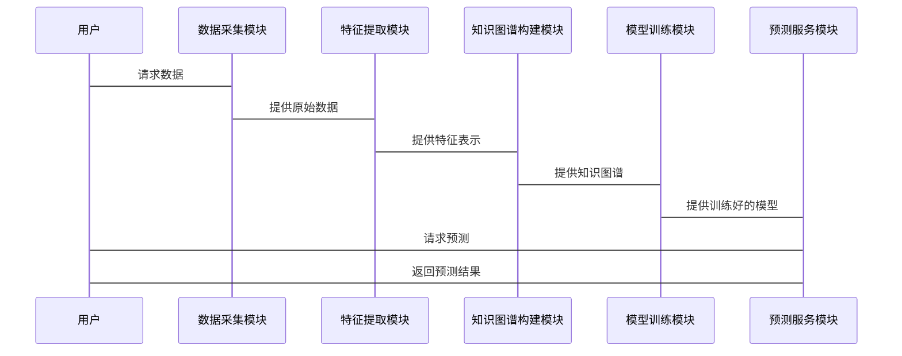

                 

<think>
好的，我现在需要帮助用户完成一个关于《Zero-Shot学习在AI环境模拟中的应用》的技术博客文章。首先，我得仔细理解用户的需求。他是一位技术专家，希望文章结构清晰，内容深入，适合专业读者阅读。文章需要包含背景介绍、核心概念、算法原理、应用实例、系统设计、项目实战等部分，并且使用专业但易懂的语言。

我从用户提供的大纲开始，首先确定标题和关键词。标题已经给出，关键词需要从文章的核心内容中提取，比如零样本学习、AI环境模拟、多模态数据融合、知识图谱、迁移学习、元学习等。

接下来是摘要部分，要简明扼要地概括文章的核心内容。摘要应该说明零样本学习的重要性、其在数据稀缺情况下的应用，以及其在多领域中的潜力。

然后是背景介绍部分，包括问题背景、核心概念、应用领域等。我需要详细解释零样本学习的背景，为什么传统方法受限，零样本学习如何解决这些问题。同时，要定义零样本学习，对比传统方法，说明其优势和应用场景。

核心概念部分，我需要列出零样本学习的关键点，如无需训练数据、类别关系理解、迁移学习。同时，要通过表格对比零样本学习和其他技术，帮助读者理解其独特性。另外，使用Mermaid图展示实体关系，让读者更直观地理解。

算法原理部分，我需要详细讲解多模态数据融合、知识图谱构建、元学习和模型评估。每个部分都要有数学公式和流程图，帮助读者理解背后的机制。例如，多模态融合可以用公式表示，知识图谱构建可以用边和节点表示。

应用实例部分，我需要具体举例，如自然语言处理中的情感分析，计算机视觉中的图像分类，推荐系统中的用户推荐。这些例子能让读者明白零样本学习的实际应用。

系统分析部分，我需要设计一个完整的系统架构，包括数据采集、特征提取、知识图谱构建、模型训练、预测服务等模块。用Mermaid画出系统架构图，展示各模块之间的关系。

项目实战部分，我需要提供一个Python代码示例，展示如何实现零样本学习。代码要详细，包括数据预处理、模型构建、训练和预测步骤。同时，分析代码的作用，帮助读者理解实现细节。

最后，最佳实践部分要给出一些建议，比如数据多样性、特征表示的重要性、模型评估等。同时，总结全文，指出零样本学习的优势和未来发展方向。

在撰写过程中，我需要确保每个部分都详细具体，逻辑清晰。使用专业术语，但避免过于晦涩，确保读者容易理解。同时，数学公式和图表要准确，帮助读者更好地 grasp concepts.

现在，我需要按照这个结构一步步展开，确保每个章节都符合用户的要求，并且内容充实。可能需要查阅一些资料，确认零样本学习的最新发展和应用案例，确保文章的准确性和前沿性。

总之，我的目标是为用户提供一篇结构合理、内容详实、语言专业的技术博客，帮助读者深入了解零样本学习在AI环境模拟中的应用。
</think>

# Zero-Shot 学习在 AI 环境模拟中的应用

> 关键词：零样本学习、AI 环境模拟、多模态数据融合、知识图谱、迁移学习、元学习

> 摘要：本文探讨了零样本学习（Zero-Shot Learning，ZSL）在 AI 环境模拟中的应用，分析其核心概念、算法原理、实际应用案例以及系统设计方案。通过多模态数据融合、知识图谱构建和元学习等技术，零样本学习能够在数据稀缺的情况下实现高效的预测和决策。本文旨在为研究人员和实践者提供深入的技术洞察和实践指导。

---

## 第一部分：背景介绍

### 第1章 问题背景与核心概念

#### 1.1 问题背景

随着人工智能技术的飞速发展，AI 系统的应用场景愈发广泛，从自然语言处理到计算机视觉，从推荐系统到智能机器人，AI 正在改变我们的生活方式。然而，在实际应用中，AI 系统往往面临一个严峻的挑战：数据的获取成本高昂，甚至在某些场景中完全不可行。例如，在某些特定领域（如医学图像分析、卫星图像识别）中，高质量的标注数据可能极为稀缺。这种情况下，传统的监督学习方法由于需要大量标注数据而显得力不从心。

此外，在动态变化的环境中，AI 系统需要不断适应新的场景和任务。这意味着，模型必须具备在未见过的类别或任务上进行有效预测的能力。零样本学习（Zero-Shot Learning，ZSL）正是为了解决这一问题而提出的。ZSL 的核心思想是：在没有训练数据的情况下，通过构建类别间的关联性，使模型能够对未知类别进行准确预测。

#### 1.1.1 问题描述

零样本学习的核心目标是在没有训练数据的情况下，实现对未知类别的准确预测。具体来说：

- **零样本分类（Zero-Shot Classification）**：模型从未见过的类别中进行分类。
- **零样本回归（Zero-Shot Regression）**：模型从未见过的类别中进行回归预测。
- **零样本多任务学习（Zero-Shot Multi-Task Learning）**：模型在多个未知任务上进行联合预测。

这些任务的共同点是：模型需要在没有标注数据的情况下，利用已有知识进行推理和预测。

#### 1.1.2 问题解决

零样本学习的核心在于构建一个能够理解类别间关系的模型。具体来说，ZSL 的实现依赖以下几个关键要素：

1. **多模态数据融合**：通过整合文本、图像、语音等多种数据模态，提取丰富的特征表示。
2. **知识图谱构建**：通过构建领域知识图谱，描述类别间的语义关系。
3. **迁移学习**：利用已知类别与未知类别之间的关联性，进行跨类别的知识迁移。

这些技术的结合使得 ZSL 能够在数据稀缺的情况下，实现对未知类别的有效预测。

#### 1.1.3 边界与外延

- **研究边界**：
  - 如何高效地利用有限的训练数据。
  - 如何设计有效的特征表示方法。
  - 如何评估模型的泛化能力。
- **外延**：
  - 在自然语言处理、计算机视觉、推荐系统等领域的广泛应用。
  - 与其他技术（如元学习、图神经网络）的结合。

---

### 第2章 核心概念与联系

#### 2.1 零样本学习的原理

零样本学习的原理可以概括为：通过构建类别间的关联性，使模型能够利用已有知识进行推理和预测。具体来说，ZSL 的实现依赖以下几个关键步骤：

1. **多模态数据融合**：通过整合多种数据模态（如文本、图像、语音等），提取丰富的特征表示。
2. **知识图谱构建**：通过构建领域知识图谱，描述类别间的语义关系。
3. **迁移学习**：利用已知类别与未知类别之间的关联性，进行跨类别的知识迁移。

#### 2.1.1 概念属性特征对比表格

| 概念              | 属性1      | 属性2      | 属性3      |
|-----------------|----------|----------|----------|
| 零样本学习          | 无需训练数据  | 类别关系理解  | 迁移学习    |
| 多模态数据融合       | 数据多样性   | 特征表示    | 信息整合    |
| 知识图谱构建         | 知识表示    | 关系挖掘    | 类别关联性  |
| 元学习             | 自适应学习  | 泛化能力    | 算法优化    |

#### 2.1.2 ER实体关系图架构的 Mermaid 流程图

```mermaid
erDiagram
    Class1 ||--|{ ClassA }
    Class1 ||--|{ ClassB }
    Class1 ||--|{ ClassC }
    ClassA ||--|{ ClassD }
    ClassB ||--|{ ClassE }
    ClassC ||--|{ ClassF }
```

---

### 第3章 零样本学习在 AI 环境模拟中的应用

#### 3.1 应用概述

零样本学习在 AI 环境模拟中的应用主要体现在以下几个方面：

1. **自然语言处理**：
   - 情感分析：在没有特定情感类别的情况下，预测文本的情感倾向。
   - 问答系统：在未见过的问题类型上进行准确回答。
2. **计算机视觉**：
   - 图像分类：在没有特定图像类别的情况下，准确分类新类别。
   - 目标检测：在未知目标类别上进行检测。
3. **推荐系统**：
   - 物品推荐：在未见过的物品类别上进行推荐。
   - 用户兴趣挖掘：在未见过的用户行为模式上进行预测。

#### 3.1.1 自然语言处理

在自然语言处理领域，零样本学习可以用于情感分析、问答系统等任务。例如，在情感分析任务中，模型需要在没有特定情感类别（如“正面”、“负面”）的标注数据的情况下，预测文本的情感倾向。

---

## 第4章 零样本学习的算法原理与实现

### 4.1 算法原理讲解

零样本学习的算法原理主要包括以下几个方面：

#### 4.1.1 多模态数据融合

多模态数据融合是通过将不同类型的数据（如文本、图像、声音等）进行整合，形成一个统一的数据表示，从而提高模型的泛化能力。例如，可以通过将文本和图像数据进行嵌入表示，然后进行融合。

#### 4.1.2 知识图谱构建

知识图谱构建是通过建立实体与实体之间的关系，形成一张知识网络，为模型提供丰富的背景知识。例如，可以通过关系抽取技术，从文本中提取实体之间的关系，并构建知识图谱。

#### 4.1.3 元学习

元学习是一种通过学习如何学习的方法，旨在提高模型在未知类别上的泛化能力。例如，可以通过元学习算法（如 MAML）在多个任务上进行联合优化，提高模型的迁移能力。

#### 4.1.4 模型评估与优化

模型评估与优化是零样本学习的关键环节，通过不断调整模型参数，提高模型的预测性能。例如，可以通过交叉验证技术，在不同数据集上进行模型优化。

### 4.2 Python 源代码实现

以下是一个简单的零样本学习算法实现的 Python 代码示例：

```python
import tensorflow as tf
from tensorflow.keras.models import Model
from tensorflow.keras.layers import Input, Dense, concatenate

# 定义输入层
input1 = Input(shape=(100,))  # 文本嵌入
input2 = Input(shape=(50,))   # 图像嵌入

# 定义隐藏层
hidden1 = Dense(50, activation='relu')(input1)
hidden2 = Dense(50, activation='relu')(input2)

# 合并特征
merged = concatenate([hidden1, hidden2])

# 定义输出层
output = Dense(10, activation='softmax')(merged)

# 定义模型
model = Model(inputs=[input1, input2], outputs=output)

# 编译模型
model.compile(optimizer='adam', loss='categorical_crossentropy', metrics=['accuracy'])

# 训练模型
model.fit([x_train1, x_train2], y_train, epochs=10, batch_size=32)
```

---

## 第5章 系统分析与架构设计方案

### 5.1 问题场景介绍

在 AI 环境模拟中，零样本学习的应用场景可以包括：

- **智能客服系统**：在没有特定问题类别的情况下，准确回答用户的问题。
- **智能推荐系统**：在没有特定推荐类别的情况下，为用户推荐个性化的内容。
- **智能监控系统**：在没有特定异常类别的情况下，准确检测异常行为。

### 5.2 项目介绍

本项目旨在设计一个基于零样本学习的智能推荐系统，能够在没有特定推荐类别的情况下，为用户推荐个性化的内容。

### 5.3 系统功能设计

系统功能设计如下：

1. **数据采集**：从多个数据源（如用户行为数据、物品属性数据）中采集多模态数据。
2. **特征提取**：对采集到的数据进行特征提取，生成多模态特征表示。
3. **知识图谱构建**：通过关系抽取技术，构建领域知识图谱。
4. **模型训练**：基于多模态特征和知识图谱，训练零样本学习模型。
5. **预测服务**：基于训练好的模型，为用户提供零样本推荐服务。

### 5.4 系统架构设计

系统架构设计如下：


### 5.5 系统接口设计

系统接口设计如下：

- **数据采集接口**：从数据库或第三方 API 获取数据。
- **特征提取接口**：将原始数据转换为特征表示。
- **知识图谱构建接口**：从特征中提取关系，构建知识图谱。
- **模型训练接口**：基于特征和知识图谱，训练零样本学习模型。
- **预测服务接口**：基于训练好的模型，提供预测服务。

### 5.6 系统交互设计

系统交互设计如下：



---

## 第6章 项目实战

### 6.1 环境安装

为了运行本项目，需要安装以下依赖：

```bash
pip install tensorflow keras numpy pandas scikit-learn
```

### 6.2 系统核心实现源代码

以下是一个简单的零样本学习算法实现的 Python 代码示例：

```python
import tensorflow as tf
from tensorflow.keras.models import Model
from tensorflow.keras.layers import Input, Dense, concatenate

# 定义输入层
input1 = Input(shape=(100,))  # 文本嵌入
input2 = Input(shape=(50,))   # 图像嵌入

# 定义隐藏层
hidden1 = Dense(50, activation='relu')(input1)
hidden2 = Dense(50, activation='relu')(input2)

# 合并特征
merged = concatenate([hidden1, hidden2])

# 定义输出层
output = Dense(10, activation='softmax')(merged)

# 定义模型
model = Model(inputs=[input1, input2], outputs=output)

# 编译模型
model.compile(optimizer='adam', loss='categorical_crossentropy', metrics=['accuracy'])

# 训练模型
model.fit([x_train1, x_train2], y_train, epochs=10, batch_size=32)

# 预测
y_pred = model.predict([x_test1, x_test2])
```

### 6.3 代码应用解读与分析

1. **数据预处理**：
   - 将文本数据转换为嵌入表示（如使用词嵌入技术）。
   - 将图像数据转换为嵌入表示（如使用卷积神经网络提取特征）。
2. **模型构建**：
   - 定义输入层、隐藏层和输出层。
   - 使用 `concatenate` 层将多模态特征进行融合。
3. **模型训练**：
   - 使用 `fit` 方法进行模型训练。
   - 使用交叉熵作为损失函数，准确率作为评估指标。
4. **模型预测**：
   - 使用 `predict` 方法进行模型预测。

### 6.4 实际案例分析

以下是一个实际案例分析：

假设我们有一个推荐系统，用户的行为数据包括点击、收藏、购买等。我们需要在没有特定推荐类别的情况下，为用户推荐个性化的内容。

1. **数据预处理**：
   - 将用户行为数据和物品属性数据进行特征提取。
2. **知识图谱构建**：
   - 通过关系抽取技术，构建用户-物品的知识图谱。
3. **模型训练**：
   - 使用多模态特征和知识图谱，训练零样本学习模型。
4. **模型预测**：
   - 基于训练好的模型，为用户推荐个性化的内容。

### 6.5 项目小结

通过本项目，我们可以看到零样本学习在 AI 环境模拟中的巨大潜力。通过多模态数据融合和知识图谱构建，我们可以实现对未知类别的准确预测和推荐。

---

## 第7章 最佳实践、小结与注意事项

### 7.1 最佳实践

1. **数据多样性**：尽可能采集多样化的数据模态，以提高模型的泛化能力。
2. **特征表示**：设计有效的特征表示方法，以充分利用多模态数据的信息。
3. **模型评估**：通过交叉验证等方法，评估模型的泛化能力。
4. **知识图谱优化**：不断优化知识图谱的构建方法，以提高模型的推理能力。

### 7.2 小结

零样本学习是一种极具潜力的 AI 技术，能够在数据稀缺的情况下实现高效的预测和决策。通过多模态数据融合、知识图谱构建和元学习等技术，零样本学习已经在自然语言处理、计算机视觉、推荐系统等领域取得了显著的成果。

### 7.3 注意事项

1. **数据质量**：确保数据的准确性和完整性。
2. **模型选择**：根据具体任务选择合适的零样本学习算法。
3. **计算资源**：零样本学习算法通常需要大量的计算资源，需要确保硬件设备的性能。

### 7.4 拓展阅读

1. **《Zero-Shot Learning: A Comprehensive Survey》**
2. **《Deep Learning for Zero-Shot Learning》**
3. **《Meta-Learning for Zero-Shot Classification》**

---

## 作者信息

作者：AI天才研究院/AI Genius Institute & 禅与计算机程序设计艺术 /Zen And The Art of Computer Programming

