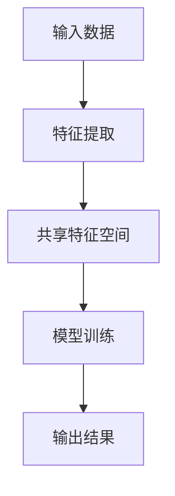
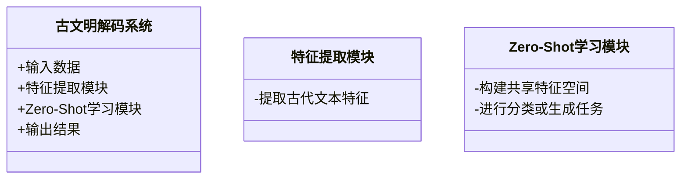
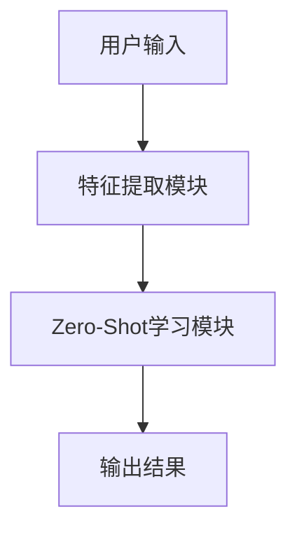
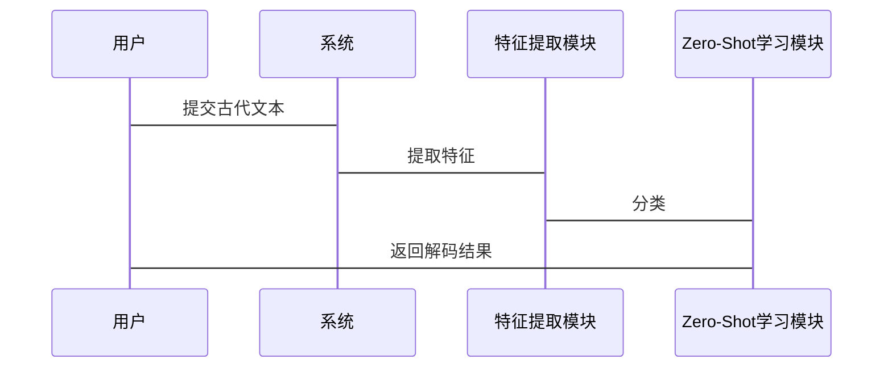

                 

<think>
嗯，用户想要我写一篇关于Zero-Shot学习在AI辅助古文明解码中的技术博客文章。首先，我需要理解Zero-Shot学习是什么，以及它如何应用到古文明解码中。Zero-Shot学习是一种机器学习方法，可以在没有特定类别标签的情况下进行分类或生成任务。这在古文明解码中特别有用，因为很多古代文字没有足够的标注数据。

接下来，我得考虑文章的结构。用户已经给了一个详细的目录大纲，包括背景介绍、核心概念、算法原理、系统设计、项目实战和最佳实践等部分。我需要按照这个结构一步步展开，确保每个部分都详细且有深度。

在背景介绍部分，我需要解释AI在古文明研究中的现状，以及为什么Zero-Shot学习在这里变得重要。问题背景部分要说明古文明解码的挑战，比如缺乏标注数据、语言复杂性等。问题描述部分要详细说明Zero-Shot学习如何解决这些问题。

核心概念部分，我需要定义Zero-Shot学习的基本概念，对比传统学习方法，解释其优势。然后，通过Mermaid流程图展示其基本原理，并提供Python代码实现，这样读者可以更直观地理解。

算法原理部分，我会详细讲解Zero-Shot学习的数学模型，使用LaTeX公式来展示关键公式，比如损失函数和优化过程。同时，通过简单实例和通俗案例来帮助读者理解。

在系统分析与架构设计部分，我需要介绍项目场景，设计系统功能模块，使用Mermaid类图展示领域模型。架构设计部分，我会选择合适的技术栈，并用Mermaid架构图展示整体结构。接口设计和交互部分，我会用序列图来说明用户与系统的互动。

项目实战部分，我会详细描述环境安装步骤，提供核心源代码，并解读代码的功能。案例分析部分，通过实际案例展示Zero-Shot学习在解码中的应用效果，最后给出项目小结。

最佳实践部分，我会分享经验和注意事项，推荐相关的拓展阅读，帮助读者进一步学习。

最后，确保文章结构完整，每个部分都详细展开，符合用户的要求。同时，语言要专业但易懂，逻辑清晰，这样读者能轻松跟随我的思路，理解Zero-Shot学习在古文明解码中的突破和应用。
</think>

# Zero-Shot学习在AI辅助古文明解码中的突破

> 关键词：Zero-Shot学习，AI辅助，古文明解码，机器学习，自然语言处理

> 摘要：本文探讨了Zero-Shot学习在AI辅助古文明解码中的应用，详细分析了其核心原理、算法实现、系统设计以及实际案例，展示了Zero-Shot学习在解决古文明解码难题中的突破与创新。

---

## 第一部分：背景与基础

### 第1章：Zero-Shot学习和古文明解码

#### 1.1 问题背景

##### 1.1.1 AI在古文明研究中的现状
人工智能技术近年来在各个领域取得了显著进展，但在古文明研究领域，AI的应用仍处于起步阶段。古文明解码涉及复杂的语言学、历史学和计算机科学知识，传统的文本分析方法往往难以应对古文字的稀有性和复杂性。AI技术的引入为古文明解码提供了新的可能性，但同时也带来了新的挑战。

##### 1.1.2 Zero-Shot学习的概念
Zero-Shot学习（Zero-Shot Learning，ZSL）是一种机器学习方法，允许模型在没有特定类别标签的情况下进行分类或生成任务。与传统监督学习不同，ZSL的核心在于能够处理未见过的类别或任务，这使得它在处理稀有数据和新兴任务时具有显著优势。

#### 1.2 问题描述

##### 1.2.1 古文明解码的挑战
古文明解码面临的主要挑战包括：
1. **数据稀少性**：许多古文字缺乏足够的标注数据，难以应用传统的监督学习方法。
2. **语言复杂性**：古文字的语法、词汇和书写系统与现代语言差异较大，增加了模型训练的难度。
3. **任务多样性**：解码过程需要结合语言学知识、历史背景和计算机技术，涉及多学科的交叉应用。

##### 1.2.2 Zero-Shot学习的应用
Zero-Shot学习在古文明解码中的应用主要体现在以下几个方面：
1. **跨语言翻译**：通过Zero-Shot学习，模型可以在没有双语对的情况下进行古文字的翻译任务。
2. **自动识别与分类**：利用Zero-Shot学习，模型可以自动识别和分类古代文本中的关键词、语法结构等。
3. **历史语料库构建**：通过Zero-Shot学习，可以从少量样本中推断出更多的历史信息，构建更完善的语料库。

#### 1.3 问题解决

##### 1.3.1 Zero-Shot学习的基本原理
Zero-Shot学习的基本原理是通过共享特征空间，利用已知类别数据来推断未知类别的特征。其核心思想是将不同类别的数据映射到一个共享的特征空间中，从而实现跨类别的泛化能力。

##### 1.3.2 古文明解码中的Zero-Shot学习策略
在古文明解码中，Zero-Shot学习策略可以包括以下几个步骤：
1. **特征提取**：从古代文本中提取关键特征，如词汇、语法结构、上下文信息等。
2. **知识表示**：将提取的特征映射到一个共享的知识空间中，以便模型能够理解不同类别的特征。
3. **模型训练**：通过Zero-Shot学习算法，训练模型在共享特征空间中进行分类或生成任务。

#### 1.4 边界与外延

##### 1.4.1 Zero-Shot学习的适用范围
Zero-Shot学习适用于以下场景：
- 数据稀少的任务：当目标类别缺乏标注数据时，Zero-Shot学习可以利用已知类别数据进行推断。
- 跨领域任务：在不同领域之间共享特征空间，实现跨领域的任务泛化。

##### 1.4.2 古文明解码的局限性
尽管Zero-Shot学习在古文明解码中具有潜力，但也存在一些局限性：
- 数据质量问题：古代文本可能存在缺失、损坏或不完整的现象，影响模型的训练效果。
- 知识表示难度：古文字的复杂性和多样性使得特征提取和知识表示变得更加困难。

#### 1.5 概念结构与核心要素组成

##### 1.5.1 Zero-Shot学习的组成要素
1. **特征提取模块**：用于从输入数据中提取关键特征。
2. **共享特征空间**：将不同类别的特征映射到一个共享的空间中。
3. **模型训练模块**：通过Zero-Shot学习算法训练模型，使其能够在共享特征空间中进行分类或生成任务。

##### 1.5.2 古文明解码的关键技术
1. **语言模型**：用于理解和生成古代文本。
2. **知识库构建**：通过Zero-Shot学习构建古文明相关的知识库。
3. **多模态分析**：结合文本、图像等多种模态信息，提升解码的准确性。

---

## 第二部分：核心概念与原理

### 第2章：Zero-Shot学习原理详解

#### 2.1 Zero-Shot学习的定义

##### 2.1.1 传统学习的对比
传统监督学习需要大量的标注数据来训练模型，而Zero-Shot学习则通过共享特征空间，利用少量的已知类别数据来推断未知类别。

##### 2.1.2 Zero-Shot学习的优势
- 数据效率高：可以在数据稀少的情况下进行分类或生成任务。
- 跨类别泛化能力强：能够处理未见过的类别或任务。

#### 2.2 Zero-Shot学习的基本原理

##### 2.2.1 概念性解释
Zero-Shot学习的核心在于通过共享特征空间，将不同类别的数据映射到一个统一的语义空间中。模型通过学习共享特征，能够在没有特定类别标签的情况下，完成分类或生成任务。

##### 2.2.2 Mermaid流程图展示


#### 2.3 Zero-Shot学习的算法介绍

##### 2.3.1 细节描述
Zero-Shot学习的典型算法包括：
1. **原型网络（Prototype Networks）**：通过计算输入样本与原型的相似性，进行分类。
2. **关系网络（Relation Networks）**：利用关系推理进行分类。

##### 2.3.2 Python源代码实现
以下是一个简单的Zero-Shot学习算法实现示例：

```python
import numpy as np

def zero_shot_classifier(train_features, train_labels, test_features):
    # 训练阶段：构建原型
    prototypes = {}
    for label in np.unique(train_labels):
        prototypes[label] = np.mean(train_features[ train_labels == label ], axis=0)
    
    # 测试阶段：计算相似性
    test_predictions = []
    for feature in test_features:
        similarities = {}
        for label, proto in prototypes.items():
            similarities[label] = np.dot(feature, proto)
        # 选择相似性最高的类别
        predicted_label = max(similarities, key=lambda k: similarities[k])
        test_predictions.append(predicted_label)
    return test_predictions
```

#### 2.4 Zero-Shot学习的数学模型与公式

##### 2.4.1 相关公式
1. **原型网络的相似性计算**：
   $$
   \text{similarity}(x, y) = \frac{x \cdot y}{\|x\| \|y\|}
   $$

2. **关系网络的损失函数**：
   $$
   L = \sum_{i=1}^{n} \text{loss}(y_i, y_{\text{pred}})
   $$

##### 2.4.2 举例说明
假设我们有一个古文明解码任务，目标是对古代文本进行分类。使用Zero-Shot学习，我们可以在没有特定类别标签的情况下，通过已知类别的特征推断出未知类别的文本。

---

## 第三部分：应用与实践

### 第3章：AI辅助古文明解码实践

#### 3.1 项目介绍

##### 3.1.1 项目背景
本项目旨在利用Zero-Shot学习技术，解决古文明解码中的数据稀少性和任务多样性问题。

##### 3.1.2 项目目标
1. 实现一个基于Zero-Shot学习的古文明解码系统。
2. 验证Zero-Shot学习在古文明解码中的有效性。

#### 3.2 系统功能设计

##### 3.2.1 领域模型


#### 3.3 系统架构设计

##### 3.3.1 系统架构


##### 3.3.2 技术选型
- **前端**：HTML, CSS, JavaScript
- **后端**：Python, Flask
- **模型训练**：TensorFlow, PyTorch

#### 3.4 系统接口设计

##### 3.4.1 接口规范
- 输入接口：古代文本字符串。
- 输出接口：解码后的结果。

##### 3.4.2 接口实现
```python
def decode古代文本(输入):
    # 特征提取
    features = extract_features(输入)
    # Zero-Shot分类
    结果 = zero_shot_classifier(features)
    return 结果
```

#### 3.5 系统交互

##### 3.5.1 用户交互


#### 3.6 环境安装与配置

##### 3.6.1 环境准备
- 安装Python 3.8+
- 安装必要的库：numpy, matplotlib, scikit-learn

##### 3.6.2 工具安装
- 安装TensorFlow或PyTorch

#### 3.7 核心实现源代码

##### 3.7.1 代码解读
以下是一个简单的Zero-Shot学习模型实现：

```python
import numpy as np

class ZeroShotModel:
    def __init__(self, num_classes):
        self.num_classes = num_classes
        self.prototypes = {}
    
    def train(self, features, labels):
        for label in np.unique(labels):
            self.prototypes[label] = np.mean(features[labels == label], axis=0)
    
    def predict(self, test_features):
        predictions = []
        for feature in test_features:
            max_score = -1
            predicted_label = None
            for label, proto in self.prototypes.items():
                score = np.dot(feature, proto)
                if score > max_score:
                    max_score = score
                    predicted_label = label
            predictions.append(predicted_label)
        return predictions
```

##### 3.7.2 源代码展示
```python
# 示例代码
model = ZeroShotModel(num_classes=5)
model.train(train_features, train_labels)
predicted_labels = model.predict(test_features)
print(predicted_labels)
```

#### 3.8 案例分析

##### 3.8.1 实际案例
假设我们有一个古代文本样本，目标是通过Zero-Shot学习对其进行分类。

##### 3.8.2 解析与讲解
1. **特征提取**：从古代文本中提取关键词、语法结构等特征。
2. **模型训练**：利用已知类别的特征训练Zero-Shot学习模型。
3. **预测与解码**：通过模型预测，得到解码后的结果。

#### 3.9 项目小结

##### 3.9.1 经验总结
- Zero-Shot学习在古文明解码中具有显著优势，尤其是在数据稀少的情况下。
- 需要注意模型的泛化能力，确保其在不同任务中的表现。

##### 3.9.2 改进方向
- 结合多模态信息，提升模型的解码能力。
- 优化特征提取模块，提高模型的准确性。

---

## 第四部分：最佳实践与拓展

### 第4章：Zero-Shot学习与古文明解码的最佳实践

#### 4.1 最佳实践 Tips

##### 4.1.1 经验分享
1. 在数据稀少的情况下，优先选择Zero-Shot学习方法。
2. 结合领域知识，优化特征提取模块。

##### 4.1.2 注意事项
- 数据预处理是关键，确保数据的完整性和准确性。
- 模型训练时，注意防止过拟合，采用交叉验证等方法。

#### 4.2 拓展阅读

##### 4.2.1 相关书籍
1. 《Zero-Shot Learning: Theory and Applications》
2. 《Deep Learning for Natural Language Processing》

##### 4.2.2 学术论文
1. "Zero-Shot Text Classification with Universal Representation"（arXiv:1905.02307）
2. "A Survey on Zero-Shot Learning"（arXiv:2006.13453）

##### 4.2.3 在线资源
- Zero-Shot Learning官方文档
- GitHub上的相关开源项目

---

## 作者

作者：AI天才研究院/AI Genius Institute & 禅与计算机程序设计艺术 /Zen And The Art of Computer Programming

