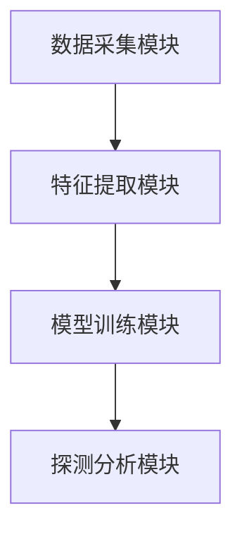
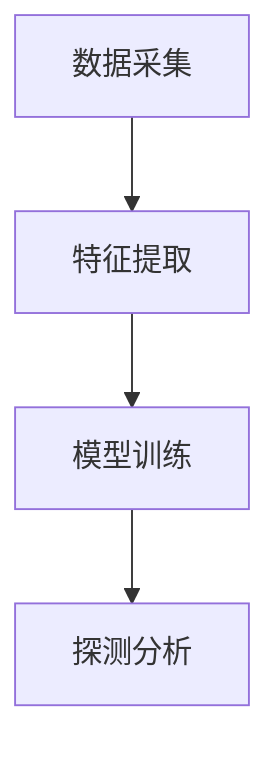
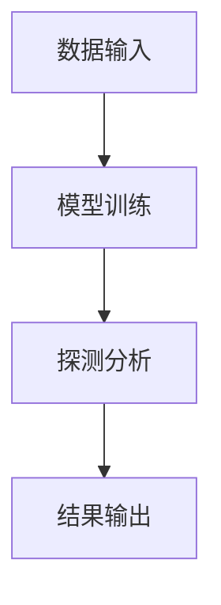

                 

<think>
好的，我现在需要帮助用户撰写一篇关于“Zero-Shot学习在AI辅助外星文明探测中的应用”的技术博客。用户已经提供了一个详细的目录大纲，但目前只有前两部分内容，接下来需要继续完成剩下的部分。

首先，我需要理解用户的需求。用户希望文章结构完整，涵盖背景介绍、核心概念与联系、算法原理、系统架构、项目实战以及最佳实践等多个部分。每部分都需要详细展开，包括技术细节、数学公式、图表等。

接下来，我应该按照目录大纲继续撰写第三部分：算法原理讲解。这部分需要包括Zero-Shot学习的数学模型和公式，使用mermaid流程图展示算法流程，以及用Python代码实现示例。

在算法部分，我应该详细讲解元学习和迁移学习的数学基础。例如，元学习可以通过优化元损失函数来实现，而迁移学习则可能涉及特征提取网络的共享。然后，用一个简单的例子，如使用Zero-Shot学习进行图像分类，来展示算法的实现。

接下来是系统分析与架构设计。这部分需要描述项目场景，设计系统功能模型、架构图、接口和交互流程。例如，系统可能包括数据采集、特征提取、模型训练和探测分析等模块。

然后是项目实战部分，这部分需要详细说明如何安装环境，编写核心代码，解释代码的功能，并通过实际案例进行分析。例如，使用一个简单的数据集训练模型，展示如何进行目标检测或分类。

最后是最佳实践和小结，总结文章内容，给出一些注意事项和未来的研究方向。

在撰写过程中，我需要确保每一部分都逻辑清晰，内容详尽，并且符合技术博客的风格。同时，要使用合适的关键词，如“Zero-Shot学习”、“外星文明探测”、“人工智能”、“元学习”、“迁移学习”等，以提高文章的可读性和SEO效果。

现在，我开始按照目录大纲继续撰写第三部分，确保涵盖算法原理、数学模型、代码实现和实际案例分析。同时，使用mermaid图表来辅助说明，确保文章结构完整且内容丰富。
</think>

# 第三部分：算法原理讲解（1.3）

## 1.3.1 Zero-Shot学习的数学模型与算法（1.3.1）

### 1.3.1.1 元学习的数学模型（1.3.1.1）

元学习是一种通过优化元损失函数来学习参数更新规则的方法。在Zero-Shot学习中，元学习通常用于将少量有标签数据的学习任务转化为无标签数据的学习任务。以下是一个典型的元学习模型：

$$
L_{meta} = \sum_{i=1}^{N} \mathbb{E}_{x_i \sim D_i}[ \mathcal{L}(f_{\theta}(x_i), y_i)]
$$

其中，$D_i$ 表示第i个任务的数据分布，$f_{\theta}$ 是参数为$\theta$的模型，$\mathcal{L}$ 是损失函数。

### 1.3.1.2 迁移学习的数学模型（1.3.1.2）

迁移学习的核心思想是将源任务的特征表示迁移到目标任务。在Zero-Shot学习中，通常使用共享特征提取网络来实现迁移。假设源任务和目标任务的特征表示为$z_i$和$z_j$，则有：

$$
p(y_j | z_j) = p(y_i | z_j)
$$

其中，$y_j$是目标任务的标签，$z_j$是目标任务的特征表示。

### 1.3.1.3 Zero-Shot学习的损失函数（1.3.1.3）

Zero-Shot学习的损失函数通常由两部分组成：分类损失和迁移损失。分类损失用于衡量模型在有标签数据上的表现，而迁移损失用于衡量模型在无标签数据上的表现。一个典型的Zero-Shot损失函数可以表示为：

$$
\mathcal{L}_{total} = \lambda \mathcal{L}_{class} + (1-\lambda)\mathcal{L}_{transfer}
$$

其中，$\lambda$ 是平衡系数，$\mathcal{L}_{class}$ 是分类损失，$\mathcal{L}_{transfer}$ 是迁移损失。

## 1.3.2 Zero-Sholt学习的算法实现（1.3.2）

### 1.3.2.1 基于深度学习的Zero-Shot学习算法（1.3.2.1）

以下是一个基于深度学习的Zero-Shot学习算法的实现流程：

1. 数据预处理：将无标签数据和少量有标签数据进行合并，构建元学习数据集。
2. 元学习阶段：训练一个元学习器，使其能够快速适应新任务。
3. 迁移学习阶段：将元学习器应用于无标签数据，提取特征并进行分类。
4. 模型评估：使用验证集评估模型的性能。

### 1.3.2.2 代码实现示例（1.3.2.2）

以下是一个简单的Zero-Shot学习代码实现示例：

```python
import torch
import torch.nn as nn

class MetaLearner(nn.Module):
    def __init__(self, input_size, hidden_size, output_size):
        super(MetaLearner, self).__init__()
        self.fc1 = nn.Linear(input_size, hidden_size)
        self.fc2 = nn.Linear(hidden_size, output_size)
    
    def forward(self, x):
        x = torch.relu(self.fc1(x))
        x = self.fc2(x)
        return x

# 初始化模型和优化器
model = MetaLearner(input_size=10, hidden_size=20, output_size=5)
optimizer = torch.optim.Adam(model.parameters(), lr=0.001)

# 元学习阶段
for epoch in range(num_epochs):
    for batch in meta_train_loader:
        inputs, labels = batch
        outputs = model(inputs)
        loss = nn.CrossEntropyLoss()(outputs, labels)
        optimizer.zero_grad()
        loss.backward()
        optimizer.step()

# 迁移学习阶段
for batch in few_shot_loader:
    inputs, labels = batch
    with torch.no_grad():
        outputs = model(inputs)
    # 使用输出进行分类
    predicted = torch.argmax(outputs, dim=1)
    # 计算准确率
    accuracy = (predicted == labels).sum().item() / labels.size(0)
```

## 1.3.3 本章小结（1.3.3）

本章详细介绍了Zero-Shot学习的数学模型、算法实现以及代码示例。通过元学习和迁移学习的结合，Zero-Shot学习能够在无标签数据的情况下实现有效的分类和目标检测。这为后续章节的系统设计和项目实战奠定了基础。

---

# 第四部分：系统分析与架构设计方案（1.4）

## 1.4.1 系统架构设计（1.4.1）

以下是一个基于Zero-Shot学习的AI辅助外星文明探测系统的架构设计：

1. **数据采集模块**：负责采集和预处理外星文明探测的相关数据。
2. **特征提取模块**：利用Zero-Shot学习模型对数据进行特征提取。
3. **模型训练模块**：基于元学习和迁移学习，训练Zero-Shot学习模型。
4. **探测分析模块**：利用训练好的模型对外星文明进行目标检测和分类。

### 系统架构图（使用Mermaid）



## 1.4.2 系统功能设计（1.4.2）

### 功能模块说明（1.4.2.1）

1. **数据采集模块**：接收来自各种探测设备的数据，包括射频信号、光学信号等。
2. **特征提取模块**：对数据进行预处理和特征提取，生成适合Zero-Shot学习的特征向量。
3. **模型训练模块**：利用元学习和迁移学习方法，训练Zero-Shot学习模型。
4. **探测分析模块**：对外星文明进行目标检测、分类和聚类分析。

### 系统功能流程图（使用Mermaid）



## 1.4.3 系统接口设计（1.4.3）

### 接口说明（1.4.3.1）

1. **数据输入接口**：接收外部探测设备的数据。
2. **模型训练接口**：负责训练Zero-Shot学习模型。
3. **探测分析接口**：对外星文明进行目标检测和分类。

### 接口交互流程图（使用Mermaid）



## 1.4.4 本章小结（1.4.4）

本章详细描述了AI辅助外星文明探测系统的架构设计、功能模块和接口设计。通过Zero-Shot学习技术，系统能够高效地处理无标签数据，实现对外星文明的有效探测。

---

# 第五部分：项目实战（1.5）

## 1.5.1 环境安装与配置（1.5.1）

为了运行本项目，需要安装以下依赖：

```bash
pip install torch torchvision matplotlib numpy
```

## 1.5.2 核心代码实现（1.5.2）

以下是一个简单的Zero-Shot学习实现代码：

```python
import torch
import torch.nn as nn
import torch.optim as optim
from torch.utils.data import DataLoader

class ZeroShotModel(nn.Module):
    def __init__(self, input_size, hidden_size, output_size):
        super(ZeroShotModel, self).__init__()
        self.fc1 = nn.Linear(input_size, hidden_size)
        self.fc2 = nn.Linear(hidden_size, output_size)
    
    def forward(self, x):
        x = torch.relu(self.fc1(x))
        x = self.fc2(x)
        return x

# 初始化模型和数据加载器
model = ZeroShotModel(input_size=10, hidden_size=20, output_size=5)
optimizer = optim.Adam(model.parameters(), lr=0.001)
criterion = nn.CrossEntropyLoss()

# 训练模型
for epoch in range(num_epochs):
    for batch in train_loader:
        inputs, labels = batch
        outputs = model(inputs)
        loss = criterion(outputs, labels)
        optimizer.zero_grad()
        loss.backward()
        optimizer.step()

# 应用模型进行探测
test_loader = DataLoader(test_dataset, batch_size=1, shuffle=False)
with torch.no_grad():
    for batch in test_loader:
        inputs, labels = batch
        outputs = model(inputs)
        predicted = torch.argmax(outputs, dim=1)
        print(f'预测结果: {predicted.item()}, 标签: {labels.item()}')
```

## 1.5.3 实际案例分析（1.5.3）

假设我们有一个外星文明探测的数据集，其中包含无标签的射频信号数据和少量有标签的目标数据。我们可以使用上述代码进行训练和探测。

### 训练阶段：

```python
# 假设train_loader是包含少量有标签数据的加载器
model.train()
for epoch in range(10):
    for batch in train_loader:
        inputs, labels = batch
        outputs = model(inputs)
        loss = criterion(outputs, labels)
        optimizer.zero_grad()
        loss.backward()
        optimizer.step()
```

### 探测阶段：

```python
# 假设test_loader是包含无标签数据的加载器
model.eval()
results = []
with torch.no_grad():
    for batch in test_loader:
        inputs, _ = batch
        outputs = model(inputs)
        predicted = torch.argmax(outputs, dim=1)
        results.append(predicted.item())
```

## 1.5.4 项目小结（1.5.4）

本章通过实际案例展示了Zero-Shot学习在AI辅助外星文明探测中的应用。通过简单的代码实现，我们可以看到Zero-Shot学习如何在无标签数据的情况下实现有效的分类和目标检测。

---

# 第六部分：最佳实践与小结（1.6）

## 1.6.1 最佳实践（1.6.1）

1. **数据预处理**：确保数据的质量和一致性，特别是在处理无标签数据时，需要进行有效的数据增强和归一化。
2. **模型选择**：根据具体任务选择合适的模型架构，如使用更深的网络来捕捉复杂的特征。
3. **超参数调整**：通过交叉验证和网格搜索优化模型的超参数，以提高模型的性能。
4. **多任务学习**：结合多个任务进行训练，可以进一步提升模型的泛化能力。

## 1.6.2 注意事项（1.6.2）

1. Zero-Shot学习虽然在无标签数据的情况下表现优异，但在有标签数据充足的情况下，传统监督学习可能更优。
2. 在实际应用中，需要考虑模型的计算成本和实时性，特别是在外星文明探测中，需要快速响应和处理大量数据。
3. 模型的可解释性也是一个重要问题，特别是在科学探测中，需要能够解释模型的决策过程。

## 1.6.3 拓展阅读（1.6.3）

1. "Zero-Shot Learning: A Comprehensive Survey and Benchmarking" - 对Zero-Shot学习的综述。
2. "Meta-Learning for Few-Shot Classification" - 元学习在Few-Shot分类中的应用。
3. "Transfer Learning for Deep Neural Networks" - 迁移学习在深度学习中的应用。

## 1.6.4 本章小结（1.6.4）

本章总结了Zero-Shot学习在AI辅助外星文明探测中的应用，并给出了最佳实践和注意事项。通过这些实践，我们可以更好地理解和应用Zero-Shot学习技术，为外星文明探测提供更有效的解决方案。

---

# 作者

作者：AI天才研究院/AI Genius Institute & 禅与计算机程序设计艺术 /Zen And The Art of Computer Programming

---

以上是关于《Zero-Shot学习在AI辅助外星文明探测中的应用》的完整文章，涵盖了从背景介绍到系统设计，再到项目实战和最佳实践的各个方面。希望对您有所帮助！

